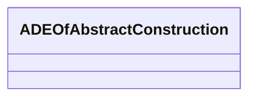

# Class: ADEOfAbstractConstruction 


_ADEOfAbstractConstruction acts as a hook to define properties within an ADE that are to be added to AbstractConstruction._


* __NOTE__: this is an abstract class and should not be instantiated directly


URI: [citygml:ADEOfAbstractConstruction](https://www.ogc.org/standards/citygml/ADEOfAbstractConstruction)





<!-- no inheritance hierarchy -->

## Slots

| Name | Cardinality and Range | Description | Inheritance |
| ---  | --- | --- | --- |


## Usages

| used by | used in | type | used |
| ---  | --- | --- | --- |
| [AbstractConstruction](AbstractConstruction.md) | [adeOfAbstractConstruction](adeOfAbstractConstruction.md) | range | [ADEOfAbstractConstruction](ADEOfAbstractConstruction.md) |
| [OtherConstruction](OtherConstruction.md) | [adeOfAbstractConstruction](adeOfAbstractConstruction.md) | range | [ADEOfAbstractConstruction](ADEOfAbstractConstruction.md) |
| [AbstractBridge](AbstractBridge.md) | [adeOfAbstractConstruction](adeOfAbstractConstruction.md) | range | [ADEOfAbstractConstruction](ADEOfAbstractConstruction.md) |
| [Bridge](Bridge.md) | [adeOfAbstractConstruction](adeOfAbstractConstruction.md) | range | [ADEOfAbstractConstruction](ADEOfAbstractConstruction.md) |
| [BridgePart](BridgePart.md) | [adeOfAbstractConstruction](adeOfAbstractConstruction.md) | range | [ADEOfAbstractConstruction](ADEOfAbstractConstruction.md) |
| [AbstractBuilding](AbstractBuilding.md) | [adeOfAbstractConstruction](adeOfAbstractConstruction.md) | range | [ADEOfAbstractConstruction](ADEOfAbstractConstruction.md) |
| [Building](Building.md) | [adeOfAbstractConstruction](adeOfAbstractConstruction.md) | range | [ADEOfAbstractConstruction](ADEOfAbstractConstruction.md) |
| [BuildingPart](BuildingPart.md) | [adeOfAbstractConstruction](adeOfAbstractConstruction.md) | range | [ADEOfAbstractConstruction](ADEOfAbstractConstruction.md) |
| [AbstractTunnel](AbstractTunnel.md) | [adeOfAbstractConstruction](adeOfAbstractConstruction.md) | range | [ADEOfAbstractConstruction](ADEOfAbstractConstruction.md) |
| [Tunnel](Tunnel.md) | [adeOfAbstractConstruction](adeOfAbstractConstruction.md) | range | [ADEOfAbstractConstruction](ADEOfAbstractConstruction.md) |
| [TunnelPart](TunnelPart.md) | [adeOfAbstractConstruction](adeOfAbstractConstruction.md) | range | [ADEOfAbstractConstruction](ADEOfAbstractConstruction.md) |


## Identifier and Mapping Information


### Schema Source


* from schema: https://www.ogc.org/standards/citygml


## Mappings

| Mapping Type | Mapped Value |
| ---  | ---  |
| self | citygml:ADEOfAbstractConstruction |
| native | citygml:ADEOfAbstractConstruction |


## LinkML Source

<!-- TODO: investigate https://stackoverflow.com/questions/37606292/how-to-create-tabbed-code-blocks-in-mkdocs-or-sphinx -->

### Direct

<details>
```yaml
name: ADEOfAbstractConstruction
description: ADEOfAbstractConstruction acts as a hook to define properties within
  an ADE that are to be added to AbstractConstruction.
from_schema: https://www.ogc.org/standards/citygml
abstract: true

```
</details>

### Induced

<details>
```yaml
name: ADEOfAbstractConstruction
description: ADEOfAbstractConstruction acts as a hook to define properties within
  an ADE that are to be added to AbstractConstruction.
from_schema: https://www.ogc.org/standards/citygml
abstract: true

```
</details>