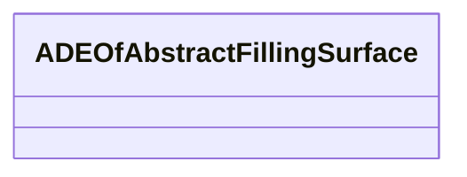

# Class: ADEOfAbstractFillingSurface 


_ADEOfAbstractFillingSurface acts as a hook to define properties within an ADE that are to be added to AbstractFillingSurface._


* __NOTE__: this is an abstract class and should not be instantiated directly


URI: [citygml:ADEOfAbstractFillingSurface](https://www.ogc.org/standards/citygml/ADEOfAbstractFillingSurface)





<!-- no inheritance hierarchy -->

## Slots

| Name | Cardinality and Range | Description | Inheritance |
| ---  | --- | --- | --- |


## Usages

| used by | used in | type | used |
| ---  | --- | --- | --- |
| [AbstractFillingSurface](AbstractFillingSurface.md) | [adeOfAbstractFillingSurface](adeOfAbstractFillingSurface.md) | range | [ADEOfAbstractFillingSurface](ADEOfAbstractFillingSurface.md) |
| [DoorSurface](DoorSurface.md) | [adeOfAbstractFillingSurface](adeOfAbstractFillingSurface.md) | range | [ADEOfAbstractFillingSurface](ADEOfAbstractFillingSurface.md) |
| [WindowSurface](WindowSurface.md) | [adeOfAbstractFillingSurface](adeOfAbstractFillingSurface.md) | range | [ADEOfAbstractFillingSurface](ADEOfAbstractFillingSurface.md) |


## Identifier and Mapping Information


### Schema Source


* from schema: https://www.ogc.org/standards/citygml


## Mappings

| Mapping Type | Mapped Value |
| ---  | ---  |
| self | citygml:ADEOfAbstractFillingSurface |
| native | citygml:ADEOfAbstractFillingSurface |


## LinkML Source

<!-- TODO: investigate https://stackoverflow.com/questions/37606292/how-to-create-tabbed-code-blocks-in-mkdocs-or-sphinx -->

### Direct

<details>
```yaml
name: ADEOfAbstractFillingSurface
description: ADEOfAbstractFillingSurface acts as a hook to define properties within
  an ADE that are to be added to AbstractFillingSurface.
from_schema: https://www.ogc.org/standards/citygml
abstract: true

```
</details>

### Induced

<details>
```yaml
name: ADEOfAbstractFillingSurface
description: ADEOfAbstractFillingSurface acts as a hook to define properties within
  an ADE that are to be added to AbstractFillingSurface.
from_schema: https://www.ogc.org/standards/citygml
abstract: true

```
</details>