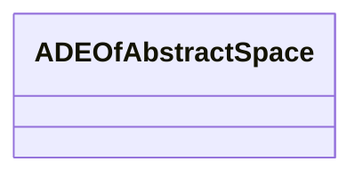

# Class: ADEOfAbstractSpace 


_ADEOfAbstractSpace acts as a hook to define properties within an ADE that are to be added to AbstractSpace._


* __NOTE__: this is an abstract class and should not be instantiated directly


URI: [citygml:ADEOfAbstractSpace](https://www.ogc.org/standards/citygml/ADEOfAbstractSpace)





<!-- no inheritance hierarchy -->

## Slots

| Name | Cardinality and Range | Description | Inheritance |
| ---  | --- | --- | --- |


## Usages

| used by | used in | type | used |
| ---  | --- | --- | --- |
| [AbstractConstruction](AbstractConstruction.md) | [adeOfAbstractSpace](adeOfAbstractSpace.md) | range | [ADEOfAbstractSpace](ADEOfAbstractSpace.md) |
| [AbstractConstructiveElement](AbstractConstructiveElement.md) | [adeOfAbstractSpace](adeOfAbstractSpace.md) | range | [ADEOfAbstractSpace](ADEOfAbstractSpace.md) |
| [AbstractFillingElement](AbstractFillingElement.md) | [adeOfAbstractSpace](adeOfAbstractSpace.md) | range | [ADEOfAbstractSpace](ADEOfAbstractSpace.md) |
| [AbstractFurniture](AbstractFurniture.md) | [adeOfAbstractSpace](adeOfAbstractSpace.md) | range | [ADEOfAbstractSpace](ADEOfAbstractSpace.md) |
| [AbstractInstallation](AbstractInstallation.md) | [adeOfAbstractSpace](adeOfAbstractSpace.md) | range | [ADEOfAbstractSpace](ADEOfAbstractSpace.md) |
| [Door](Door.md) | [adeOfAbstractSpace](adeOfAbstractSpace.md) | range | [ADEOfAbstractSpace](ADEOfAbstractSpace.md) |
| [OtherConstruction](OtherConstruction.md) | [adeOfAbstractSpace](adeOfAbstractSpace.md) | range | [ADEOfAbstractSpace](ADEOfAbstractSpace.md) |
| [Window](Window.md) | [adeOfAbstractSpace](adeOfAbstractSpace.md) | range | [ADEOfAbstractSpace](ADEOfAbstractSpace.md) |
| [AbstractBridge](AbstractBridge.md) | [adeOfAbstractSpace](adeOfAbstractSpace.md) | range | [ADEOfAbstractSpace](ADEOfAbstractSpace.md) |
| [Bridge](Bridge.md) | [adeOfAbstractSpace](adeOfAbstractSpace.md) | range | [ADEOfAbstractSpace](ADEOfAbstractSpace.md) |
| [BridgeConstructiveElement](BridgeConstructiveElement.md) | [adeOfAbstractSpace](adeOfAbstractSpace.md) | range | [ADEOfAbstractSpace](ADEOfAbstractSpace.md) |
| [BridgeFurniture](BridgeFurniture.md) | [adeOfAbstractSpace](adeOfAbstractSpace.md) | range | [ADEOfAbstractSpace](ADEOfAbstractSpace.md) |
| [BridgeInstallation](BridgeInstallation.md) | [adeOfAbstractSpace](adeOfAbstractSpace.md) | range | [ADEOfAbstractSpace](ADEOfAbstractSpace.md) |
| [BridgePart](BridgePart.md) | [adeOfAbstractSpace](adeOfAbstractSpace.md) | range | [ADEOfAbstractSpace](ADEOfAbstractSpace.md) |
| [BridgeRoom](BridgeRoom.md) | [adeOfAbstractSpace](adeOfAbstractSpace.md) | range | [ADEOfAbstractSpace](ADEOfAbstractSpace.md) |
| [AbstractBuilding](AbstractBuilding.md) | [adeOfAbstractSpace](adeOfAbstractSpace.md) | range | [ADEOfAbstractSpace](ADEOfAbstractSpace.md) |
| [AbstractBuildingSubdivision](AbstractBuildingSubdivision.md) | [adeOfAbstractSpace](adeOfAbstractSpace.md) | range | [ADEOfAbstractSpace](ADEOfAbstractSpace.md) |
| [Building](Building.md) | [adeOfAbstractSpace](adeOfAbstractSpace.md) | range | [ADEOfAbstractSpace](ADEOfAbstractSpace.md) |
| [BuildingConstructiveElement](BuildingConstructiveElement.md) | [adeOfAbstractSpace](adeOfAbstractSpace.md) | range | [ADEOfAbstractSpace](ADEOfAbstractSpace.md) |
| [BuildingFurniture](BuildingFurniture.md) | [adeOfAbstractSpace](adeOfAbstractSpace.md) | range | [ADEOfAbstractSpace](ADEOfAbstractSpace.md) |
| [BuildingInstallation](BuildingInstallation.md) | [adeOfAbstractSpace](adeOfAbstractSpace.md) | range | [ADEOfAbstractSpace](ADEOfAbstractSpace.md) |
| [BuildingPart](BuildingPart.md) | [adeOfAbstractSpace](adeOfAbstractSpace.md) | range | [ADEOfAbstractSpace](ADEOfAbstractSpace.md) |
| [BuildingRoom](BuildingRoom.md) | [adeOfAbstractSpace](adeOfAbstractSpace.md) | range | [ADEOfAbstractSpace](ADEOfAbstractSpace.md) |
| [BuildingUnit](BuildingUnit.md) | [adeOfAbstractSpace](adeOfAbstractSpace.md) | range | [ADEOfAbstractSpace](ADEOfAbstractSpace.md) |
| [Storey](Storey.md) | [adeOfAbstractSpace](adeOfAbstractSpace.md) | range | [ADEOfAbstractSpace](ADEOfAbstractSpace.md) |
| [CityFurniture](CityFurniture.md) | [adeOfAbstractSpace](adeOfAbstractSpace.md) | range | [ADEOfAbstractSpace](ADEOfAbstractSpace.md) |
| [CityObjectGroup](CityObjectGroup.md) | [adeOfAbstractSpace](adeOfAbstractSpace.md) | range | [ADEOfAbstractSpace](ADEOfAbstractSpace.md) |
| [AbstractLogicalSpace](AbstractLogicalSpace.md) | [adeOfAbstractSpace](adeOfAbstractSpace.md) | range | [ADEOfAbstractSpace](ADEOfAbstractSpace.md) |
| [AbstractOccupiedSpace](AbstractOccupiedSpace.md) | [adeOfAbstractSpace](adeOfAbstractSpace.md) | range | [ADEOfAbstractSpace](ADEOfAbstractSpace.md) |
| [AbstractPhysicalSpace](AbstractPhysicalSpace.md) | [adeOfAbstractSpace](adeOfAbstractSpace.md) | range | [ADEOfAbstractSpace](ADEOfAbstractSpace.md) |
| [AbstractSpace](AbstractSpace.md) | [adeOfAbstractSpace](adeOfAbstractSpace.md) | range | [ADEOfAbstractSpace](ADEOfAbstractSpace.md) |
| [AbstractUnoccupiedSpace](AbstractUnoccupiedSpace.md) | [adeOfAbstractSpace](adeOfAbstractSpace.md) | range | [ADEOfAbstractSpace](ADEOfAbstractSpace.md) |
| [GenericLogicalSpace](GenericLogicalSpace.md) | [adeOfAbstractSpace](adeOfAbstractSpace.md) | range | [ADEOfAbstractSpace](ADEOfAbstractSpace.md) |
| [GenericOccupiedSpace](GenericOccupiedSpace.md) | [adeOfAbstractSpace](adeOfAbstractSpace.md) | range | [ADEOfAbstractSpace](ADEOfAbstractSpace.md) |
| [GenericUnoccupiedSpace](GenericUnoccupiedSpace.md) | [adeOfAbstractSpace](adeOfAbstractSpace.md) | range | [ADEOfAbstractSpace](ADEOfAbstractSpace.md) |
| [AbstractTransportationSpace](AbstractTransportationSpace.md) | [adeOfAbstractSpace](adeOfAbstractSpace.md) | range | [ADEOfAbstractSpace](ADEOfAbstractSpace.md) |
| [AuxiliaryTrafficSpace](AuxiliaryTrafficSpace.md) | [adeOfAbstractSpace](adeOfAbstractSpace.md) | range | [ADEOfAbstractSpace](ADEOfAbstractSpace.md) |
| [ClearanceSpace](ClearanceSpace.md) | [adeOfAbstractSpace](adeOfAbstractSpace.md) | range | [ADEOfAbstractSpace](ADEOfAbstractSpace.md) |
| [Hole](Hole.md) | [adeOfAbstractSpace](adeOfAbstractSpace.md) | range | [ADEOfAbstractSpace](ADEOfAbstractSpace.md) |
| [Intersection](Intersection.md) | [adeOfAbstractSpace](adeOfAbstractSpace.md) | range | [ADEOfAbstractSpace](ADEOfAbstractSpace.md) |
| [Railway](Railway.md) | [adeOfAbstractSpace](adeOfAbstractSpace.md) | range | [ADEOfAbstractSpace](ADEOfAbstractSpace.md) |
| [Road](Road.md) | [adeOfAbstractSpace](adeOfAbstractSpace.md) | range | [ADEOfAbstractSpace](ADEOfAbstractSpace.md) |
| [Section](Section.md) | [adeOfAbstractSpace](adeOfAbstractSpace.md) | range | [ADEOfAbstractSpace](ADEOfAbstractSpace.md) |
| [Square](Square.md) | [adeOfAbstractSpace](adeOfAbstractSpace.md) | range | [ADEOfAbstractSpace](ADEOfAbstractSpace.md) |
| [Track](Track.md) | [adeOfAbstractSpace](adeOfAbstractSpace.md) | range | [ADEOfAbstractSpace](ADEOfAbstractSpace.md) |
| [TrafficSpace](TrafficSpace.md) | [adeOfAbstractSpace](adeOfAbstractSpace.md) | range | [ADEOfAbstractSpace](ADEOfAbstractSpace.md) |
| [Waterway](Waterway.md) | [adeOfAbstractSpace](adeOfAbstractSpace.md) | range | [ADEOfAbstractSpace](ADEOfAbstractSpace.md) |
| [AbstractTunnel](AbstractTunnel.md) | [adeOfAbstractSpace](adeOfAbstractSpace.md) | range | [ADEOfAbstractSpace](ADEOfAbstractSpace.md) |
| [HollowSpace](HollowSpace.md) | [adeOfAbstractSpace](adeOfAbstractSpace.md) | range | [ADEOfAbstractSpace](ADEOfAbstractSpace.md) |
| [Tunnel](Tunnel.md) | [adeOfAbstractSpace](adeOfAbstractSpace.md) | range | [ADEOfAbstractSpace](ADEOfAbstractSpace.md) |
| [TunnelConstructiveElement](TunnelConstructiveElement.md) | [adeOfAbstractSpace](adeOfAbstractSpace.md) | range | [ADEOfAbstractSpace](ADEOfAbstractSpace.md) |
| [TunnelFurniture](TunnelFurniture.md) | [adeOfAbstractSpace](adeOfAbstractSpace.md) | range | [ADEOfAbstractSpace](ADEOfAbstractSpace.md) |
| [TunnelInstallation](TunnelInstallation.md) | [adeOfAbstractSpace](adeOfAbstractSpace.md) | range | [ADEOfAbstractSpace](ADEOfAbstractSpace.md) |
| [TunnelPart](TunnelPart.md) | [adeOfAbstractSpace](adeOfAbstractSpace.md) | range | [ADEOfAbstractSpace](ADEOfAbstractSpace.md) |
| [AbstractVegetationObject](AbstractVegetationObject.md) | [adeOfAbstractSpace](adeOfAbstractSpace.md) | range | [ADEOfAbstractSpace](ADEOfAbstractSpace.md) |
| [PlantCover](PlantCover.md) | [adeOfAbstractSpace](adeOfAbstractSpace.md) | range | [ADEOfAbstractSpace](ADEOfAbstractSpace.md) |
| [SolitaryVegetationObject](SolitaryVegetationObject.md) | [adeOfAbstractSpace](adeOfAbstractSpace.md) | range | [ADEOfAbstractSpace](ADEOfAbstractSpace.md) |
| [WaterBody](WaterBody.md) | [adeOfAbstractSpace](adeOfAbstractSpace.md) | range | [ADEOfAbstractSpace](ADEOfAbstractSpace.md) |


## Identifier and Mapping Information


### Schema Source


* from schema: https://www.ogc.org/standards/citygml


## Mappings

| Mapping Type | Mapped Value |
| ---  | ---  |
| self | citygml:ADEOfAbstractSpace |
| native | citygml:ADEOfAbstractSpace |


## LinkML Source

<!-- TODO: investigate https://stackoverflow.com/questions/37606292/how-to-create-tabbed-code-blocks-in-mkdocs-or-sphinx -->

### Direct

<details>
```yaml
name: ADEOfAbstractSpace
description: ADEOfAbstractSpace acts as a hook to define properties within an ADE
  that are to be added to AbstractSpace.
from_schema: https://www.ogc.org/standards/citygml
abstract: true

```
</details>

### Induced

<details>
```yaml
name: ADEOfAbstractSpace
description: ADEOfAbstractSpace acts as a hook to define properties within an ADE
  that are to be added to AbstractSpace.
from_schema: https://www.ogc.org/standards/citygml
abstract: true

```
</details>