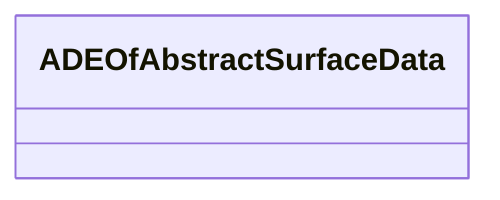

# Class: ADEOfAbstractSurfaceData 


_ADEOfAbstractSurfaceData acts as a hook to define properties within an ADE that are to be added to AbstractSurfaceData._


* __NOTE__: this is an abstract class and should not be instantiated directly


URI: [citygml:ADEOfAbstractSurfaceData](https://www.ogc.org/standards/citygml/ADEOfAbstractSurfaceData)





<!-- no inheritance hierarchy -->

## Slots

| Name | Cardinality and Range | Description | Inheritance |
| ---  | --- | --- | --- |


## Usages

| used by | used in | type | used |
| ---  | --- | --- | --- |
| [AbstractSurfaceData](AbstractSurfaceData.md) | [adeOfAbstractSurfaceData](adeOfAbstractSurfaceData.md) | range | [ADEOfAbstractSurfaceData](ADEOfAbstractSurfaceData.md) |
| [AbstractTexture](AbstractTexture.md) | [adeOfAbstractSurfaceData](adeOfAbstractSurfaceData.md) | range | [ADEOfAbstractSurfaceData](ADEOfAbstractSurfaceData.md) |
| [GeoreferencedTexture](GeoreferencedTexture.md) | [adeOfAbstractSurfaceData](adeOfAbstractSurfaceData.md) | range | [ADEOfAbstractSurfaceData](ADEOfAbstractSurfaceData.md) |
| [ParameterizedTexture](ParameterizedTexture.md) | [adeOfAbstractSurfaceData](adeOfAbstractSurfaceData.md) | range | [ADEOfAbstractSurfaceData](ADEOfAbstractSurfaceData.md) |
| [X3DMaterial](X3DMaterial.md) | [adeOfAbstractSurfaceData](adeOfAbstractSurfaceData.md) | range | [ADEOfAbstractSurfaceData](ADEOfAbstractSurfaceData.md) |


## Identifier and Mapping Information


### Schema Source


* from schema: https://www.ogc.org/standards/citygml


## Mappings

| Mapping Type | Mapped Value |
| ---  | ---  |
| self | citygml:ADEOfAbstractSurfaceData |
| native | citygml:ADEOfAbstractSurfaceData |


## LinkML Source

<!-- TODO: investigate https://stackoverflow.com/questions/37606292/how-to-create-tabbed-code-blocks-in-mkdocs-or-sphinx -->

### Direct

<details>
```yaml
name: ADEOfAbstractSurfaceData
description: ADEOfAbstractSurfaceData acts as a hook to define properties within an
  ADE that are to be added to AbstractSurfaceData.
from_schema: https://www.ogc.org/standards/citygml
abstract: true

```
</details>

### Induced

<details>
```yaml
name: ADEOfAbstractSurfaceData
description: ADEOfAbstractSurfaceData acts as a hook to define properties within an
  ADE that are to be added to AbstractSurfaceData.
from_schema: https://www.ogc.org/standards/citygml
abstract: true

```
</details>