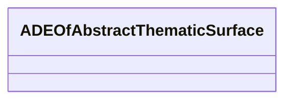

# Class: ADEOfAbstractThematicSurface 


_ADEOfAbstractThematicSurface acts as a hook to define properties within an ADE that are to be added to AbstractThematicSurface._


* __NOTE__: this is an abstract class and should not be instantiated directly


URI: [citygml:ADEOfAbstractThematicSurface](https://www.ogc.org/standards/citygml/ADEOfAbstractThematicSurface)





<!-- no inheritance hierarchy -->

## Slots

| Name | Cardinality and Range | Description | Inheritance |
| ---  | --- | --- | --- |


## Usages

| used by | used in | type | used |
| ---  | --- | --- | --- |
| [AbstractConstructionSurface](AbstractConstructionSurface.md) | [adeOfAbstractThematicSurface](adeOfAbstractThematicSurface.md) | range | [ADEOfAbstractThematicSurface](ADEOfAbstractThematicSurface.md) |
| [AbstractFillingSurface](AbstractFillingSurface.md) | [adeOfAbstractThematicSurface](adeOfAbstractThematicSurface.md) | range | [ADEOfAbstractThematicSurface](ADEOfAbstractThematicSurface.md) |
| [CeilingSurface](CeilingSurface.md) | [adeOfAbstractThematicSurface](adeOfAbstractThematicSurface.md) | range | [ADEOfAbstractThematicSurface](ADEOfAbstractThematicSurface.md) |
| [DoorSurface](DoorSurface.md) | [adeOfAbstractThematicSurface](adeOfAbstractThematicSurface.md) | range | [ADEOfAbstractThematicSurface](ADEOfAbstractThematicSurface.md) |
| [FloorSurface](FloorSurface.md) | [adeOfAbstractThematicSurface](adeOfAbstractThematicSurface.md) | range | [ADEOfAbstractThematicSurface](ADEOfAbstractThematicSurface.md) |
| [GroundSurface](GroundSurface.md) | [adeOfAbstractThematicSurface](adeOfAbstractThematicSurface.md) | range | [ADEOfAbstractThematicSurface](ADEOfAbstractThematicSurface.md) |
| [InteriorWallSurface](InteriorWallSurface.md) | [adeOfAbstractThematicSurface](adeOfAbstractThematicSurface.md) | range | [ADEOfAbstractThematicSurface](ADEOfAbstractThematicSurface.md) |
| [OuterCeilingSurface](OuterCeilingSurface.md) | [adeOfAbstractThematicSurface](adeOfAbstractThematicSurface.md) | range | [ADEOfAbstractThematicSurface](ADEOfAbstractThematicSurface.md) |
| [OuterFloorSurface](OuterFloorSurface.md) | [adeOfAbstractThematicSurface](adeOfAbstractThematicSurface.md) | range | [ADEOfAbstractThematicSurface](ADEOfAbstractThematicSurface.md) |
| [RoofSurface](RoofSurface.md) | [adeOfAbstractThematicSurface](adeOfAbstractThematicSurface.md) | range | [ADEOfAbstractThematicSurface](ADEOfAbstractThematicSurface.md) |
| [WallSurface](WallSurface.md) | [adeOfAbstractThematicSurface](adeOfAbstractThematicSurface.md) | range | [ADEOfAbstractThematicSurface](ADEOfAbstractThematicSurface.md) |
| [WindowSurface](WindowSurface.md) | [adeOfAbstractThematicSurface](adeOfAbstractThematicSurface.md) | range | [ADEOfAbstractThematicSurface](ADEOfAbstractThematicSurface.md) |
| [AbstractThematicSurface](AbstractThematicSurface.md) | [adeOfAbstractThematicSurface](adeOfAbstractThematicSurface.md) | range | [ADEOfAbstractThematicSurface](ADEOfAbstractThematicSurface.md) |
| [ClosureSurface](ClosureSurface.md) | [adeOfAbstractThematicSurface](adeOfAbstractThematicSurface.md) | range | [ADEOfAbstractThematicSurface](ADEOfAbstractThematicSurface.md) |
| [GenericThematicSurface](GenericThematicSurface.md) | [adeOfAbstractThematicSurface](adeOfAbstractThematicSurface.md) | range | [ADEOfAbstractThematicSurface](ADEOfAbstractThematicSurface.md) |
| [LandUse](LandUse.md) | [adeOfAbstractThematicSurface](adeOfAbstractThematicSurface.md) | range | [ADEOfAbstractThematicSurface](ADEOfAbstractThematicSurface.md) |
| [AuxiliaryTrafficArea](AuxiliaryTrafficArea.md) | [adeOfAbstractThematicSurface](adeOfAbstractThematicSurface.md) | range | [ADEOfAbstractThematicSurface](ADEOfAbstractThematicSurface.md) |
| [HoleSurface](HoleSurface.md) | [adeOfAbstractThematicSurface](adeOfAbstractThematicSurface.md) | range | [ADEOfAbstractThematicSurface](ADEOfAbstractThematicSurface.md) |
| [Marking](Marking.md) | [adeOfAbstractThematicSurface](adeOfAbstractThematicSurface.md) | range | [ADEOfAbstractThematicSurface](ADEOfAbstractThematicSurface.md) |
| [TrafficArea](TrafficArea.md) | [adeOfAbstractThematicSurface](adeOfAbstractThematicSurface.md) | range | [ADEOfAbstractThematicSurface](ADEOfAbstractThematicSurface.md) |
| [AbstractWaterBoundarySurface](AbstractWaterBoundarySurface.md) | [adeOfAbstractThematicSurface](adeOfAbstractThematicSurface.md) | range | [ADEOfAbstractThematicSurface](ADEOfAbstractThematicSurface.md) |
| [WaterGroundSurface](WaterGroundSurface.md) | [adeOfAbstractThematicSurface](adeOfAbstractThematicSurface.md) | range | [ADEOfAbstractThematicSurface](ADEOfAbstractThematicSurface.md) |
| [WaterSurface](WaterSurface.md) | [adeOfAbstractThematicSurface](adeOfAbstractThematicSurface.md) | range | [ADEOfAbstractThematicSurface](ADEOfAbstractThematicSurface.md) |


## Identifier and Mapping Information


### Schema Source


* from schema: https://www.ogc.org/standards/citygml


## Mappings

| Mapping Type | Mapped Value |
| ---  | ---  |
| self | citygml:ADEOfAbstractThematicSurface |
| native | citygml:ADEOfAbstractThematicSurface |


## LinkML Source

<!-- TODO: investigate https://stackoverflow.com/questions/37606292/how-to-create-tabbed-code-blocks-in-mkdocs-or-sphinx -->

### Direct

<details>
```yaml
name: ADEOfAbstractThematicSurface
description: ADEOfAbstractThematicSurface acts as a hook to define properties within
  an ADE that are to be added to AbstractThematicSurface.
from_schema: https://www.ogc.org/standards/citygml
abstract: true

```
</details>

### Induced

<details>
```yaml
name: ADEOfAbstractThematicSurface
description: ADEOfAbstractThematicSurface acts as a hook to define properties within
  an ADE that are to be added to AbstractThematicSurface.
from_schema: https://www.ogc.org/standards/citygml
abstract: true

```
</details>