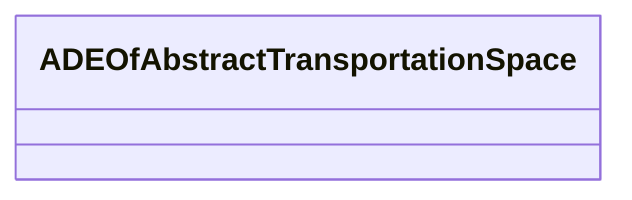

# Class: ADEOfAbstractTransportationSpace 


_ADEOfAbstractTransportationSpace acts as a hook to define properties within an ADE that are to be added to AbstractTransportationSpace._


* __NOTE__: this is an abstract class and should not be instantiated directly


URI: [citygml:ADEOfAbstractTransportationSpace](https://www.ogc.org/standards/citygml/ADEOfAbstractTransportationSpace)





<!-- no inheritance hierarchy -->

## Slots

| Name | Cardinality and Range | Description | Inheritance |
| ---  | --- | --- | --- |


## Usages

| used by | used in | type | used |
| ---  | --- | --- | --- |
| [AbstractTransportationSpace](AbstractTransportationSpace.md) | [adeOfAbstractTransportationSpace](adeOfAbstractTransportationSpace.md) | range | [ADEOfAbstractTransportationSpace](ADEOfAbstractTransportationSpace.md) |
| [Intersection](Intersection.md) | [adeOfAbstractTransportationSpace](adeOfAbstractTransportationSpace.md) | range | [ADEOfAbstractTransportationSpace](ADEOfAbstractTransportationSpace.md) |
| [Railway](Railway.md) | [adeOfAbstractTransportationSpace](adeOfAbstractTransportationSpace.md) | range | [ADEOfAbstractTransportationSpace](ADEOfAbstractTransportationSpace.md) |
| [Road](Road.md) | [adeOfAbstractTransportationSpace](adeOfAbstractTransportationSpace.md) | range | [ADEOfAbstractTransportationSpace](ADEOfAbstractTransportationSpace.md) |
| [Section](Section.md) | [adeOfAbstractTransportationSpace](adeOfAbstractTransportationSpace.md) | range | [ADEOfAbstractTransportationSpace](ADEOfAbstractTransportationSpace.md) |
| [Square](Square.md) | [adeOfAbstractTransportationSpace](adeOfAbstractTransportationSpace.md) | range | [ADEOfAbstractTransportationSpace](ADEOfAbstractTransportationSpace.md) |
| [Track](Track.md) | [adeOfAbstractTransportationSpace](adeOfAbstractTransportationSpace.md) | range | [ADEOfAbstractTransportationSpace](ADEOfAbstractTransportationSpace.md) |
| [Waterway](Waterway.md) | [adeOfAbstractTransportationSpace](adeOfAbstractTransportationSpace.md) | range | [ADEOfAbstractTransportationSpace](ADEOfAbstractTransportationSpace.md) |


## Identifier and Mapping Information


### Schema Source


* from schema: https://www.ogc.org/standards/citygml


## Mappings

| Mapping Type | Mapped Value |
| ---  | ---  |
| self | citygml:ADEOfAbstractTransportationSpace |
| native | citygml:ADEOfAbstractTransportationSpace |


## LinkML Source

<!-- TODO: investigate https://stackoverflow.com/questions/37606292/how-to-create-tabbed-code-blocks-in-mkdocs-or-sphinx -->

### Direct

<details>
```yaml
name: ADEOfAbstractTransportationSpace
description: ADEOfAbstractTransportationSpace acts as a hook to define properties
  within an ADE that are to be added to AbstractTransportationSpace.
from_schema: https://www.ogc.org/standards/citygml
abstract: true

```
</details>

### Induced

<details>
```yaml
name: ADEOfAbstractTransportationSpace
description: ADEOfAbstractTransportationSpace acts as a hook to define properties
  within an ADE that are to be added to AbstractTransportationSpace.
from_schema: https://www.ogc.org/standards/citygml
abstract: true

```
</details>