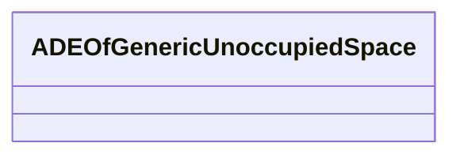

# Class: ADEOfGenericUnoccupiedSpace 


_ADEOfGenericUnoccupiedSpace acts as a hook to define properties within an ADE that are to be added to a GenericUnoccupiedSpace._


* __NOTE__: this is an abstract class and should not be instantiated directly


URI: [citygml:ADEOfGenericUnoccupiedSpace](https://www.ogc.org/standards/citygml/ADEOfGenericUnoccupiedSpace)





<!-- no inheritance hierarchy -->

## Slots

| Name | Cardinality and Range | Description | Inheritance |
| ---  | --- | --- | --- |


## Usages

| used by | used in | type | used |
| ---  | --- | --- | --- |
| [GenericUnoccupiedSpace](GenericUnoccupiedSpace.md) | [adeOfGenericUnoccupiedSpace](adeOfGenericUnoccupiedSpace.md) | range | [ADEOfGenericUnoccupiedSpace](ADEOfGenericUnoccupiedSpace.md) |


## Identifier and Mapping Information


### Schema Source


* from schema: https://www.ogc.org/standards/citygml


## Mappings

| Mapping Type | Mapped Value |
| ---  | ---  |
| self | citygml:ADEOfGenericUnoccupiedSpace |
| native | citygml:ADEOfGenericUnoccupiedSpace |


## LinkML Source

<!-- TODO: investigate https://stackoverflow.com/questions/37606292/how-to-create-tabbed-code-blocks-in-mkdocs-or-sphinx -->

### Direct

<details>
```yaml
name: ADEOfGenericUnoccupiedSpace
description: ADEOfGenericUnoccupiedSpace acts as a hook to define properties within
  an ADE that are to be added to a GenericUnoccupiedSpace.
from_schema: https://www.ogc.org/standards/citygml
abstract: true

```
</details>

### Induced

<details>
```yaml
name: ADEOfGenericUnoccupiedSpace
description: ADEOfGenericUnoccupiedSpace acts as a hook to define properties within
  an ADE that are to be added to a GenericUnoccupiedSpace.
from_schema: https://www.ogc.org/standards/citygml
abstract: true

```
</details>