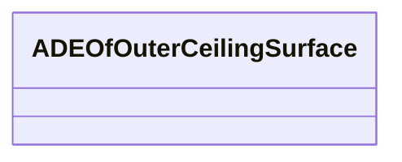

# Class: ADEOfOuterCeilingSurface 


_ADEOfOuterCeilingSurface acts as a hook to define properties within an ADE that are to be added to an OuterCeilingSurface._


* __NOTE__: this is an abstract class and should not be instantiated directly


URI: [citygml:ADEOfOuterCeilingSurface](https://www.ogc.org/standards/citygml/ADEOfOuterCeilingSurface)





<!-- no inheritance hierarchy -->

## Slots

| Name | Cardinality and Range | Description | Inheritance |
| ---  | --- | --- | --- |


## Usages

| used by | used in | type | used |
| ---  | --- | --- | --- |
| [OuterCeilingSurface](OuterCeilingSurface.md) | [adeOfOuterCeilingSurface](adeOfOuterCeilingSurface.md) | range | [ADEOfOuterCeilingSurface](ADEOfOuterCeilingSurface.md) |


## Identifier and Mapping Information


### Schema Source


* from schema: https://www.ogc.org/standards/citygml


## Mappings

| Mapping Type | Mapped Value |
| ---  | ---  |
| self | citygml:ADEOfOuterCeilingSurface |
| native | citygml:ADEOfOuterCeilingSurface |


## LinkML Source

<!-- TODO: investigate https://stackoverflow.com/questions/37606292/how-to-create-tabbed-code-blocks-in-mkdocs-or-sphinx -->

### Direct

<details>
```yaml
name: ADEOfOuterCeilingSurface
description: ADEOfOuterCeilingSurface acts as a hook to define properties within an
  ADE that are to be added to an OuterCeilingSurface.
from_schema: https://www.ogc.org/standards/citygml
abstract: true

```
</details>

### Induced

<details>
```yaml
name: ADEOfOuterCeilingSurface
description: ADEOfOuterCeilingSurface acts as a hook to define properties within an
  ADE that are to be added to an OuterCeilingSurface.
from_schema: https://www.ogc.org/standards/citygml
abstract: true

```
</details>