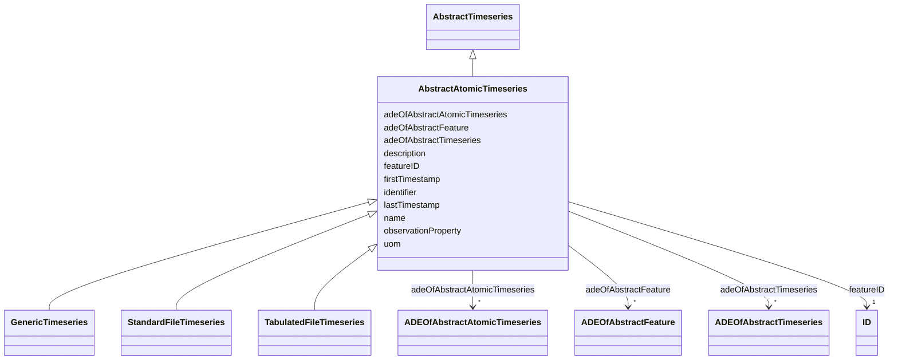

# Class: AbstractAtomicTimeseries 


_AbstractAtomicTimeseries represents the attributes and relationships that are common to all kinds of atomic timeseries (GenericTimeseries, TabulatedFileTimeseries, StandardFileTimeseries). An atomic timeseries represents time-varying data of a specific data type for a single contiguous time interval._


* __NOTE__: this is an abstract class and should not be instantiated directly


URI: [citygml:AbstractAtomicTimeseries](https://www.ogc.org/standards/citygml/AbstractAtomicTimeseries)





## Inheritance
* [AbstractFeature](AbstractFeature.md)
    * [AbstractTimeseries](AbstractTimeseries.md)
        * **AbstractAtomicTimeseries**
            * [GenericTimeseries](GenericTimeseries.md)
            * [StandardFileTimeseries](StandardFileTimeseries.md)
            * [TabulatedFileTimeseries](TabulatedFileTimeseries.md)


## Slots

| Name | Cardinality and Range | Description | Inheritance |
| ---  | --- | --- | --- |
| [observationProperty](observationProperty.md) | 1 <br/> [String](String.md) | Specifies the phenomenon for which the atomic timeseries provides observation... | direct |
| [uom](uom.md) | 0..1 <br/> [String](String.md) | Specifies the unit of measurement of the observation values | direct |
| [adeOfAbstractAtomicTimeseries](adeOfAbstractAtomicTimeseries.md) | * <br/> [ADEOfAbstractAtomicTimeseries](ADEOfAbstractAtomicTimeseries.md) | Augments AbstractAtomicTimeseries with properties defined in an ADE | direct |
| [firstTimestamp](firstTimestamp.md) | 0..1 <br/> [String](String.md) | Specifies the beginning of the timeseries | [AbstractTimeseries](AbstractTimeseries.md) |
| [lastTimestamp](lastTimestamp.md) | 0..1 <br/> [String](String.md) | Specifies the end of the timeseries | [AbstractTimeseries](AbstractTimeseries.md) |
| [adeOfAbstractTimeseries](adeOfAbstractTimeseries.md) | * <br/> [ADEOfAbstractTimeseries](ADEOfAbstractTimeseries.md) | Augments AbstractTimeseries with properties defined in an ADE | [AbstractTimeseries](AbstractTimeseries.md) |
| [featureID](featureID.md) | 1 <br/> [ID](ID.md) |  | [AbstractFeature](AbstractFeature.md) |
| [identifier](identifier.md) | 0..1 <br/> [String](String.md) |  | [AbstractFeature](AbstractFeature.md) |
| [name](name.md) | * <br/> [String](String.md) |  | [AbstractFeature](AbstractFeature.md) |
| [description](description.md) | 0..1 <br/> [String](String.md) |  | [AbstractFeature](AbstractFeature.md) |
| [adeOfAbstractFeature](adeOfAbstractFeature.md) | * <br/> [ADEOfAbstractFeature](ADEOfAbstractFeature.md) | Augments AbstractFeature with properties defined in an ADE | [AbstractFeature](AbstractFeature.md) |


## Identifier and Mapping Information


### Schema Source


* from schema: https://www.ogc.org/standards/citygml


## Mappings

| Mapping Type | Mapped Value |
| ---  | ---  |
| self | citygml:AbstractAtomicTimeseries |
| native | citygml:AbstractAtomicTimeseries |


## LinkML Source

<!-- TODO: investigate https://stackoverflow.com/questions/37606292/how-to-create-tabbed-code-blocks-in-mkdocs-or-sphinx -->

### Direct

<details>
```yaml
name: AbstractAtomicTimeseries
description: AbstractAtomicTimeseries represents the attributes and relationships
  that are common to all kinds of atomic timeseries (GenericTimeseries, TabulatedFileTimeseries,
  StandardFileTimeseries). An atomic timeseries represents time-varying data of a
  specific data type for a single contiguous time interval.
from_schema: https://www.ogc.org/standards/citygml
is_a: AbstractTimeseries
abstract: true
attributes:
  observationProperty:
    name: observationProperty
    description: Specifies the phenomenon for which the atomic timeseries provides
      observation values.
    from_schema: https://www.ogc.org/standards/citygml
    domain_of:
    - SensorConnection
    - AbstractAtomicTimeseries
    range: string
    required: true
    multivalued: false
  uom:
    name: uom
    description: Specifies the unit of measurement of the observation values.
    from_schema: https://www.ogc.org/standards/citygml
    domain_of:
    - SensorConnection
    - AbstractAtomicTimeseries
    - MeasureOrNilReasonList
    range: string
    required: false
    multivalued: false
  adeOfAbstractAtomicTimeseries:
    name: adeOfAbstractAtomicTimeseries
    description: Augments AbstractAtomicTimeseries with properties defined in an ADE.
    from_schema: https://www.ogc.org/standards/citygml
    rank: 1000
    domain_of:
    - AbstractAtomicTimeseries
    range: ADEOfAbstractAtomicTimeseries
    required: false
    multivalued: true

```
</details>

### Induced

<details>
```yaml
name: AbstractAtomicTimeseries
description: AbstractAtomicTimeseries represents the attributes and relationships
  that are common to all kinds of atomic timeseries (GenericTimeseries, TabulatedFileTimeseries,
  StandardFileTimeseries). An atomic timeseries represents time-varying data of a
  specific data type for a single contiguous time interval.
from_schema: https://www.ogc.org/standards/citygml
is_a: AbstractTimeseries
abstract: true
attributes:
  observationProperty:
    name: observationProperty
    description: Specifies the phenomenon for which the atomic timeseries provides
      observation values.
    from_schema: https://www.ogc.org/standards/citygml
    alias: observationProperty
    owner: AbstractAtomicTimeseries
    domain_of:
    - SensorConnection
    - AbstractAtomicTimeseries
    range: string
    required: true
    multivalued: false
  uom:
    name: uom
    description: Specifies the unit of measurement of the observation values.
    from_schema: https://www.ogc.org/standards/citygml
    alias: uom
    owner: AbstractAtomicTimeseries
    domain_of:
    - SensorConnection
    - AbstractAtomicTimeseries
    - MeasureOrNilReasonList
    range: string
    required: false
    multivalued: false
  adeOfAbstractAtomicTimeseries:
    name: adeOfAbstractAtomicTimeseries
    description: Augments AbstractAtomicTimeseries with properties defined in an ADE.
    from_schema: https://www.ogc.org/standards/citygml
    rank: 1000
    alias: adeOfAbstractAtomicTimeseries
    owner: AbstractAtomicTimeseries
    domain_of:
    - AbstractAtomicTimeseries
    range: ADEOfAbstractAtomicTimeseries
    required: false
    multivalued: true
  firstTimestamp:
    name: firstTimestamp
    description: Specifies the beginning of the timeseries.
    from_schema: https://www.ogc.org/standards/citygml
    rank: 1000
    alias: firstTimestamp
    owner: AbstractAtomicTimeseries
    domain_of:
    - AbstractTimeseries
    range: string
    required: false
    multivalued: false
  lastTimestamp:
    name: lastTimestamp
    description: Specifies the end of the timeseries.
    from_schema: https://www.ogc.org/standards/citygml
    rank: 1000
    alias: lastTimestamp
    owner: AbstractAtomicTimeseries
    domain_of:
    - AbstractTimeseries
    range: string
    required: false
    multivalued: false
  adeOfAbstractTimeseries:
    name: adeOfAbstractTimeseries
    description: Augments AbstractTimeseries with properties defined in an ADE.
    from_schema: https://www.ogc.org/standards/citygml
    rank: 1000
    alias: adeOfAbstractTimeseries
    owner: AbstractAtomicTimeseries
    domain_of:
    - AbstractTimeseries
    range: ADEOfAbstractTimeseries
    required: false
    multivalued: true
  featureID:
    name: featureID
    from_schema: https://www.ogc.org/standards/citygml
    rank: 1000
    alias: featureID
    owner: AbstractAtomicTimeseries
    domain_of:
    - AbstractFeature
    range: ID
    required: true
    multivalued: false
  identifier:
    name: identifier
    from_schema: https://www.ogc.org/standards/citygml
    rank: 1000
    alias: identifier
    owner: AbstractAtomicTimeseries
    domain_of:
    - AbstractFeature
    range: string
    required: false
    multivalued: false
  name:
    name: name
    from_schema: https://www.ogc.org/standards/citygml
    alias: name
    owner: AbstractAtomicTimeseries
    domain_of:
    - CodeAttribute
    - DateAttribute
    - DoubleAttribute
    - GenericAttributeSet
    - IntAttribute
    - MeasureAttribute
    - StringAttribute
    - UriAttribute
    - AbstractFeature
    range: string
    required: false
    multivalued: true
  description:
    name: description
    from_schema: https://www.ogc.org/standards/citygml
    alias: description
    owner: AbstractAtomicTimeseries
    domain_of:
    - ConstructionEvent
    - AbstractFeature
    range: string
    required: false
    multivalued: false
  adeOfAbstractFeature:
    name: adeOfAbstractFeature
    description: Augments AbstractFeature with properties defined in an ADE.
    from_schema: https://www.ogc.org/standards/citygml
    rank: 1000
    alias: adeOfAbstractFeature
    owner: AbstractAtomicTimeseries
    domain_of:
    - AbstractFeature
    range: ADEOfAbstractFeature
    required: false
    multivalued: true

```
</details>