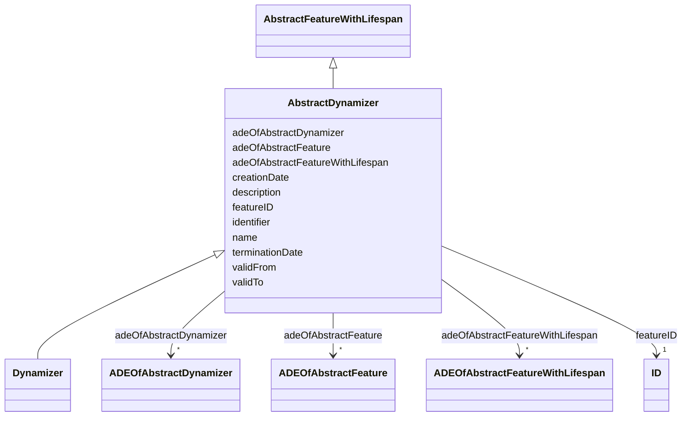

# Class: AbstractDynamizer 


_AbstractDynamizer is the abstract superclass to represent Dynamizer objects._


* __NOTE__: this is an abstract class and should not be instantiated directly


URI: [citygml:AbstractDynamizer](https://www.ogc.org/standards/citygml/AbstractDynamizer)





## Inheritance
* [AbstractFeature](AbstractFeature.md)
    * [AbstractFeatureWithLifespan](AbstractFeatureWithLifespan.md)
        * **AbstractDynamizer**
            * [Dynamizer](Dynamizer.md)


## Slots

| Name | Cardinality and Range | Description | Inheritance |
| ---  | --- | --- | --- |
| [adeOfAbstractDynamizer](adeOfAbstractDynamizer.md) | * <br/> [ADEOfAbstractDynamizer](ADEOfAbstractDynamizer.md) | Augments AbstractDynamizer with properties defined in an ADE | direct |
| [creationDate](creationDate.md) | 0..1 <br/> [Datetime](Datetime.md) | Indicates the date at which a CityGML feature was added to the CityModel | [AbstractFeatureWithLifespan](AbstractFeatureWithLifespan.md) |
| [terminationDate](terminationDate.md) | 0..1 <br/> [Datetime](Datetime.md) | Indicates the date at which a CityGML feature was removed from the CityModel | [AbstractFeatureWithLifespan](AbstractFeatureWithLifespan.md) |
| [validFrom](validFrom.md) | 0..1 <br/> [Datetime](Datetime.md) | Indicates the date at which a CityGML feature started to exist in the real wo... | [AbstractFeatureWithLifespan](AbstractFeatureWithLifespan.md) |
| [validTo](validTo.md) | 0..1 <br/> [Datetime](Datetime.md) | Indicates the date at which a CityGML feature ended to exist in the real worl... | [AbstractFeatureWithLifespan](AbstractFeatureWithLifespan.md) |
| [adeOfAbstractFeatureWithLifespan](adeOfAbstractFeatureWithLifespan.md) | * <br/> [ADEOfAbstractFeatureWithLifespan](ADEOfAbstractFeatureWithLifespan.md) | Augments AbstractFeatureWithLifespan with properties defined in an ADE | [AbstractFeatureWithLifespan](AbstractFeatureWithLifespan.md) |
| [featureID](featureID.md) | 1 <br/> [ID](ID.md) |  | [AbstractFeature](AbstractFeature.md) |
| [identifier](identifier.md) | 0..1 <br/> [String](String.md) |  | [AbstractFeature](AbstractFeature.md) |
| [name](name.md) | * <br/> [String](String.md) |  | [AbstractFeature](AbstractFeature.md) |
| [description](description.md) | 0..1 <br/> [String](String.md) |  | [AbstractFeature](AbstractFeature.md) |
| [adeOfAbstractFeature](adeOfAbstractFeature.md) | * <br/> [ADEOfAbstractFeature](ADEOfAbstractFeature.md) | Augments AbstractFeature with properties defined in an ADE | [AbstractFeature](AbstractFeature.md) |


## Usages

| used by | used in | type | used |
| ---  | --- | --- | --- |
| [AbstractConstruction](AbstractConstruction.md) | [dynamizer](dynamizer.md) | range | [AbstractDynamizer](AbstractDynamizer.md) |
| [AbstractConstructionSurface](AbstractConstructionSurface.md) | [dynamizer](dynamizer.md) | range | [AbstractDynamizer](AbstractDynamizer.md) |
| [AbstractConstructiveElement](AbstractConstructiveElement.md) | [dynamizer](dynamizer.md) | range | [AbstractDynamizer](AbstractDynamizer.md) |
| [AbstractFillingElement](AbstractFillingElement.md) | [dynamizer](dynamizer.md) | range | [AbstractDynamizer](AbstractDynamizer.md) |
| [AbstractFillingSurface](AbstractFillingSurface.md) | [dynamizer](dynamizer.md) | range | [AbstractDynamizer](AbstractDynamizer.md) |
| [AbstractFurniture](AbstractFurniture.md) | [dynamizer](dynamizer.md) | range | [AbstractDynamizer](AbstractDynamizer.md) |
| [AbstractInstallation](AbstractInstallation.md) | [dynamizer](dynamizer.md) | range | [AbstractDynamizer](AbstractDynamizer.md) |
| [CeilingSurface](CeilingSurface.md) | [dynamizer](dynamizer.md) | range | [AbstractDynamizer](AbstractDynamizer.md) |
| [Door](Door.md) | [dynamizer](dynamizer.md) | range | [AbstractDynamizer](AbstractDynamizer.md) |
| [DoorSurface](DoorSurface.md) | [dynamizer](dynamizer.md) | range | [AbstractDynamizer](AbstractDynamizer.md) |
| [FloorSurface](FloorSurface.md) | [dynamizer](dynamizer.md) | range | [AbstractDynamizer](AbstractDynamizer.md) |
| [GroundSurface](GroundSurface.md) | [dynamizer](dynamizer.md) | range | [AbstractDynamizer](AbstractDynamizer.md) |
| [InteriorWallSurface](InteriorWallSurface.md) | [dynamizer](dynamizer.md) | range | [AbstractDynamizer](AbstractDynamizer.md) |
| [OtherConstruction](OtherConstruction.md) | [dynamizer](dynamizer.md) | range | [AbstractDynamizer](AbstractDynamizer.md) |
| [OuterCeilingSurface](OuterCeilingSurface.md) | [dynamizer](dynamizer.md) | range | [AbstractDynamizer](AbstractDynamizer.md) |
| [OuterFloorSurface](OuterFloorSurface.md) | [dynamizer](dynamizer.md) | range | [AbstractDynamizer](AbstractDynamizer.md) |
| [RoofSurface](RoofSurface.md) | [dynamizer](dynamizer.md) | range | [AbstractDynamizer](AbstractDynamizer.md) |
| [WallSurface](WallSurface.md) | [dynamizer](dynamizer.md) | range | [AbstractDynamizer](AbstractDynamizer.md) |
| [Window](Window.md) | [dynamizer](dynamizer.md) | range | [AbstractDynamizer](AbstractDynamizer.md) |
| [WindowSurface](WindowSurface.md) | [dynamizer](dynamizer.md) | range | [AbstractDynamizer](AbstractDynamizer.md) |
| [AbstractBridge](AbstractBridge.md) | [dynamizer](dynamizer.md) | range | [AbstractDynamizer](AbstractDynamizer.md) |
| [Bridge](Bridge.md) | [dynamizer](dynamizer.md) | range | [AbstractDynamizer](AbstractDynamizer.md) |
| [BridgeConstructiveElement](BridgeConstructiveElement.md) | [dynamizer](dynamizer.md) | range | [AbstractDynamizer](AbstractDynamizer.md) |
| [BridgeFurniture](BridgeFurniture.md) | [dynamizer](dynamizer.md) | range | [AbstractDynamizer](AbstractDynamizer.md) |
| [BridgeInstallation](BridgeInstallation.md) | [dynamizer](dynamizer.md) | range | [AbstractDynamizer](AbstractDynamizer.md) |
| [BridgePart](BridgePart.md) | [dynamizer](dynamizer.md) | range | [AbstractDynamizer](AbstractDynamizer.md) |
| [BridgeRoom](BridgeRoom.md) | [dynamizer](dynamizer.md) | range | [AbstractDynamizer](AbstractDynamizer.md) |
| [AbstractBuilding](AbstractBuilding.md) | [dynamizer](dynamizer.md) | range | [AbstractDynamizer](AbstractDynamizer.md) |
| [AbstractBuildingSubdivision](AbstractBuildingSubdivision.md) | [dynamizer](dynamizer.md) | range | [AbstractDynamizer](AbstractDynamizer.md) |
| [Building](Building.md) | [dynamizer](dynamizer.md) | range | [AbstractDynamizer](AbstractDynamizer.md) |
| [BuildingConstructiveElement](BuildingConstructiveElement.md) | [dynamizer](dynamizer.md) | range | [AbstractDynamizer](AbstractDynamizer.md) |
| [BuildingFurniture](BuildingFurniture.md) | [dynamizer](dynamizer.md) | range | [AbstractDynamizer](AbstractDynamizer.md) |
| [BuildingInstallation](BuildingInstallation.md) | [dynamizer](dynamizer.md) | range | [AbstractDynamizer](AbstractDynamizer.md) |
| [BuildingPart](BuildingPart.md) | [dynamizer](dynamizer.md) | range | [AbstractDynamizer](AbstractDynamizer.md) |
| [BuildingRoom](BuildingRoom.md) | [dynamizer](dynamizer.md) | range | [AbstractDynamizer](AbstractDynamizer.md) |
| [BuildingUnit](BuildingUnit.md) | [dynamizer](dynamizer.md) | range | [AbstractDynamizer](AbstractDynamizer.md) |
| [Storey](Storey.md) | [dynamizer](dynamizer.md) | range | [AbstractDynamizer](AbstractDynamizer.md) |
| [CityFurniture](CityFurniture.md) | [dynamizer](dynamizer.md) | range | [AbstractDynamizer](AbstractDynamizer.md) |
| [CityObjectGroup](CityObjectGroup.md) | [dynamizer](dynamizer.md) | range | [AbstractDynamizer](AbstractDynamizer.md) |
| [AbstractCityObject](AbstractCityObject.md) | [dynamizer](dynamizer.md) | range | [AbstractDynamizer](AbstractDynamizer.md) |
| [AbstractLogicalSpace](AbstractLogicalSpace.md) | [dynamizer](dynamizer.md) | range | [AbstractDynamizer](AbstractDynamizer.md) |
| [AbstractOccupiedSpace](AbstractOccupiedSpace.md) | [dynamizer](dynamizer.md) | range | [AbstractDynamizer](AbstractDynamizer.md) |
| [AbstractPhysicalSpace](AbstractPhysicalSpace.md) | [dynamizer](dynamizer.md) | range | [AbstractDynamizer](AbstractDynamizer.md) |
| [AbstractSpace](AbstractSpace.md) | [dynamizer](dynamizer.md) | range | [AbstractDynamizer](AbstractDynamizer.md) |
| [AbstractSpaceBoundary](AbstractSpaceBoundary.md) | [dynamizer](dynamizer.md) | range | [AbstractDynamizer](AbstractDynamizer.md) |
| [AbstractThematicSurface](AbstractThematicSurface.md) | [dynamizer](dynamizer.md) | range | [AbstractDynamizer](AbstractDynamizer.md) |
| [AbstractUnoccupiedSpace](AbstractUnoccupiedSpace.md) | [dynamizer](dynamizer.md) | range | [AbstractDynamizer](AbstractDynamizer.md) |
| [ClosureSurface](ClosureSurface.md) | [dynamizer](dynamizer.md) | range | [AbstractDynamizer](AbstractDynamizer.md) |
| [GenericLogicalSpace](GenericLogicalSpace.md) | [dynamizer](dynamizer.md) | range | [AbstractDynamizer](AbstractDynamizer.md) |
| [GenericOccupiedSpace](GenericOccupiedSpace.md) | [dynamizer](dynamizer.md) | range | [AbstractDynamizer](AbstractDynamizer.md) |
| [GenericThematicSurface](GenericThematicSurface.md) | [dynamizer](dynamizer.md) | range | [AbstractDynamizer](AbstractDynamizer.md) |
| [GenericUnoccupiedSpace](GenericUnoccupiedSpace.md) | [dynamizer](dynamizer.md) | range | [AbstractDynamizer](AbstractDynamizer.md) |
| [LandUse](LandUse.md) | [dynamizer](dynamizer.md) | range | [AbstractDynamizer](AbstractDynamizer.md) |
| [AbstractReliefComponent](AbstractReliefComponent.md) | [dynamizer](dynamizer.md) | range | [AbstractDynamizer](AbstractDynamizer.md) |
| [BreaklineRelief](BreaklineRelief.md) | [dynamizer](dynamizer.md) | range | [AbstractDynamizer](AbstractDynamizer.md) |
| [MassPointRelief](MassPointRelief.md) | [dynamizer](dynamizer.md) | range | [AbstractDynamizer](AbstractDynamizer.md) |
| [RasterRelief](RasterRelief.md) | [dynamizer](dynamizer.md) | range | [AbstractDynamizer](AbstractDynamizer.md) |
| [ReliefFeature](ReliefFeature.md) | [dynamizer](dynamizer.md) | range | [AbstractDynamizer](AbstractDynamizer.md) |
| [TINRelief](TINRelief.md) | [dynamizer](dynamizer.md) | range | [AbstractDynamizer](AbstractDynamizer.md) |
| [AbstractTransportationSpace](AbstractTransportationSpace.md) | [dynamizer](dynamizer.md) | range | [AbstractDynamizer](AbstractDynamizer.md) |
| [AuxiliaryTrafficArea](AuxiliaryTrafficArea.md) | [dynamizer](dynamizer.md) | range | [AbstractDynamizer](AbstractDynamizer.md) |
| [AuxiliaryTrafficSpace](AuxiliaryTrafficSpace.md) | [dynamizer](dynamizer.md) | range | [AbstractDynamizer](AbstractDynamizer.md) |
| [ClearanceSpace](ClearanceSpace.md) | [dynamizer](dynamizer.md) | range | [AbstractDynamizer](AbstractDynamizer.md) |
| [Hole](Hole.md) | [dynamizer](dynamizer.md) | range | [AbstractDynamizer](AbstractDynamizer.md) |
| [HoleSurface](HoleSurface.md) | [dynamizer](dynamizer.md) | range | [AbstractDynamizer](AbstractDynamizer.md) |
| [Intersection](Intersection.md) | [dynamizer](dynamizer.md) | range | [AbstractDynamizer](AbstractDynamizer.md) |
| [Marking](Marking.md) | [dynamizer](dynamizer.md) | range | [AbstractDynamizer](AbstractDynamizer.md) |
| [Railway](Railway.md) | [dynamizer](dynamizer.md) | range | [AbstractDynamizer](AbstractDynamizer.md) |
| [Road](Road.md) | [dynamizer](dynamizer.md) | range | [AbstractDynamizer](AbstractDynamizer.md) |
| [Section](Section.md) | [dynamizer](dynamizer.md) | range | [AbstractDynamizer](AbstractDynamizer.md) |
| [Square](Square.md) | [dynamizer](dynamizer.md) | range | [AbstractDynamizer](AbstractDynamizer.md) |
| [Track](Track.md) | [dynamizer](dynamizer.md) | range | [AbstractDynamizer](AbstractDynamizer.md) |
| [TrafficArea](TrafficArea.md) | [dynamizer](dynamizer.md) | range | [AbstractDynamizer](AbstractDynamizer.md) |
| [TrafficSpace](TrafficSpace.md) | [dynamizer](dynamizer.md) | range | [AbstractDynamizer](AbstractDynamizer.md) |
| [Waterway](Waterway.md) | [dynamizer](dynamizer.md) | range | [AbstractDynamizer](AbstractDynamizer.md) |
| [AbstractTunnel](AbstractTunnel.md) | [dynamizer](dynamizer.md) | range | [AbstractDynamizer](AbstractDynamizer.md) |
| [HollowSpace](HollowSpace.md) | [dynamizer](dynamizer.md) | range | [AbstractDynamizer](AbstractDynamizer.md) |
| [Tunnel](Tunnel.md) | [dynamizer](dynamizer.md) | range | [AbstractDynamizer](AbstractDynamizer.md) |
| [TunnelConstructiveElement](TunnelConstructiveElement.md) | [dynamizer](dynamizer.md) | range | [AbstractDynamizer](AbstractDynamizer.md) |
| [TunnelFurniture](TunnelFurniture.md) | [dynamizer](dynamizer.md) | range | [AbstractDynamizer](AbstractDynamizer.md) |
| [TunnelInstallation](TunnelInstallation.md) | [dynamizer](dynamizer.md) | range | [AbstractDynamizer](AbstractDynamizer.md) |
| [TunnelPart](TunnelPart.md) | [dynamizer](dynamizer.md) | range | [AbstractDynamizer](AbstractDynamizer.md) |
| [AbstractVegetationObject](AbstractVegetationObject.md) | [dynamizer](dynamizer.md) | range | [AbstractDynamizer](AbstractDynamizer.md) |
| [PlantCover](PlantCover.md) | [dynamizer](dynamizer.md) | range | [AbstractDynamizer](AbstractDynamizer.md) |
| [SolitaryVegetationObject](SolitaryVegetationObject.md) | [dynamizer](dynamizer.md) | range | [AbstractDynamizer](AbstractDynamizer.md) |
| [AbstractWaterBoundarySurface](AbstractWaterBoundarySurface.md) | [dynamizer](dynamizer.md) | range | [AbstractDynamizer](AbstractDynamizer.md) |
| [WaterBody](WaterBody.md) | [dynamizer](dynamizer.md) | range | [AbstractDynamizer](AbstractDynamizer.md) |
| [WaterGroundSurface](WaterGroundSurface.md) | [dynamizer](dynamizer.md) | range | [AbstractDynamizer](AbstractDynamizer.md) |
| [WaterSurface](WaterSurface.md) | [dynamizer](dynamizer.md) | range | [AbstractDynamizer](AbstractDynamizer.md) |


## Identifier and Mapping Information


### Schema Source


* from schema: https://www.ogc.org/standards/citygml


## Mappings

| Mapping Type | Mapped Value |
| ---  | ---  |
| self | citygml:AbstractDynamizer |
| native | citygml:AbstractDynamizer |


## LinkML Source

<!-- TODO: investigate https://stackoverflow.com/questions/37606292/how-to-create-tabbed-code-blocks-in-mkdocs-or-sphinx -->

### Direct

<details>
```yaml
name: AbstractDynamizer
description: AbstractDynamizer is the abstract superclass to represent Dynamizer objects.
from_schema: https://www.ogc.org/standards/citygml
is_a: AbstractFeatureWithLifespan
abstract: true
attributes:
  adeOfAbstractDynamizer:
    name: adeOfAbstractDynamizer
    description: Augments AbstractDynamizer with properties defined in an ADE.
    from_schema: https://www.ogc.org/standards/citygml
    rank: 1000
    domain_of:
    - AbstractDynamizer
    range: ADEOfAbstractDynamizer
    required: false
    multivalued: true

```
</details>

### Induced

<details>
```yaml
name: AbstractDynamizer
description: AbstractDynamizer is the abstract superclass to represent Dynamizer objects.
from_schema: https://www.ogc.org/standards/citygml
is_a: AbstractFeatureWithLifespan
abstract: true
attributes:
  adeOfAbstractDynamizer:
    name: adeOfAbstractDynamizer
    description: Augments AbstractDynamizer with properties defined in an ADE.
    from_schema: https://www.ogc.org/standards/citygml
    rank: 1000
    alias: adeOfAbstractDynamizer
    owner: AbstractDynamizer
    domain_of:
    - AbstractDynamizer
    range: ADEOfAbstractDynamizer
    required: false
    multivalued: true
  creationDate:
    name: creationDate
    description: Indicates the date at which a CityGML feature was added to the CityModel.
    from_schema: https://www.ogc.org/standards/citygml
    rank: 1000
    alias: creationDate
    owner: AbstractDynamizer
    domain_of:
    - AbstractFeatureWithLifespan
    range: datetime
    required: false
    multivalued: false
  terminationDate:
    name: terminationDate
    description: Indicates the date at which a CityGML feature was removed from the
      CityModel.
    from_schema: https://www.ogc.org/standards/citygml
    rank: 1000
    alias: terminationDate
    owner: AbstractDynamizer
    domain_of:
    - AbstractFeatureWithLifespan
    range: datetime
    required: false
    multivalued: false
  validFrom:
    name: validFrom
    description: Indicates the date at which a CityGML feature started to exist in
      the real world.
    from_schema: https://www.ogc.org/standards/citygml
    rank: 1000
    alias: validFrom
    owner: AbstractDynamizer
    domain_of:
    - AbstractFeatureWithLifespan
    range: datetime
    required: false
    multivalued: false
  validTo:
    name: validTo
    description: Indicates the date at which a CityGML feature ended to exist in the
      real world.
    from_schema: https://www.ogc.org/standards/citygml
    rank: 1000
    alias: validTo
    owner: AbstractDynamizer
    domain_of:
    - AbstractFeatureWithLifespan
    range: datetime
    required: false
    multivalued: false
  adeOfAbstractFeatureWithLifespan:
    name: adeOfAbstractFeatureWithLifespan
    description: Augments AbstractFeatureWithLifespan with properties defined in an
      ADE.
    from_schema: https://www.ogc.org/standards/citygml
    rank: 1000
    alias: adeOfAbstractFeatureWithLifespan
    owner: AbstractDynamizer
    domain_of:
    - AbstractFeatureWithLifespan
    range: ADEOfAbstractFeatureWithLifespan
    required: false
    multivalued: true
  featureID:
    name: featureID
    from_schema: https://www.ogc.org/standards/citygml
    rank: 1000
    alias: featureID
    owner: AbstractDynamizer
    domain_of:
    - AbstractFeature
    range: ID
    required: true
    multivalued: false
  identifier:
    name: identifier
    from_schema: https://www.ogc.org/standards/citygml
    rank: 1000
    alias: identifier
    owner: AbstractDynamizer
    domain_of:
    - AbstractFeature
    range: string
    required: false
    multivalued: false
  name:
    name: name
    from_schema: https://www.ogc.org/standards/citygml
    alias: name
    owner: AbstractDynamizer
    domain_of:
    - CodeAttribute
    - DateAttribute
    - DoubleAttribute
    - GenericAttributeSet
    - IntAttribute
    - MeasureAttribute
    - StringAttribute
    - UriAttribute
    - AbstractFeature
    range: string
    required: false
    multivalued: true
  description:
    name: description
    from_schema: https://www.ogc.org/standards/citygml
    alias: description
    owner: AbstractDynamizer
    domain_of:
    - ConstructionEvent
    - AbstractFeature
    range: string
    required: false
    multivalued: false
  adeOfAbstractFeature:
    name: adeOfAbstractFeature
    description: Augments AbstractFeature with properties defined in an ADE.
    from_schema: https://www.ogc.org/standards/citygml
    rank: 1000
    alias: adeOfAbstractFeature
    owner: AbstractDynamizer
    domain_of:
    - AbstractFeature
    range: ADEOfAbstractFeature
    required: false
    multivalued: true

```
</details>