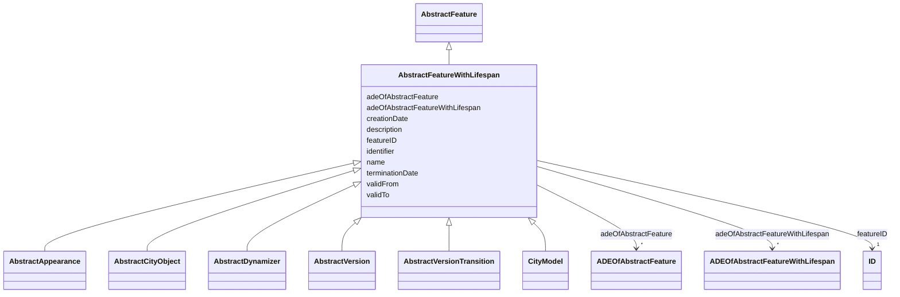

# Class: AbstractFeatureWithLifespan 


_AbstractFeatureWithLifespan is the base class for all CityGML features. This class allows the optional specification of the real-world and database times for the existence of each feature._


* __NOTE__: this is an abstract class and should not be instantiated directly


URI: [citygml:AbstractFeatureWithLifespan](https://www.ogc.org/standards/citygml/AbstractFeatureWithLifespan)





## Inheritance
* [AbstractFeature](AbstractFeature.md)
    * **AbstractFeatureWithLifespan**
        * [AbstractAppearance](AbstractAppearance.md)
        * [AbstractCityObject](AbstractCityObject.md)
        * [AbstractDynamizer](AbstractDynamizer.md)
        * [AbstractVersion](AbstractVersion.md)
        * [AbstractVersionTransition](AbstractVersionTransition.md)
        * [CityModel](CityModel.md)


## Slots

| Name | Cardinality and Range | Description | Inheritance |
| ---  | --- | --- | --- |
| [creationDate](creationDate.md) | 0..1 <br/> [Datetime](Datetime.md) | Indicates the date at which a CityGML feature was added to the CityModel | direct |
| [terminationDate](terminationDate.md) | 0..1 <br/> [Datetime](Datetime.md) | Indicates the date at which a CityGML feature was removed from the CityModel | direct |
| [validFrom](validFrom.md) | 0..1 <br/> [Datetime](Datetime.md) | Indicates the date at which a CityGML feature started to exist in the real wo... | direct |
| [validTo](validTo.md) | 0..1 <br/> [Datetime](Datetime.md) | Indicates the date at which a CityGML feature ended to exist in the real worl... | direct |
| [adeOfAbstractFeatureWithLifespan](adeOfAbstractFeatureWithLifespan.md) | * <br/> [ADEOfAbstractFeatureWithLifespan](ADEOfAbstractFeatureWithLifespan.md) | Augments AbstractFeatureWithLifespan with properties defined in an ADE | direct |
| [featureID](featureID.md) | 1 <br/> [ID](ID.md) |  | [AbstractFeature](AbstractFeature.md) |
| [identifier](identifier.md) | 0..1 <br/> [String](String.md) |  | [AbstractFeature](AbstractFeature.md) |
| [name](name.md) | * <br/> [String](String.md) |  | [AbstractFeature](AbstractFeature.md) |
| [description](description.md) | 0..1 <br/> [String](String.md) |  | [AbstractFeature](AbstractFeature.md) |
| [adeOfAbstractFeature](adeOfAbstractFeature.md) | * <br/> [ADEOfAbstractFeature](ADEOfAbstractFeature.md) | Augments AbstractFeature with properties defined in an ADE | [AbstractFeature](AbstractFeature.md) |


## Usages

| used by | used in | type | used |
| ---  | --- | --- | --- |
| [Transaction](Transaction.md) | [newFeature](newFeature.md) | range | [AbstractFeatureWithLifespan](AbstractFeatureWithLifespan.md) |
| [Transaction](Transaction.md) | [oldFeature](oldFeature.md) | range | [AbstractFeatureWithLifespan](AbstractFeatureWithLifespan.md) |
| [Version](Version.md) | [versionMember](versionMember.md) | range | [AbstractFeatureWithLifespan](AbstractFeatureWithLifespan.md) |


## Identifier and Mapping Information


### Schema Source


* from schema: https://www.ogc.org/standards/citygml


## Mappings

| Mapping Type | Mapped Value |
| ---  | ---  |
| self | citygml:AbstractFeatureWithLifespan |
| native | citygml:AbstractFeatureWithLifespan |


## LinkML Source

<!-- TODO: investigate https://stackoverflow.com/questions/37606292/how-to-create-tabbed-code-blocks-in-mkdocs-or-sphinx -->

### Direct

<details>
```yaml
name: AbstractFeatureWithLifespan
description: AbstractFeatureWithLifespan is the base class for all CityGML features.
  This class allows the optional specification of the real-world and database times
  for the existence of each feature.
from_schema: https://www.ogc.org/standards/citygml
is_a: AbstractFeature
abstract: true
attributes:
  creationDate:
    name: creationDate
    description: Indicates the date at which a CityGML feature was added to the CityModel.
    from_schema: https://www.ogc.org/standards/citygml
    rank: 1000
    domain_of:
    - AbstractFeatureWithLifespan
    range: datetime
    required: false
    multivalued: false
  terminationDate:
    name: terminationDate
    description: Indicates the date at which a CityGML feature was removed from the
      CityModel.
    from_schema: https://www.ogc.org/standards/citygml
    rank: 1000
    domain_of:
    - AbstractFeatureWithLifespan
    range: datetime
    required: false
    multivalued: false
  validFrom:
    name: validFrom
    description: Indicates the date at which a CityGML feature started to exist in
      the real world.
    from_schema: https://www.ogc.org/standards/citygml
    rank: 1000
    domain_of:
    - AbstractFeatureWithLifespan
    range: datetime
    required: false
    multivalued: false
  validTo:
    name: validTo
    description: Indicates the date at which a CityGML feature ended to exist in the
      real world.
    from_schema: https://www.ogc.org/standards/citygml
    rank: 1000
    domain_of:
    - AbstractFeatureWithLifespan
    range: datetime
    required: false
    multivalued: false
  adeOfAbstractFeatureWithLifespan:
    name: adeOfAbstractFeatureWithLifespan
    description: Augments AbstractFeatureWithLifespan with properties defined in an
      ADE.
    from_schema: https://www.ogc.org/standards/citygml
    rank: 1000
    domain_of:
    - AbstractFeatureWithLifespan
    range: ADEOfAbstractFeatureWithLifespan
    required: false
    multivalued: true

```
</details>

### Induced

<details>
```yaml
name: AbstractFeatureWithLifespan
description: AbstractFeatureWithLifespan is the base class for all CityGML features.
  This class allows the optional specification of the real-world and database times
  for the existence of each feature.
from_schema: https://www.ogc.org/standards/citygml
is_a: AbstractFeature
abstract: true
attributes:
  creationDate:
    name: creationDate
    description: Indicates the date at which a CityGML feature was added to the CityModel.
    from_schema: https://www.ogc.org/standards/citygml
    rank: 1000
    alias: creationDate
    owner: AbstractFeatureWithLifespan
    domain_of:
    - AbstractFeatureWithLifespan
    range: datetime
    required: false
    multivalued: false
  terminationDate:
    name: terminationDate
    description: Indicates the date at which a CityGML feature was removed from the
      CityModel.
    from_schema: https://www.ogc.org/standards/citygml
    rank: 1000
    alias: terminationDate
    owner: AbstractFeatureWithLifespan
    domain_of:
    - AbstractFeatureWithLifespan
    range: datetime
    required: false
    multivalued: false
  validFrom:
    name: validFrom
    description: Indicates the date at which a CityGML feature started to exist in
      the real world.
    from_schema: https://www.ogc.org/standards/citygml
    rank: 1000
    alias: validFrom
    owner: AbstractFeatureWithLifespan
    domain_of:
    - AbstractFeatureWithLifespan
    range: datetime
    required: false
    multivalued: false
  validTo:
    name: validTo
    description: Indicates the date at which a CityGML feature ended to exist in the
      real world.
    from_schema: https://www.ogc.org/standards/citygml
    rank: 1000
    alias: validTo
    owner: AbstractFeatureWithLifespan
    domain_of:
    - AbstractFeatureWithLifespan
    range: datetime
    required: false
    multivalued: false
  adeOfAbstractFeatureWithLifespan:
    name: adeOfAbstractFeatureWithLifespan
    description: Augments AbstractFeatureWithLifespan with properties defined in an
      ADE.
    from_schema: https://www.ogc.org/standards/citygml
    rank: 1000
    alias: adeOfAbstractFeatureWithLifespan
    owner: AbstractFeatureWithLifespan
    domain_of:
    - AbstractFeatureWithLifespan
    range: ADEOfAbstractFeatureWithLifespan
    required: false
    multivalued: true
  featureID:
    name: featureID
    from_schema: https://www.ogc.org/standards/citygml
    rank: 1000
    alias: featureID
    owner: AbstractFeatureWithLifespan
    domain_of:
    - AbstractFeature
    range: ID
    required: true
    multivalued: false
  identifier:
    name: identifier
    from_schema: https://www.ogc.org/standards/citygml
    rank: 1000
    alias: identifier
    owner: AbstractFeatureWithLifespan
    domain_of:
    - AbstractFeature
    range: string
    required: false
    multivalued: false
  name:
    name: name
    from_schema: https://www.ogc.org/standards/citygml
    alias: name
    owner: AbstractFeatureWithLifespan
    domain_of:
    - CodeAttribute
    - DateAttribute
    - DoubleAttribute
    - GenericAttributeSet
    - IntAttribute
    - MeasureAttribute
    - StringAttribute
    - UriAttribute
    - AbstractFeature
    range: string
    required: false
    multivalued: true
  description:
    name: description
    from_schema: https://www.ogc.org/standards/citygml
    alias: description
    owner: AbstractFeatureWithLifespan
    domain_of:
    - ConstructionEvent
    - AbstractFeature
    range: string
    required: false
    multivalued: false
  adeOfAbstractFeature:
    name: adeOfAbstractFeature
    description: Augments AbstractFeature with properties defined in an ADE.
    from_schema: https://www.ogc.org/standards/citygml
    rank: 1000
    alias: adeOfAbstractFeature
    owner: AbstractFeatureWithLifespan
    domain_of:
    - AbstractFeature
    range: ADEOfAbstractFeature
    required: false
    multivalued: true

```
</details>