# Class: AbstractSpaceBoundary 


_AbstractSpaceBoundary is the abstract superclass for all types of space boundaries. A space boundary is an entity with areal extent in the real world. Space boundaries are objects that bound a Space. They also realize the contact between adjacent spaces._


* __NOTE__: this is an abstract class and should not be instantiated directly


URI: [citygml:AbstractSpaceBoundary](https://www.ogc.org/standards/citygml/AbstractSpaceBoundary)

```mermaid
 classDiagram
    class AbstractSpaceBoundary
    click AbstractSpaceBoundary href "../AbstractSpaceBoundary/"
      AbstractCityObject <|-- AbstractSpaceBoundary
        click AbstractCityObject href "../AbstractCityObject/"
      

      AbstractSpaceBoundary <|-- AbstractThematicSurface
        click AbstractThematicSurface href "../AbstractThematicSurface/"
      AbstractSpaceBoundary <|-- AbstractReliefComponent
        click AbstractReliefComponent href "../AbstractReliefComponent/"
      AbstractSpaceBoundary <|-- ReliefFeature
        click ReliefFeature href "../ReliefFeature/"
      

      AbstractSpaceBoundary : adeOfAbstractCityObject
        
          
    
        
        
        AbstractSpaceBoundary --> "*" ADEOfAbstractCityObject : adeOfAbstractCityObject
        click ADEOfAbstractCityObject href "../ADEOfAbstractCityObject/"
    

        
      AbstractSpaceBoundary : adeOfAbstractFeature
        
          
    
        
        
        AbstractSpaceBoundary --> "*" ADEOfAbstractFeature : adeOfAbstractFeature
        click ADEOfAbstractFeature href "../ADEOfAbstractFeature/"
    

        
      AbstractSpaceBoundary : adeOfAbstractFeatureWithLifespan
        
          
    
        
        
        AbstractSpaceBoundary --> "*" ADEOfAbstractFeatureWithLifespan : adeOfAbstractFeatureWithLifespan
        click ADEOfAbstractFeatureWithLifespan href "../ADEOfAbstractFeatureWithLifespan/"
    

        
      AbstractSpaceBoundary : adeOfAbstractSpaceBoundary
        
          
    
        
        
        AbstractSpaceBoundary --> "*" ADEOfAbstractSpaceBoundary : adeOfAbstractSpaceBoundary
        click ADEOfAbstractSpaceBoundary href "../ADEOfAbstractSpaceBoundary/"
    

        
      AbstractSpaceBoundary : appearance
        
          
    
        
        
        AbstractSpaceBoundary --> "*" AbstractAppearance : appearance
        click AbstractAppearance href "../AbstractAppearance/"
    

        
      AbstractSpaceBoundary : creationDate
        
      AbstractSpaceBoundary : description
        
      AbstractSpaceBoundary : dynamizer
        
          
    
        
        
        AbstractSpaceBoundary --> "*" AbstractDynamizer : dynamizer
        click AbstractDynamizer href "../AbstractDynamizer/"
    

        
      AbstractSpaceBoundary : externalReference
        
          
    
        
        
        AbstractSpaceBoundary --> "*" ExternalReference : externalReference
        click ExternalReference href "../ExternalReference/"
    

        
      AbstractSpaceBoundary : featureID
        
          
    
        
        
        AbstractSpaceBoundary --> "1" ID : featureID
        click ID href "../ID/"
    

        
      AbstractSpaceBoundary : generalizesTo
        
          
    
        
        
        AbstractSpaceBoundary --> "*" AbstractCityObject : generalizesTo
        click AbstractCityObject href "../AbstractCityObject/"
    

        
      AbstractSpaceBoundary : genericAttribute
        
          
    
        
        
        AbstractSpaceBoundary --> "*" AbstractGenericAttribute : genericAttribute
        click AbstractGenericAttribute href "../AbstractGenericAttribute/"
    

        
      AbstractSpaceBoundary : identifier
        
      AbstractSpaceBoundary : name
        
      AbstractSpaceBoundary : relatedTo
        
          
    
        
        
        AbstractSpaceBoundary --> "*" AbstractCityObject : relatedTo
        click AbstractCityObject href "../AbstractCityObject/"
    

        
      AbstractSpaceBoundary : relativeToTerrain
        
          
    
        
        
        AbstractSpaceBoundary --> "0..1" RelativeToTerrain : relativeToTerrain
        click RelativeToTerrain href "../RelativeToTerrain/"
    

        
      AbstractSpaceBoundary : relativeToWater
        
          
    
        
        
        AbstractSpaceBoundary --> "0..1" RelativeToWater : relativeToWater
        click RelativeToWater href "../RelativeToWater/"
    

        
      AbstractSpaceBoundary : terminationDate
        
      AbstractSpaceBoundary : validFrom
        
      AbstractSpaceBoundary : validTo
        
      
```





## Inheritance
* [AbstractFeature](AbstractFeature.md)
    * [AbstractFeatureWithLifespan](AbstractFeatureWithLifespan.md)
        * [AbstractCityObject](AbstractCityObject.md)
            * **AbstractSpaceBoundary**
                * [AbstractThematicSurface](AbstractThematicSurface.md)
                * [AbstractReliefComponent](AbstractReliefComponent.md)
                * [ReliefFeature](ReliefFeature.md)


## Slots

| Name | Cardinality and Range | Description | Inheritance |
| ---  | --- | --- | --- |
| [adeOfAbstractSpaceBoundary](adeOfAbstractSpaceBoundary.md) | * <br/> [ADEOfAbstractSpaceBoundary](ADEOfAbstractSpaceBoundary.md) | Augments AbstractSpaceBoundary with properties defined in an ADE | direct |
| [relativeToTerrain](relativeToTerrain.md) | 0..1 <br/> [RelativeToTerrain](RelativeToTerrain.md) | Describes the vertical position of the city object relative to the surroundin... | [AbstractCityObject](AbstractCityObject.md) |
| [relativeToWater](relativeToWater.md) | 0..1 <br/> [RelativeToWater](RelativeToWater.md) | Describes the vertical position of the city object relative to the surroundin... | [AbstractCityObject](AbstractCityObject.md) |
| [adeOfAbstractCityObject](adeOfAbstractCityObject.md) | * <br/> [ADEOfAbstractCityObject](ADEOfAbstractCityObject.md) | Augments AbstractCityObject with properties defined in an ADE | [AbstractCityObject](AbstractCityObject.md) |
| [appearance](appearance.md) | * <br/> [AbstractAppearance](AbstractAppearance.md) | Relates appearances to the city object | [AbstractCityObject](AbstractCityObject.md) |
| [genericAttribute](genericAttribute.md) | * <br/> [AbstractGenericAttribute](AbstractGenericAttribute.md) | Relates generic attributes to the city object | [AbstractCityObject](AbstractCityObject.md) |
| [generalizesTo](generalizesTo.md) | * <br/> [AbstractCityObject](AbstractCityObject.md) | Relates generalized representations of the same real-world object in differen... | [AbstractCityObject](AbstractCityObject.md) |
| [externalReference](externalReference.md) | * <br/> [ExternalReference](ExternalReference.md) | References external objects in other information systems that have a relation... | [AbstractCityObject](AbstractCityObject.md) |
| [relatedTo](relatedTo.md) | * <br/> [AbstractCityObject](AbstractCityObject.md) |  | [AbstractCityObject](AbstractCityObject.md) |
| [dynamizer](dynamizer.md) | * <br/> [AbstractDynamizer](AbstractDynamizer.md) | Relates Dynamizer objects to the city object | [AbstractCityObject](AbstractCityObject.md) |
| [creationDate](creationDate.md) | 0..1 <br/> [Datetime](Datetime.md) | Indicates the date at which a CityGML feature was added to the CityModel | [AbstractFeatureWithLifespan](AbstractFeatureWithLifespan.md) |
| [terminationDate](terminationDate.md) | 0..1 <br/> [Datetime](Datetime.md) | Indicates the date at which a CityGML feature was removed from the CityModel | [AbstractFeatureWithLifespan](AbstractFeatureWithLifespan.md) |
| [validFrom](validFrom.md) | 0..1 <br/> [Datetime](Datetime.md) | Indicates the date at which a CityGML feature started to exist in the real wo... | [AbstractFeatureWithLifespan](AbstractFeatureWithLifespan.md) |
| [validTo](validTo.md) | 0..1 <br/> [Datetime](Datetime.md) | Indicates the date at which a CityGML feature ended to exist in the real worl... | [AbstractFeatureWithLifespan](AbstractFeatureWithLifespan.md) |
| [adeOfAbstractFeatureWithLifespan](adeOfAbstractFeatureWithLifespan.md) | * <br/> [ADEOfAbstractFeatureWithLifespan](ADEOfAbstractFeatureWithLifespan.md) | Augments AbstractFeatureWithLifespan with properties defined in an ADE | [AbstractFeatureWithLifespan](AbstractFeatureWithLifespan.md) |
| [featureID](featureID.md) | 1 <br/> [ID](ID.md) |  | [AbstractFeature](AbstractFeature.md) |
| [identifier](identifier.md) | 0..1 <br/> [String](String.md) |  | [AbstractFeature](AbstractFeature.md) |
| [name](name.md) | * <br/> [String](String.md) |  | [AbstractFeature](AbstractFeature.md) |
| [description](description.md) | 0..1 <br/> [String](String.md) |  | [AbstractFeature](AbstractFeature.md) |
| [adeOfAbstractFeature](adeOfAbstractFeature.md) | * <br/> [ADEOfAbstractFeature](ADEOfAbstractFeature.md) | Augments AbstractFeature with properties defined in an ADE | [AbstractFeature](AbstractFeature.md) |


## Usages

| used by | used in | type | used |
| ---  | --- | --- | --- |
| [AbstractFillingElement](AbstractFillingElement.md) | [boundary](boundary.md) | range | [AbstractSpaceBoundary](AbstractSpaceBoundary.md) |
| [AbstractFurniture](AbstractFurniture.md) | [boundary](boundary.md) | range | [AbstractSpaceBoundary](AbstractSpaceBoundary.md) |
| [BridgeFurniture](BridgeFurniture.md) | [boundary](boundary.md) | range | [AbstractSpaceBoundary](AbstractSpaceBoundary.md) |
| [AbstractBuildingSubdivision](AbstractBuildingSubdivision.md) | [boundary](boundary.md) | range | [AbstractSpaceBoundary](AbstractSpaceBoundary.md) |
| [BuildingFurniture](BuildingFurniture.md) | [boundary](boundary.md) | range | [AbstractSpaceBoundary](AbstractSpaceBoundary.md) |
| [BuildingUnit](BuildingUnit.md) | [boundary](boundary.md) | range | [AbstractSpaceBoundary](AbstractSpaceBoundary.md) |
| [CityFurniture](CityFurniture.md) | [boundary](boundary.md) | range | [AbstractSpaceBoundary](AbstractSpaceBoundary.md) |
| [CityObjectGroup](CityObjectGroup.md) | [boundary](boundary.md) | range | [AbstractSpaceBoundary](AbstractSpaceBoundary.md) |
| [AbstractLogicalSpace](AbstractLogicalSpace.md) | [boundary](boundary.md) | range | [AbstractSpaceBoundary](AbstractSpaceBoundary.md) |
| [AbstractOccupiedSpace](AbstractOccupiedSpace.md) | [boundary](boundary.md) | range | [AbstractSpaceBoundary](AbstractSpaceBoundary.md) |
| [AbstractPhysicalSpace](AbstractPhysicalSpace.md) | [boundary](boundary.md) | range | [AbstractSpaceBoundary](AbstractSpaceBoundary.md) |
| [AbstractSpace](AbstractSpace.md) | [boundary](boundary.md) | range | [AbstractSpaceBoundary](AbstractSpaceBoundary.md) |
| [AbstractUnoccupiedSpace](AbstractUnoccupiedSpace.md) | [boundary](boundary.md) | range | [AbstractSpaceBoundary](AbstractSpaceBoundary.md) |
| [GenericLogicalSpace](GenericLogicalSpace.md) | [boundary](boundary.md) | range | [AbstractSpaceBoundary](AbstractSpaceBoundary.md) |
| [GenericOccupiedSpace](GenericOccupiedSpace.md) | [boundary](boundary.md) | range | [AbstractSpaceBoundary](AbstractSpaceBoundary.md) |
| [GenericUnoccupiedSpace](GenericUnoccupiedSpace.md) | [boundary](boundary.md) | range | [AbstractSpaceBoundary](AbstractSpaceBoundary.md) |
| [AbstractTransportationSpace](AbstractTransportationSpace.md) | [boundary](boundary.md) | range | [AbstractSpaceBoundary](AbstractSpaceBoundary.md) |
| [ClearanceSpace](ClearanceSpace.md) | [boundary](boundary.md) | range | [AbstractSpaceBoundary](AbstractSpaceBoundary.md) |
| [Intersection](Intersection.md) | [boundary](boundary.md) | range | [AbstractSpaceBoundary](AbstractSpaceBoundary.md) |
| [Railway](Railway.md) | [boundary](boundary.md) | range | [AbstractSpaceBoundary](AbstractSpaceBoundary.md) |
| [Road](Road.md) | [boundary](boundary.md) | range | [AbstractSpaceBoundary](AbstractSpaceBoundary.md) |
| [Section](Section.md) | [boundary](boundary.md) | range | [AbstractSpaceBoundary](AbstractSpaceBoundary.md) |
| [Square](Square.md) | [boundary](boundary.md) | range | [AbstractSpaceBoundary](AbstractSpaceBoundary.md) |
| [Track](Track.md) | [boundary](boundary.md) | range | [AbstractSpaceBoundary](AbstractSpaceBoundary.md) |
| [Waterway](Waterway.md) | [boundary](boundary.md) | range | [AbstractSpaceBoundary](AbstractSpaceBoundary.md) |
| [TunnelFurniture](TunnelFurniture.md) | [boundary](boundary.md) | range | [AbstractSpaceBoundary](AbstractSpaceBoundary.md) |
| [AbstractVegetationObject](AbstractVegetationObject.md) | [boundary](boundary.md) | range | [AbstractSpaceBoundary](AbstractSpaceBoundary.md) |
| [PlantCover](PlantCover.md) | [boundary](boundary.md) | range | [AbstractSpaceBoundary](AbstractSpaceBoundary.md) |
| [SolitaryVegetationObject](SolitaryVegetationObject.md) | [boundary](boundary.md) | range | [AbstractSpaceBoundary](AbstractSpaceBoundary.md) |


## Identifier and Mapping Information


### Schema Source


* from schema: https://www.ogc.org/standards/citygml


## Mappings

| Mapping Type | Mapped Value |
| ---  | ---  |
| self | citygml:AbstractSpaceBoundary |
| native | citygml:AbstractSpaceBoundary |


## LinkML Source

<!-- TODO: investigate https://stackoverflow.com/questions/37606292/how-to-create-tabbed-code-blocks-in-mkdocs-or-sphinx -->

### Direct

<details>
```yaml
name: AbstractSpaceBoundary
description: AbstractSpaceBoundary is the abstract superclass for all types of space
  boundaries. A space boundary is an entity with areal extent in the real world. Space
  boundaries are objects that bound a Space. They also realize the contact between
  adjacent spaces.
from_schema: https://www.ogc.org/standards/citygml
is_a: AbstractCityObject
abstract: true
attributes:
  adeOfAbstractSpaceBoundary:
    name: adeOfAbstractSpaceBoundary
    description: Augments AbstractSpaceBoundary with properties defined in an ADE.
    from_schema: https://www.ogc.org/standards/citygml
    rank: 1000
    domain_of:
    - AbstractSpaceBoundary
    range: ADEOfAbstractSpaceBoundary
    required: false
    multivalued: true

```
</details>

### Induced

<details>
```yaml
name: AbstractSpaceBoundary
description: AbstractSpaceBoundary is the abstract superclass for all types of space
  boundaries. A space boundary is an entity with areal extent in the real world. Space
  boundaries are objects that bound a Space. They also realize the contact between
  adjacent spaces.
from_schema: https://www.ogc.org/standards/citygml
is_a: AbstractCityObject
abstract: true
attributes:
  adeOfAbstractSpaceBoundary:
    name: adeOfAbstractSpaceBoundary
    description: Augments AbstractSpaceBoundary with properties defined in an ADE.
    from_schema: https://www.ogc.org/standards/citygml
    rank: 1000
    alias: adeOfAbstractSpaceBoundary
    owner: AbstractSpaceBoundary
    domain_of:
    - AbstractSpaceBoundary
    range: ADEOfAbstractSpaceBoundary
    required: false
    multivalued: true
  relativeToTerrain:
    name: relativeToTerrain
    description: Describes the vertical position of the city object relative to the
      surrounding terrain.
    from_schema: https://www.ogc.org/standards/citygml
    rank: 1000
    alias: relativeToTerrain
    owner: AbstractSpaceBoundary
    domain_of:
    - AbstractCityObject
    range: RelativeToTerrain
    required: false
    multivalued: false
  relativeToWater:
    name: relativeToWater
    description: Describes the vertical position of the city object relative to the
      surrounding water surface.
    from_schema: https://www.ogc.org/standards/citygml
    rank: 1000
    alias: relativeToWater
    owner: AbstractSpaceBoundary
    domain_of:
    - AbstractCityObject
    range: RelativeToWater
    required: false
    multivalued: false
  adeOfAbstractCityObject:
    name: adeOfAbstractCityObject
    description: Augments AbstractCityObject with properties defined in an ADE.
    from_schema: https://www.ogc.org/standards/citygml
    rank: 1000
    alias: adeOfAbstractCityObject
    owner: AbstractSpaceBoundary
    domain_of:
    - AbstractCityObject
    range: ADEOfAbstractCityObject
    required: false
    multivalued: true
  appearance:
    name: appearance
    description: Relates appearances to the city object.
    from_schema: https://www.ogc.org/standards/citygml
    rank: 1000
    alias: appearance
    owner: AbstractSpaceBoundary
    domain_of:
    - AbstractCityObject
    - ImplicitGeometry
    range: AbstractAppearance
    required: false
    multivalued: true
  genericAttribute:
    name: genericAttribute
    description: Relates generic attributes to the city object.
    from_schema: https://www.ogc.org/standards/citygml
    alias: genericAttribute
    owner: AbstractSpaceBoundary
    domain_of:
    - GenericAttributeSet
    - AbstractCityObject
    range: AbstractGenericAttribute
    required: false
    multivalued: true
  generalizesTo:
    name: generalizesTo
    description: Relates generalized representations of the same real-world object
      in different Levels of Detail to the city object. The direction of this relation
      is from the city object to the corresponding generalized city objects.
    from_schema: https://www.ogc.org/standards/citygml
    rank: 1000
    alias: generalizesTo
    owner: AbstractSpaceBoundary
    domain_of:
    - AbstractCityObject
    range: AbstractCityObject
    required: false
    multivalued: true
  externalReference:
    name: externalReference
    description: References external objects in other information systems that have
      a relation to the city object.
    from_schema: https://www.ogc.org/standards/citygml
    rank: 1000
    alias: externalReference
    owner: AbstractSpaceBoundary
    domain_of:
    - AbstractCityObject
    range: ExternalReference
    required: false
    multivalued: true
  relatedTo:
    name: relatedTo
    from_schema: https://www.ogc.org/standards/citygml
    rank: 1000
    alias: relatedTo
    owner: AbstractSpaceBoundary
    domain_of:
    - AbstractCityObject
    range: AbstractCityObject
    required: false
    multivalued: true
  dynamizer:
    name: dynamizer
    description: Relates Dynamizer objects to the city object. These allow timeseries
      data to override static attribute values of the city object.
    from_schema: https://www.ogc.org/standards/citygml
    rank: 1000
    alias: dynamizer
    owner: AbstractSpaceBoundary
    domain_of:
    - AbstractCityObject
    range: AbstractDynamizer
    required: false
    multivalued: true
  creationDate:
    name: creationDate
    description: Indicates the date at which a CityGML feature was added to the CityModel.
    from_schema: https://www.ogc.org/standards/citygml
    rank: 1000
    alias: creationDate
    owner: AbstractSpaceBoundary
    domain_of:
    - AbstractFeatureWithLifespan
    range: datetime
    required: false
    multivalued: false
  terminationDate:
    name: terminationDate
    description: Indicates the date at which a CityGML feature was removed from the
      CityModel.
    from_schema: https://www.ogc.org/standards/citygml
    rank: 1000
    alias: terminationDate
    owner: AbstractSpaceBoundary
    domain_of:
    - AbstractFeatureWithLifespan
    range: datetime
    required: false
    multivalued: false
  validFrom:
    name: validFrom
    description: Indicates the date at which a CityGML feature started to exist in
      the real world.
    from_schema: https://www.ogc.org/standards/citygml
    rank: 1000
    alias: validFrom
    owner: AbstractSpaceBoundary
    domain_of:
    - AbstractFeatureWithLifespan
    range: datetime
    required: false
    multivalued: false
  validTo:
    name: validTo
    description: Indicates the date at which a CityGML feature ended to exist in the
      real world.
    from_schema: https://www.ogc.org/standards/citygml
    rank: 1000
    alias: validTo
    owner: AbstractSpaceBoundary
    domain_of:
    - AbstractFeatureWithLifespan
    range: datetime
    required: false
    multivalued: false
  adeOfAbstractFeatureWithLifespan:
    name: adeOfAbstractFeatureWithLifespan
    description: Augments AbstractFeatureWithLifespan with properties defined in an
      ADE.
    from_schema: https://www.ogc.org/standards/citygml
    rank: 1000
    alias: adeOfAbstractFeatureWithLifespan
    owner: AbstractSpaceBoundary
    domain_of:
    - AbstractFeatureWithLifespan
    range: ADEOfAbstractFeatureWithLifespan
    required: false
    multivalued: true
  featureID:
    name: featureID
    from_schema: https://www.ogc.org/standards/citygml
    rank: 1000
    alias: featureID
    owner: AbstractSpaceBoundary
    domain_of:
    - AbstractFeature
    range: ID
    required: true
    multivalued: false
  identifier:
    name: identifier
    from_schema: https://www.ogc.org/standards/citygml
    rank: 1000
    alias: identifier
    owner: AbstractSpaceBoundary
    domain_of:
    - AbstractFeature
    range: string
    required: false
    multivalued: false
  name:
    name: name
    from_schema: https://www.ogc.org/standards/citygml
    alias: name
    owner: AbstractSpaceBoundary
    domain_of:
    - CodeAttribute
    - DateAttribute
    - DoubleAttribute
    - GenericAttributeSet
    - IntAttribute
    - MeasureAttribute
    - StringAttribute
    - UriAttribute
    - AbstractFeature
    range: string
    required: false
    multivalued: true
  description:
    name: description
    from_schema: https://www.ogc.org/standards/citygml
    alias: description
    owner: AbstractSpaceBoundary
    domain_of:
    - ConstructionEvent
    - AbstractFeature
    range: string
    required: false
    multivalued: false
  adeOfAbstractFeature:
    name: adeOfAbstractFeature
    description: Augments AbstractFeature with properties defined in an ADE.
    from_schema: https://www.ogc.org/standards/citygml
    rank: 1000
    alias: adeOfAbstractFeature
    owner: AbstractSpaceBoundary
    domain_of:
    - AbstractFeature
    range: ADEOfAbstractFeature
    required: false
    multivalued: true

```
</details>