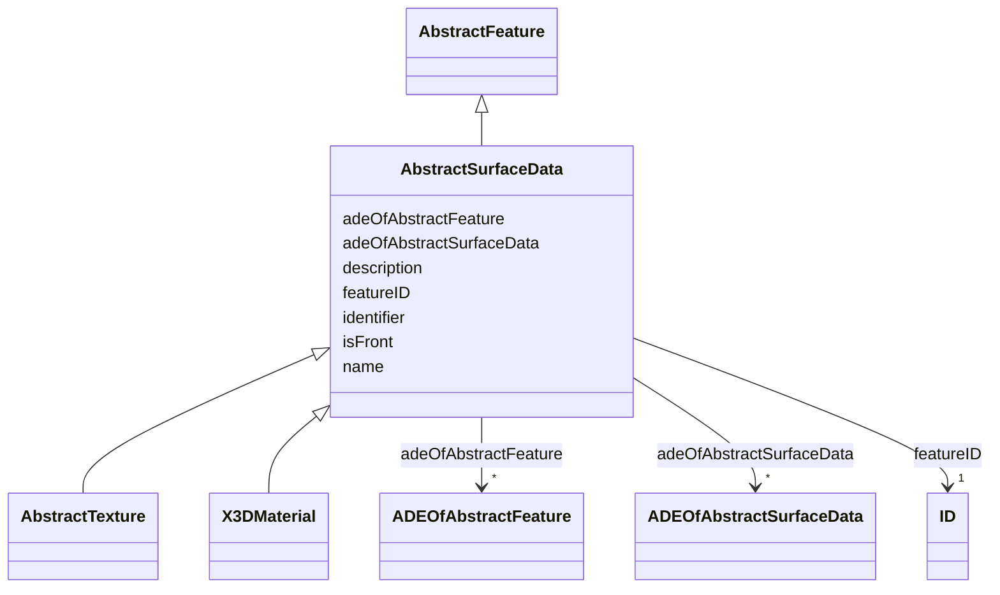

# Class: AbstractSurfaceData 


_AbstractSurfaceData is the abstract superclass for different kinds of textures and material._


* __NOTE__: this is an abstract class and should not be instantiated directly


URI: [citygml:AbstractSurfaceData](https://www.ogc.org/standards/citygml/AbstractSurfaceData)





## Inheritance
* [AbstractFeature](AbstractFeature.md)
    * **AbstractSurfaceData**
        * [AbstractTexture](AbstractTexture.md)
        * [X3DMaterial](X3DMaterial.md)


## Slots

| Name | Cardinality and Range | Description | Inheritance |
| ---  | --- | --- | --- |
| [isFront](isFront.md) | 0..1 <br/> [Boolean](Boolean.md) | Indicates whether the texture or material is assigned to the front side or th... | direct |
| [adeOfAbstractSurfaceData](adeOfAbstractSurfaceData.md) | * <br/> [ADEOfAbstractSurfaceData](ADEOfAbstractSurfaceData.md) | Augments AbstractSurfaceData with properties defined in an ADE | direct |
| [featureID](featureID.md) | 1 <br/> [ID](ID.md) |  | [AbstractFeature](AbstractFeature.md) |
| [identifier](identifier.md) | 0..1 <br/> [String](String.md) |  | [AbstractFeature](AbstractFeature.md) |
| [name](name.md) | * <br/> [String](String.md) |  | [AbstractFeature](AbstractFeature.md) |
| [description](description.md) | 0..1 <br/> [String](String.md) |  | [AbstractFeature](AbstractFeature.md) |
| [adeOfAbstractFeature](adeOfAbstractFeature.md) | * <br/> [ADEOfAbstractFeature](ADEOfAbstractFeature.md) | Augments AbstractFeature with properties defined in an ADE | [AbstractFeature](AbstractFeature.md) |


## Usages

| used by | used in | type | used |
| ---  | --- | --- | --- |
| [Appearance](Appearance.md) | [surfaceData](surfaceData.md) | range | [AbstractSurfaceData](AbstractSurfaceData.md) |


## Identifier and Mapping Information


### Schema Source


* from schema: https://www.ogc.org/standards/citygml


## Mappings

| Mapping Type | Mapped Value |
| ---  | ---  |
| self | citygml:AbstractSurfaceData |
| native | citygml:AbstractSurfaceData |


## LinkML Source

<!-- TODO: investigate https://stackoverflow.com/questions/37606292/how-to-create-tabbed-code-blocks-in-mkdocs-or-sphinx -->

### Direct

<details>
```yaml
name: AbstractSurfaceData
description: AbstractSurfaceData is the abstract superclass for different kinds of
  textures and material.
from_schema: https://www.ogc.org/standards/citygml
is_a: AbstractFeature
abstract: true
attributes:
  isFront:
    name: isFront
    description: Indicates whether the texture or material is assigned to the front
      side or the back side of the surface geometry object.
    from_schema: https://www.ogc.org/standards/citygml
    rank: 1000
    domain_of:
    - AbstractSurfaceData
    range: boolean
    required: false
    multivalued: false
  adeOfAbstractSurfaceData:
    name: adeOfAbstractSurfaceData
    description: Augments AbstractSurfaceData with properties defined in an ADE.
    from_schema: https://www.ogc.org/standards/citygml
    rank: 1000
    domain_of:
    - AbstractSurfaceData
    range: ADEOfAbstractSurfaceData
    required: false
    multivalued: true

```
</details>

### Induced

<details>
```yaml
name: AbstractSurfaceData
description: AbstractSurfaceData is the abstract superclass for different kinds of
  textures and material.
from_schema: https://www.ogc.org/standards/citygml
is_a: AbstractFeature
abstract: true
attributes:
  isFront:
    name: isFront
    description: Indicates whether the texture or material is assigned to the front
      side or the back side of the surface geometry object.
    from_schema: https://www.ogc.org/standards/citygml
    rank: 1000
    alias: isFront
    owner: AbstractSurfaceData
    domain_of:
    - AbstractSurfaceData
    range: boolean
    required: false
    multivalued: false
  adeOfAbstractSurfaceData:
    name: adeOfAbstractSurfaceData
    description: Augments AbstractSurfaceData with properties defined in an ADE.
    from_schema: https://www.ogc.org/standards/citygml
    rank: 1000
    alias: adeOfAbstractSurfaceData
    owner: AbstractSurfaceData
    domain_of:
    - AbstractSurfaceData
    range: ADEOfAbstractSurfaceData
    required: false
    multivalued: true
  featureID:
    name: featureID
    from_schema: https://www.ogc.org/standards/citygml
    rank: 1000
    alias: featureID
    owner: AbstractSurfaceData
    domain_of:
    - AbstractFeature
    range: ID
    required: true
    multivalued: false
  identifier:
    name: identifier
    from_schema: https://www.ogc.org/standards/citygml
    rank: 1000
    alias: identifier
    owner: AbstractSurfaceData
    domain_of:
    - AbstractFeature
    range: string
    required: false
    multivalued: false
  name:
    name: name
    from_schema: https://www.ogc.org/standards/citygml
    alias: name
    owner: AbstractSurfaceData
    domain_of:
    - CodeAttribute
    - DateAttribute
    - DoubleAttribute
    - GenericAttributeSet
    - IntAttribute
    - MeasureAttribute
    - StringAttribute
    - UriAttribute
    - AbstractFeature
    range: string
    required: false
    multivalued: true
  description:
    name: description
    from_schema: https://www.ogc.org/standards/citygml
    alias: description
    owner: AbstractSurfaceData
    domain_of:
    - ConstructionEvent
    - AbstractFeature
    range: string
    required: false
    multivalued: false
  adeOfAbstractFeature:
    name: adeOfAbstractFeature
    description: Augments AbstractFeature with properties defined in an ADE.
    from_schema: https://www.ogc.org/standards/citygml
    rank: 1000
    alias: adeOfAbstractFeature
    owner: AbstractSurfaceData
    domain_of:
    - AbstractFeature
    range: ADEOfAbstractFeature
    required: false
    multivalued: true

```
</details>