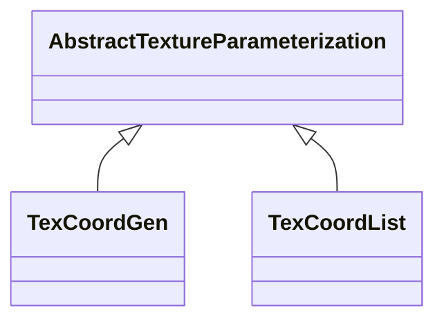

# Class: AbstractTextureParameterization 


_AbstractTextureParameterization is the abstract superclass for different kinds of texture parameterizations._


* __NOTE__: this is an abstract class and should not be instantiated directly


URI: [citygml:AbstractTextureParameterization](https://www.ogc.org/standards/citygml/AbstractTextureParameterization)





## Inheritance
* **AbstractTextureParameterization**
    * [TexCoordGen](TexCoordGen.md)
    * [TexCoordList](TexCoordList.md)


## Slots

| Name | Cardinality and Range | Description | Inheritance |
| ---  | --- | --- | --- |


## Usages

| used by | used in | type | used |
| ---  | --- | --- | --- |
| [ParameterizedTexture](ParameterizedTexture.md) | [textureParameterization](textureParameterization.md) | range | [AbstractTextureParameterization](AbstractTextureParameterization.md) |


## Identifier and Mapping Information


### Schema Source


* from schema: https://www.ogc.org/standards/citygml


## Mappings

| Mapping Type | Mapped Value |
| ---  | ---  |
| self | citygml:AbstractTextureParameterization |
| native | citygml:AbstractTextureParameterization |


## LinkML Source

<!-- TODO: investigate https://stackoverflow.com/questions/37606292/how-to-create-tabbed-code-blocks-in-mkdocs-or-sphinx -->

### Direct

<details>
```yaml
name: AbstractTextureParameterization
description: AbstractTextureParameterization is the abstract superclass for different
  kinds of texture parameterizations.
from_schema: https://www.ogc.org/standards/citygml
abstract: true

```
</details>

### Induced

<details>
```yaml
name: AbstractTextureParameterization
description: AbstractTextureParameterization is the abstract superclass for different
  kinds of texture parameterizations.
from_schema: https://www.ogc.org/standards/citygml
abstract: true

```
</details>