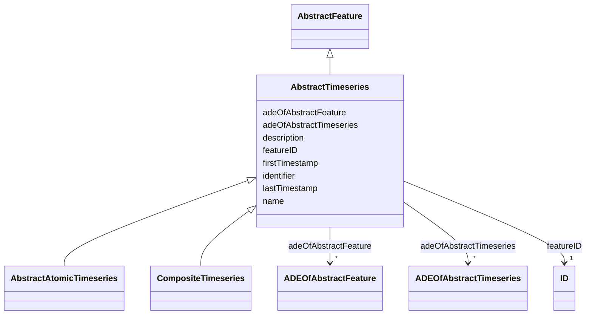

# Class: AbstractTimeseries 


_AbstractTimeseries is the abstract superclass representing any type of timeseries data._


* __NOTE__: this is an abstract class and should not be instantiated directly


URI: [citygml:AbstractTimeseries](https://www.ogc.org/standards/citygml/AbstractTimeseries)





## Inheritance
* [AbstractFeature](AbstractFeature.md)
    * **AbstractTimeseries**
        * [AbstractAtomicTimeseries](AbstractAtomicTimeseries.md)
        * [CompositeTimeseries](CompositeTimeseries.md)


## Slots

| Name | Cardinality and Range | Description | Inheritance |
| ---  | --- | --- | --- |
| [firstTimestamp](firstTimestamp.md) | 0..1 <br/> [String](String.md) | Specifies the beginning of the timeseries | direct |
| [lastTimestamp](lastTimestamp.md) | 0..1 <br/> [String](String.md) | Specifies the end of the timeseries | direct |
| [adeOfAbstractTimeseries](adeOfAbstractTimeseries.md) | * <br/> [ADEOfAbstractTimeseries](ADEOfAbstractTimeseries.md) | Augments AbstractTimeseries with properties defined in an ADE | direct |
| [featureID](featureID.md) | 1 <br/> [ID](ID.md) |  | [AbstractFeature](AbstractFeature.md) |
| [identifier](identifier.md) | 0..1 <br/> [String](String.md) |  | [AbstractFeature](AbstractFeature.md) |
| [name](name.md) | * <br/> [String](String.md) |  | [AbstractFeature](AbstractFeature.md) |
| [description](description.md) | 0..1 <br/> [String](String.md) |  | [AbstractFeature](AbstractFeature.md) |
| [adeOfAbstractFeature](adeOfAbstractFeature.md) | * <br/> [ADEOfAbstractFeature](ADEOfAbstractFeature.md) | Augments AbstractFeature with properties defined in an ADE | [AbstractFeature](AbstractFeature.md) |


## Usages

| used by | used in | type | used |
| ---  | --- | --- | --- |
| [TimeseriesComponent](TimeseriesComponent.md) | [timeseries](timeseries.md) | range | [AbstractTimeseries](AbstractTimeseries.md) |
| [Dynamizer](Dynamizer.md) | [dynamicData](dynamicData.md) | range | [AbstractTimeseries](AbstractTimeseries.md) |


## Identifier and Mapping Information


### Schema Source


* from schema: https://www.ogc.org/standards/citygml


## Mappings

| Mapping Type | Mapped Value |
| ---  | ---  |
| self | citygml:AbstractTimeseries |
| native | citygml:AbstractTimeseries |


## LinkML Source

<!-- TODO: investigate https://stackoverflow.com/questions/37606292/how-to-create-tabbed-code-blocks-in-mkdocs-or-sphinx -->

### Direct

<details>
```yaml
name: AbstractTimeseries
description: AbstractTimeseries is the abstract superclass representing any type of
  timeseries data.
from_schema: https://www.ogc.org/standards/citygml
is_a: AbstractFeature
abstract: true
attributes:
  firstTimestamp:
    name: firstTimestamp
    description: Specifies the beginning of the timeseries.
    from_schema: https://www.ogc.org/standards/citygml
    rank: 1000
    domain_of:
    - AbstractTimeseries
    range: string
    required: false
    multivalued: false
  lastTimestamp:
    name: lastTimestamp
    description: Specifies the end of the timeseries.
    from_schema: https://www.ogc.org/standards/citygml
    rank: 1000
    domain_of:
    - AbstractTimeseries
    range: string
    required: false
    multivalued: false
  adeOfAbstractTimeseries:
    name: adeOfAbstractTimeseries
    description: Augments AbstractTimeseries with properties defined in an ADE.
    from_schema: https://www.ogc.org/standards/citygml
    rank: 1000
    domain_of:
    - AbstractTimeseries
    range: ADEOfAbstractTimeseries
    required: false
    multivalued: true

```
</details>

### Induced

<details>
```yaml
name: AbstractTimeseries
description: AbstractTimeseries is the abstract superclass representing any type of
  timeseries data.
from_schema: https://www.ogc.org/standards/citygml
is_a: AbstractFeature
abstract: true
attributes:
  firstTimestamp:
    name: firstTimestamp
    description: Specifies the beginning of the timeseries.
    from_schema: https://www.ogc.org/standards/citygml
    rank: 1000
    alias: firstTimestamp
    owner: AbstractTimeseries
    domain_of:
    - AbstractTimeseries
    range: string
    required: false
    multivalued: false
  lastTimestamp:
    name: lastTimestamp
    description: Specifies the end of the timeseries.
    from_schema: https://www.ogc.org/standards/citygml
    rank: 1000
    alias: lastTimestamp
    owner: AbstractTimeseries
    domain_of:
    - AbstractTimeseries
    range: string
    required: false
    multivalued: false
  adeOfAbstractTimeseries:
    name: adeOfAbstractTimeseries
    description: Augments AbstractTimeseries with properties defined in an ADE.
    from_schema: https://www.ogc.org/standards/citygml
    rank: 1000
    alias: adeOfAbstractTimeseries
    owner: AbstractTimeseries
    domain_of:
    - AbstractTimeseries
    range: ADEOfAbstractTimeseries
    required: false
    multivalued: true
  featureID:
    name: featureID
    from_schema: https://www.ogc.org/standards/citygml
    rank: 1000
    alias: featureID
    owner: AbstractTimeseries
    domain_of:
    - AbstractFeature
    range: ID
    required: true
    multivalued: false
  identifier:
    name: identifier
    from_schema: https://www.ogc.org/standards/citygml
    rank: 1000
    alias: identifier
    owner: AbstractTimeseries
    domain_of:
    - AbstractFeature
    range: string
    required: false
    multivalued: false
  name:
    name: name
    from_schema: https://www.ogc.org/standards/citygml
    alias: name
    owner: AbstractTimeseries
    domain_of:
    - CodeAttribute
    - DateAttribute
    - DoubleAttribute
    - GenericAttributeSet
    - IntAttribute
    - MeasureAttribute
    - StringAttribute
    - UriAttribute
    - AbstractFeature
    range: string
    required: false
    multivalued: true
  description:
    name: description
    from_schema: https://www.ogc.org/standards/citygml
    alias: description
    owner: AbstractTimeseries
    domain_of:
    - ConstructionEvent
    - AbstractFeature
    range: string
    required: false
    multivalued: false
  adeOfAbstractFeature:
    name: adeOfAbstractFeature
    description: Augments AbstractFeature with properties defined in an ADE.
    from_schema: https://www.ogc.org/standards/citygml
    rank: 1000
    alias: adeOfAbstractFeature
    owner: AbstractTimeseries
    domain_of:
    - AbstractFeature
    range: ADEOfAbstractFeature
    required: false
    multivalued: true

```
</details>