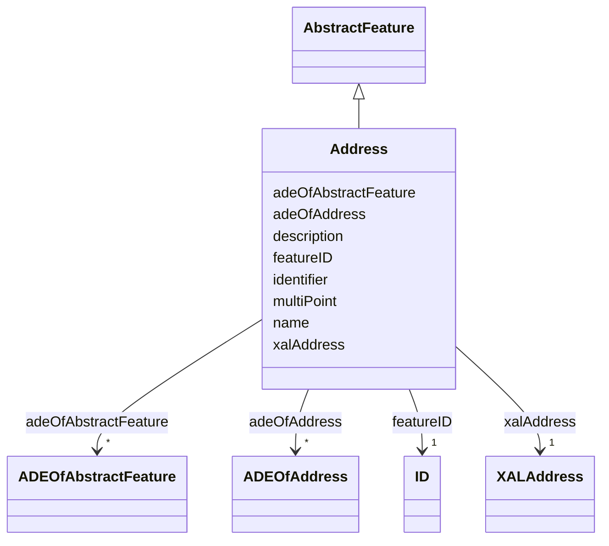

# Class: Address 


_Address represents an address of a city object._


URI: [citygml:Address](https://www.ogc.org/standards/citygml/Address)





## Inheritance
* [AbstractFeature](AbstractFeature.md)
    * **Address**


## Slots

| Name | Cardinality and Range | Description | Inheritance |
| ---  | --- | --- | --- |
| [adeOfAddress](adeOfAddress.md) | * <br/> [ADEOfAddress](ADEOfAddress.md) | Augments the Address with properties defined in an ADE | direct |
| [multiPoint](multiPoint.md) | 0..1 <br/> [String](String.md) | Relates to the MultiPoint geometry of the Address | direct |
| [xalAddress](xalAddress.md) | 1 <br/> [XALAddress](XALAddress.md) | Relates an OASIS address object to the Address | direct |
| [featureID](featureID.md) | 1 <br/> [ID](ID.md) |  | [AbstractFeature](AbstractFeature.md) |
| [identifier](identifier.md) | 0..1 <br/> [String](String.md) |  | [AbstractFeature](AbstractFeature.md) |
| [name](name.md) | * <br/> [String](String.md) |  | [AbstractFeature](AbstractFeature.md) |
| [description](description.md) | 0..1 <br/> [String](String.md) |  | [AbstractFeature](AbstractFeature.md) |
| [adeOfAbstractFeature](adeOfAbstractFeature.md) | * <br/> [ADEOfAbstractFeature](ADEOfAbstractFeature.md) | Augments AbstractFeature with properties defined in an ADE | [AbstractFeature](AbstractFeature.md) |


## Usages

| used by | used in | type | used |
| ---  | --- | --- | --- |
| [Door](Door.md) | [address](address.md) | range | [Address](Address.md) |
| [DoorSurface](DoorSurface.md) | [address](address.md) | range | [Address](Address.md) |
| [AbstractBridge](AbstractBridge.md) | [address](address.md) | range | [Address](Address.md) |
| [Bridge](Bridge.md) | [address](address.md) | range | [Address](Address.md) |
| [BridgePart](BridgePart.md) | [address](address.md) | range | [Address](Address.md) |
| [AbstractBuilding](AbstractBuilding.md) | [address](address.md) | range | [Address](Address.md) |
| [Building](Building.md) | [address](address.md) | range | [Address](Address.md) |
| [BuildingPart](BuildingPart.md) | [address](address.md) | range | [Address](Address.md) |
| [BuildingUnit](BuildingUnit.md) | [address](address.md) | range | [Address](Address.md) |


## Identifier and Mapping Information


### Schema Source


* from schema: https://www.ogc.org/standards/citygml


## Mappings

| Mapping Type | Mapped Value |
| ---  | ---  |
| self | citygml:Address |
| native | citygml:Address |


## LinkML Source

<!-- TODO: investigate https://stackoverflow.com/questions/37606292/how-to-create-tabbed-code-blocks-in-mkdocs-or-sphinx -->

### Direct

<details>
```yaml
name: Address
description: Address represents an address of a city object.
from_schema: https://www.ogc.org/standards/citygml
is_a: AbstractFeature
abstract: false
attributes:
  adeOfAddress:
    name: adeOfAddress
    description: Augments the Address with properties defined in an ADE.
    from_schema: https://www.ogc.org/standards/citygml
    rank: 1000
    domain_of:
    - Address
    range: ADEOfAddress
    required: false
    multivalued: true
  multiPoint:
    name: multiPoint
    description: Relates to the MultiPoint geometry of the Address. The geometry relates
      the address spatially to a city object.
    from_schema: https://www.ogc.org/standards/citygml
    rank: 1000
    domain_of:
    - Address
    range: string
    required: false
    multivalued: false
  xalAddress:
    name: xalAddress
    description: Relates an OASIS address object to the Address.
    from_schema: https://www.ogc.org/standards/citygml
    rank: 1000
    domain_of:
    - Address
    range: XALAddress
    required: true
    multivalued: false

```
</details>

### Induced

<details>
```yaml
name: Address
description: Address represents an address of a city object.
from_schema: https://www.ogc.org/standards/citygml
is_a: AbstractFeature
abstract: false
attributes:
  adeOfAddress:
    name: adeOfAddress
    description: Augments the Address with properties defined in an ADE.
    from_schema: https://www.ogc.org/standards/citygml
    rank: 1000
    alias: adeOfAddress
    owner: Address
    domain_of:
    - Address
    range: ADEOfAddress
    required: false
    multivalued: true
  multiPoint:
    name: multiPoint
    description: Relates to the MultiPoint geometry of the Address. The geometry relates
      the address spatially to a city object.
    from_schema: https://www.ogc.org/standards/citygml
    rank: 1000
    alias: multiPoint
    owner: Address
    domain_of:
    - Address
    range: string
    required: false
    multivalued: false
  xalAddress:
    name: xalAddress
    description: Relates an OASIS address object to the Address.
    from_schema: https://www.ogc.org/standards/citygml
    rank: 1000
    alias: xalAddress
    owner: Address
    domain_of:
    - Address
    range: XALAddress
    required: true
    multivalued: false
  featureID:
    name: featureID
    from_schema: https://www.ogc.org/standards/citygml
    rank: 1000
    alias: featureID
    owner: Address
    domain_of:
    - AbstractFeature
    range: ID
    required: true
    multivalued: false
  identifier:
    name: identifier
    from_schema: https://www.ogc.org/standards/citygml
    rank: 1000
    alias: identifier
    owner: Address
    domain_of:
    - AbstractFeature
    range: string
    required: false
    multivalued: false
  name:
    name: name
    from_schema: https://www.ogc.org/standards/citygml
    alias: name
    owner: Address
    domain_of:
    - CodeAttribute
    - DateAttribute
    - DoubleAttribute
    - GenericAttributeSet
    - IntAttribute
    - MeasureAttribute
    - StringAttribute
    - UriAttribute
    - AbstractFeature
    range: string
    required: false
    multivalued: true
  description:
    name: description
    from_schema: https://www.ogc.org/standards/citygml
    alias: description
    owner: Address
    domain_of:
    - ConstructionEvent
    - AbstractFeature
    range: string
    required: false
    multivalued: false
  adeOfAbstractFeature:
    name: adeOfAbstractFeature
    description: Augments AbstractFeature with properties defined in an ADE.
    from_schema: https://www.ogc.org/standards/citygml
    rank: 1000
    alias: adeOfAbstractFeature
    owner: Address
    domain_of:
    - AbstractFeature
    range: ADEOfAbstractFeature
    required: false
    multivalued: true

```
</details>