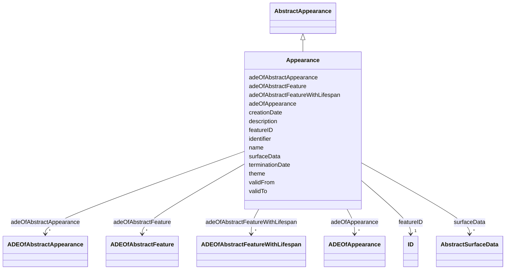

# Class: Appearance 


_An Appearance is a collection of surface data, i.e., observable properties for surface geometry objects in the form of textures and material._


URI: [citygml:Appearance](https://www.ogc.org/standards/citygml/Appearance)





## Inheritance
* [AbstractFeature](AbstractFeature.md)
    * [AbstractFeatureWithLifespan](AbstractFeatureWithLifespan.md)
        * [AbstractAppearance](AbstractAppearance.md)
            * **Appearance**


## Slots

| Name | Cardinality and Range | Description | Inheritance |
| ---  | --- | --- | --- |
| [theme](theme.md) | 0..1 <br/> [String](String.md) | Specifies the topic of the Appearance | direct |
| [adeOfAppearance](adeOfAppearance.md) | * <br/> [ADEOfAppearance](ADEOfAppearance.md) | Augments the Appearance with properties defined in an ADE | direct |
| [surfaceData](surfaceData.md) | * <br/> [AbstractSurfaceData](AbstractSurfaceData.md) | Relates to the surface data that are part of the Appearance | direct |
| [adeOfAbstractAppearance](adeOfAbstractAppearance.md) | * <br/> [ADEOfAbstractAppearance](ADEOfAbstractAppearance.md) | Augments AbstractAppearance with properties defined in an ADE | [AbstractAppearance](AbstractAppearance.md) |
| [creationDate](creationDate.md) | 0..1 <br/> [Datetime](Datetime.md) | Indicates the date at which a CityGML feature was added to the CityModel | [AbstractFeatureWithLifespan](AbstractFeatureWithLifespan.md) |
| [terminationDate](terminationDate.md) | 0..1 <br/> [Datetime](Datetime.md) | Indicates the date at which a CityGML feature was removed from the CityModel | [AbstractFeatureWithLifespan](AbstractFeatureWithLifespan.md) |
| [validFrom](validFrom.md) | 0..1 <br/> [Datetime](Datetime.md) | Indicates the date at which a CityGML feature started to exist in the real wo... | [AbstractFeatureWithLifespan](AbstractFeatureWithLifespan.md) |
| [validTo](validTo.md) | 0..1 <br/> [Datetime](Datetime.md) | Indicates the date at which a CityGML feature ended to exist in the real worl... | [AbstractFeatureWithLifespan](AbstractFeatureWithLifespan.md) |
| [adeOfAbstractFeatureWithLifespan](adeOfAbstractFeatureWithLifespan.md) | * <br/> [ADEOfAbstractFeatureWithLifespan](ADEOfAbstractFeatureWithLifespan.md) | Augments AbstractFeatureWithLifespan with properties defined in an ADE | [AbstractFeatureWithLifespan](AbstractFeatureWithLifespan.md) |
| [featureID](featureID.md) | 1 <br/> [ID](ID.md) |  | [AbstractFeature](AbstractFeature.md) |
| [identifier](identifier.md) | 0..1 <br/> [String](String.md) |  | [AbstractFeature](AbstractFeature.md) |
| [name](name.md) | * <br/> [String](String.md) |  | [AbstractFeature](AbstractFeature.md) |
| [description](description.md) | 0..1 <br/> [String](String.md) |  | [AbstractFeature](AbstractFeature.md) |
| [adeOfAbstractFeature](adeOfAbstractFeature.md) | * <br/> [ADEOfAbstractFeature](ADEOfAbstractFeature.md) | Augments AbstractFeature with properties defined in an ADE | [AbstractFeature](AbstractFeature.md) |


## Identifier and Mapping Information


### Schema Source


* from schema: https://www.ogc.org/standards/citygml


## Mappings

| Mapping Type | Mapped Value |
| ---  | ---  |
| self | citygml:Appearance |
| native | citygml:Appearance |


## LinkML Source

<!-- TODO: investigate https://stackoverflow.com/questions/37606292/how-to-create-tabbed-code-blocks-in-mkdocs-or-sphinx -->

### Direct

<details>
```yaml
name: Appearance
description: An Appearance is a collection of surface data, i.e., observable properties
  for surface geometry objects in the form of textures and material.
from_schema: https://www.ogc.org/standards/citygml
is_a: AbstractAppearance
abstract: false
attributes:
  theme:
    name: theme
    description: Specifies the topic of the Appearance. Each Appearance contains surface
      data for one theme only. Examples of themes are infrared radiation, noise pollution,
      or earthquake-induced structural stress.
    from_schema: https://www.ogc.org/standards/citygml
    rank: 1000
    domain_of:
    - Appearance
    range: string
    required: false
    multivalued: false
  adeOfAppearance:
    name: adeOfAppearance
    description: Augments the Appearance with properties defined in an ADE.
    from_schema: https://www.ogc.org/standards/citygml
    rank: 1000
    domain_of:
    - Appearance
    range: ADEOfAppearance
    required: false
    multivalued: true
  surfaceData:
    name: surfaceData
    description: Relates to the surface data that are part of the Appearance.
    from_schema: https://www.ogc.org/standards/citygml
    rank: 1000
    domain_of:
    - Appearance
    range: AbstractSurfaceData
    required: false
    multivalued: true

```
</details>

### Induced

<details>
```yaml
name: Appearance
description: An Appearance is a collection of surface data, i.e., observable properties
  for surface geometry objects in the form of textures and material.
from_schema: https://www.ogc.org/standards/citygml
is_a: AbstractAppearance
abstract: false
attributes:
  theme:
    name: theme
    description: Specifies the topic of the Appearance. Each Appearance contains surface
      data for one theme only. Examples of themes are infrared radiation, noise pollution,
      or earthquake-induced structural stress.
    from_schema: https://www.ogc.org/standards/citygml
    rank: 1000
    alias: theme
    owner: Appearance
    domain_of:
    - Appearance
    range: string
    required: false
    multivalued: false
  adeOfAppearance:
    name: adeOfAppearance
    description: Augments the Appearance with properties defined in an ADE.
    from_schema: https://www.ogc.org/standards/citygml
    rank: 1000
    alias: adeOfAppearance
    owner: Appearance
    domain_of:
    - Appearance
    range: ADEOfAppearance
    required: false
    multivalued: true
  surfaceData:
    name: surfaceData
    description: Relates to the surface data that are part of the Appearance.
    from_schema: https://www.ogc.org/standards/citygml
    rank: 1000
    alias: surfaceData
    owner: Appearance
    domain_of:
    - Appearance
    range: AbstractSurfaceData
    required: false
    multivalued: true
  adeOfAbstractAppearance:
    name: adeOfAbstractAppearance
    description: Augments AbstractAppearance with properties defined in an ADE.
    from_schema: https://www.ogc.org/standards/citygml
    rank: 1000
    alias: adeOfAbstractAppearance
    owner: Appearance
    domain_of:
    - AbstractAppearance
    range: ADEOfAbstractAppearance
    required: false
    multivalued: true
  creationDate:
    name: creationDate
    description: Indicates the date at which a CityGML feature was added to the CityModel.
    from_schema: https://www.ogc.org/standards/citygml
    rank: 1000
    alias: creationDate
    owner: Appearance
    domain_of:
    - AbstractFeatureWithLifespan
    range: datetime
    required: false
    multivalued: false
  terminationDate:
    name: terminationDate
    description: Indicates the date at which a CityGML feature was removed from the
      CityModel.
    from_schema: https://www.ogc.org/standards/citygml
    rank: 1000
    alias: terminationDate
    owner: Appearance
    domain_of:
    - AbstractFeatureWithLifespan
    range: datetime
    required: false
    multivalued: false
  validFrom:
    name: validFrom
    description: Indicates the date at which a CityGML feature started to exist in
      the real world.
    from_schema: https://www.ogc.org/standards/citygml
    rank: 1000
    alias: validFrom
    owner: Appearance
    domain_of:
    - AbstractFeatureWithLifespan
    range: datetime
    required: false
    multivalued: false
  validTo:
    name: validTo
    description: Indicates the date at which a CityGML feature ended to exist in the
      real world.
    from_schema: https://www.ogc.org/standards/citygml
    rank: 1000
    alias: validTo
    owner: Appearance
    domain_of:
    - AbstractFeatureWithLifespan
    range: datetime
    required: false
    multivalued: false
  adeOfAbstractFeatureWithLifespan:
    name: adeOfAbstractFeatureWithLifespan
    description: Augments AbstractFeatureWithLifespan with properties defined in an
      ADE.
    from_schema: https://www.ogc.org/standards/citygml
    rank: 1000
    alias: adeOfAbstractFeatureWithLifespan
    owner: Appearance
    domain_of:
    - AbstractFeatureWithLifespan
    range: ADEOfAbstractFeatureWithLifespan
    required: false
    multivalued: true
  featureID:
    name: featureID
    from_schema: https://www.ogc.org/standards/citygml
    rank: 1000
    alias: featureID
    owner: Appearance
    domain_of:
    - AbstractFeature
    range: ID
    required: true
    multivalued: false
  identifier:
    name: identifier
    from_schema: https://www.ogc.org/standards/citygml
    rank: 1000
    alias: identifier
    owner: Appearance
    domain_of:
    - AbstractFeature
    range: string
    required: false
    multivalued: false
  name:
    name: name
    from_schema: https://www.ogc.org/standards/citygml
    alias: name
    owner: Appearance
    domain_of:
    - CodeAttribute
    - DateAttribute
    - DoubleAttribute
    - GenericAttributeSet
    - IntAttribute
    - MeasureAttribute
    - StringAttribute
    - UriAttribute
    - AbstractFeature
    range: string
    required: false
    multivalued: true
  description:
    name: description
    from_schema: https://www.ogc.org/standards/citygml
    alias: description
    owner: Appearance
    domain_of:
    - ConstructionEvent
    - AbstractFeature
    range: string
    required: false
    multivalued: false
  adeOfAbstractFeature:
    name: adeOfAbstractFeature
    description: Augments AbstractFeature with properties defined in an ADE.
    from_schema: https://www.ogc.org/standards/citygml
    rank: 1000
    alias: adeOfAbstractFeature
    owner: Appearance
    domain_of:
    - AbstractFeature
    range: ADEOfAbstractFeature
    required: false
    multivalued: true

```
</details>