# Class: Building 


_A Building is a free-standing, self-supporting construction that is roofed, usually walled, and can be entered by humans and is normally designed to stand permanently in one place. It is intended for human occupancy (e.g., a place of work or recreation), habitation and/or shelter of humans, animals or things._


URI: [citygml:Building](https://www.ogc.org/standards/citygml/Building)

```mermaid
 classDiagram
    class Building
    click Building href "../Building/"
      AbstractBuilding <|-- Building
        click AbstractBuilding href "../AbstractBuilding/"
      
      Building : address
        
          
    
        
        
        Building --> "*" Address : address
        click Address href "../Address/"
    

        
      Building : adeOfAbstractBuilding
        
          
    
        
        
        Building --> "*" ADEOfAbstractBuilding : adeOfAbstractBuilding
        click ADEOfAbstractBuilding href "../ADEOfAbstractBuilding/"
    

        
      Building : adeOfAbstractCityObject
        
          
    
        
        
        Building --> "*" ADEOfAbstractCityObject : adeOfAbstractCityObject
        click ADEOfAbstractCityObject href "../ADEOfAbstractCityObject/"
    

        
      Building : adeOfAbstractConstruction
        
          
    
        
        
        Building --> "*" ADEOfAbstractConstruction : adeOfAbstractConstruction
        click ADEOfAbstractConstruction href "../ADEOfAbstractConstruction/"
    

        
      Building : adeOfAbstractFeature
        
          
    
        
        
        Building --> "*" ADEOfAbstractFeature : adeOfAbstractFeature
        click ADEOfAbstractFeature href "../ADEOfAbstractFeature/"
    

        
      Building : adeOfAbstractFeatureWithLifespan
        
          
    
        
        
        Building --> "*" ADEOfAbstractFeatureWithLifespan : adeOfAbstractFeatureWithLifespan
        click ADEOfAbstractFeatureWithLifespan href "../ADEOfAbstractFeatureWithLifespan/"
    

        
      Building : adeOfAbstractOccupiedSpace
        
          
    
        
        
        Building --> "*" ADEOfAbstractOccupiedSpace : adeOfAbstractOccupiedSpace
        click ADEOfAbstractOccupiedSpace href "../ADEOfAbstractOccupiedSpace/"
    

        
      Building : adeOfAbstractPhysicalSpace
        
          
    
        
        
        Building --> "*" ADEOfAbstractPhysicalSpace : adeOfAbstractPhysicalSpace
        click ADEOfAbstractPhysicalSpace href "../ADEOfAbstractPhysicalSpace/"
    

        
      Building : adeOfAbstractSpace
        
          
    
        
        
        Building --> "*" ADEOfAbstractSpace : adeOfAbstractSpace
        click ADEOfAbstractSpace href "../ADEOfAbstractSpace/"
    

        
      Building : adeOfBuilding
        
          
    
        
        
        Building --> "*" ADEOfBuilding : adeOfBuilding
        click ADEOfBuilding href "../ADEOfBuilding/"
    

        
      Building : appearance
        
          
    
        
        
        Building --> "*" AbstractAppearance : appearance
        click AbstractAppearance href "../AbstractAppearance/"
    

        
      Building : area
        
          
    
        
        
        Building --> "*" QualifiedArea : area
        click QualifiedArea href "../QualifiedArea/"
    

        
      Building : boundary
        
          
    
        
        
        Building --> "*" AbstractThematicSurface : boundary
        click AbstractThematicSurface href "../AbstractThematicSurface/"
    

        
      Building : buildingConstructiveElement
        
          
    
        
        
        Building --> "*" BuildingConstructiveElement : buildingConstructiveElement
        click BuildingConstructiveElement href "../BuildingConstructiveElement/"
    

        
      Building : buildingFurniture
        
          
    
        
        
        Building --> "*" BuildingFurniture : buildingFurniture
        click BuildingFurniture href "../BuildingFurniture/"
    

        
      Building : buildingInstallation
        
          
    
        
        
        Building --> "*" BuildingInstallation : buildingInstallation
        click BuildingInstallation href "../BuildingInstallation/"
    

        
      Building : buildingPart
        
          
    
        
        
        Building --> "*" BuildingPart : buildingPart
        click BuildingPart href "../BuildingPart/"
    

        
      Building : buildingRoom
        
          
    
        
        
        Building --> "*" BuildingRoom : buildingRoom
        click BuildingRoom href "../BuildingRoom/"
    

        
      Building : buildingSubdivision
        
          
    
        
        
        Building --> "*" AbstractBuildingSubdivision : buildingSubdivision
        click AbstractBuildingSubdivision href "../AbstractBuildingSubdivision/"
    

        
      Building : class
        
          
    
        
        
        Building --> "0..1" BuildingClassValue : class
        click BuildingClassValue href "../BuildingClassValue/"
    

        
      Building : conditionOfConstruction
        
          
    
        
        
        Building --> "0..1" ConditionOfConstructionValue : conditionOfConstruction
        click ConditionOfConstructionValue href "../ConditionOfConstructionValue/"
    

        
      Building : constructionEvent
        
          
    
        
        
        Building --> "*" ConstructionEvent : constructionEvent
        click ConstructionEvent href "../ConstructionEvent/"
    

        
      Building : creationDate
        
      Building : dateOfConstruction
        
      Building : dateOfDemolition
        
      Building : description
        
      Building : dynamizer
        
          
    
        
        
        Building --> "*" AbstractDynamizer : dynamizer
        click AbstractDynamizer href "../AbstractDynamizer/"
    

        
      Building : elevation
        
          
    
        
        
        Building --> "*" Elevation : elevation
        click Elevation href "../Elevation/"
    

        
      Building : externalReference
        
          
    
        
        
        Building --> "*" ExternalReference : externalReference
        click ExternalReference href "../ExternalReference/"
    

        
      Building : featureID
        
          
    
        
        
        Building --> "1" ID : featureID
        click ID href "../ID/"
    

        
      Building : function
        
          
    
        
        
        Building --> "*" BuildingFunctionValue : function
        click BuildingFunctionValue href "../BuildingFunctionValue/"
    

        
      Building : generalizesTo
        
          
    
        
        
        Building --> "*" AbstractCityObject : generalizesTo
        click AbstractCityObject href "../AbstractCityObject/"
    

        
      Building : genericAttribute
        
          
    
        
        
        Building --> "*" AbstractGenericAttribute : genericAttribute
        click AbstractGenericAttribute href "../AbstractGenericAttribute/"
    

        
      Building : height
        
          
    
        
        
        Building --> "*" Height : height
        click Height href "../Height/"
    

        
      Building : identifier
        
      Building : lod0MultiCurve
        
      Building : lod0MultiSurface
        
      Building : lod0Point
        
      Building : lod1ImplicitRepresentation
        
          
    
        
        
        Building --> "0..1" ImplicitGeometry : lod1ImplicitRepresentation
        click ImplicitGeometry href "../ImplicitGeometry/"
    

        
      Building : lod1Solid
        
      Building : lod1TerrainIntersectionCurve
        
      Building : lod2ImplicitRepresentation
        
          
    
        
        
        Building --> "0..1" ImplicitGeometry : lod2ImplicitRepresentation
        click ImplicitGeometry href "../ImplicitGeometry/"
    

        
      Building : lod2MultiCurve
        
      Building : lod2MultiSurface
        
      Building : lod2Solid
        
      Building : lod2TerrainIntersectionCurve
        
      Building : lod3ImplicitRepresentation
        
          
    
        
        
        Building --> "0..1" ImplicitGeometry : lod3ImplicitRepresentation
        click ImplicitGeometry href "../ImplicitGeometry/"
    

        
      Building : lod3MultiCurve
        
      Building : lod3MultiSurface
        
      Building : lod3Solid
        
      Building : lod3TerrainIntersectionCurve
        
      Building : name
        
      Building : occupancy
        
          
    
        
        
        Building --> "*" Occupancy : occupancy
        click Occupancy href "../Occupancy/"
    

        
      Building : pointCloud
        
          
    
        
        
        Building --> "0..1" AbstractPointCloud : pointCloud
        click AbstractPointCloud href "../AbstractPointCloud/"
    

        
      Building : relatedTo
        
          
    
        
        
        Building --> "*" AbstractCityObject : relatedTo
        click AbstractCityObject href "../AbstractCityObject/"
    

        
      Building : relativeToTerrain
        
          
    
        
        
        Building --> "0..1" RelativeToTerrain : relativeToTerrain
        click RelativeToTerrain href "../RelativeToTerrain/"
    

        
      Building : relativeToWater
        
          
    
        
        
        Building --> "0..1" RelativeToWater : relativeToWater
        click RelativeToWater href "../RelativeToWater/"
    

        
      Building : roofType
        
          
    
        
        
        Building --> "0..1" RoofTypeValue : roofType
        click RoofTypeValue href "../RoofTypeValue/"
    

        
      Building : spaceType
        
          
    
        
        
        Building --> "0..1" SpaceType : spaceType
        click SpaceType href "../SpaceType/"
    

        
      Building : storeyHeightsAboveGround
        
      Building : storeyHeightsBelowGround
        
      Building : storeysAboveGround
        
      Building : storeysBelowGround
        
      Building : terminationDate
        
      Building : usage
        
          
    
        
        
        Building --> "*" BuildingUsageValue : usage
        click BuildingUsageValue href "../BuildingUsageValue/"
    

        
      Building : validFrom
        
      Building : validTo
        
      Building : volume
        
          
    
        
        
        Building --> "*" QualifiedVolume : volume
        click QualifiedVolume href "../QualifiedVolume/"
    

        
      
```





## Inheritance
* [AbstractFeature](AbstractFeature.md)
    * [AbstractFeatureWithLifespan](AbstractFeatureWithLifespan.md)
        * [AbstractCityObject](AbstractCityObject.md)
            * [AbstractSpace](AbstractSpace.md)
                * [AbstractPhysicalSpace](AbstractPhysicalSpace.md)
                    * [AbstractOccupiedSpace](AbstractOccupiedSpace.md)
                        * [AbstractConstruction](AbstractConstruction.md)
                            * [AbstractBuilding](AbstractBuilding.md)
                                * **Building**


## Slots

| Name | Cardinality and Range | Description | Inheritance |
| ---  | --- | --- | --- |
| [adeOfBuilding](adeOfBuilding.md) | * <br/> [ADEOfBuilding](ADEOfBuilding.md) | Augments the Building with properties defined in an ADE | direct |
| [buildingPart](buildingPart.md) | * <br/> [BuildingPart](BuildingPart.md) | Relates the building parts to the Building | direct |
| [class](class.md) | 0..1 <br/> [BuildingClassValue](BuildingClassValue.md) | Indicates the specific type of the Building or BuildingPart | [AbstractBuilding](AbstractBuilding.md) |
| [function](function.md) | * <br/> [BuildingFunctionValue](BuildingFunctionValue.md) | Specifies the intended purposes of the Building or BuildingPart | [AbstractBuilding](AbstractBuilding.md) |
| [usage](usage.md) | * <br/> [BuildingUsageValue](BuildingUsageValue.md) | Specifies the actual uses of the Building or BuildingPart | [AbstractBuilding](AbstractBuilding.md) |
| [roofType](roofType.md) | 0..1 <br/> [RoofTypeValue](RoofTypeValue.md) | Indicates the shape of the roof of the Building or BuildingPart | [AbstractBuilding](AbstractBuilding.md) |
| [storeysAboveGround](storeysAboveGround.md) | 0..1 <br/> [Integer](Integer.md) | Indicates the number of storeys positioned above ground level | [AbstractBuilding](AbstractBuilding.md) |
| [storeysBelowGround](storeysBelowGround.md) | 0..1 <br/> [Integer](Integer.md) | Indicates the number of storeys positioned below ground level | [AbstractBuilding](AbstractBuilding.md) |
| [storeyHeightsAboveGround](storeyHeightsAboveGround.md) | 0..1 <br/> [String](String.md) | Lists the heights of each storey above ground | [AbstractBuilding](AbstractBuilding.md) |
| [storeyHeightsBelowGround](storeyHeightsBelowGround.md) | 0..1 <br/> [String](String.md) | Lists the height of each storey below ground | [AbstractBuilding](AbstractBuilding.md) |
| [adeOfAbstractBuilding](adeOfAbstractBuilding.md) | * <br/> [ADEOfAbstractBuilding](ADEOfAbstractBuilding.md) | Augments AbstractBuilding with properties defined in an ADE | [AbstractBuilding](AbstractBuilding.md) |
| [buildingInstallation](buildingInstallation.md) | * <br/> [BuildingInstallation](BuildingInstallation.md) | Relates the installation objects to the Building or BuildingPart | [AbstractBuilding](AbstractBuilding.md) |
| [buildingFurniture](buildingFurniture.md) | * <br/> [BuildingFurniture](BuildingFurniture.md) | Relates the furniture objects to the Building or BuildingPart | [AbstractBuilding](AbstractBuilding.md) |
| [buildingConstructiveElement](buildingConstructiveElement.md) | * <br/> [BuildingConstructiveElement](BuildingConstructiveElement.md) | Relates the constructive elements to the Building or BuildingPart | [AbstractBuilding](AbstractBuilding.md) |
| [address](address.md) | * <br/> [Address](Address.md) | Relates the addresses to the Building or BuildingPart | [AbstractBuilding](AbstractBuilding.md) |
| [buildingRoom](buildingRoom.md) | * <br/> [BuildingRoom](BuildingRoom.md) | Relates the rooms to the Building or BuildingPart | [AbstractBuilding](AbstractBuilding.md) |
| [buildingSubdivision](buildingSubdivision.md) | * <br/> [AbstractBuildingSubdivision](AbstractBuildingSubdivision.md) | Relates the logical subdivisions to the Building or BuildingPart | [AbstractBuilding](AbstractBuilding.md) |
| [conditionOfConstruction](conditionOfConstruction.md) | 0..1 <br/> [ConditionOfConstructionValue](ConditionOfConstructionValue.md) | Indicates the life-cycle status of the construction | [AbstractConstruction](AbstractConstruction.md) |
| [dateOfConstruction](dateOfConstruction.md) | 0..1 <br/> [Date](Date.md) | Indicates the date at which the construction was completed | [AbstractConstruction](AbstractConstruction.md) |
| [dateOfDemolition](dateOfDemolition.md) | 0..1 <br/> [Date](Date.md) | Indicates the date at which the construction was demolished | [AbstractConstruction](AbstractConstruction.md) |
| [constructionEvent](constructionEvent.md) | * <br/> [ConstructionEvent](ConstructionEvent.md) | Describes specific events in the life-time of the construction | [AbstractConstruction](AbstractConstruction.md) |
| [elevation](elevation.md) | * <br/> [Elevation](Elevation.md) | Specifies qualified elevations of the construction in relation to a well-defi... | [AbstractConstruction](AbstractConstruction.md) |
| [height](height.md) | * <br/> [Height](Height.md) | Specifies qualified heights of the construction above ground or below ground | [AbstractConstruction](AbstractConstruction.md) |
| [occupancy](occupancy.md) | * <br/> [Occupancy](Occupancy.md) | Provides qualified information on the residency of persons, animals, or other... | [AbstractConstruction](AbstractConstruction.md) |
| [adeOfAbstractConstruction](adeOfAbstractConstruction.md) | * <br/> [ADEOfAbstractConstruction](ADEOfAbstractConstruction.md) | Augments AbstractConstruction with properties defined in an ADE | [AbstractConstruction](AbstractConstruction.md) |
| [boundary](boundary.md) | * <br/> [AbstractThematicSurface](AbstractThematicSurface.md) |  | [AbstractSpace](AbstractSpace.md), [AbstractConstruction](AbstractConstruction.md) |
| [adeOfAbstractOccupiedSpace](adeOfAbstractOccupiedSpace.md) | * <br/> [ADEOfAbstractOccupiedSpace](ADEOfAbstractOccupiedSpace.md) | Augments AbstractOccupiedSpace with properties defined in an ADE | [AbstractOccupiedSpace](AbstractOccupiedSpace.md) |
| [lod3ImplicitRepresentation](lod3ImplicitRepresentation.md) | 0..1 <br/> [ImplicitGeometry](ImplicitGeometry.md) | Relates to an implicit geometry that represents the occupied space in Level o... | [AbstractOccupiedSpace](AbstractOccupiedSpace.md) |
| [lod2ImplicitRepresentation](lod2ImplicitRepresentation.md) | 0..1 <br/> [ImplicitGeometry](ImplicitGeometry.md) | Relates to an implicit geometry that represents the occupied space in Level o... | [AbstractOccupiedSpace](AbstractOccupiedSpace.md) |
| [lod1ImplicitRepresentation](lod1ImplicitRepresentation.md) | 0..1 <br/> [ImplicitGeometry](ImplicitGeometry.md) | Relates to an implicit geometry that represents the occupied space in Level o... | [AbstractOccupiedSpace](AbstractOccupiedSpace.md) |
| [adeOfAbstractPhysicalSpace](adeOfAbstractPhysicalSpace.md) | * <br/> [ADEOfAbstractPhysicalSpace](ADEOfAbstractPhysicalSpace.md) | Augments AbstractPhysicalSpace with properties defined in an ADE | [AbstractPhysicalSpace](AbstractPhysicalSpace.md) |
| [lod3TerrainIntersectionCurve](lod3TerrainIntersectionCurve.md) | 0..1 <br/> [String](String.md) | Relates to a 3D MultiCurve geometry that represents the terrain intersection ... | [AbstractPhysicalSpace](AbstractPhysicalSpace.md) |
| [pointCloud](pointCloud.md) | 0..1 <br/> [AbstractPointCloud](AbstractPointCloud.md) | Relates to a 3D PointCloud that represents the physical space | [AbstractPhysicalSpace](AbstractPhysicalSpace.md) |
| [lod1TerrainIntersectionCurve](lod1TerrainIntersectionCurve.md) | 0..1 <br/> [String](String.md) | Relates to a 3D MultiCurve geometry that represents the terrain intersection ... | [AbstractPhysicalSpace](AbstractPhysicalSpace.md) |
| [lod2TerrainIntersectionCurve](lod2TerrainIntersectionCurve.md) | 0..1 <br/> [String](String.md) | Relates to a 3D MultiCurve geometry that represents the terrain intersection ... | [AbstractPhysicalSpace](AbstractPhysicalSpace.md) |
| [spaceType](spaceType.md) | 0..1 <br/> [SpaceType](SpaceType.md) | Specifies the degree of openness of a space | [AbstractSpace](AbstractSpace.md) |
| [volume](volume.md) | * <br/> [QualifiedVolume](QualifiedVolume.md) | Specifies qualified volumes related to the space | [AbstractSpace](AbstractSpace.md) |
| [area](area.md) | * <br/> [QualifiedArea](QualifiedArea.md) | Specifies qualified areas related to the space | [AbstractSpace](AbstractSpace.md) |
| [adeOfAbstractSpace](adeOfAbstractSpace.md) | * <br/> [ADEOfAbstractSpace](ADEOfAbstractSpace.md) | Augments AbstractSpace with properties defined in an ADE | [AbstractSpace](AbstractSpace.md) |
| [lod2MultiCurve](lod2MultiCurve.md) | 0..1 <br/> [String](String.md) | Relates to a 3D MultiCurve geometry that represents the space in Level of Det... | [AbstractSpace](AbstractSpace.md) |
| [lod3MultiSurface](lod3MultiSurface.md) | 0..1 <br/> [String](String.md) | Relates to a 3D MultiSurface geometry that represents the space in Level of D... | [AbstractSpace](AbstractSpace.md) |
| [lod0MultiSurface](lod0MultiSurface.md) | 0..1 <br/> [String](String.md) | Relates to a 3D MultiSurface geometry that represents the space in Level of D... | [AbstractSpace](AbstractSpace.md) |
| [lod1Solid](lod1Solid.md) | 0..1 <br/> [String](String.md) | Relates to a 3D Solid geometry that represents the space in Level of Detail 1 | [AbstractSpace](AbstractSpace.md) |
| [lod3Solid](lod3Solid.md) | 0..1 <br/> [String](String.md) | Relates to a 3D Solid geometry that represents the space in Level of Detail 3 | [AbstractSpace](AbstractSpace.md) |
| [lod0MultiCurve](lod0MultiCurve.md) | 0..1 <br/> [String](String.md) | Relates to a 3D MultiCurve geometry that represents the space in Level of Det... | [AbstractSpace](AbstractSpace.md) |
| [lod2Solid](lod2Solid.md) | 0..1 <br/> [String](String.md) | Relates to a 3D Solid geometry that represents the space in Level of Detail 2 | [AbstractSpace](AbstractSpace.md) |
| [lod0Point](lod0Point.md) | 0..1 <br/> [String](String.md) | Relates to a 3D Point geometry that represents the space in Level of Detail 0 | [AbstractSpace](AbstractSpace.md) |
| [lod3MultiCurve](lod3MultiCurve.md) | 0..1 <br/> [String](String.md) | Relates to a 3D MultiCurve geometry that represents the space in Level of Det... | [AbstractSpace](AbstractSpace.md) |
| [lod2MultiSurface](lod2MultiSurface.md) | 0..1 <br/> [String](String.md) | Relates to a 3D MultiSurface geometry that represents the space in Level of D... | [AbstractSpace](AbstractSpace.md) |
| [relativeToTerrain](relativeToTerrain.md) | 0..1 <br/> [RelativeToTerrain](RelativeToTerrain.md) | Describes the vertical position of the city object relative to the surroundin... | [AbstractCityObject](AbstractCityObject.md) |
| [relativeToWater](relativeToWater.md) | 0..1 <br/> [RelativeToWater](RelativeToWater.md) | Describes the vertical position of the city object relative to the surroundin... | [AbstractCityObject](AbstractCityObject.md) |
| [adeOfAbstractCityObject](adeOfAbstractCityObject.md) | * <br/> [ADEOfAbstractCityObject](ADEOfAbstractCityObject.md) | Augments AbstractCityObject with properties defined in an ADE | [AbstractCityObject](AbstractCityObject.md) |
| [appearance](appearance.md) | * <br/> [AbstractAppearance](AbstractAppearance.md) | Relates appearances to the city object | [AbstractCityObject](AbstractCityObject.md) |
| [genericAttribute](genericAttribute.md) | * <br/> [AbstractGenericAttribute](AbstractGenericAttribute.md) | Relates generic attributes to the city object | [AbstractCityObject](AbstractCityObject.md) |
| [generalizesTo](generalizesTo.md) | * <br/> [AbstractCityObject](AbstractCityObject.md) | Relates generalized representations of the same real-world object in differen... | [AbstractCityObject](AbstractCityObject.md) |
| [externalReference](externalReference.md) | * <br/> [ExternalReference](ExternalReference.md) | References external objects in other information systems that have a relation... | [AbstractCityObject](AbstractCityObject.md) |
| [relatedTo](relatedTo.md) | * <br/> [AbstractCityObject](AbstractCityObject.md) |  | [AbstractCityObject](AbstractCityObject.md) |
| [dynamizer](dynamizer.md) | * <br/> [AbstractDynamizer](AbstractDynamizer.md) | Relates Dynamizer objects to the city object | [AbstractCityObject](AbstractCityObject.md) |
| [creationDate](creationDate.md) | 0..1 <br/> [Datetime](Datetime.md) | Indicates the date at which a CityGML feature was added to the CityModel | [AbstractFeatureWithLifespan](AbstractFeatureWithLifespan.md) |
| [terminationDate](terminationDate.md) | 0..1 <br/> [Datetime](Datetime.md) | Indicates the date at which a CityGML feature was removed from the CityModel | [AbstractFeatureWithLifespan](AbstractFeatureWithLifespan.md) |
| [validFrom](validFrom.md) | 0..1 <br/> [Datetime](Datetime.md) | Indicates the date at which a CityGML feature started to exist in the real wo... | [AbstractFeatureWithLifespan](AbstractFeatureWithLifespan.md) |
| [validTo](validTo.md) | 0..1 <br/> [Datetime](Datetime.md) | Indicates the date at which a CityGML feature ended to exist in the real worl... | [AbstractFeatureWithLifespan](AbstractFeatureWithLifespan.md) |
| [adeOfAbstractFeatureWithLifespan](adeOfAbstractFeatureWithLifespan.md) | * <br/> [ADEOfAbstractFeatureWithLifespan](ADEOfAbstractFeatureWithLifespan.md) | Augments AbstractFeatureWithLifespan with properties defined in an ADE | [AbstractFeatureWithLifespan](AbstractFeatureWithLifespan.md) |
| [featureID](featureID.md) | 1 <br/> [ID](ID.md) |  | [AbstractFeature](AbstractFeature.md) |
| [identifier](identifier.md) | 0..1 <br/> [String](String.md) |  | [AbstractFeature](AbstractFeature.md) |
| [name](name.md) | * <br/> [String](String.md) |  | [AbstractFeature](AbstractFeature.md) |
| [description](description.md) | 0..1 <br/> [String](String.md) |  | [AbstractFeature](AbstractFeature.md) |
| [adeOfAbstractFeature](adeOfAbstractFeature.md) | * <br/> [ADEOfAbstractFeature](ADEOfAbstractFeature.md) | Augments AbstractFeature with properties defined in an ADE | [AbstractFeature](AbstractFeature.md) |


## Identifier and Mapping Information


### Schema Source


* from schema: https://www.ogc.org/standards/citygml


## Mappings

| Mapping Type | Mapped Value |
| ---  | ---  |
| self | citygml:Building |
| native | citygml:Building |


## LinkML Source

<!-- TODO: investigate https://stackoverflow.com/questions/37606292/how-to-create-tabbed-code-blocks-in-mkdocs-or-sphinx -->

### Direct

<details>
```yaml
name: Building
description: A Building is a free-standing, self-supporting construction that is roofed,
  usually walled, and can be entered by humans and is normally designed to stand permanently
  in one place. It is intended for human occupancy (e.g., a place of work or recreation),
  habitation and/or shelter of humans, animals or things.
from_schema: https://www.ogc.org/standards/citygml
is_a: AbstractBuilding
abstract: false
attributes:
  adeOfBuilding:
    name: adeOfBuilding
    description: Augments the Building with properties defined in an ADE.
    from_schema: https://www.ogc.org/standards/citygml
    rank: 1000
    domain_of:
    - Building
    range: ADEOfBuilding
    required: false
    multivalued: true
  buildingPart:
    name: buildingPart
    description: Relates the building parts to the Building.
    from_schema: https://www.ogc.org/standards/citygml
    rank: 1000
    domain_of:
    - Building
    range: BuildingPart
    required: false
    multivalued: true

```
</details>

### Induced

<details>
```yaml
name: Building
description: A Building is a free-standing, self-supporting construction that is roofed,
  usually walled, and can be entered by humans and is normally designed to stand permanently
  in one place. It is intended for human occupancy (e.g., a place of work or recreation),
  habitation and/or shelter of humans, animals or things.
from_schema: https://www.ogc.org/standards/citygml
is_a: AbstractBuilding
abstract: false
attributes:
  adeOfBuilding:
    name: adeOfBuilding
    description: Augments the Building with properties defined in an ADE.
    from_schema: https://www.ogc.org/standards/citygml
    rank: 1000
    alias: adeOfBuilding
    owner: Building
    domain_of:
    - Building
    range: ADEOfBuilding
    required: false
    multivalued: true
  buildingPart:
    name: buildingPart
    description: Relates the building parts to the Building.
    from_schema: https://www.ogc.org/standards/citygml
    rank: 1000
    alias: buildingPart
    owner: Building
    domain_of:
    - Building
    range: BuildingPart
    required: false
    multivalued: true
  class:
    name: class
    description: Indicates the specific type of the Building or BuildingPart.
    from_schema: https://www.ogc.org/standards/citygml
    alias: class
    owner: Building
    domain_of:
    - Door
    - OtherConstruction
    - Window
    - AbstractBridge
    - BridgeConstructiveElement
    - BridgeFurniture
    - BridgeInstallation
    - BridgeRoom
    - AbstractBuilding
    - AbstractBuildingSubdivision
    - BuildingConstructiveElement
    - BuildingFurniture
    - BuildingInstallation
    - BuildingRoom
    - CityFurniture
    - CityObjectGroup
    - GenericLogicalSpace
    - GenericOccupiedSpace
    - GenericThematicSurface
    - GenericUnoccupiedSpace
    - LandUse
    - AuxiliaryTrafficArea
    - AuxiliaryTrafficSpace
    - ClearanceSpace
    - Hole
    - Intersection
    - Marking
    - Railway
    - Road
    - Section
    - Square
    - Track
    - TrafficArea
    - TrafficSpace
    - Waterway
    - AbstractTunnel
    - HollowSpace
    - TunnelConstructiveElement
    - TunnelFurniture
    - TunnelInstallation
    - PlantCover
    - SolitaryVegetationObject
    - WaterBody
    range: BuildingClassValue
    required: false
    multivalued: false
  function:
    name: function
    description: Specifies the intended purposes of the Building or BuildingPart.
    from_schema: https://www.ogc.org/standards/citygml
    alias: function
    owner: Building
    domain_of:
    - Door
    - OtherConstruction
    - Window
    - AbstractBridge
    - BridgeConstructiveElement
    - BridgeFurniture
    - BridgeInstallation
    - BridgeRoom
    - AbstractBuilding
    - AbstractBuildingSubdivision
    - BuildingConstructiveElement
    - BuildingFurniture
    - BuildingInstallation
    - BuildingRoom
    - CityFurniture
    - CityObjectGroup
    - GenericLogicalSpace
    - GenericOccupiedSpace
    - GenericThematicSurface
    - GenericUnoccupiedSpace
    - LandUse
    - AuxiliaryTrafficArea
    - AuxiliaryTrafficSpace
    - Railway
    - Road
    - Square
    - Track
    - TrafficArea
    - TrafficSpace
    - Waterway
    - AbstractTunnel
    - HollowSpace
    - TunnelConstructiveElement
    - TunnelFurniture
    - TunnelInstallation
    - PlantCover
    - SolitaryVegetationObject
    - WaterBody
    range: BuildingFunctionValue
    required: false
    multivalued: true
  usage:
    name: usage
    description: Specifies the actual uses of the Building or BuildingPart.
    from_schema: https://www.ogc.org/standards/citygml
    alias: usage
    owner: Building
    domain_of:
    - Door
    - OtherConstruction
    - Window
    - AbstractBridge
    - BridgeConstructiveElement
    - BridgeFurniture
    - BridgeInstallation
    - BridgeRoom
    - AbstractBuilding
    - AbstractBuildingSubdivision
    - BuildingConstructiveElement
    - BuildingFurniture
    - BuildingInstallation
    - BuildingRoom
    - CityFurniture
    - CityObjectGroup
    - GenericLogicalSpace
    - GenericOccupiedSpace
    - GenericThematicSurface
    - GenericUnoccupiedSpace
    - LandUse
    - AuxiliaryTrafficArea
    - AuxiliaryTrafficSpace
    - Railway
    - Road
    - Square
    - Track
    - TrafficArea
    - TrafficSpace
    - Waterway
    - AbstractTunnel
    - HollowSpace
    - TunnelConstructiveElement
    - TunnelFurniture
    - TunnelInstallation
    - PlantCover
    - SolitaryVegetationObject
    - WaterBody
    range: BuildingUsageValue
    required: false
    multivalued: true
  roofType:
    name: roofType
    description: Indicates the shape of the roof of the Building or BuildingPart.
    from_schema: https://www.ogc.org/standards/citygml
    rank: 1000
    alias: roofType
    owner: Building
    domain_of:
    - AbstractBuilding
    range: RoofTypeValue
    required: false
    multivalued: false
  storeysAboveGround:
    name: storeysAboveGround
    description: Indicates the number of storeys positioned above ground level.
    from_schema: https://www.ogc.org/standards/citygml
    rank: 1000
    alias: storeysAboveGround
    owner: Building
    domain_of:
    - AbstractBuilding
    range: integer
    required: false
    multivalued: false
  storeysBelowGround:
    name: storeysBelowGround
    description: Indicates the number of storeys positioned below ground level.
    from_schema: https://www.ogc.org/standards/citygml
    rank: 1000
    alias: storeysBelowGround
    owner: Building
    domain_of:
    - AbstractBuilding
    range: integer
    required: false
    multivalued: false
  storeyHeightsAboveGround:
    name: storeyHeightsAboveGround
    description: Lists the heights of each storey above ground. The first value in
      the list denotes the height of the storey closest to the ground level, the last
      value denotes the height furthest away.
    from_schema: https://www.ogc.org/standards/citygml
    rank: 1000
    alias: storeyHeightsAboveGround
    owner: Building
    domain_of:
    - AbstractBuilding
    range: string
    required: false
    multivalued: false
  storeyHeightsBelowGround:
    name: storeyHeightsBelowGround
    description: Lists the height of each storey below ground. The first value in
      the list denotes the height of the storey closest to the ground level, the last
      value denotes the height furthest away.
    from_schema: https://www.ogc.org/standards/citygml
    rank: 1000
    alias: storeyHeightsBelowGround
    owner: Building
    domain_of:
    - AbstractBuilding
    range: string
    required: false
    multivalued: false
  adeOfAbstractBuilding:
    name: adeOfAbstractBuilding
    description: Augments AbstractBuilding with properties defined in an ADE.
    from_schema: https://www.ogc.org/standards/citygml
    rank: 1000
    alias: adeOfAbstractBuilding
    owner: Building
    domain_of:
    - AbstractBuilding
    range: ADEOfAbstractBuilding
    required: false
    multivalued: true
  buildingInstallation:
    name: buildingInstallation
    description: Relates the installation objects to the Building or BuildingPart.
    from_schema: https://www.ogc.org/standards/citygml
    rank: 1000
    alias: buildingInstallation
    owner: Building
    domain_of:
    - AbstractBuilding
    - AbstractBuildingSubdivision
    - BuildingRoom
    range: BuildingInstallation
    required: false
    multivalued: true
  buildingFurniture:
    name: buildingFurniture
    description: Relates the furniture objects to the Building or BuildingPart.
    from_schema: https://www.ogc.org/standards/citygml
    rank: 1000
    alias: buildingFurniture
    owner: Building
    domain_of:
    - AbstractBuilding
    - AbstractBuildingSubdivision
    - BuildingRoom
    range: BuildingFurniture
    required: false
    multivalued: true
  buildingConstructiveElement:
    name: buildingConstructiveElement
    description: Relates the constructive elements to the Building or BuildingPart.
    from_schema: https://www.ogc.org/standards/citygml
    rank: 1000
    alias: buildingConstructiveElement
    owner: Building
    domain_of:
    - AbstractBuilding
    - AbstractBuildingSubdivision
    range: BuildingConstructiveElement
    required: false
    multivalued: true
  address:
    name: address
    description: Relates the addresses to the Building or BuildingPart.
    from_schema: https://www.ogc.org/standards/citygml
    alias: address
    owner: Building
    domain_of:
    - Door
    - DoorSurface
    - AbstractBridge
    - AbstractBuilding
    - BuildingUnit
    range: Address
    required: false
    multivalued: true
  buildingRoom:
    name: buildingRoom
    description: Relates the rooms to the Building or BuildingPart.
    from_schema: https://www.ogc.org/standards/citygml
    rank: 1000
    alias: buildingRoom
    owner: Building
    domain_of:
    - AbstractBuilding
    - AbstractBuildingSubdivision
    range: BuildingRoom
    required: false
    multivalued: true
  buildingSubdivision:
    name: buildingSubdivision
    description: Relates the logical subdivisions to the Building or BuildingPart.
    from_schema: https://www.ogc.org/standards/citygml
    rank: 1000
    alias: buildingSubdivision
    owner: Building
    domain_of:
    - AbstractBuilding
    range: AbstractBuildingSubdivision
    required: false
    multivalued: true
  conditionOfConstruction:
    name: conditionOfConstruction
    description: Indicates the life-cycle status of the construction. [cf. INSPIRE]
    from_schema: https://www.ogc.org/standards/citygml
    rank: 1000
    alias: conditionOfConstruction
    owner: Building
    domain_of:
    - AbstractConstruction
    range: ConditionOfConstructionValue
    required: false
    multivalued: false
  dateOfConstruction:
    name: dateOfConstruction
    description: Indicates the date at which the construction was completed.
    from_schema: https://www.ogc.org/standards/citygml
    rank: 1000
    alias: dateOfConstruction
    owner: Building
    domain_of:
    - AbstractConstruction
    range: date
    required: false
    multivalued: false
  dateOfDemolition:
    name: dateOfDemolition
    description: Indicates the date at which the construction was demolished.
    from_schema: https://www.ogc.org/standards/citygml
    rank: 1000
    alias: dateOfDemolition
    owner: Building
    domain_of:
    - AbstractConstruction
    range: date
    required: false
    multivalued: false
  constructionEvent:
    name: constructionEvent
    description: Describes specific events in the life-time of the construction.
    from_schema: https://www.ogc.org/standards/citygml
    rank: 1000
    alias: constructionEvent
    owner: Building
    domain_of:
    - AbstractConstruction
    range: ConstructionEvent
    required: false
    multivalued: true
  elevation:
    name: elevation
    description: Specifies qualified elevations of the construction in relation to
      a well-defined surface which is commonly taken as origin (e.g., geoid or water
      level). [cf. INSPIRE]
    from_schema: https://www.ogc.org/standards/citygml
    rank: 1000
    alias: elevation
    owner: Building
    domain_of:
    - AbstractConstruction
    - AbstractBuildingSubdivision
    range: Elevation
    required: false
    multivalued: true
  height:
    name: height
    description: Specifies qualified heights of the construction above ground or below
      ground. [cf. INSPIRE]
    from_schema: https://www.ogc.org/standards/citygml
    rank: 1000
    alias: height
    owner: Building
    domain_of:
    - AbstractConstruction
    - SolitaryVegetationObject
    range: Height
    required: false
    multivalued: true
  occupancy:
    name: occupancy
    description: Provides qualified information on the residency of persons, animals,
      or other moveable objects in the construction.
    from_schema: https://www.ogc.org/standards/citygml
    rank: 1000
    alias: occupancy
    owner: Building
    domain_of:
    - AbstractConstruction
    - AbstractTransportationSpace
    - TrafficSpace
    range: Occupancy
    required: false
    multivalued: true
  adeOfAbstractConstruction:
    name: adeOfAbstractConstruction
    description: Augments AbstractConstruction with properties defined in an ADE.
    from_schema: https://www.ogc.org/standards/citygml
    rank: 1000
    alias: adeOfAbstractConstruction
    owner: Building
    domain_of:
    - AbstractConstruction
    range: ADEOfAbstractConstruction
    required: false
    multivalued: true
  boundary:
    name: boundary
    from_schema: https://www.ogc.org/standards/citygml
    rank: 1000
    alias: boundary
    owner: Building
    domain_of:
    - AbstractConstruction
    - AbstractConstructiveElement
    - AbstractInstallation
    - Door
    - Window
    - BridgeRoom
    - BuildingRoom
    - Storey
    - AbstractSpace
    - AuxiliaryTrafficSpace
    - Hole
    - TrafficSpace
    - HollowSpace
    - WaterBody
    range: AbstractThematicSurface
    required: false
    multivalued: true
  adeOfAbstractOccupiedSpace:
    name: adeOfAbstractOccupiedSpace
    description: Augments AbstractOccupiedSpace with properties defined in an ADE.
    from_schema: https://www.ogc.org/standards/citygml
    rank: 1000
    alias: adeOfAbstractOccupiedSpace
    owner: Building
    domain_of:
    - AbstractOccupiedSpace
    range: ADEOfAbstractOccupiedSpace
    required: false
    multivalued: true
  lod3ImplicitRepresentation:
    name: lod3ImplicitRepresentation
    description: Relates to an implicit geometry that represents the occupied space
      in Level of Detail 3.
    from_schema: https://www.ogc.org/standards/citygml
    rank: 1000
    alias: lod3ImplicitRepresentation
    owner: Building
    domain_of:
    - AbstractOccupiedSpace
    range: ImplicitGeometry
    required: false
    multivalued: false
  lod2ImplicitRepresentation:
    name: lod2ImplicitRepresentation
    description: Relates to an implicit geometry that represents the occupied space
      in Level of Detail 2.
    from_schema: https://www.ogc.org/standards/citygml
    rank: 1000
    alias: lod2ImplicitRepresentation
    owner: Building
    domain_of:
    - AbstractOccupiedSpace
    range: ImplicitGeometry
    required: false
    multivalued: false
  lod1ImplicitRepresentation:
    name: lod1ImplicitRepresentation
    description: Relates to an implicit geometry that represents the occupied space
      in Level of Detail 1.
    from_schema: https://www.ogc.org/standards/citygml
    rank: 1000
    alias: lod1ImplicitRepresentation
    owner: Building
    domain_of:
    - AbstractOccupiedSpace
    range: ImplicitGeometry
    required: false
    multivalued: false
  adeOfAbstractPhysicalSpace:
    name: adeOfAbstractPhysicalSpace
    description: Augments AbstractPhysicalSpace with properties defined in an ADE.
    from_schema: https://www.ogc.org/standards/citygml
    rank: 1000
    alias: adeOfAbstractPhysicalSpace
    owner: Building
    domain_of:
    - AbstractPhysicalSpace
    range: ADEOfAbstractPhysicalSpace
    required: false
    multivalued: true
  lod3TerrainIntersectionCurve:
    name: lod3TerrainIntersectionCurve
    description: Relates to a 3D MultiCurve geometry that represents the terrain intersection
      curve of the physical space in Level of Detail 3.
    from_schema: https://www.ogc.org/standards/citygml
    rank: 1000
    alias: lod3TerrainIntersectionCurve
    owner: Building
    domain_of:
    - AbstractPhysicalSpace
    range: string
    required: false
    multivalued: false
  pointCloud:
    name: pointCloud
    description: Relates to a 3D PointCloud that represents the physical space.
    from_schema: https://www.ogc.org/standards/citygml
    rank: 1000
    alias: pointCloud
    owner: Building
    domain_of:
    - AbstractPhysicalSpace
    - AbstractThematicSurface
    - MassPointRelief
    range: AbstractPointCloud
    required: false
    multivalued: false
  lod1TerrainIntersectionCurve:
    name: lod1TerrainIntersectionCurve
    description: Relates to a 3D MultiCurve geometry that represents the terrain intersection
      curve of the physical space in Level of Detail 1.
    from_schema: https://www.ogc.org/standards/citygml
    rank: 1000
    alias: lod1TerrainIntersectionCurve
    owner: Building
    domain_of:
    - AbstractPhysicalSpace
    range: string
    required: false
    multivalued: false
  lod2TerrainIntersectionCurve:
    name: lod2TerrainIntersectionCurve
    description: Relates to a 3D MultiCurve geometry that represents the terrain intersection
      curve of the physical space in Level of Detail 2.
    from_schema: https://www.ogc.org/standards/citygml
    rank: 1000
    alias: lod2TerrainIntersectionCurve
    owner: Building
    domain_of:
    - AbstractPhysicalSpace
    range: string
    required: false
    multivalued: false
  spaceType:
    name: spaceType
    description: Specifies the degree of openness of a space.
    from_schema: https://www.ogc.org/standards/citygml
    rank: 1000
    alias: spaceType
    owner: Building
    domain_of:
    - AbstractSpace
    range: SpaceType
    required: false
    multivalued: false
  volume:
    name: volume
    description: Specifies qualified volumes related to the space.
    from_schema: https://www.ogc.org/standards/citygml
    alias: volume
    owner: Building
    domain_of:
    - QualifiedVolume
    - AbstractSpace
    range: QualifiedVolume
    required: false
    multivalued: true
  area:
    name: area
    description: Specifies qualified areas related to the space.
    from_schema: https://www.ogc.org/standards/citygml
    alias: area
    owner: Building
    domain_of:
    - QualifiedArea
    - AbstractSpace
    - AbstractThematicSurface
    range: QualifiedArea
    required: false
    multivalued: true
  adeOfAbstractSpace:
    name: adeOfAbstractSpace
    description: Augments AbstractSpace with properties defined in an ADE.
    from_schema: https://www.ogc.org/standards/citygml
    rank: 1000
    alias: adeOfAbstractSpace
    owner: Building
    domain_of:
    - AbstractSpace
    range: ADEOfAbstractSpace
    required: false
    multivalued: true
  lod2MultiCurve:
    name: lod2MultiCurve
    description: Relates to a 3D MultiCurve geometry that represents the space in
      Level of Detail 2.
    from_schema: https://www.ogc.org/standards/citygml
    rank: 1000
    alias: lod2MultiCurve
    owner: Building
    domain_of:
    - AbstractSpace
    range: string
    required: false
    multivalued: false
  lod3MultiSurface:
    name: lod3MultiSurface
    description: Relates to a 3D MultiSurface geometry that represents the space in
      Level of Detail 3.
    from_schema: https://www.ogc.org/standards/citygml
    rank: 1000
    alias: lod3MultiSurface
    owner: Building
    domain_of:
    - AbstractSpace
    - AbstractThematicSurface
    range: string
    required: false
    multivalued: false
  lod0MultiSurface:
    name: lod0MultiSurface
    description: Relates to a 3D MultiSurface geometry that represents the space in
      Level of Detail 0.
    from_schema: https://www.ogc.org/standards/citygml
    rank: 1000
    alias: lod0MultiSurface
    owner: Building
    domain_of:
    - AbstractSpace
    - AbstractThematicSurface
    range: string
    required: false
    multivalued: false
  lod1Solid:
    name: lod1Solid
    description: Relates to a 3D Solid geometry that represents the space in Level
      of Detail 1.
    from_schema: https://www.ogc.org/standards/citygml
    rank: 1000
    alias: lod1Solid
    owner: Building
    domain_of:
    - AbstractSpace
    range: string
    required: false
    multivalued: false
  lod3Solid:
    name: lod3Solid
    description: Relates to a 3D Solid geometry that represents the space in Level
      of Detail 3.
    from_schema: https://www.ogc.org/standards/citygml
    rank: 1000
    alias: lod3Solid
    owner: Building
    domain_of:
    - AbstractSpace
    range: string
    required: false
    multivalued: false
  lod0MultiCurve:
    name: lod0MultiCurve
    description: Relates to a 3D MultiCurve geometry that represents the space in
      Level of Detail 0.
    from_schema: https://www.ogc.org/standards/citygml
    rank: 1000
    alias: lod0MultiCurve
    owner: Building
    domain_of:
    - AbstractSpace
    - AbstractThematicSurface
    range: string
    required: false
    multivalued: false
  lod2Solid:
    name: lod2Solid
    description: Relates to a 3D Solid geometry that represents the space in Level
      of Detail 2.
    from_schema: https://www.ogc.org/standards/citygml
    rank: 1000
    alias: lod2Solid
    owner: Building
    domain_of:
    - AbstractSpace
    range: string
    required: false
    multivalued: false
  lod0Point:
    name: lod0Point
    description: Relates to a 3D Point geometry that represents the space in Level
      of Detail 0.
    from_schema: https://www.ogc.org/standards/citygml
    rank: 1000
    alias: lod0Point
    owner: Building
    domain_of:
    - AbstractSpace
    range: string
    required: false
    multivalued: false
  lod3MultiCurve:
    name: lod3MultiCurve
    description: Relates to a 3D MultiCurve geometry that represents the space in
      Level of Detail 3.
    from_schema: https://www.ogc.org/standards/citygml
    rank: 1000
    alias: lod3MultiCurve
    owner: Building
    domain_of:
    - AbstractSpace
    range: string
    required: false
    multivalued: false
  lod2MultiSurface:
    name: lod2MultiSurface
    description: Relates to a 3D MultiSurface geometry that represents the space in
      Level of Detail 2.
    from_schema: https://www.ogc.org/standards/citygml
    rank: 1000
    alias: lod2MultiSurface
    owner: Building
    domain_of:
    - AbstractSpace
    - AbstractThematicSurface
    range: string
    required: false
    multivalued: false
  relativeToTerrain:
    name: relativeToTerrain
    description: Describes the vertical position of the city object relative to the
      surrounding terrain.
    from_schema: https://www.ogc.org/standards/citygml
    rank: 1000
    alias: relativeToTerrain
    owner: Building
    domain_of:
    - AbstractCityObject
    range: RelativeToTerrain
    required: false
    multivalued: false
  relativeToWater:
    name: relativeToWater
    description: Describes the vertical position of the city object relative to the
      surrounding water surface.
    from_schema: https://www.ogc.org/standards/citygml
    rank: 1000
    alias: relativeToWater
    owner: Building
    domain_of:
    - AbstractCityObject
    range: RelativeToWater
    required: false
    multivalued: false
  adeOfAbstractCityObject:
    name: adeOfAbstractCityObject
    description: Augments AbstractCityObject with properties defined in an ADE.
    from_schema: https://www.ogc.org/standards/citygml
    rank: 1000
    alias: adeOfAbstractCityObject
    owner: Building
    domain_of:
    - AbstractCityObject
    range: ADEOfAbstractCityObject
    required: false
    multivalued: true
  appearance:
    name: appearance
    description: Relates appearances to the city object.
    from_schema: https://www.ogc.org/standards/citygml
    rank: 1000
    alias: appearance
    owner: Building
    domain_of:
    - AbstractCityObject
    - ImplicitGeometry
    range: AbstractAppearance
    required: false
    multivalued: true
  genericAttribute:
    name: genericAttribute
    description: Relates generic attributes to the city object.
    from_schema: https://www.ogc.org/standards/citygml
    alias: genericAttribute
    owner: Building
    domain_of:
    - GenericAttributeSet
    - AbstractCityObject
    range: AbstractGenericAttribute
    required: false
    multivalued: true
  generalizesTo:
    name: generalizesTo
    description: Relates generalized representations of the same real-world object
      in different Levels of Detail to the city object. The direction of this relation
      is from the city object to the corresponding generalized city objects.
    from_schema: https://www.ogc.org/standards/citygml
    rank: 1000
    alias: generalizesTo
    owner: Building
    domain_of:
    - AbstractCityObject
    range: AbstractCityObject
    required: false
    multivalued: true
  externalReference:
    name: externalReference
    description: References external objects in other information systems that have
      a relation to the city object.
    from_schema: https://www.ogc.org/standards/citygml
    rank: 1000
    alias: externalReference
    owner: Building
    domain_of:
    - AbstractCityObject
    range: ExternalReference
    required: false
    multivalued: true
  relatedTo:
    name: relatedTo
    from_schema: https://www.ogc.org/standards/citygml
    rank: 1000
    alias: relatedTo
    owner: Building
    domain_of:
    - AbstractCityObject
    range: AbstractCityObject
    required: false
    multivalued: true
  dynamizer:
    name: dynamizer
    description: Relates Dynamizer objects to the city object. These allow timeseries
      data to override static attribute values of the city object.
    from_schema: https://www.ogc.org/standards/citygml
    rank: 1000
    alias: dynamizer
    owner: Building
    domain_of:
    - AbstractCityObject
    range: AbstractDynamizer
    required: false
    multivalued: true
  creationDate:
    name: creationDate
    description: Indicates the date at which a CityGML feature was added to the CityModel.
    from_schema: https://www.ogc.org/standards/citygml
    rank: 1000
    alias: creationDate
    owner: Building
    domain_of:
    - AbstractFeatureWithLifespan
    range: datetime
    required: false
    multivalued: false
  terminationDate:
    name: terminationDate
    description: Indicates the date at which a CityGML feature was removed from the
      CityModel.
    from_schema: https://www.ogc.org/standards/citygml
    rank: 1000
    alias: terminationDate
    owner: Building
    domain_of:
    - AbstractFeatureWithLifespan
    range: datetime
    required: false
    multivalued: false
  validFrom:
    name: validFrom
    description: Indicates the date at which a CityGML feature started to exist in
      the real world.
    from_schema: https://www.ogc.org/standards/citygml
    rank: 1000
    alias: validFrom
    owner: Building
    domain_of:
    - AbstractFeatureWithLifespan
    range: datetime
    required: false
    multivalued: false
  validTo:
    name: validTo
    description: Indicates the date at which a CityGML feature ended to exist in the
      real world.
    from_schema: https://www.ogc.org/standards/citygml
    rank: 1000
    alias: validTo
    owner: Building
    domain_of:
    - AbstractFeatureWithLifespan
    range: datetime
    required: false
    multivalued: false
  adeOfAbstractFeatureWithLifespan:
    name: adeOfAbstractFeatureWithLifespan
    description: Augments AbstractFeatureWithLifespan with properties defined in an
      ADE.
    from_schema: https://www.ogc.org/standards/citygml
    rank: 1000
    alias: adeOfAbstractFeatureWithLifespan
    owner: Building
    domain_of:
    - AbstractFeatureWithLifespan
    range: ADEOfAbstractFeatureWithLifespan
    required: false
    multivalued: true
  featureID:
    name: featureID
    from_schema: https://www.ogc.org/standards/citygml
    rank: 1000
    alias: featureID
    owner: Building
    domain_of:
    - AbstractFeature
    range: ID
    required: true
    multivalued: false
  identifier:
    name: identifier
    from_schema: https://www.ogc.org/standards/citygml
    rank: 1000
    alias: identifier
    owner: Building
    domain_of:
    - AbstractFeature
    range: string
    required: false
    multivalued: false
  name:
    name: name
    from_schema: https://www.ogc.org/standards/citygml
    alias: name
    owner: Building
    domain_of:
    - CodeAttribute
    - DateAttribute
    - DoubleAttribute
    - GenericAttributeSet
    - IntAttribute
    - MeasureAttribute
    - StringAttribute
    - UriAttribute
    - AbstractFeature
    range: string
    required: false
    multivalued: true
  description:
    name: description
    from_schema: https://www.ogc.org/standards/citygml
    alias: description
    owner: Building
    domain_of:
    - ConstructionEvent
    - AbstractFeature
    range: string
    required: false
    multivalued: false
  adeOfAbstractFeature:
    name: adeOfAbstractFeature
    description: Augments AbstractFeature with properties defined in an ADE.
    from_schema: https://www.ogc.org/standards/citygml
    rank: 1000
    alias: adeOfAbstractFeature
    owner: Building
    domain_of:
    - AbstractFeature
    range: ADEOfAbstractFeature
    required: false
    multivalued: true

```
</details>