# Class: CeilingSurface 


_A CeilingSurface is a surface that represents the interior ceiling of a construction. An example is the ceiling of a room._


URI: [citygml:CeilingSurface](https://www.ogc.org/standards/citygml/CeilingSurface)

```mermaid
 classDiagram
    class CeilingSurface
    click CeilingSurface href "../CeilingSurface/"
      AbstractConstructionSurface <|-- CeilingSurface
        click AbstractConstructionSurface href "../AbstractConstructionSurface/"
      
      CeilingSurface : adeOfAbstractCityObject
        
          
    
        
        
        CeilingSurface --> "*" ADEOfAbstractCityObject : adeOfAbstractCityObject
        click ADEOfAbstractCityObject href "../ADEOfAbstractCityObject/"
    

        
      CeilingSurface : adeOfAbstractConstructionSurface
        
          
    
        
        
        CeilingSurface --> "*" ADEOfAbstractConstructionSurface : adeOfAbstractConstructionSurface
        click ADEOfAbstractConstructionSurface href "../ADEOfAbstractConstructionSurface/"
    

        
      CeilingSurface : adeOfAbstractFeature
        
          
    
        
        
        CeilingSurface --> "*" ADEOfAbstractFeature : adeOfAbstractFeature
        click ADEOfAbstractFeature href "../ADEOfAbstractFeature/"
    

        
      CeilingSurface : adeOfAbstractFeatureWithLifespan
        
          
    
        
        
        CeilingSurface --> "*" ADEOfAbstractFeatureWithLifespan : adeOfAbstractFeatureWithLifespan
        click ADEOfAbstractFeatureWithLifespan href "../ADEOfAbstractFeatureWithLifespan/"
    

        
      CeilingSurface : adeOfAbstractSpaceBoundary
        
          
    
        
        
        CeilingSurface --> "*" ADEOfAbstractSpaceBoundary : adeOfAbstractSpaceBoundary
        click ADEOfAbstractSpaceBoundary href "../ADEOfAbstractSpaceBoundary/"
    

        
      CeilingSurface : adeOfAbstractThematicSurface
        
          
    
        
        
        CeilingSurface --> "*" ADEOfAbstractThematicSurface : adeOfAbstractThematicSurface
        click ADEOfAbstractThematicSurface href "../ADEOfAbstractThematicSurface/"
    

        
      CeilingSurface : adeOfCeilingSurface
        
          
    
        
        
        CeilingSurface --> "*" ADEOfCeilingSurface : adeOfCeilingSurface
        click ADEOfCeilingSurface href "../ADEOfCeilingSurface/"
    

        
      CeilingSurface : appearance
        
          
    
        
        
        CeilingSurface --> "*" AbstractAppearance : appearance
        click AbstractAppearance href "../AbstractAppearance/"
    

        
      CeilingSurface : area
        
          
    
        
        
        CeilingSurface --> "*" QualifiedArea : area
        click QualifiedArea href "../QualifiedArea/"
    

        
      CeilingSurface : creationDate
        
      CeilingSurface : description
        
      CeilingSurface : dynamizer
        
          
    
        
        
        CeilingSurface --> "*" AbstractDynamizer : dynamizer
        click AbstractDynamizer href "../AbstractDynamizer/"
    

        
      CeilingSurface : externalReference
        
          
    
        
        
        CeilingSurface --> "*" ExternalReference : externalReference
        click ExternalReference href "../ExternalReference/"
    

        
      CeilingSurface : featureID
        
          
    
        
        
        CeilingSurface --> "1" ID : featureID
        click ID href "../ID/"
    

        
      CeilingSurface : fillingSurface
        
          
    
        
        
        CeilingSurface --> "*" AbstractFillingSurface : fillingSurface
        click AbstractFillingSurface href "../AbstractFillingSurface/"
    

        
      CeilingSurface : generalizesTo
        
          
    
        
        
        CeilingSurface --> "*" AbstractCityObject : generalizesTo
        click AbstractCityObject href "../AbstractCityObject/"
    

        
      CeilingSurface : genericAttribute
        
          
    
        
        
        CeilingSurface --> "*" AbstractGenericAttribute : genericAttribute
        click AbstractGenericAttribute href "../AbstractGenericAttribute/"
    

        
      CeilingSurface : identifier
        
      CeilingSurface : lod0MultiCurve
        
      CeilingSurface : lod0MultiSurface
        
      CeilingSurface : lod1MultiSurface
        
      CeilingSurface : lod2MultiSurface
        
      CeilingSurface : lod3MultiSurface
        
      CeilingSurface : name
        
      CeilingSurface : pointCloud
        
          
    
        
        
        CeilingSurface --> "0..1" AbstractPointCloud : pointCloud
        click AbstractPointCloud href "../AbstractPointCloud/"
    

        
      CeilingSurface : relatedTo
        
          
    
        
        
        CeilingSurface --> "*" AbstractCityObject : relatedTo
        click AbstractCityObject href "../AbstractCityObject/"
    

        
      CeilingSurface : relativeToTerrain
        
          
    
        
        
        CeilingSurface --> "0..1" RelativeToTerrain : relativeToTerrain
        click RelativeToTerrain href "../RelativeToTerrain/"
    

        
      CeilingSurface : relativeToWater
        
          
    
        
        
        CeilingSurface --> "0..1" RelativeToWater : relativeToWater
        click RelativeToWater href "../RelativeToWater/"
    

        
      CeilingSurface : terminationDate
        
      CeilingSurface : validFrom
        
      CeilingSurface : validTo
        
      
```





## Inheritance
* [AbstractFeature](AbstractFeature.md)
    * [AbstractFeatureWithLifespan](AbstractFeatureWithLifespan.md)
        * [AbstractCityObject](AbstractCityObject.md)
            * [AbstractSpaceBoundary](AbstractSpaceBoundary.md)
                * [AbstractThematicSurface](AbstractThematicSurface.md)
                    * [AbstractConstructionSurface](AbstractConstructionSurface.md)
                        * **CeilingSurface**


## Slots

| Name | Cardinality and Range | Description | Inheritance |
| ---  | --- | --- | --- |
| [adeOfCeilingSurface](adeOfCeilingSurface.md) | * <br/> [ADEOfCeilingSurface](ADEOfCeilingSurface.md) | Augments the CeilingSurface with properties defined in an ADE | direct |
| [adeOfAbstractConstructionSurface](adeOfAbstractConstructionSurface.md) | * <br/> [ADEOfAbstractConstructionSurface](ADEOfAbstractConstructionSurface.md) | Augments AbstractConstructionSurface with properties defined in an ADE | [AbstractConstructionSurface](AbstractConstructionSurface.md) |
| [fillingSurface](fillingSurface.md) | * <br/> [AbstractFillingSurface](AbstractFillingSurface.md) | Relates to the surfaces that seal the openings of the construction surface | [AbstractConstructionSurface](AbstractConstructionSurface.md) |
| [area](area.md) | * <br/> [QualifiedArea](QualifiedArea.md) | Specifies qualified areas related to the thematic surface | [AbstractThematicSurface](AbstractThematicSurface.md) |
| [adeOfAbstractThematicSurface](adeOfAbstractThematicSurface.md) | * <br/> [ADEOfAbstractThematicSurface](ADEOfAbstractThematicSurface.md) | Augments AbstractThematicSurface with properties defined in an ADE | [AbstractThematicSurface](AbstractThematicSurface.md) |
| [lod3MultiSurface](lod3MultiSurface.md) | 0..1 <br/> [String](String.md) | Relates to a 3D MultiSurface geometry that represents the thematic surface in... | [AbstractThematicSurface](AbstractThematicSurface.md) |
| [lod2MultiSurface](lod2MultiSurface.md) | 0..1 <br/> [String](String.md) | Relates to a 3D MultiSurface geometry that represents the thematic surface in... | [AbstractThematicSurface](AbstractThematicSurface.md) |
| [pointCloud](pointCloud.md) | 0..1 <br/> [AbstractPointCloud](AbstractPointCloud.md) | Relates to a 3D PointCloud that represents the thematic surface | [AbstractThematicSurface](AbstractThematicSurface.md) |
| [lod0MultiCurve](lod0MultiCurve.md) | 0..1 <br/> [String](String.md) | Relates to a 3D MultiCurve geometry that represents the thematic surface in L... | [AbstractThematicSurface](AbstractThematicSurface.md) |
| [lod0MultiSurface](lod0MultiSurface.md) | 0..1 <br/> [String](String.md) | Relates to a 3D MultiSurface geometry that represents the thematic surface in... | [AbstractThematicSurface](AbstractThematicSurface.md) |
| [lod1MultiSurface](lod1MultiSurface.md) | 0..1 <br/> [String](String.md) | Relates to a 3D MultiSurface geometry that represents the thematic surface in... | [AbstractThematicSurface](AbstractThematicSurface.md) |
| [adeOfAbstractSpaceBoundary](adeOfAbstractSpaceBoundary.md) | * <br/> [ADEOfAbstractSpaceBoundary](ADEOfAbstractSpaceBoundary.md) | Augments AbstractSpaceBoundary with properties defined in an ADE | [AbstractSpaceBoundary](AbstractSpaceBoundary.md) |
| [relativeToTerrain](relativeToTerrain.md) | 0..1 <br/> [RelativeToTerrain](RelativeToTerrain.md) | Describes the vertical position of the city object relative to the surroundin... | [AbstractCityObject](AbstractCityObject.md) |
| [relativeToWater](relativeToWater.md) | 0..1 <br/> [RelativeToWater](RelativeToWater.md) | Describes the vertical position of the city object relative to the surroundin... | [AbstractCityObject](AbstractCityObject.md) |
| [adeOfAbstractCityObject](adeOfAbstractCityObject.md) | * <br/> [ADEOfAbstractCityObject](ADEOfAbstractCityObject.md) | Augments AbstractCityObject with properties defined in an ADE | [AbstractCityObject](AbstractCityObject.md) |
| [appearance](appearance.md) | * <br/> [AbstractAppearance](AbstractAppearance.md) | Relates appearances to the city object | [AbstractCityObject](AbstractCityObject.md) |
| [genericAttribute](genericAttribute.md) | * <br/> [AbstractGenericAttribute](AbstractGenericAttribute.md) | Relates generic attributes to the city object | [AbstractCityObject](AbstractCityObject.md) |
| [generalizesTo](generalizesTo.md) | * <br/> [AbstractCityObject](AbstractCityObject.md) | Relates generalized representations of the same real-world object in differen... | [AbstractCityObject](AbstractCityObject.md) |
| [externalReference](externalReference.md) | * <br/> [ExternalReference](ExternalReference.md) | References external objects in other information systems that have a relation... | [AbstractCityObject](AbstractCityObject.md) |
| [relatedTo](relatedTo.md) | * <br/> [AbstractCityObject](AbstractCityObject.md) |  | [AbstractCityObject](AbstractCityObject.md) |
| [dynamizer](dynamizer.md) | * <br/> [AbstractDynamizer](AbstractDynamizer.md) | Relates Dynamizer objects to the city object | [AbstractCityObject](AbstractCityObject.md) |
| [creationDate](creationDate.md) | 0..1 <br/> [Datetime](Datetime.md) | Indicates the date at which a CityGML feature was added to the CityModel | [AbstractFeatureWithLifespan](AbstractFeatureWithLifespan.md) |
| [terminationDate](terminationDate.md) | 0..1 <br/> [Datetime](Datetime.md) | Indicates the date at which a CityGML feature was removed from the CityModel | [AbstractFeatureWithLifespan](AbstractFeatureWithLifespan.md) |
| [validFrom](validFrom.md) | 0..1 <br/> [Datetime](Datetime.md) | Indicates the date at which a CityGML feature started to exist in the real wo... | [AbstractFeatureWithLifespan](AbstractFeatureWithLifespan.md) |
| [validTo](validTo.md) | 0..1 <br/> [Datetime](Datetime.md) | Indicates the date at which a CityGML feature ended to exist in the real worl... | [AbstractFeatureWithLifespan](AbstractFeatureWithLifespan.md) |
| [adeOfAbstractFeatureWithLifespan](adeOfAbstractFeatureWithLifespan.md) | * <br/> [ADEOfAbstractFeatureWithLifespan](ADEOfAbstractFeatureWithLifespan.md) | Augments AbstractFeatureWithLifespan with properties defined in an ADE | [AbstractFeatureWithLifespan](AbstractFeatureWithLifespan.md) |
| [featureID](featureID.md) | 1 <br/> [ID](ID.md) |  | [AbstractFeature](AbstractFeature.md) |
| [identifier](identifier.md) | 0..1 <br/> [String](String.md) |  | [AbstractFeature](AbstractFeature.md) |
| [name](name.md) | * <br/> [String](String.md) |  | [AbstractFeature](AbstractFeature.md) |
| [description](description.md) | 0..1 <br/> [String](String.md) |  | [AbstractFeature](AbstractFeature.md) |
| [adeOfAbstractFeature](adeOfAbstractFeature.md) | * <br/> [ADEOfAbstractFeature](ADEOfAbstractFeature.md) | Augments AbstractFeature with properties defined in an ADE | [AbstractFeature](AbstractFeature.md) |


## Identifier and Mapping Information


### Schema Source


* from schema: https://www.ogc.org/standards/citygml


## Mappings

| Mapping Type | Mapped Value |
| ---  | ---  |
| self | citygml:CeilingSurface |
| native | citygml:CeilingSurface |


## LinkML Source

<!-- TODO: investigate https://stackoverflow.com/questions/37606292/how-to-create-tabbed-code-blocks-in-mkdocs-or-sphinx -->

### Direct

<details>
```yaml
name: CeilingSurface
description: A CeilingSurface is a surface that represents the interior ceiling of
  a construction. An example is the ceiling of a room.
from_schema: https://www.ogc.org/standards/citygml
is_a: AbstractConstructionSurface
abstract: false
attributes:
  adeOfCeilingSurface:
    name: adeOfCeilingSurface
    description: Augments the CeilingSurface with properties defined in an ADE.
    from_schema: https://www.ogc.org/standards/citygml
    rank: 1000
    domain_of:
    - CeilingSurface
    range: ADEOfCeilingSurface
    required: false
    multivalued: true

```
</details>

### Induced

<details>
```yaml
name: CeilingSurface
description: A CeilingSurface is a surface that represents the interior ceiling of
  a construction. An example is the ceiling of a room.
from_schema: https://www.ogc.org/standards/citygml
is_a: AbstractConstructionSurface
abstract: false
attributes:
  adeOfCeilingSurface:
    name: adeOfCeilingSurface
    description: Augments the CeilingSurface with properties defined in an ADE.
    from_schema: https://www.ogc.org/standards/citygml
    rank: 1000
    alias: adeOfCeilingSurface
    owner: CeilingSurface
    domain_of:
    - CeilingSurface
    range: ADEOfCeilingSurface
    required: false
    multivalued: true
  adeOfAbstractConstructionSurface:
    name: adeOfAbstractConstructionSurface
    description: Augments AbstractConstructionSurface with properties defined in an
      ADE.
    from_schema: https://www.ogc.org/standards/citygml
    rank: 1000
    alias: adeOfAbstractConstructionSurface
    owner: CeilingSurface
    domain_of:
    - AbstractConstructionSurface
    range: ADEOfAbstractConstructionSurface
    required: false
    multivalued: true
  fillingSurface:
    name: fillingSurface
    description: Relates to the surfaces that seal the openings of the construction
      surface.
    from_schema: https://www.ogc.org/standards/citygml
    rank: 1000
    alias: fillingSurface
    owner: CeilingSurface
    domain_of:
    - AbstractConstructionSurface
    range: AbstractFillingSurface
    required: false
    multivalued: true
  area:
    name: area
    description: Specifies qualified areas related to the thematic surface.
    from_schema: https://www.ogc.org/standards/citygml
    alias: area
    owner: CeilingSurface
    domain_of:
    - QualifiedArea
    - AbstractSpace
    - AbstractThematicSurface
    range: QualifiedArea
    required: false
    multivalued: true
  adeOfAbstractThematicSurface:
    name: adeOfAbstractThematicSurface
    description: Augments AbstractThematicSurface with properties defined in an ADE.
    from_schema: https://www.ogc.org/standards/citygml
    rank: 1000
    alias: adeOfAbstractThematicSurface
    owner: CeilingSurface
    domain_of:
    - AbstractThematicSurface
    range: ADEOfAbstractThematicSurface
    required: false
    multivalued: true
  lod3MultiSurface:
    name: lod3MultiSurface
    description: Relates to a 3D MultiSurface geometry that represents the thematic
      surface in Level of Detail 3.
    from_schema: https://www.ogc.org/standards/citygml
    alias: lod3MultiSurface
    owner: CeilingSurface
    domain_of:
    - AbstractSpace
    - AbstractThematicSurface
    range: string
    required: false
    multivalued: false
  lod2MultiSurface:
    name: lod2MultiSurface
    description: Relates to a 3D MultiSurface geometry that represents the thematic
      surface in Level of Detail 2.
    from_schema: https://www.ogc.org/standards/citygml
    alias: lod2MultiSurface
    owner: CeilingSurface
    domain_of:
    - AbstractSpace
    - AbstractThematicSurface
    range: string
    required: false
    multivalued: false
  pointCloud:
    name: pointCloud
    description: Relates to a 3D PointCloud that represents the thematic surface.
    from_schema: https://www.ogc.org/standards/citygml
    alias: pointCloud
    owner: CeilingSurface
    domain_of:
    - AbstractPhysicalSpace
    - AbstractThematicSurface
    - MassPointRelief
    range: AbstractPointCloud
    required: false
    multivalued: false
  lod0MultiCurve:
    name: lod0MultiCurve
    description: Relates to a 3D MultiCurve geometry that represents the thematic
      surface in Level of Detail 0.
    from_schema: https://www.ogc.org/standards/citygml
    alias: lod0MultiCurve
    owner: CeilingSurface
    domain_of:
    - AbstractSpace
    - AbstractThematicSurface
    range: string
    required: false
    multivalued: false
  lod0MultiSurface:
    name: lod0MultiSurface
    description: Relates to a 3D MultiSurface geometry that represents the thematic
      surface in Level of Detail 0.
    from_schema: https://www.ogc.org/standards/citygml
    alias: lod0MultiSurface
    owner: CeilingSurface
    domain_of:
    - AbstractSpace
    - AbstractThematicSurface
    range: string
    required: false
    multivalued: false
  lod1MultiSurface:
    name: lod1MultiSurface
    description: Relates to a 3D MultiSurface geometry that represents the thematic
      surface in Level of Detail 1.
    from_schema: https://www.ogc.org/standards/citygml
    rank: 1000
    alias: lod1MultiSurface
    owner: CeilingSurface
    domain_of:
    - AbstractThematicSurface
    range: string
    required: false
    multivalued: false
  adeOfAbstractSpaceBoundary:
    name: adeOfAbstractSpaceBoundary
    description: Augments AbstractSpaceBoundary with properties defined in an ADE.
    from_schema: https://www.ogc.org/standards/citygml
    rank: 1000
    alias: adeOfAbstractSpaceBoundary
    owner: CeilingSurface
    domain_of:
    - AbstractSpaceBoundary
    range: ADEOfAbstractSpaceBoundary
    required: false
    multivalued: true
  relativeToTerrain:
    name: relativeToTerrain
    description: Describes the vertical position of the city object relative to the
      surrounding terrain.
    from_schema: https://www.ogc.org/standards/citygml
    rank: 1000
    alias: relativeToTerrain
    owner: CeilingSurface
    domain_of:
    - AbstractCityObject
    range: RelativeToTerrain
    required: false
    multivalued: false
  relativeToWater:
    name: relativeToWater
    description: Describes the vertical position of the city object relative to the
      surrounding water surface.
    from_schema: https://www.ogc.org/standards/citygml
    rank: 1000
    alias: relativeToWater
    owner: CeilingSurface
    domain_of:
    - AbstractCityObject
    range: RelativeToWater
    required: false
    multivalued: false
  adeOfAbstractCityObject:
    name: adeOfAbstractCityObject
    description: Augments AbstractCityObject with properties defined in an ADE.
    from_schema: https://www.ogc.org/standards/citygml
    rank: 1000
    alias: adeOfAbstractCityObject
    owner: CeilingSurface
    domain_of:
    - AbstractCityObject
    range: ADEOfAbstractCityObject
    required: false
    multivalued: true
  appearance:
    name: appearance
    description: Relates appearances to the city object.
    from_schema: https://www.ogc.org/standards/citygml
    rank: 1000
    alias: appearance
    owner: CeilingSurface
    domain_of:
    - AbstractCityObject
    - ImplicitGeometry
    range: AbstractAppearance
    required: false
    multivalued: true
  genericAttribute:
    name: genericAttribute
    description: Relates generic attributes to the city object.
    from_schema: https://www.ogc.org/standards/citygml
    alias: genericAttribute
    owner: CeilingSurface
    domain_of:
    - GenericAttributeSet
    - AbstractCityObject
    range: AbstractGenericAttribute
    required: false
    multivalued: true
  generalizesTo:
    name: generalizesTo
    description: Relates generalized representations of the same real-world object
      in different Levels of Detail to the city object. The direction of this relation
      is from the city object to the corresponding generalized city objects.
    from_schema: https://www.ogc.org/standards/citygml
    rank: 1000
    alias: generalizesTo
    owner: CeilingSurface
    domain_of:
    - AbstractCityObject
    range: AbstractCityObject
    required: false
    multivalued: true
  externalReference:
    name: externalReference
    description: References external objects in other information systems that have
      a relation to the city object.
    from_schema: https://www.ogc.org/standards/citygml
    rank: 1000
    alias: externalReference
    owner: CeilingSurface
    domain_of:
    - AbstractCityObject
    range: ExternalReference
    required: false
    multivalued: true
  relatedTo:
    name: relatedTo
    from_schema: https://www.ogc.org/standards/citygml
    rank: 1000
    alias: relatedTo
    owner: CeilingSurface
    domain_of:
    - AbstractCityObject
    range: AbstractCityObject
    required: false
    multivalued: true
  dynamizer:
    name: dynamizer
    description: Relates Dynamizer objects to the city object. These allow timeseries
      data to override static attribute values of the city object.
    from_schema: https://www.ogc.org/standards/citygml
    rank: 1000
    alias: dynamizer
    owner: CeilingSurface
    domain_of:
    - AbstractCityObject
    range: AbstractDynamizer
    required: false
    multivalued: true
  creationDate:
    name: creationDate
    description: Indicates the date at which a CityGML feature was added to the CityModel.
    from_schema: https://www.ogc.org/standards/citygml
    rank: 1000
    alias: creationDate
    owner: CeilingSurface
    domain_of:
    - AbstractFeatureWithLifespan
    range: datetime
    required: false
    multivalued: false
  terminationDate:
    name: terminationDate
    description: Indicates the date at which a CityGML feature was removed from the
      CityModel.
    from_schema: https://www.ogc.org/standards/citygml
    rank: 1000
    alias: terminationDate
    owner: CeilingSurface
    domain_of:
    - AbstractFeatureWithLifespan
    range: datetime
    required: false
    multivalued: false
  validFrom:
    name: validFrom
    description: Indicates the date at which a CityGML feature started to exist in
      the real world.
    from_schema: https://www.ogc.org/standards/citygml
    rank: 1000
    alias: validFrom
    owner: CeilingSurface
    domain_of:
    - AbstractFeatureWithLifespan
    range: datetime
    required: false
    multivalued: false
  validTo:
    name: validTo
    description: Indicates the date at which a CityGML feature ended to exist in the
      real world.
    from_schema: https://www.ogc.org/standards/citygml
    rank: 1000
    alias: validTo
    owner: CeilingSurface
    domain_of:
    - AbstractFeatureWithLifespan
    range: datetime
    required: false
    multivalued: false
  adeOfAbstractFeatureWithLifespan:
    name: adeOfAbstractFeatureWithLifespan
    description: Augments AbstractFeatureWithLifespan with properties defined in an
      ADE.
    from_schema: https://www.ogc.org/standards/citygml
    rank: 1000
    alias: adeOfAbstractFeatureWithLifespan
    owner: CeilingSurface
    domain_of:
    - AbstractFeatureWithLifespan
    range: ADEOfAbstractFeatureWithLifespan
    required: false
    multivalued: true
  featureID:
    name: featureID
    from_schema: https://www.ogc.org/standards/citygml
    rank: 1000
    alias: featureID
    owner: CeilingSurface
    domain_of:
    - AbstractFeature
    range: ID
    required: true
    multivalued: false
  identifier:
    name: identifier
    from_schema: https://www.ogc.org/standards/citygml
    rank: 1000
    alias: identifier
    owner: CeilingSurface
    domain_of:
    - AbstractFeature
    range: string
    required: false
    multivalued: false
  name:
    name: name
    from_schema: https://www.ogc.org/standards/citygml
    alias: name
    owner: CeilingSurface
    domain_of:
    - CodeAttribute
    - DateAttribute
    - DoubleAttribute
    - GenericAttributeSet
    - IntAttribute
    - MeasureAttribute
    - StringAttribute
    - UriAttribute
    - AbstractFeature
    range: string
    required: false
    multivalued: true
  description:
    name: description
    from_schema: https://www.ogc.org/standards/citygml
    alias: description
    owner: CeilingSurface
    domain_of:
    - ConstructionEvent
    - AbstractFeature
    range: string
    required: false
    multivalued: false
  adeOfAbstractFeature:
    name: adeOfAbstractFeature
    description: Augments AbstractFeature with properties defined in an ADE.
    from_schema: https://www.ogc.org/standards/citygml
    rank: 1000
    alias: adeOfAbstractFeature
    owner: CeilingSurface
    domain_of:
    - AbstractFeature
    range: ADEOfAbstractFeature
    required: false
    multivalued: true

```
</details>