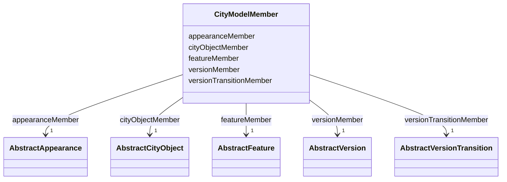

# Class: CityModelMember 


_CityGML class from package Core_


URI: [citygml:CityModelMember](https://www.ogc.org/standards/citygml/CityModelMember)





<!-- no inheritance hierarchy -->

## Slots

| Name | Cardinality and Range | Description | Inheritance |
| ---  | --- | --- | --- |
| [cityObjectMember](cityObjectMember.md) | 1 <br/> [AbstractCityObject](AbstractCityObject.md) |  | direct |
| [appearanceMember](appearanceMember.md) | 1 <br/> [AbstractAppearance](AbstractAppearance.md) |  | direct |
| [versionMember](versionMember.md) | 1 <br/> [AbstractVersion](AbstractVersion.md) |  | direct |
| [versionTransitionMember](versionTransitionMember.md) | 1 <br/> [AbstractVersionTransition](AbstractVersionTransition.md) |  | direct |
| [featureMember](featureMember.md) | 1 <br/> [AbstractFeature](AbstractFeature.md) |  | direct |


## Usages

| used by | used in | type | used |
| ---  | --- | --- | --- |
| [CityModel](CityModel.md) | [cityModelMember](cityModelMember.md) | range | [CityModelMember](CityModelMember.md) |


## Identifier and Mapping Information


### Schema Source


* from schema: https://www.ogc.org/standards/citygml


## Mappings

| Mapping Type | Mapped Value |
| ---  | ---  |
| self | citygml:CityModelMember |
| native | citygml:CityModelMember |


## LinkML Source

<!-- TODO: investigate https://stackoverflow.com/questions/37606292/how-to-create-tabbed-code-blocks-in-mkdocs-or-sphinx -->

### Direct

<details>
```yaml
name: CityModelMember
description: CityGML class from package Core
from_schema: https://www.ogc.org/standards/citygml
abstract: false
attributes:
  cityObjectMember:
    name: cityObjectMember
    from_schema: https://www.ogc.org/standards/citygml
    rank: 1000
    domain_of:
    - CityModelMember
    range: AbstractCityObject
    required: true
    multivalued: false
  appearanceMember:
    name: appearanceMember
    from_schema: https://www.ogc.org/standards/citygml
    rank: 1000
    domain_of:
    - CityModelMember
    range: AbstractAppearance
    required: true
    multivalued: false
  versionMember:
    name: versionMember
    from_schema: https://www.ogc.org/standards/citygml
    rank: 1000
    domain_of:
    - CityModelMember
    - Version
    range: AbstractVersion
    required: true
    multivalued: false
  versionTransitionMember:
    name: versionTransitionMember
    from_schema: https://www.ogc.org/standards/citygml
    rank: 1000
    domain_of:
    - CityModelMember
    range: AbstractVersionTransition
    required: true
    multivalued: false
  featureMember:
    name: featureMember
    from_schema: https://www.ogc.org/standards/citygml
    rank: 1000
    domain_of:
    - CityModelMember
    range: AbstractFeature
    required: true
    multivalued: false

```
</details>

### Induced

<details>
```yaml
name: CityModelMember
description: CityGML class from package Core
from_schema: https://www.ogc.org/standards/citygml
abstract: false
attributes:
  cityObjectMember:
    name: cityObjectMember
    from_schema: https://www.ogc.org/standards/citygml
    rank: 1000
    alias: cityObjectMember
    owner: CityModelMember
    domain_of:
    - CityModelMember
    range: AbstractCityObject
    required: true
    multivalued: false
  appearanceMember:
    name: appearanceMember
    from_schema: https://www.ogc.org/standards/citygml
    rank: 1000
    alias: appearanceMember
    owner: CityModelMember
    domain_of:
    - CityModelMember
    range: AbstractAppearance
    required: true
    multivalued: false
  versionMember:
    name: versionMember
    from_schema: https://www.ogc.org/standards/citygml
    rank: 1000
    alias: versionMember
    owner: CityModelMember
    domain_of:
    - CityModelMember
    - Version
    range: AbstractVersion
    required: true
    multivalued: false
  versionTransitionMember:
    name: versionTransitionMember
    from_schema: https://www.ogc.org/standards/citygml
    rank: 1000
    alias: versionTransitionMember
    owner: CityModelMember
    domain_of:
    - CityModelMember
    range: AbstractVersionTransition
    required: true
    multivalued: false
  featureMember:
    name: featureMember
    from_schema: https://www.ogc.org/standards/citygml
    rank: 1000
    alias: featureMember
    owner: CityModelMember
    domain_of:
    - CityModelMember
    range: AbstractFeature
    required: true
    multivalued: false

```
</details>