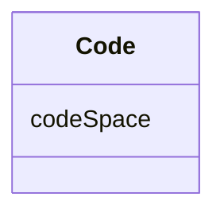

# Class: Code 


_CityGML class from package Core_


URI: [citygml:Code](https://www.ogc.org/standards/citygml/Code)





<!-- no inheritance hierarchy -->

## Slots

| Name | Cardinality and Range | Description | Inheritance |
| ---  | --- | --- | --- |
| [codeSpace](codeSpace.md) | 0..1 <br/> [Uri](Uri.md) |  | direct |


## Usages

| used by | used in | type | used |
| ---  | --- | --- | --- |
| [CodeAttribute](CodeAttribute.md) | [value](value.md) | range | [Code](Code.md) |


## Identifier and Mapping Information


### Schema Source


* from schema: https://www.ogc.org/standards/citygml


## Mappings

| Mapping Type | Mapped Value |
| ---  | ---  |
| self | citygml:Code |
| native | citygml:Code |


## LinkML Source

<!-- TODO: investigate https://stackoverflow.com/questions/37606292/how-to-create-tabbed-code-blocks-in-mkdocs-or-sphinx -->

### Direct

<details>
```yaml
name: Code
description: CityGML class from package Core
from_schema: https://www.ogc.org/standards/citygml
abstract: false
attributes:
  codeSpace:
    name: codeSpace
    from_schema: https://www.ogc.org/standards/citygml
    domain_of:
    - GenericAttributeSet
    - Code
    range: uri
    required: false
    multivalued: false

```
</details>

### Induced

<details>
```yaml
name: Code
description: CityGML class from package Core
from_schema: https://www.ogc.org/standards/citygml
abstract: false
attributes:
  codeSpace:
    name: codeSpace
    from_schema: https://www.ogc.org/standards/citygml
    alias: codeSpace
    owner: Code
    domain_of:
    - GenericAttributeSet
    - Code
    range: uri
    required: false
    multivalued: false

```
</details>