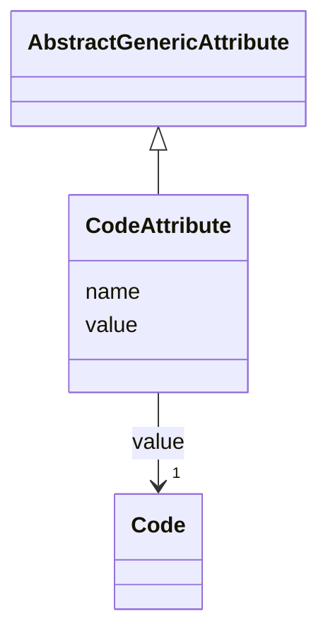

# Class: CodeAttribute 


_CodeAttribute is a data type used to define generic attributes of type "Code"._


URI: [citygml:CodeAttribute](https://www.ogc.org/standards/citygml/CodeAttribute)





## Inheritance
* [AbstractGenericAttribute](AbstractGenericAttribute.md)
    * **CodeAttribute**


## Slots

| Name | Cardinality and Range | Description | Inheritance |
| ---  | --- | --- | --- |
| [name](name.md) | 1 <br/> [String](String.md) | Specifies the name of the CodeAttribute | direct |
| [value](value.md) | 1 <br/> [Code](Code.md) | Specifies the "Code" value | direct |


## Identifier and Mapping Information


### Schema Source


* from schema: https://www.ogc.org/standards/citygml


## Mappings

| Mapping Type | Mapped Value |
| ---  | ---  |
| self | citygml:CodeAttribute |
| native | citygml:CodeAttribute |


## LinkML Source

<!-- TODO: investigate https://stackoverflow.com/questions/37606292/how-to-create-tabbed-code-blocks-in-mkdocs-or-sphinx -->

### Direct

<details>
```yaml
name: CodeAttribute
description: CodeAttribute is a data type used to define generic attributes of type
  "Code".
from_schema: https://www.ogc.org/standards/citygml
is_a: AbstractGenericAttribute
abstract: false
attributes:
  name:
    name: name
    description: Specifies the name of the CodeAttribute.
    from_schema: https://www.ogc.org/standards/citygml
    rank: 1000
    domain_of:
    - CodeAttribute
    - DateAttribute
    - DoubleAttribute
    - GenericAttributeSet
    - IntAttribute
    - MeasureAttribute
    - StringAttribute
    - UriAttribute
    - AbstractFeature
    range: string
    required: true
    multivalued: false
  value:
    name: value
    description: Specifies the "Code" value.
    from_schema: https://www.ogc.org/standards/citygml
    domain_of:
    - Height
    - RoomHeight
    - DoubleOrNilReason
    - CodeAttribute
    - DateAttribute
    - DoubleAttribute
    - IntAttribute
    - MeasureAttribute
    - StringAttribute
    - UriAttribute
    range: Code
    required: true
    multivalued: false

```
</details>

### Induced

<details>
```yaml
name: CodeAttribute
description: CodeAttribute is a data type used to define generic attributes of type
  "Code".
from_schema: https://www.ogc.org/standards/citygml
is_a: AbstractGenericAttribute
abstract: false
attributes:
  name:
    name: name
    description: Specifies the name of the CodeAttribute.
    from_schema: https://www.ogc.org/standards/citygml
    rank: 1000
    alias: name
    owner: CodeAttribute
    domain_of:
    - CodeAttribute
    - DateAttribute
    - DoubleAttribute
    - GenericAttributeSet
    - IntAttribute
    - MeasureAttribute
    - StringAttribute
    - UriAttribute
    - AbstractFeature
    range: string
    required: true
    multivalued: false
  value:
    name: value
    description: Specifies the "Code" value.
    from_schema: https://www.ogc.org/standards/citygml
    alias: value
    owner: CodeAttribute
    domain_of:
    - Height
    - RoomHeight
    - DoubleOrNilReason
    - CodeAttribute
    - DateAttribute
    - DoubleAttribute
    - IntAttribute
    - MeasureAttribute
    - StringAttribute
    - UriAttribute
    range: Code
    required: true
    multivalued: false

```
</details>