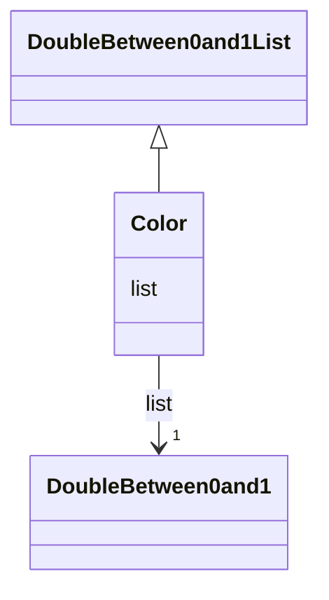

# Class: Color 


_CityGML class from package Appearance_


URI: [citygml:Color](https://www.ogc.org/standards/citygml/Color)





## Inheritance
* [DoubleBetween0and1List](DoubleBetween0and1List.md)
    * **Color**


## Slots

| Name | Cardinality and Range | Description | Inheritance |
| ---  | --- | --- | --- |
| [list](list.md) | 1 <br/> [DoubleBetween0and1](DoubleBetween0and1.md) |  | [DoubleBetween0and1List](DoubleBetween0and1List.md) |


## Usages

| used by | used in | type | used |
| ---  | --- | --- | --- |
| [X3DMaterial](X3DMaterial.md) | [diffuseColor](diffuseColor.md) | range | [Color](Color.md) |
| [X3DMaterial](X3DMaterial.md) | [emissiveColor](emissiveColor.md) | range | [Color](Color.md) |
| [X3DMaterial](X3DMaterial.md) | [specularColor](specularColor.md) | range | [Color](Color.md) |


## Identifier and Mapping Information


### Schema Source


* from schema: https://www.ogc.org/standards/citygml


## Mappings

| Mapping Type | Mapped Value |
| ---  | ---  |
| self | citygml:Color |
| native | citygml:Color |


## LinkML Source

<!-- TODO: investigate https://stackoverflow.com/questions/37606292/how-to-create-tabbed-code-blocks-in-mkdocs-or-sphinx -->

### Direct

<details>
```yaml
name: Color
description: CityGML class from package Appearance
from_schema: https://www.ogc.org/standards/citygml
is_a: DoubleBetween0and1List
abstract: false

```
</details>

### Induced

<details>
```yaml
name: Color
description: CityGML class from package Appearance
from_schema: https://www.ogc.org/standards/citygml
is_a: DoubleBetween0and1List
abstract: false
attributes:
  list:
    name: list
    from_schema: https://www.ogc.org/standards/citygml
    rank: 1000
    alias: list
    owner: Color
    domain_of:
    - DoubleBetween0and1List
    - DoubleList
    - DoubleOrNilReasonList
    range: DoubleBetween0and1
    required: true
    multivalued: false

```
</details>