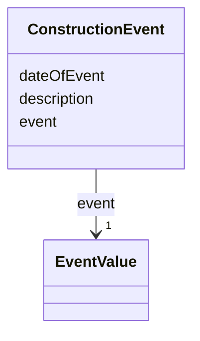

# Class: ConstructionEvent 


_A ConstructionEvent is a data type used to describe a specific event that is associated with a construction. Examples are the issuing of a building permit or the renovation of a building._


URI: [citygml:ConstructionEvent](https://www.ogc.org/standards/citygml/ConstructionEvent)





<!-- no inheritance hierarchy -->

## Slots

| Name | Cardinality and Range | Description | Inheritance |
| ---  | --- | --- | --- |
| [event](event.md) | 1 <br/> [EventValue](EventValue.md) | Indicates the specific event type | direct |
| [dateOfEvent](dateOfEvent.md) | 1 <br/> [Date](Date.md) | Specifies the date at which the event took or will take place | direct |
| [description](description.md) | 0..1 <br/> [String](String.md) | Provides additional information on the event | direct |


## Usages

| used by | used in | type | used |
| ---  | --- | --- | --- |
| [AbstractConstruction](AbstractConstruction.md) | [constructionEvent](constructionEvent.md) | range | [ConstructionEvent](ConstructionEvent.md) |
| [OtherConstruction](OtherConstruction.md) | [constructionEvent](constructionEvent.md) | range | [ConstructionEvent](ConstructionEvent.md) |
| [AbstractBridge](AbstractBridge.md) | [constructionEvent](constructionEvent.md) | range | [ConstructionEvent](ConstructionEvent.md) |
| [Bridge](Bridge.md) | [constructionEvent](constructionEvent.md) | range | [ConstructionEvent](ConstructionEvent.md) |
| [BridgePart](BridgePart.md) | [constructionEvent](constructionEvent.md) | range | [ConstructionEvent](ConstructionEvent.md) |
| [AbstractBuilding](AbstractBuilding.md) | [constructionEvent](constructionEvent.md) | range | [ConstructionEvent](ConstructionEvent.md) |
| [Building](Building.md) | [constructionEvent](constructionEvent.md) | range | [ConstructionEvent](ConstructionEvent.md) |
| [BuildingPart](BuildingPart.md) | [constructionEvent](constructionEvent.md) | range | [ConstructionEvent](ConstructionEvent.md) |
| [AbstractTunnel](AbstractTunnel.md) | [constructionEvent](constructionEvent.md) | range | [ConstructionEvent](ConstructionEvent.md) |
| [Tunnel](Tunnel.md) | [constructionEvent](constructionEvent.md) | range | [ConstructionEvent](ConstructionEvent.md) |
| [TunnelPart](TunnelPart.md) | [constructionEvent](constructionEvent.md) | range | [ConstructionEvent](ConstructionEvent.md) |


## Identifier and Mapping Information


### Schema Source


* from schema: https://www.ogc.org/standards/citygml


## Mappings

| Mapping Type | Mapped Value |
| ---  | ---  |
| self | citygml:ConstructionEvent |
| native | citygml:ConstructionEvent |


## LinkML Source

<!-- TODO: investigate https://stackoverflow.com/questions/37606292/how-to-create-tabbed-code-blocks-in-mkdocs-or-sphinx -->

### Direct

<details>
```yaml
name: ConstructionEvent
description: A ConstructionEvent is a data type used to describe a specific event
  that is associated with a construction. Examples are the issuing of a building permit
  or the renovation of a building.
from_schema: https://www.ogc.org/standards/citygml
abstract: false
attributes:
  event:
    name: event
    description: Indicates the specific event type.
    from_schema: https://www.ogc.org/standards/citygml
    rank: 1000
    domain_of:
    - ConstructionEvent
    range: EventValue
    required: true
    multivalued: false
  dateOfEvent:
    name: dateOfEvent
    description: Specifies the date at which the event took or will take place.
    from_schema: https://www.ogc.org/standards/citygml
    rank: 1000
    domain_of:
    - ConstructionEvent
    range: date
    required: true
    multivalued: false
  description:
    name: description
    description: Provides additional information on the event.
    from_schema: https://www.ogc.org/standards/citygml
    rank: 1000
    domain_of:
    - ConstructionEvent
    - AbstractFeature
    range: string
    required: false
    multivalued: false

```
</details>

### Induced

<details>
```yaml
name: ConstructionEvent
description: A ConstructionEvent is a data type used to describe a specific event
  that is associated with a construction. Examples are the issuing of a building permit
  or the renovation of a building.
from_schema: https://www.ogc.org/standards/citygml
abstract: false
attributes:
  event:
    name: event
    description: Indicates the specific event type.
    from_schema: https://www.ogc.org/standards/citygml
    rank: 1000
    alias: event
    owner: ConstructionEvent
    domain_of:
    - ConstructionEvent
    range: EventValue
    required: true
    multivalued: false
  dateOfEvent:
    name: dateOfEvent
    description: Specifies the date at which the event took or will take place.
    from_schema: https://www.ogc.org/standards/citygml
    rank: 1000
    alias: dateOfEvent
    owner: ConstructionEvent
    domain_of:
    - ConstructionEvent
    range: date
    required: true
    multivalued: false
  description:
    name: description
    description: Provides additional information on the event.
    from_schema: https://www.ogc.org/standards/citygml
    rank: 1000
    alias: description
    owner: ConstructionEvent
    domain_of:
    - ConstructionEvent
    - AbstractFeature
    range: string
    required: false
    multivalued: false

```
</details>