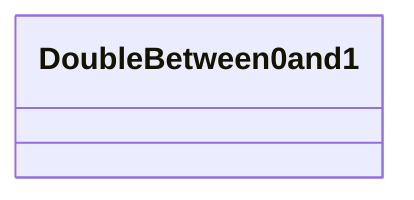

# Class: DoubleBetween0and1 


_CityGML class from package Core_


URI: [citygml:DoubleBetween0and1](https://www.ogc.org/standards/citygml/DoubleBetween0and1)





<!-- no inheritance hierarchy -->

## Slots

| Name | Cardinality and Range | Description | Inheritance |
| ---  | --- | --- | --- |


## Usages

| used by | used in | type | used |
| ---  | --- | --- | --- |
| [Color](Color.md) | [list](list.md) | range | [DoubleBetween0and1](DoubleBetween0and1.md) |
| [ColorPlusOpacity](ColorPlusOpacity.md) | [list](list.md) | range | [DoubleBetween0and1](DoubleBetween0and1.md) |
| [X3DMaterial](X3DMaterial.md) | [ambientIntensity](ambientIntensity.md) | range | [DoubleBetween0and1](DoubleBetween0and1.md) |
| [X3DMaterial](X3DMaterial.md) | [shininess](shininess.md) | range | [DoubleBetween0and1](DoubleBetween0and1.md) |
| [X3DMaterial](X3DMaterial.md) | [transparency](transparency.md) | range | [DoubleBetween0and1](DoubleBetween0and1.md) |
| [DoubleBetween0and1List](DoubleBetween0and1List.md) | [list](list.md) | range | [DoubleBetween0and1](DoubleBetween0and1.md) |


## Identifier and Mapping Information


### Schema Source


* from schema: https://www.ogc.org/standards/citygml


## Mappings

| Mapping Type | Mapped Value |
| ---  | ---  |
| self | citygml:DoubleBetween0and1 |
| native | citygml:DoubleBetween0and1 |


## LinkML Source

<!-- TODO: investigate https://stackoverflow.com/questions/37606292/how-to-create-tabbed-code-blocks-in-mkdocs-or-sphinx -->

### Direct

<details>
```yaml
name: DoubleBetween0and1
description: CityGML class from package Core
from_schema: https://www.ogc.org/standards/citygml
abstract: false

```
</details>

### Induced

<details>
```yaml
name: DoubleBetween0and1
description: CityGML class from package Core
from_schema: https://www.ogc.org/standards/citygml
abstract: false

```
</details>