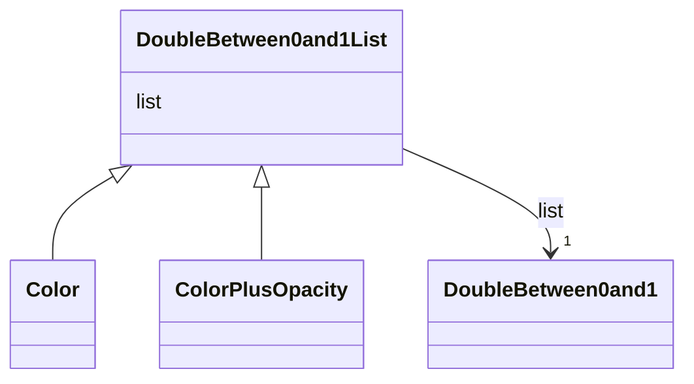

# Class: DoubleBetween0and1List 


_CityGML class from package Core_


URI: [citygml:DoubleBetween0and1List](https://www.ogc.org/standards/citygml/DoubleBetween0and1List)





## Inheritance
* **DoubleBetween0and1List**
    * [Color](Color.md)
    * [ColorPlusOpacity](ColorPlusOpacity.md)


## Slots

| Name | Cardinality and Range | Description | Inheritance |
| ---  | --- | --- | --- |
| [list](list.md) | 1 <br/> [DoubleBetween0and1](DoubleBetween0and1.md) |  | direct |


## Identifier and Mapping Information


### Schema Source


* from schema: https://www.ogc.org/standards/citygml


## Mappings

| Mapping Type | Mapped Value |
| ---  | ---  |
| self | citygml:DoubleBetween0and1List |
| native | citygml:DoubleBetween0and1List |


## LinkML Source

<!-- TODO: investigate https://stackoverflow.com/questions/37606292/how-to-create-tabbed-code-blocks-in-mkdocs-or-sphinx -->

### Direct

<details>
```yaml
name: DoubleBetween0and1List
description: CityGML class from package Core
from_schema: https://www.ogc.org/standards/citygml
abstract: false
attributes:
  list:
    name: list
    from_schema: https://www.ogc.org/standards/citygml
    rank: 1000
    domain_of:
    - DoubleBetween0and1List
    - DoubleList
    - DoubleOrNilReasonList
    range: DoubleBetween0and1
    required: true
    multivalued: false

```
</details>

### Induced

<details>
```yaml
name: DoubleBetween0and1List
description: CityGML class from package Core
from_schema: https://www.ogc.org/standards/citygml
abstract: false
attributes:
  list:
    name: list
    from_schema: https://www.ogc.org/standards/citygml
    rank: 1000
    alias: list
    owner: DoubleBetween0and1List
    domain_of:
    - DoubleBetween0and1List
    - DoubleList
    - DoubleOrNilReasonList
    range: DoubleBetween0and1
    required: true
    multivalued: false

```
</details>