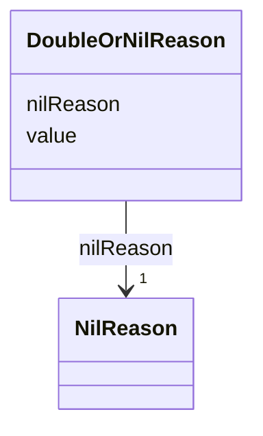

# Class: DoubleOrNilReason 


_CityGML class from package Core_


URI: [citygml:DoubleOrNilReason](https://www.ogc.org/standards/citygml/DoubleOrNilReason)





<!-- no inheritance hierarchy -->

## Slots

| Name | Cardinality and Range | Description | Inheritance |
| ---  | --- | --- | --- |
| [value](value.md) | 1 <br/> [Float](Float.md) |  | direct |
| [nilReason](nilReason.md) | 1 <br/> [NilReason](NilReason.md) |  | direct |


## Usages

| used by | used in | type | used |
| ---  | --- | --- | --- |
| [DoubleOrNilReasonList](DoubleOrNilReasonList.md) | [list](list.md) | range | [DoubleOrNilReason](DoubleOrNilReason.md) |
| [MeasureOrNilReasonList](MeasureOrNilReasonList.md) | [list](list.md) | range | [DoubleOrNilReason](DoubleOrNilReason.md) |


## Identifier and Mapping Information


### Schema Source


* from schema: https://www.ogc.org/standards/citygml


## Mappings

| Mapping Type | Mapped Value |
| ---  | ---  |
| self | citygml:DoubleOrNilReason |
| native | citygml:DoubleOrNilReason |


## LinkML Source

<!-- TODO: investigate https://stackoverflow.com/questions/37606292/how-to-create-tabbed-code-blocks-in-mkdocs-or-sphinx -->

### Direct

<details>
```yaml
name: DoubleOrNilReason
description: CityGML class from package Core
from_schema: https://www.ogc.org/standards/citygml
abstract: false
attributes:
  value:
    name: value
    from_schema: https://www.ogc.org/standards/citygml
    domain_of:
    - Height
    - RoomHeight
    - DoubleOrNilReason
    - CodeAttribute
    - DateAttribute
    - DoubleAttribute
    - IntAttribute
    - MeasureAttribute
    - StringAttribute
    - UriAttribute
    range: float
    required: true
    multivalued: false
  nilReason:
    name: nilReason
    from_schema: https://www.ogc.org/standards/citygml
    rank: 1000
    domain_of:
    - DoubleOrNilReason
    range: NilReason
    required: true
    multivalued: false

```
</details>

### Induced

<details>
```yaml
name: DoubleOrNilReason
description: CityGML class from package Core
from_schema: https://www.ogc.org/standards/citygml
abstract: false
attributes:
  value:
    name: value
    from_schema: https://www.ogc.org/standards/citygml
    alias: value
    owner: DoubleOrNilReason
    domain_of:
    - Height
    - RoomHeight
    - DoubleOrNilReason
    - CodeAttribute
    - DateAttribute
    - DoubleAttribute
    - IntAttribute
    - MeasureAttribute
    - StringAttribute
    - UriAttribute
    range: float
    required: true
    multivalued: false
  nilReason:
    name: nilReason
    from_schema: https://www.ogc.org/standards/citygml
    rank: 1000
    alias: nilReason
    owner: DoubleOrNilReason
    domain_of:
    - DoubleOrNilReason
    range: NilReason
    required: true
    multivalued: false

```
</details>