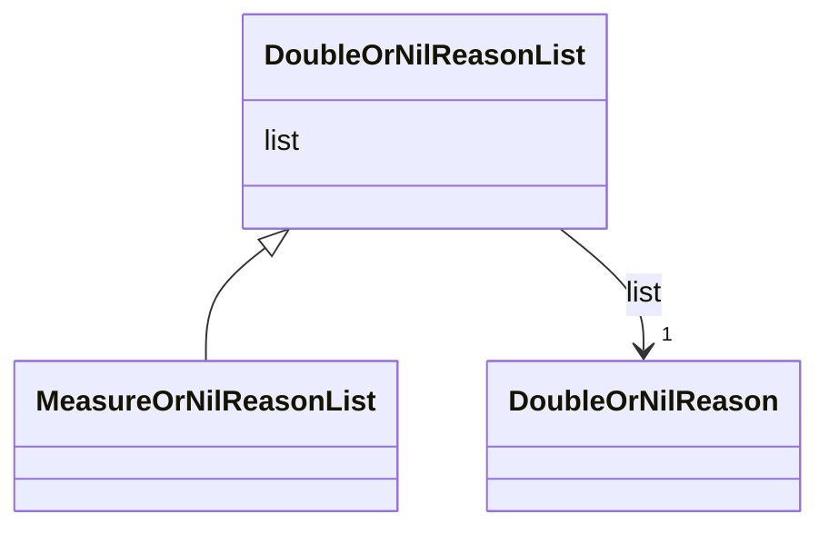

# Class: DoubleOrNilReasonList 


_CityGML class from package Core_


URI: [citygml:DoubleOrNilReasonList](https://www.ogc.org/standards/citygml/DoubleOrNilReasonList)





## Inheritance
* **DoubleOrNilReasonList**
    * [MeasureOrNilReasonList](MeasureOrNilReasonList.md)


## Slots

| Name | Cardinality and Range | Description | Inheritance |
| ---  | --- | --- | --- |
| [list](list.md) | 1 <br/> [DoubleOrNilReason](DoubleOrNilReason.md) |  | direct |


## Identifier and Mapping Information


### Schema Source


* from schema: https://www.ogc.org/standards/citygml


## Mappings

| Mapping Type | Mapped Value |
| ---  | ---  |
| self | citygml:DoubleOrNilReasonList |
| native | citygml:DoubleOrNilReasonList |


## LinkML Source

<!-- TODO: investigate https://stackoverflow.com/questions/37606292/how-to-create-tabbed-code-blocks-in-mkdocs-or-sphinx -->

### Direct

<details>
```yaml
name: DoubleOrNilReasonList
description: CityGML class from package Core
from_schema: https://www.ogc.org/standards/citygml
abstract: false
attributes:
  list:
    name: list
    from_schema: https://www.ogc.org/standards/citygml
    domain_of:
    - DoubleBetween0and1List
    - DoubleList
    - DoubleOrNilReasonList
    range: DoubleOrNilReason
    required: true
    multivalued: false

```
</details>

### Induced

<details>
```yaml
name: DoubleOrNilReasonList
description: CityGML class from package Core
from_schema: https://www.ogc.org/standards/citygml
abstract: false
attributes:
  list:
    name: list
    from_schema: https://www.ogc.org/standards/citygml
    alias: list
    owner: DoubleOrNilReasonList
    domain_of:
    - DoubleBetween0and1List
    - DoubleList
    - DoubleOrNilReasonList
    range: DoubleOrNilReason
    required: true
    multivalued: false

```
</details>