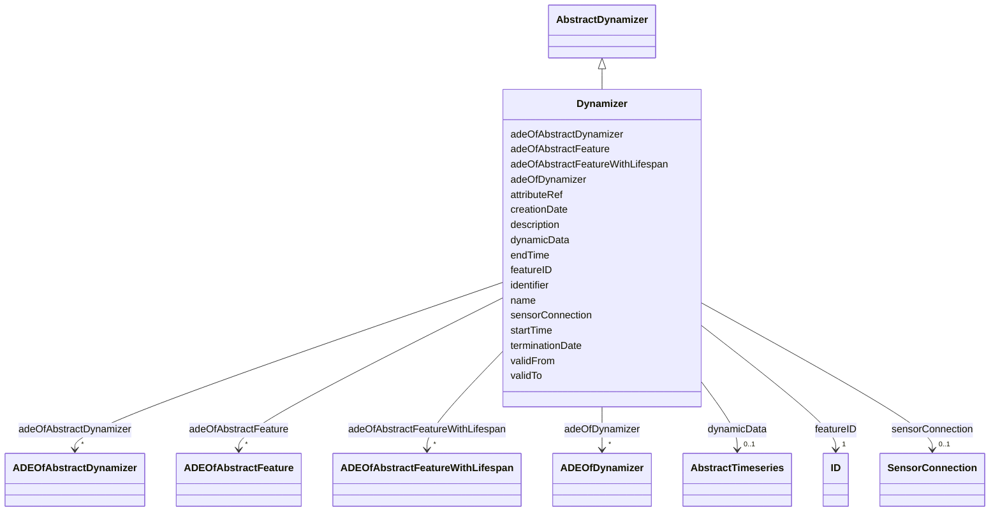

# Class: Dynamizer 


_A Dynamizer is an object that injects timeseries data for an individual attribute of the city object in which it is included. The timeseries data overrides the static value of the referenced city object attribute in order to represent dynamic (time-dependent) variations of its value._


URI: [citygml:Dynamizer](https://www.ogc.org/standards/citygml/Dynamizer)





## Inheritance
* [AbstractFeature](AbstractFeature.md)
    * [AbstractFeatureWithLifespan](AbstractFeatureWithLifespan.md)
        * [AbstractDynamizer](AbstractDynamizer.md)
            * **Dynamizer**


## Slots

| Name | Cardinality and Range | Description | Inheritance |
| ---  | --- | --- | --- |
| [attributeRef](attributeRef.md) | 1 <br/> [String](String.md) | Specifies the attribute of a CityGML feature whose value is overridden or rep... | direct |
| [startTime](startTime.md) | 0..1 <br/> [String](String.md) | Specifies the beginning of the time span for which the Dynamizer provides dyn... | direct |
| [endTime](endTime.md) | 0..1 <br/> [String](String.md) | Specifies the end of the time span for which the Dynamizer provides dynamic v... | direct |
| [adeOfDynamizer](adeOfDynamizer.md) | * <br/> [ADEOfDynamizer](ADEOfDynamizer.md) | Augments the Dynamizer with properties defined in an ADE | direct |
| [dynamicData](dynamicData.md) | 0..1 <br/> [AbstractTimeseries](AbstractTimeseries.md) | Relates to the timeseries data that is given either inline within a CityGML d... | direct |
| [sensorConnection](sensorConnection.md) | 0..1 <br/> [SensorConnection](SensorConnection.md) | Relates to the sensor API that delivers timeseries data | direct |
| [adeOfAbstractDynamizer](adeOfAbstractDynamizer.md) | * <br/> [ADEOfAbstractDynamizer](ADEOfAbstractDynamizer.md) | Augments AbstractDynamizer with properties defined in an ADE | [AbstractDynamizer](AbstractDynamizer.md) |
| [creationDate](creationDate.md) | 0..1 <br/> [Datetime](Datetime.md) | Indicates the date at which a CityGML feature was added to the CityModel | [AbstractFeatureWithLifespan](AbstractFeatureWithLifespan.md) |
| [terminationDate](terminationDate.md) | 0..1 <br/> [Datetime](Datetime.md) | Indicates the date at which a CityGML feature was removed from the CityModel | [AbstractFeatureWithLifespan](AbstractFeatureWithLifespan.md) |
| [validFrom](validFrom.md) | 0..1 <br/> [Datetime](Datetime.md) | Indicates the date at which a CityGML feature started to exist in the real wo... | [AbstractFeatureWithLifespan](AbstractFeatureWithLifespan.md) |
| [validTo](validTo.md) | 0..1 <br/> [Datetime](Datetime.md) | Indicates the date at which a CityGML feature ended to exist in the real worl... | [AbstractFeatureWithLifespan](AbstractFeatureWithLifespan.md) |
| [adeOfAbstractFeatureWithLifespan](adeOfAbstractFeatureWithLifespan.md) | * <br/> [ADEOfAbstractFeatureWithLifespan](ADEOfAbstractFeatureWithLifespan.md) | Augments AbstractFeatureWithLifespan with properties defined in an ADE | [AbstractFeatureWithLifespan](AbstractFeatureWithLifespan.md) |
| [featureID](featureID.md) | 1 <br/> [ID](ID.md) |  | [AbstractFeature](AbstractFeature.md) |
| [identifier](identifier.md) | 0..1 <br/> [String](String.md) |  | [AbstractFeature](AbstractFeature.md) |
| [name](name.md) | * <br/> [String](String.md) |  | [AbstractFeature](AbstractFeature.md) |
| [description](description.md) | 0..1 <br/> [String](String.md) |  | [AbstractFeature](AbstractFeature.md) |
| [adeOfAbstractFeature](adeOfAbstractFeature.md) | * <br/> [ADEOfAbstractFeature](ADEOfAbstractFeature.md) | Augments AbstractFeature with properties defined in an ADE | [AbstractFeature](AbstractFeature.md) |


## Identifier and Mapping Information


### Schema Source


* from schema: https://www.ogc.org/standards/citygml


## Mappings

| Mapping Type | Mapped Value |
| ---  | ---  |
| self | citygml:Dynamizer |
| native | citygml:Dynamizer |


## LinkML Source

<!-- TODO: investigate https://stackoverflow.com/questions/37606292/how-to-create-tabbed-code-blocks-in-mkdocs-or-sphinx -->

### Direct

<details>
```yaml
name: Dynamizer
description: A Dynamizer is an object that injects timeseries data for an individual
  attribute of the city object in which it is included. The timeseries data overrides
  the static value of the referenced city object attribute in order to represent dynamic
  (time-dependent) variations of its value.
from_schema: https://www.ogc.org/standards/citygml
is_a: AbstractDynamizer
abstract: false
attributes:
  attributeRef:
    name: attributeRef
    description: Specifies the attribute of a CityGML feature whose value is overridden
      or replaced by the (dynamic) values specified by the Dynamizer.
    from_schema: https://www.ogc.org/standards/citygml
    rank: 1000
    domain_of:
    - Dynamizer
    range: string
    required: true
    multivalued: false
  startTime:
    name: startTime
    description: Specifies the beginning of the time span for which the Dynamizer
      provides dynamic values.
    from_schema: https://www.ogc.org/standards/citygml
    rank: 1000
    domain_of:
    - Dynamizer
    range: string
    required: false
    multivalued: false
  endTime:
    name: endTime
    description: Specifies the end of the time span for which the Dynamizer provides
      dynamic values.
    from_schema: https://www.ogc.org/standards/citygml
    rank: 1000
    domain_of:
    - Dynamizer
    range: string
    required: false
    multivalued: false
  adeOfDynamizer:
    name: adeOfDynamizer
    description: Augments the Dynamizer with properties defined in an ADE.
    from_schema: https://www.ogc.org/standards/citygml
    rank: 1000
    domain_of:
    - Dynamizer
    range: ADEOfDynamizer
    required: false
    multivalued: true
  dynamicData:
    name: dynamicData
    description: Relates to the timeseries data that is given either inline within
      a CityGML dataset or by a link to an external file containing timeseries data.
    from_schema: https://www.ogc.org/standards/citygml
    rank: 1000
    domain_of:
    - Dynamizer
    range: AbstractTimeseries
    required: false
    multivalued: false
  sensorConnection:
    name: sensorConnection
    description: Relates to the sensor API that delivers timeseries data.
    from_schema: https://www.ogc.org/standards/citygml
    rank: 1000
    domain_of:
    - Dynamizer
    range: SensorConnection
    required: false
    multivalued: false

```
</details>

### Induced

<details>
```yaml
name: Dynamizer
description: A Dynamizer is an object that injects timeseries data for an individual
  attribute of the city object in which it is included. The timeseries data overrides
  the static value of the referenced city object attribute in order to represent dynamic
  (time-dependent) variations of its value.
from_schema: https://www.ogc.org/standards/citygml
is_a: AbstractDynamizer
abstract: false
attributes:
  attributeRef:
    name: attributeRef
    description: Specifies the attribute of a CityGML feature whose value is overridden
      or replaced by the (dynamic) values specified by the Dynamizer.
    from_schema: https://www.ogc.org/standards/citygml
    rank: 1000
    alias: attributeRef
    owner: Dynamizer
    domain_of:
    - Dynamizer
    range: string
    required: true
    multivalued: false
  startTime:
    name: startTime
    description: Specifies the beginning of the time span for which the Dynamizer
      provides dynamic values.
    from_schema: https://www.ogc.org/standards/citygml
    rank: 1000
    alias: startTime
    owner: Dynamizer
    domain_of:
    - Dynamizer
    range: string
    required: false
    multivalued: false
  endTime:
    name: endTime
    description: Specifies the end of the time span for which the Dynamizer provides
      dynamic values.
    from_schema: https://www.ogc.org/standards/citygml
    rank: 1000
    alias: endTime
    owner: Dynamizer
    domain_of:
    - Dynamizer
    range: string
    required: false
    multivalued: false
  adeOfDynamizer:
    name: adeOfDynamizer
    description: Augments the Dynamizer with properties defined in an ADE.
    from_schema: https://www.ogc.org/standards/citygml
    rank: 1000
    alias: adeOfDynamizer
    owner: Dynamizer
    domain_of:
    - Dynamizer
    range: ADEOfDynamizer
    required: false
    multivalued: true
  dynamicData:
    name: dynamicData
    description: Relates to the timeseries data that is given either inline within
      a CityGML dataset or by a link to an external file containing timeseries data.
    from_schema: https://www.ogc.org/standards/citygml
    rank: 1000
    alias: dynamicData
    owner: Dynamizer
    domain_of:
    - Dynamizer
    range: AbstractTimeseries
    required: false
    multivalued: false
  sensorConnection:
    name: sensorConnection
    description: Relates to the sensor API that delivers timeseries data.
    from_schema: https://www.ogc.org/standards/citygml
    rank: 1000
    alias: sensorConnection
    owner: Dynamizer
    domain_of:
    - Dynamizer
    range: SensorConnection
    required: false
    multivalued: false
  adeOfAbstractDynamizer:
    name: adeOfAbstractDynamizer
    description: Augments AbstractDynamizer with properties defined in an ADE.
    from_schema: https://www.ogc.org/standards/citygml
    rank: 1000
    alias: adeOfAbstractDynamizer
    owner: Dynamizer
    domain_of:
    - AbstractDynamizer
    range: ADEOfAbstractDynamizer
    required: false
    multivalued: true
  creationDate:
    name: creationDate
    description: Indicates the date at which a CityGML feature was added to the CityModel.
    from_schema: https://www.ogc.org/standards/citygml
    rank: 1000
    alias: creationDate
    owner: Dynamizer
    domain_of:
    - AbstractFeatureWithLifespan
    range: datetime
    required: false
    multivalued: false
  terminationDate:
    name: terminationDate
    description: Indicates the date at which a CityGML feature was removed from the
      CityModel.
    from_schema: https://www.ogc.org/standards/citygml
    rank: 1000
    alias: terminationDate
    owner: Dynamizer
    domain_of:
    - AbstractFeatureWithLifespan
    range: datetime
    required: false
    multivalued: false
  validFrom:
    name: validFrom
    description: Indicates the date at which a CityGML feature started to exist in
      the real world.
    from_schema: https://www.ogc.org/standards/citygml
    rank: 1000
    alias: validFrom
    owner: Dynamizer
    domain_of:
    - AbstractFeatureWithLifespan
    range: datetime
    required: false
    multivalued: false
  validTo:
    name: validTo
    description: Indicates the date at which a CityGML feature ended to exist in the
      real world.
    from_schema: https://www.ogc.org/standards/citygml
    rank: 1000
    alias: validTo
    owner: Dynamizer
    domain_of:
    - AbstractFeatureWithLifespan
    range: datetime
    required: false
    multivalued: false
  adeOfAbstractFeatureWithLifespan:
    name: adeOfAbstractFeatureWithLifespan
    description: Augments AbstractFeatureWithLifespan with properties defined in an
      ADE.
    from_schema: https://www.ogc.org/standards/citygml
    rank: 1000
    alias: adeOfAbstractFeatureWithLifespan
    owner: Dynamizer
    domain_of:
    - AbstractFeatureWithLifespan
    range: ADEOfAbstractFeatureWithLifespan
    required: false
    multivalued: true
  featureID:
    name: featureID
    from_schema: https://www.ogc.org/standards/citygml
    rank: 1000
    alias: featureID
    owner: Dynamizer
    domain_of:
    - AbstractFeature
    range: ID
    required: true
    multivalued: false
  identifier:
    name: identifier
    from_schema: https://www.ogc.org/standards/citygml
    rank: 1000
    alias: identifier
    owner: Dynamizer
    domain_of:
    - AbstractFeature
    range: string
    required: false
    multivalued: false
  name:
    name: name
    from_schema: https://www.ogc.org/standards/citygml
    alias: name
    owner: Dynamizer
    domain_of:
    - CodeAttribute
    - DateAttribute
    - DoubleAttribute
    - GenericAttributeSet
    - IntAttribute
    - MeasureAttribute
    - StringAttribute
    - UriAttribute
    - AbstractFeature
    range: string
    required: false
    multivalued: true
  description:
    name: description
    from_schema: https://www.ogc.org/standards/citygml
    alias: description
    owner: Dynamizer
    domain_of:
    - ConstructionEvent
    - AbstractFeature
    range: string
    required: false
    multivalued: false
  adeOfAbstractFeature:
    name: adeOfAbstractFeature
    description: Augments AbstractFeature with properties defined in an ADE.
    from_schema: https://www.ogc.org/standards/citygml
    rank: 1000
    alias: adeOfAbstractFeature
    owner: Dynamizer
    domain_of:
    - AbstractFeature
    range: ADEOfAbstractFeature
    required: false
    multivalued: true

```
</details>