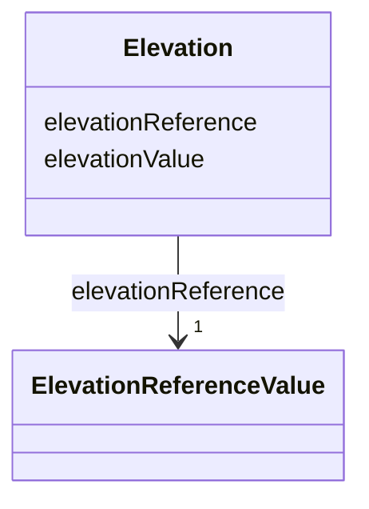

# Class: Elevation 


_Elevation is a data type that includes the elevation value itself and information on how this elevation was measured. [cf. INSPIRE]_


URI: [citygml:Elevation](https://www.ogc.org/standards/citygml/Elevation)





<!-- no inheritance hierarchy -->

## Slots

| Name | Cardinality and Range | Description | Inheritance |
| ---  | --- | --- | --- |
| [elevationReference](elevationReference.md) | 1 <br/> [ElevationReferenceValue](ElevationReferenceValue.md) | Specifies the level from which the elevation was measured | direct |
| [elevationValue](elevationValue.md) | 1 <br/> [String](String.md) | Specifies the value of the elevation | direct |


## Usages

| used by | used in | type | used |
| ---  | --- | --- | --- |
| [AbstractConstruction](AbstractConstruction.md) | [elevation](elevation.md) | range | [Elevation](Elevation.md) |
| [OtherConstruction](OtherConstruction.md) | [elevation](elevation.md) | range | [Elevation](Elevation.md) |
| [AbstractBridge](AbstractBridge.md) | [elevation](elevation.md) | range | [Elevation](Elevation.md) |
| [Bridge](Bridge.md) | [elevation](elevation.md) | range | [Elevation](Elevation.md) |
| [BridgePart](BridgePart.md) | [elevation](elevation.md) | range | [Elevation](Elevation.md) |
| [AbstractBuilding](AbstractBuilding.md) | [elevation](elevation.md) | range | [Elevation](Elevation.md) |
| [AbstractBuildingSubdivision](AbstractBuildingSubdivision.md) | [elevation](elevation.md) | range | [Elevation](Elevation.md) |
| [Building](Building.md) | [elevation](elevation.md) | range | [Elevation](Elevation.md) |
| [BuildingPart](BuildingPart.md) | [elevation](elevation.md) | range | [Elevation](Elevation.md) |
| [BuildingUnit](BuildingUnit.md) | [elevation](elevation.md) | range | [Elevation](Elevation.md) |
| [Storey](Storey.md) | [elevation](elevation.md) | range | [Elevation](Elevation.md) |
| [AbstractTunnel](AbstractTunnel.md) | [elevation](elevation.md) | range | [Elevation](Elevation.md) |
| [Tunnel](Tunnel.md) | [elevation](elevation.md) | range | [Elevation](Elevation.md) |
| [TunnelPart](TunnelPart.md) | [elevation](elevation.md) | range | [Elevation](Elevation.md) |


## Identifier and Mapping Information


### Schema Source


* from schema: https://www.ogc.org/standards/citygml


## Mappings

| Mapping Type | Mapped Value |
| ---  | ---  |
| self | citygml:Elevation |
| native | citygml:Elevation |


## LinkML Source

<!-- TODO: investigate https://stackoverflow.com/questions/37606292/how-to-create-tabbed-code-blocks-in-mkdocs-or-sphinx -->

### Direct

<details>
```yaml
name: Elevation
description: Elevation is a data type that includes the elevation value itself and
  information on how this elevation was measured. [cf. INSPIRE]
from_schema: https://www.ogc.org/standards/citygml
abstract: false
attributes:
  elevationReference:
    name: elevationReference
    description: Specifies the level from which the elevation was measured. [cf. INSPIRE]
    from_schema: https://www.ogc.org/standards/citygml
    rank: 1000
    domain_of:
    - Elevation
    range: ElevationReferenceValue
    required: true
    multivalued: false
  elevationValue:
    name: elevationValue
    description: Specifies the value of the elevation. [cf. INSPIRE]
    from_schema: https://www.ogc.org/standards/citygml
    rank: 1000
    domain_of:
    - Elevation
    range: string
    required: true
    multivalued: false

```
</details>

### Induced

<details>
```yaml
name: Elevation
description: Elevation is a data type that includes the elevation value itself and
  information on how this elevation was measured. [cf. INSPIRE]
from_schema: https://www.ogc.org/standards/citygml
abstract: false
attributes:
  elevationReference:
    name: elevationReference
    description: Specifies the level from which the elevation was measured. [cf. INSPIRE]
    from_schema: https://www.ogc.org/standards/citygml
    rank: 1000
    alias: elevationReference
    owner: Elevation
    domain_of:
    - Elevation
    range: ElevationReferenceValue
    required: true
    multivalued: false
  elevationValue:
    name: elevationValue
    description: Specifies the value of the elevation. [cf. INSPIRE]
    from_schema: https://www.ogc.org/standards/citygml
    rank: 1000
    alias: elevationValue
    owner: Elevation
    domain_of:
    - Elevation
    range: string
    required: true
    multivalued: false

```
</details>