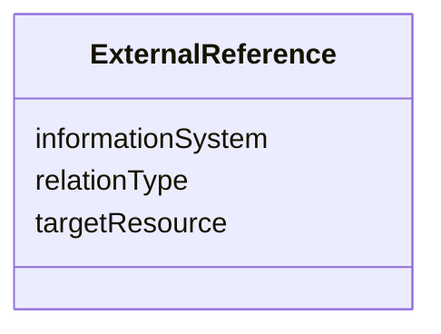

# Class: ExternalReference 


_ExternalReference is a reference to a corresponding object in another information system, for example in the German cadastre (ALKIS), the German topographic information system (ATKIS), or the OS UK MasterMap®._


URI: [citygml:ExternalReference](https://www.ogc.org/standards/citygml/ExternalReference)





<!-- no inheritance hierarchy -->

## Slots

| Name | Cardinality and Range | Description | Inheritance |
| ---  | --- | --- | --- |
| [targetResource](targetResource.md) | 1 <br/> [Uri](Uri.md) | Specifies the URI that points to the object in the external information syste... | direct |
| [informationSystem](informationSystem.md) | 0..1 <br/> [Uri](Uri.md) | Specifies the URI that points to the external information system | direct |
| [relationType](relationType.md) | 0..1 <br/> [Uri](Uri.md) | Specifies a URI that additionally qualifies the ExternalReference | direct |


## Usages

| used by | used in | type | used |
| ---  | --- | --- | --- |
| [AbstractConstruction](AbstractConstruction.md) | [externalReference](externalReference.md) | range | [ExternalReference](ExternalReference.md) |
| [AbstractConstructionSurface](AbstractConstructionSurface.md) | [externalReference](externalReference.md) | range | [ExternalReference](ExternalReference.md) |
| [AbstractConstructiveElement](AbstractConstructiveElement.md) | [externalReference](externalReference.md) | range | [ExternalReference](ExternalReference.md) |
| [AbstractFillingElement](AbstractFillingElement.md) | [externalReference](externalReference.md) | range | [ExternalReference](ExternalReference.md) |
| [AbstractFillingSurface](AbstractFillingSurface.md) | [externalReference](externalReference.md) | range | [ExternalReference](ExternalReference.md) |
| [AbstractFurniture](AbstractFurniture.md) | [externalReference](externalReference.md) | range | [ExternalReference](ExternalReference.md) |
| [AbstractInstallation](AbstractInstallation.md) | [externalReference](externalReference.md) | range | [ExternalReference](ExternalReference.md) |
| [CeilingSurface](CeilingSurface.md) | [externalReference](externalReference.md) | range | [ExternalReference](ExternalReference.md) |
| [Door](Door.md) | [externalReference](externalReference.md) | range | [ExternalReference](ExternalReference.md) |
| [DoorSurface](DoorSurface.md) | [externalReference](externalReference.md) | range | [ExternalReference](ExternalReference.md) |
| [FloorSurface](FloorSurface.md) | [externalReference](externalReference.md) | range | [ExternalReference](ExternalReference.md) |
| [GroundSurface](GroundSurface.md) | [externalReference](externalReference.md) | range | [ExternalReference](ExternalReference.md) |
| [InteriorWallSurface](InteriorWallSurface.md) | [externalReference](externalReference.md) | range | [ExternalReference](ExternalReference.md) |
| [OtherConstruction](OtherConstruction.md) | [externalReference](externalReference.md) | range | [ExternalReference](ExternalReference.md) |
| [OuterCeilingSurface](OuterCeilingSurface.md) | [externalReference](externalReference.md) | range | [ExternalReference](ExternalReference.md) |
| [OuterFloorSurface](OuterFloorSurface.md) | [externalReference](externalReference.md) | range | [ExternalReference](ExternalReference.md) |
| [RoofSurface](RoofSurface.md) | [externalReference](externalReference.md) | range | [ExternalReference](ExternalReference.md) |
| [WallSurface](WallSurface.md) | [externalReference](externalReference.md) | range | [ExternalReference](ExternalReference.md) |
| [Window](Window.md) | [externalReference](externalReference.md) | range | [ExternalReference](ExternalReference.md) |
| [WindowSurface](WindowSurface.md) | [externalReference](externalReference.md) | range | [ExternalReference](ExternalReference.md) |
| [AbstractBridge](AbstractBridge.md) | [externalReference](externalReference.md) | range | [ExternalReference](ExternalReference.md) |
| [Bridge](Bridge.md) | [externalReference](externalReference.md) | range | [ExternalReference](ExternalReference.md) |
| [BridgeConstructiveElement](BridgeConstructiveElement.md) | [externalReference](externalReference.md) | range | [ExternalReference](ExternalReference.md) |
| [BridgeFurniture](BridgeFurniture.md) | [externalReference](externalReference.md) | range | [ExternalReference](ExternalReference.md) |
| [BridgeInstallation](BridgeInstallation.md) | [externalReference](externalReference.md) | range | [ExternalReference](ExternalReference.md) |
| [BridgePart](BridgePart.md) | [externalReference](externalReference.md) | range | [ExternalReference](ExternalReference.md) |
| [BridgeRoom](BridgeRoom.md) | [externalReference](externalReference.md) | range | [ExternalReference](ExternalReference.md) |
| [AbstractBuilding](AbstractBuilding.md) | [externalReference](externalReference.md) | range | [ExternalReference](ExternalReference.md) |
| [AbstractBuildingSubdivision](AbstractBuildingSubdivision.md) | [externalReference](externalReference.md) | range | [ExternalReference](ExternalReference.md) |
| [Building](Building.md) | [externalReference](externalReference.md) | range | [ExternalReference](ExternalReference.md) |
| [BuildingConstructiveElement](BuildingConstructiveElement.md) | [externalReference](externalReference.md) | range | [ExternalReference](ExternalReference.md) |
| [BuildingFurniture](BuildingFurniture.md) | [externalReference](externalReference.md) | range | [ExternalReference](ExternalReference.md) |
| [BuildingInstallation](BuildingInstallation.md) | [externalReference](externalReference.md) | range | [ExternalReference](ExternalReference.md) |
| [BuildingPart](BuildingPart.md) | [externalReference](externalReference.md) | range | [ExternalReference](ExternalReference.md) |
| [BuildingRoom](BuildingRoom.md) | [externalReference](externalReference.md) | range | [ExternalReference](ExternalReference.md) |
| [BuildingUnit](BuildingUnit.md) | [externalReference](externalReference.md) | range | [ExternalReference](ExternalReference.md) |
| [Storey](Storey.md) | [externalReference](externalReference.md) | range | [ExternalReference](ExternalReference.md) |
| [CityFurniture](CityFurniture.md) | [externalReference](externalReference.md) | range | [ExternalReference](ExternalReference.md) |
| [CityObjectGroup](CityObjectGroup.md) | [externalReference](externalReference.md) | range | [ExternalReference](ExternalReference.md) |
| [AbstractCityObject](AbstractCityObject.md) | [externalReference](externalReference.md) | range | [ExternalReference](ExternalReference.md) |
| [AbstractLogicalSpace](AbstractLogicalSpace.md) | [externalReference](externalReference.md) | range | [ExternalReference](ExternalReference.md) |
| [AbstractOccupiedSpace](AbstractOccupiedSpace.md) | [externalReference](externalReference.md) | range | [ExternalReference](ExternalReference.md) |
| [AbstractPhysicalSpace](AbstractPhysicalSpace.md) | [externalReference](externalReference.md) | range | [ExternalReference](ExternalReference.md) |
| [AbstractSpace](AbstractSpace.md) | [externalReference](externalReference.md) | range | [ExternalReference](ExternalReference.md) |
| [AbstractSpaceBoundary](AbstractSpaceBoundary.md) | [externalReference](externalReference.md) | range | [ExternalReference](ExternalReference.md) |
| [AbstractThematicSurface](AbstractThematicSurface.md) | [externalReference](externalReference.md) | range | [ExternalReference](ExternalReference.md) |
| [AbstractUnoccupiedSpace](AbstractUnoccupiedSpace.md) | [externalReference](externalReference.md) | range | [ExternalReference](ExternalReference.md) |
| [ClosureSurface](ClosureSurface.md) | [externalReference](externalReference.md) | range | [ExternalReference](ExternalReference.md) |
| [GenericLogicalSpace](GenericLogicalSpace.md) | [externalReference](externalReference.md) | range | [ExternalReference](ExternalReference.md) |
| [GenericOccupiedSpace](GenericOccupiedSpace.md) | [externalReference](externalReference.md) | range | [ExternalReference](ExternalReference.md) |
| [GenericThematicSurface](GenericThematicSurface.md) | [externalReference](externalReference.md) | range | [ExternalReference](ExternalReference.md) |
| [GenericUnoccupiedSpace](GenericUnoccupiedSpace.md) | [externalReference](externalReference.md) | range | [ExternalReference](ExternalReference.md) |
| [LandUse](LandUse.md) | [externalReference](externalReference.md) | range | [ExternalReference](ExternalReference.md) |
| [AbstractReliefComponent](AbstractReliefComponent.md) | [externalReference](externalReference.md) | range | [ExternalReference](ExternalReference.md) |
| [BreaklineRelief](BreaklineRelief.md) | [externalReference](externalReference.md) | range | [ExternalReference](ExternalReference.md) |
| [MassPointRelief](MassPointRelief.md) | [externalReference](externalReference.md) | range | [ExternalReference](ExternalReference.md) |
| [RasterRelief](RasterRelief.md) | [externalReference](externalReference.md) | range | [ExternalReference](ExternalReference.md) |
| [ReliefFeature](ReliefFeature.md) | [externalReference](externalReference.md) | range | [ExternalReference](ExternalReference.md) |
| [TINRelief](TINRelief.md) | [externalReference](externalReference.md) | range | [ExternalReference](ExternalReference.md) |
| [AbstractTransportationSpace](AbstractTransportationSpace.md) | [externalReference](externalReference.md) | range | [ExternalReference](ExternalReference.md) |
| [AuxiliaryTrafficArea](AuxiliaryTrafficArea.md) | [externalReference](externalReference.md) | range | [ExternalReference](ExternalReference.md) |
| [AuxiliaryTrafficSpace](AuxiliaryTrafficSpace.md) | [externalReference](externalReference.md) | range | [ExternalReference](ExternalReference.md) |
| [ClearanceSpace](ClearanceSpace.md) | [externalReference](externalReference.md) | range | [ExternalReference](ExternalReference.md) |
| [Hole](Hole.md) | [externalReference](externalReference.md) | range | [ExternalReference](ExternalReference.md) |
| [HoleSurface](HoleSurface.md) | [externalReference](externalReference.md) | range | [ExternalReference](ExternalReference.md) |
| [Intersection](Intersection.md) | [externalReference](externalReference.md) | range | [ExternalReference](ExternalReference.md) |
| [Marking](Marking.md) | [externalReference](externalReference.md) | range | [ExternalReference](ExternalReference.md) |
| [Railway](Railway.md) | [externalReference](externalReference.md) | range | [ExternalReference](ExternalReference.md) |
| [Road](Road.md) | [externalReference](externalReference.md) | range | [ExternalReference](ExternalReference.md) |
| [Section](Section.md) | [externalReference](externalReference.md) | range | [ExternalReference](ExternalReference.md) |
| [Square](Square.md) | [externalReference](externalReference.md) | range | [ExternalReference](ExternalReference.md) |
| [Track](Track.md) | [externalReference](externalReference.md) | range | [ExternalReference](ExternalReference.md) |
| [TrafficArea](TrafficArea.md) | [externalReference](externalReference.md) | range | [ExternalReference](ExternalReference.md) |
| [TrafficSpace](TrafficSpace.md) | [externalReference](externalReference.md) | range | [ExternalReference](ExternalReference.md) |
| [Waterway](Waterway.md) | [externalReference](externalReference.md) | range | [ExternalReference](ExternalReference.md) |
| [AbstractTunnel](AbstractTunnel.md) | [externalReference](externalReference.md) | range | [ExternalReference](ExternalReference.md) |
| [HollowSpace](HollowSpace.md) | [externalReference](externalReference.md) | range | [ExternalReference](ExternalReference.md) |
| [Tunnel](Tunnel.md) | [externalReference](externalReference.md) | range | [ExternalReference](ExternalReference.md) |
| [TunnelConstructiveElement](TunnelConstructiveElement.md) | [externalReference](externalReference.md) | range | [ExternalReference](ExternalReference.md) |
| [TunnelFurniture](TunnelFurniture.md) | [externalReference](externalReference.md) | range | [ExternalReference](ExternalReference.md) |
| [TunnelInstallation](TunnelInstallation.md) | [externalReference](externalReference.md) | range | [ExternalReference](ExternalReference.md) |
| [TunnelPart](TunnelPart.md) | [externalReference](externalReference.md) | range | [ExternalReference](ExternalReference.md) |
| [AbstractVegetationObject](AbstractVegetationObject.md) | [externalReference](externalReference.md) | range | [ExternalReference](ExternalReference.md) |
| [PlantCover](PlantCover.md) | [externalReference](externalReference.md) | range | [ExternalReference](ExternalReference.md) |
| [SolitaryVegetationObject](SolitaryVegetationObject.md) | [externalReference](externalReference.md) | range | [ExternalReference](ExternalReference.md) |
| [AbstractWaterBoundarySurface](AbstractWaterBoundarySurface.md) | [externalReference](externalReference.md) | range | [ExternalReference](ExternalReference.md) |
| [WaterBody](WaterBody.md) | [externalReference](externalReference.md) | range | [ExternalReference](ExternalReference.md) |
| [WaterGroundSurface](WaterGroundSurface.md) | [externalReference](externalReference.md) | range | [ExternalReference](ExternalReference.md) |
| [WaterSurface](WaterSurface.md) | [externalReference](externalReference.md) | range | [ExternalReference](ExternalReference.md) |


## Identifier and Mapping Information


### Schema Source


* from schema: https://www.ogc.org/standards/citygml


## Mappings

| Mapping Type | Mapped Value |
| ---  | ---  |
| self | citygml:ExternalReference |
| native | citygml:ExternalReference |


## LinkML Source

<!-- TODO: investigate https://stackoverflow.com/questions/37606292/how-to-create-tabbed-code-blocks-in-mkdocs-or-sphinx -->

### Direct

<details>
```yaml
name: ExternalReference
description: ExternalReference is a reference to a corresponding object in another
  information system, for example in the German cadastre (ALKIS), the German topographic
  information system (ATKIS), or the OS UK MasterMap®.
from_schema: https://www.ogc.org/standards/citygml
abstract: false
attributes:
  targetResource:
    name: targetResource
    description: Specifies the URI that points to the object in the external information
      system.
    from_schema: https://www.ogc.org/standards/citygml
    rank: 1000
    domain_of:
    - ExternalReference
    range: uri
    required: true
    multivalued: false
  informationSystem:
    name: informationSystem
    description: Specifies the URI that points to the external information system.
    from_schema: https://www.ogc.org/standards/citygml
    rank: 1000
    domain_of:
    - ExternalReference
    range: uri
    required: false
    multivalued: false
  relationType:
    name: relationType
    description: Specifies a URI that additionally qualifies the ExternalReference.
      The URI can point to a definition from an external ontology (e.g., the sameAs
      relation from OWL) and allows for mapping the ExternalReference to RDF triples.
    from_schema: https://www.ogc.org/standards/citygml
    rank: 1000
    domain_of:
    - ExternalReference
    range: uri
    required: false
    multivalued: false

```
</details>

### Induced

<details>
```yaml
name: ExternalReference
description: ExternalReference is a reference to a corresponding object in another
  information system, for example in the German cadastre (ALKIS), the German topographic
  information system (ATKIS), or the OS UK MasterMap®.
from_schema: https://www.ogc.org/standards/citygml
abstract: false
attributes:
  targetResource:
    name: targetResource
    description: Specifies the URI that points to the object in the external information
      system.
    from_schema: https://www.ogc.org/standards/citygml
    rank: 1000
    alias: targetResource
    owner: ExternalReference
    domain_of:
    - ExternalReference
    range: uri
    required: true
    multivalued: false
  informationSystem:
    name: informationSystem
    description: Specifies the URI that points to the external information system.
    from_schema: https://www.ogc.org/standards/citygml
    rank: 1000
    alias: informationSystem
    owner: ExternalReference
    domain_of:
    - ExternalReference
    range: uri
    required: false
    multivalued: false
  relationType:
    name: relationType
    description: Specifies a URI that additionally qualifies the ExternalReference.
      The URI can point to a definition from an external ontology (e.g., the sameAs
      relation from OWL) and allows for mapping the ExternalReference to RDF triples.
    from_schema: https://www.ogc.org/standards/citygml
    rank: 1000
    alias: relationType
    owner: ExternalReference
    domain_of:
    - ExternalReference
    range: uri
    required: false
    multivalued: false

```
</details>