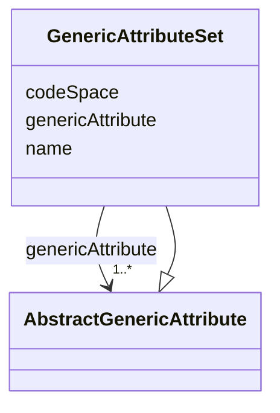

# Class: GenericAttributeSet 


_A GenericAttributeSet is a named collection of generic attributes._


URI: [citygml:GenericAttributeSet](https://www.ogc.org/standards/citygml/GenericAttributeSet)





## Inheritance
* [AbstractGenericAttribute](AbstractGenericAttribute.md)
    * **GenericAttributeSet**


## Slots

| Name | Cardinality and Range | Description | Inheritance |
| ---  | --- | --- | --- |
| [name](name.md) | 1 <br/> [String](String.md) | Specifies the name of the GenericAttributeSet | direct |
| [codeSpace](codeSpace.md) | 0..1 <br/> [Uri](Uri.md) | Associates the GenericAttributeSet with an authority that maintains the colle... | direct |
| [genericAttribute](genericAttribute.md) | 1..* <br/> [AbstractGenericAttribute](AbstractGenericAttribute.md) | Relates to the generic attributes that are part of the GenericAttributeSet | direct |


## Identifier and Mapping Information


### Schema Source


* from schema: https://www.ogc.org/standards/citygml


## Mappings

| Mapping Type | Mapped Value |
| ---  | ---  |
| self | citygml:GenericAttributeSet |
| native | citygml:GenericAttributeSet |


## LinkML Source

<!-- TODO: investigate https://stackoverflow.com/questions/37606292/how-to-create-tabbed-code-blocks-in-mkdocs-or-sphinx -->

### Direct

<details>
```yaml
name: GenericAttributeSet
description: A GenericAttributeSet is a named collection of generic attributes.
from_schema: https://www.ogc.org/standards/citygml
is_a: AbstractGenericAttribute
abstract: false
attributes:
  name:
    name: name
    description: Specifies the name of the GenericAttributeSet.
    from_schema: https://www.ogc.org/standards/citygml
    domain_of:
    - CodeAttribute
    - DateAttribute
    - DoubleAttribute
    - GenericAttributeSet
    - IntAttribute
    - MeasureAttribute
    - StringAttribute
    - UriAttribute
    - AbstractFeature
    range: string
    required: true
    multivalued: false
  codeSpace:
    name: codeSpace
    description: Associates the GenericAttributeSet with an authority that maintains
      the collection of generic attributes.
    from_schema: https://www.ogc.org/standards/citygml
    rank: 1000
    domain_of:
    - GenericAttributeSet
    - Code
    range: uri
    required: false
    multivalued: false
  genericAttribute:
    name: genericAttribute
    description: Relates to the generic attributes that are part of the GenericAttributeSet.
    from_schema: https://www.ogc.org/standards/citygml
    rank: 1000
    domain_of:
    - GenericAttributeSet
    - AbstractCityObject
    range: AbstractGenericAttribute
    required: true
    multivalued: true

```
</details>

### Induced

<details>
```yaml
name: GenericAttributeSet
description: A GenericAttributeSet is a named collection of generic attributes.
from_schema: https://www.ogc.org/standards/citygml
is_a: AbstractGenericAttribute
abstract: false
attributes:
  name:
    name: name
    description: Specifies the name of the GenericAttributeSet.
    from_schema: https://www.ogc.org/standards/citygml
    alias: name
    owner: GenericAttributeSet
    domain_of:
    - CodeAttribute
    - DateAttribute
    - DoubleAttribute
    - GenericAttributeSet
    - IntAttribute
    - MeasureAttribute
    - StringAttribute
    - UriAttribute
    - AbstractFeature
    range: string
    required: true
    multivalued: false
  codeSpace:
    name: codeSpace
    description: Associates the GenericAttributeSet with an authority that maintains
      the collection of generic attributes.
    from_schema: https://www.ogc.org/standards/citygml
    rank: 1000
    alias: codeSpace
    owner: GenericAttributeSet
    domain_of:
    - GenericAttributeSet
    - Code
    range: uri
    required: false
    multivalued: false
  genericAttribute:
    name: genericAttribute
    description: Relates to the generic attributes that are part of the GenericAttributeSet.
    from_schema: https://www.ogc.org/standards/citygml
    rank: 1000
    alias: genericAttribute
    owner: GenericAttributeSet
    domain_of:
    - GenericAttributeSet
    - AbstractCityObject
    range: AbstractGenericAttribute
    required: true
    multivalued: true

```
</details>