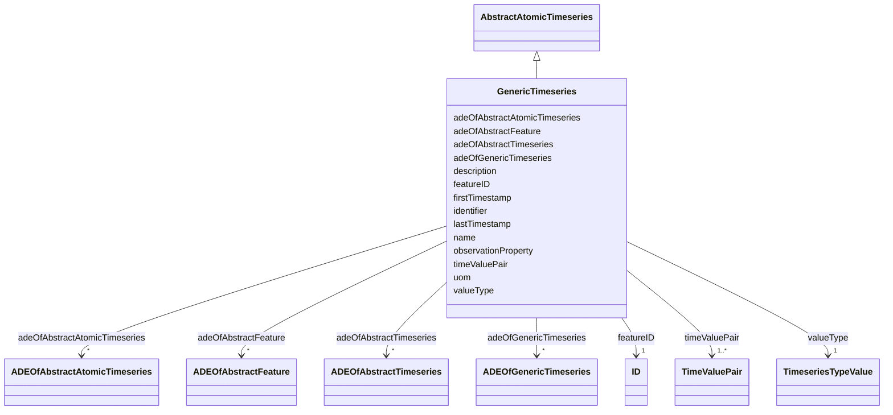

# Class: GenericTimeseries 


_A GenericTimeseries represents time-varying data in the form of embedded time-value-pairs of a specific data type for a single contiguous time interval._


URI: [citygml:GenericTimeseries](https://www.ogc.org/standards/citygml/GenericTimeseries)





## Inheritance
* [AbstractFeature](AbstractFeature.md)
    * [AbstractTimeseries](AbstractTimeseries.md)
        * [AbstractAtomicTimeseries](AbstractAtomicTimeseries.md)
            * **GenericTimeseries**


## Slots

| Name | Cardinality and Range | Description | Inheritance |
| ---  | --- | --- | --- |
| [valueType](valueType.md) | 1 <br/> [TimeseriesTypeValue](TimeseriesTypeValue.md) | Indicates the specific type of all time-value-pairs that are part of the Gene... | direct |
| [adeOfGenericTimeseries](adeOfGenericTimeseries.md) | * <br/> [ADEOfGenericTimeseries](ADEOfGenericTimeseries.md) | Augments the GenericTimeseries with properties defined in an ADE | direct |
| [timeValuePair](timeValuePair.md) | 1..* <br/> [TimeValuePair](TimeValuePair.md) | Relates to the time-value-pairs that are part of the GenericTimeseries | direct |
| [observationProperty](observationProperty.md) | 1 <br/> [String](String.md) | Specifies the phenomenon for which the atomic timeseries provides observation... | [AbstractAtomicTimeseries](AbstractAtomicTimeseries.md) |
| [uom](uom.md) | 0..1 <br/> [String](String.md) | Specifies the unit of measurement of the observation values | [AbstractAtomicTimeseries](AbstractAtomicTimeseries.md) |
| [adeOfAbstractAtomicTimeseries](adeOfAbstractAtomicTimeseries.md) | * <br/> [ADEOfAbstractAtomicTimeseries](ADEOfAbstractAtomicTimeseries.md) | Augments AbstractAtomicTimeseries with properties defined in an ADE | [AbstractAtomicTimeseries](AbstractAtomicTimeseries.md) |
| [firstTimestamp](firstTimestamp.md) | 0..1 <br/> [String](String.md) | Specifies the beginning of the timeseries | [AbstractTimeseries](AbstractTimeseries.md) |
| [lastTimestamp](lastTimestamp.md) | 0..1 <br/> [String](String.md) | Specifies the end of the timeseries | [AbstractTimeseries](AbstractTimeseries.md) |
| [adeOfAbstractTimeseries](adeOfAbstractTimeseries.md) | * <br/> [ADEOfAbstractTimeseries](ADEOfAbstractTimeseries.md) | Augments AbstractTimeseries with properties defined in an ADE | [AbstractTimeseries](AbstractTimeseries.md) |
| [featureID](featureID.md) | 1 <br/> [ID](ID.md) |  | [AbstractFeature](AbstractFeature.md) |
| [identifier](identifier.md) | 0..1 <br/> [String](String.md) |  | [AbstractFeature](AbstractFeature.md) |
| [name](name.md) | * <br/> [String](String.md) |  | [AbstractFeature](AbstractFeature.md) |
| [description](description.md) | 0..1 <br/> [String](String.md) |  | [AbstractFeature](AbstractFeature.md) |
| [adeOfAbstractFeature](adeOfAbstractFeature.md) | * <br/> [ADEOfAbstractFeature](ADEOfAbstractFeature.md) | Augments AbstractFeature with properties defined in an ADE | [AbstractFeature](AbstractFeature.md) |


## Identifier and Mapping Information


### Schema Source


* from schema: https://www.ogc.org/standards/citygml


## Mappings

| Mapping Type | Mapped Value |
| ---  | ---  |
| self | citygml:GenericTimeseries |
| native | citygml:GenericTimeseries |


## LinkML Source

<!-- TODO: investigate https://stackoverflow.com/questions/37606292/how-to-create-tabbed-code-blocks-in-mkdocs-or-sphinx -->

### Direct

<details>
```yaml
name: GenericTimeseries
description: A GenericTimeseries represents time-varying data in the form of embedded
  time-value-pairs of a specific data type for a single contiguous time interval.
from_schema: https://www.ogc.org/standards/citygml
is_a: AbstractAtomicTimeseries
abstract: false
attributes:
  valueType:
    name: valueType
    description: Indicates the specific type of all time-value-pairs that are part
      of the GenericTimeseries.
    from_schema: https://www.ogc.org/standards/citygml
    rank: 1000
    domain_of:
    - GenericTimeseries
    - TabulatedFileTimeseries
    range: TimeseriesTypeValue
    required: true
    multivalued: false
  adeOfGenericTimeseries:
    name: adeOfGenericTimeseries
    description: Augments the GenericTimeseries with properties defined in an ADE.
    from_schema: https://www.ogc.org/standards/citygml
    rank: 1000
    domain_of:
    - GenericTimeseries
    range: ADEOfGenericTimeseries
    required: false
    multivalued: true
  timeValuePair:
    name: timeValuePair
    description: Relates to the time-value-pairs that are part of the GenericTimeseries.
    from_schema: https://www.ogc.org/standards/citygml
    rank: 1000
    domain_of:
    - GenericTimeseries
    range: TimeValuePair
    required: true
    multivalued: true

```
</details>

### Induced

<details>
```yaml
name: GenericTimeseries
description: A GenericTimeseries represents time-varying data in the form of embedded
  time-value-pairs of a specific data type for a single contiguous time interval.
from_schema: https://www.ogc.org/standards/citygml
is_a: AbstractAtomicTimeseries
abstract: false
attributes:
  valueType:
    name: valueType
    description: Indicates the specific type of all time-value-pairs that are part
      of the GenericTimeseries.
    from_schema: https://www.ogc.org/standards/citygml
    rank: 1000
    alias: valueType
    owner: GenericTimeseries
    domain_of:
    - GenericTimeseries
    - TabulatedFileTimeseries
    range: TimeseriesTypeValue
    required: true
    multivalued: false
  adeOfGenericTimeseries:
    name: adeOfGenericTimeseries
    description: Augments the GenericTimeseries with properties defined in an ADE.
    from_schema: https://www.ogc.org/standards/citygml
    rank: 1000
    alias: adeOfGenericTimeseries
    owner: GenericTimeseries
    domain_of:
    - GenericTimeseries
    range: ADEOfGenericTimeseries
    required: false
    multivalued: true
  timeValuePair:
    name: timeValuePair
    description: Relates to the time-value-pairs that are part of the GenericTimeseries.
    from_schema: https://www.ogc.org/standards/citygml
    rank: 1000
    alias: timeValuePair
    owner: GenericTimeseries
    domain_of:
    - GenericTimeseries
    range: TimeValuePair
    required: true
    multivalued: true
  observationProperty:
    name: observationProperty
    description: Specifies the phenomenon for which the atomic timeseries provides
      observation values.
    from_schema: https://www.ogc.org/standards/citygml
    alias: observationProperty
    owner: GenericTimeseries
    domain_of:
    - SensorConnection
    - AbstractAtomicTimeseries
    range: string
    required: true
    multivalued: false
  uom:
    name: uom
    description: Specifies the unit of measurement of the observation values.
    from_schema: https://www.ogc.org/standards/citygml
    alias: uom
    owner: GenericTimeseries
    domain_of:
    - SensorConnection
    - AbstractAtomicTimeseries
    - MeasureOrNilReasonList
    range: string
    required: false
    multivalued: false
  adeOfAbstractAtomicTimeseries:
    name: adeOfAbstractAtomicTimeseries
    description: Augments AbstractAtomicTimeseries with properties defined in an ADE.
    from_schema: https://www.ogc.org/standards/citygml
    rank: 1000
    alias: adeOfAbstractAtomicTimeseries
    owner: GenericTimeseries
    domain_of:
    - AbstractAtomicTimeseries
    range: ADEOfAbstractAtomicTimeseries
    required: false
    multivalued: true
  firstTimestamp:
    name: firstTimestamp
    description: Specifies the beginning of the timeseries.
    from_schema: https://www.ogc.org/standards/citygml
    rank: 1000
    alias: firstTimestamp
    owner: GenericTimeseries
    domain_of:
    - AbstractTimeseries
    range: string
    required: false
    multivalued: false
  lastTimestamp:
    name: lastTimestamp
    description: Specifies the end of the timeseries.
    from_schema: https://www.ogc.org/standards/citygml
    rank: 1000
    alias: lastTimestamp
    owner: GenericTimeseries
    domain_of:
    - AbstractTimeseries
    range: string
    required: false
    multivalued: false
  adeOfAbstractTimeseries:
    name: adeOfAbstractTimeseries
    description: Augments AbstractTimeseries with properties defined in an ADE.
    from_schema: https://www.ogc.org/standards/citygml
    rank: 1000
    alias: adeOfAbstractTimeseries
    owner: GenericTimeseries
    domain_of:
    - AbstractTimeseries
    range: ADEOfAbstractTimeseries
    required: false
    multivalued: true
  featureID:
    name: featureID
    from_schema: https://www.ogc.org/standards/citygml
    rank: 1000
    alias: featureID
    owner: GenericTimeseries
    domain_of:
    - AbstractFeature
    range: ID
    required: true
    multivalued: false
  identifier:
    name: identifier
    from_schema: https://www.ogc.org/standards/citygml
    rank: 1000
    alias: identifier
    owner: GenericTimeseries
    domain_of:
    - AbstractFeature
    range: string
    required: false
    multivalued: false
  name:
    name: name
    from_schema: https://www.ogc.org/standards/citygml
    alias: name
    owner: GenericTimeseries
    domain_of:
    - CodeAttribute
    - DateAttribute
    - DoubleAttribute
    - GenericAttributeSet
    - IntAttribute
    - MeasureAttribute
    - StringAttribute
    - UriAttribute
    - AbstractFeature
    range: string
    required: false
    multivalued: true
  description:
    name: description
    from_schema: https://www.ogc.org/standards/citygml
    alias: description
    owner: GenericTimeseries
    domain_of:
    - ConstructionEvent
    - AbstractFeature
    range: string
    required: false
    multivalued: false
  adeOfAbstractFeature:
    name: adeOfAbstractFeature
    description: Augments AbstractFeature with properties defined in an ADE.
    from_schema: https://www.ogc.org/standards/citygml
    rank: 1000
    alias: adeOfAbstractFeature
    owner: GenericTimeseries
    domain_of:
    - AbstractFeature
    range: ADEOfAbstractFeature
    required: false
    multivalued: true

```
</details>