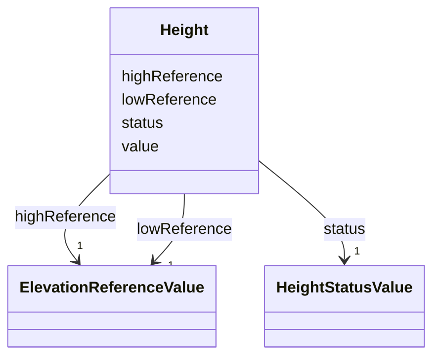

# Class: Height 


_Height represents a vertical distance (measured or estimated) between a low reference and a high reference. [cf. INSPIRE]_


URI: [citygml:Height](https://www.ogc.org/standards/citygml/Height)





<!-- no inheritance hierarchy -->

## Slots

| Name | Cardinality and Range | Description | Inheritance |
| ---  | --- | --- | --- |
| [highReference](highReference.md) | 1 <br/> [ElevationReferenceValue](ElevationReferenceValue.md) | Indicates the high point used to calculate the value of the height | direct |
| [lowReference](lowReference.md) | 1 <br/> [ElevationReferenceValue](ElevationReferenceValue.md) | Indicates the low point used to calculate the value of the height | direct |
| [status](status.md) | 1 <br/> [HeightStatusValue](HeightStatusValue.md) | Indicates the way the height has been captured | direct |
| [value](value.md) | 1 <br/> [Float](Float.md) | Specifies the value of the height above or below ground | direct |


## Usages

| used by | used in | type | used |
| ---  | --- | --- | --- |
| [AbstractConstruction](AbstractConstruction.md) | [height](height.md) | range | [Height](Height.md) |
| [OtherConstruction](OtherConstruction.md) | [height](height.md) | range | [Height](Height.md) |
| [AbstractBridge](AbstractBridge.md) | [height](height.md) | range | [Height](Height.md) |
| [Bridge](Bridge.md) | [height](height.md) | range | [Height](Height.md) |
| [BridgePart](BridgePart.md) | [height](height.md) | range | [Height](Height.md) |
| [AbstractBuilding](AbstractBuilding.md) | [height](height.md) | range | [Height](Height.md) |
| [Building](Building.md) | [height](height.md) | range | [Height](Height.md) |
| [BuildingPart](BuildingPart.md) | [height](height.md) | range | [Height](Height.md) |
| [AbstractTunnel](AbstractTunnel.md) | [height](height.md) | range | [Height](Height.md) |
| [Tunnel](Tunnel.md) | [height](height.md) | range | [Height](Height.md) |
| [TunnelPart](TunnelPart.md) | [height](height.md) | range | [Height](Height.md) |


## Identifier and Mapping Information


### Schema Source


* from schema: https://www.ogc.org/standards/citygml


## Mappings

| Mapping Type | Mapped Value |
| ---  | ---  |
| self | citygml:Height |
| native | citygml:Height |


## LinkML Source

<!-- TODO: investigate https://stackoverflow.com/questions/37606292/how-to-create-tabbed-code-blocks-in-mkdocs-or-sphinx -->

### Direct

<details>
```yaml
name: Height
description: Height represents a vertical distance (measured or estimated) between
  a low reference and a high reference. [cf. INSPIRE]
from_schema: https://www.ogc.org/standards/citygml
abstract: false
attributes:
  highReference:
    name: highReference
    description: Indicates the high point used to calculate the value of the height.
      [cf. INSPIRE]
    from_schema: https://www.ogc.org/standards/citygml
    rank: 1000
    domain_of:
    - Height
    - RoomHeight
    range: ElevationReferenceValue
    required: true
    multivalued: false
  lowReference:
    name: lowReference
    description: Indicates the low point used to calculate the value of the height.
      [cf. INSPIRE]
    from_schema: https://www.ogc.org/standards/citygml
    rank: 1000
    domain_of:
    - Height
    - RoomHeight
    range: ElevationReferenceValue
    required: true
    multivalued: false
  status:
    name: status
    description: Indicates the way the height has been captured. [cf. INSPIRE]
    from_schema: https://www.ogc.org/standards/citygml
    rank: 1000
    domain_of:
    - Height
    - RoomHeight
    range: HeightStatusValue
    required: true
    multivalued: false
  value:
    name: value
    description: Specifies the value of the height above or below ground. [cf. INSPIRE]
    from_schema: https://www.ogc.org/standards/citygml
    rank: 1000
    domain_of:
    - Height
    - RoomHeight
    - DoubleOrNilReason
    - CodeAttribute
    - DateAttribute
    - DoubleAttribute
    - IntAttribute
    - MeasureAttribute
    - StringAttribute
    - UriAttribute
    range: float
    required: true
    multivalued: false

```
</details>

### Induced

<details>
```yaml
name: Height
description: Height represents a vertical distance (measured or estimated) between
  a low reference and a high reference. [cf. INSPIRE]
from_schema: https://www.ogc.org/standards/citygml
abstract: false
attributes:
  highReference:
    name: highReference
    description: Indicates the high point used to calculate the value of the height.
      [cf. INSPIRE]
    from_schema: https://www.ogc.org/standards/citygml
    rank: 1000
    alias: highReference
    owner: Height
    domain_of:
    - Height
    - RoomHeight
    range: ElevationReferenceValue
    required: true
    multivalued: false
  lowReference:
    name: lowReference
    description: Indicates the low point used to calculate the value of the height.
      [cf. INSPIRE]
    from_schema: https://www.ogc.org/standards/citygml
    rank: 1000
    alias: lowReference
    owner: Height
    domain_of:
    - Height
    - RoomHeight
    range: ElevationReferenceValue
    required: true
    multivalued: false
  status:
    name: status
    description: Indicates the way the height has been captured. [cf. INSPIRE]
    from_schema: https://www.ogc.org/standards/citygml
    rank: 1000
    alias: status
    owner: Height
    domain_of:
    - Height
    - RoomHeight
    range: HeightStatusValue
    required: true
    multivalued: false
  value:
    name: value
    description: Specifies the value of the height above or below ground. [cf. INSPIRE]
    from_schema: https://www.ogc.org/standards/citygml
    rank: 1000
    alias: value
    owner: Height
    domain_of:
    - Height
    - RoomHeight
    - DoubleOrNilReason
    - CodeAttribute
    - DateAttribute
    - DoubleAttribute
    - IntAttribute
    - MeasureAttribute
    - StringAttribute
    - UriAttribute
    range: float
    required: true
    multivalued: false

```
</details>