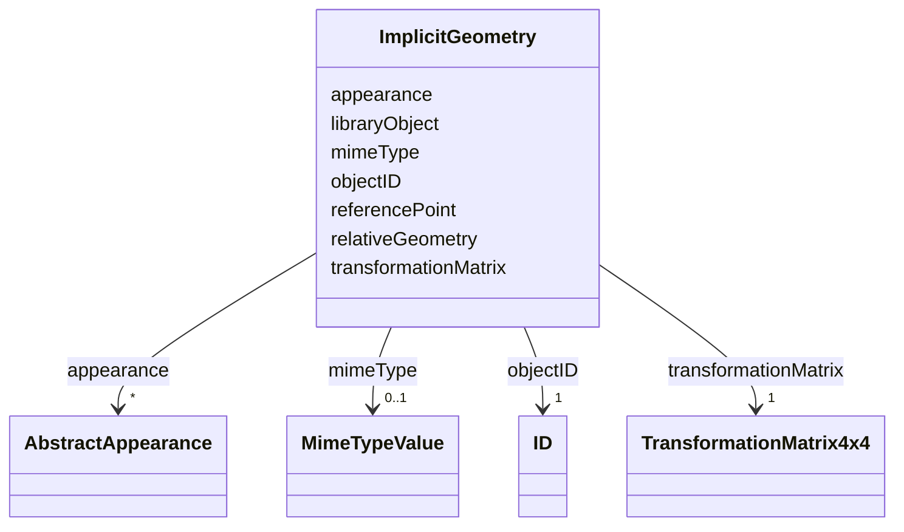

# Class: ImplicitGeometry 


_ImplicitGeometry is a geometry representation where the shape is stored only once as a prototypical geometry. Examples are a tree or other vegetation object, a traffic light or a traffic sign. This prototypic geometry object can be re-used or referenced many times, wherever the corresponding feature occurs in the 3D city model._


URI: [citygml:ImplicitGeometry](https://www.ogc.org/standards/citygml/ImplicitGeometry)





<!-- no inheritance hierarchy -->

## Slots

| Name | Cardinality and Range | Description | Inheritance |
| ---  | --- | --- | --- |
| [objectID](objectID.md) | 1 <br/> [ID](ID.md) |  | direct |
| [transformationMatrix](transformationMatrix.md) | 1 <br/> [TransformationMatrix4x4](TransformationMatrix4x4.md) | Specifies the mathematical transformation (translation, rotation, and scaling... | direct |
| [mimeType](mimeType.md) | 0..1 <br/> [MimeTypeValue](MimeTypeValue.md) | Specifies the MIME type of the external file that stores the prototypical geo... | direct |
| [libraryObject](libraryObject.md) | 0..1 <br/> [Uri](Uri.md) | Specifies the URI that points to the prototypical geometry stored in an exter... | direct |
| [relativeGeometry](relativeGeometry.md) | 0..1 <br/> [String](String.md) | Relates to a prototypical geometry in a local coordinate system stored inline... | direct |
| [referencePoint](referencePoint.md) | 1 <br/> [String](String.md) | Relates to a 3D Point geometry that represents the base point of the object i... | direct |
| [appearance](appearance.md) | * <br/> [AbstractAppearance](AbstractAppearance.md) | Relates appearances to the ImplicitGeometry | direct |


## Usages

| used by | used in | type | used |
| ---  | --- | --- | --- |
| [TimeValuePair](TimeValuePair.md) | [implicitGeometryValue](implicitGeometryValue.md) | range | [ImplicitGeometry](ImplicitGeometry.md) |
| [AbstractConstruction](AbstractConstruction.md) | [lod3ImplicitRepresentation](lod3ImplicitRepresentation.md) | range | [ImplicitGeometry](ImplicitGeometry.md) |
| [AbstractConstruction](AbstractConstruction.md) | [lod2ImplicitRepresentation](lod2ImplicitRepresentation.md) | range | [ImplicitGeometry](ImplicitGeometry.md) |
| [AbstractConstruction](AbstractConstruction.md) | [lod1ImplicitRepresentation](lod1ImplicitRepresentation.md) | range | [ImplicitGeometry](ImplicitGeometry.md) |
| [AbstractConstructiveElement](AbstractConstructiveElement.md) | [lod3ImplicitRepresentation](lod3ImplicitRepresentation.md) | range | [ImplicitGeometry](ImplicitGeometry.md) |
| [AbstractConstructiveElement](AbstractConstructiveElement.md) | [lod2ImplicitRepresentation](lod2ImplicitRepresentation.md) | range | [ImplicitGeometry](ImplicitGeometry.md) |
| [AbstractConstructiveElement](AbstractConstructiveElement.md) | [lod1ImplicitRepresentation](lod1ImplicitRepresentation.md) | range | [ImplicitGeometry](ImplicitGeometry.md) |
| [AbstractFillingElement](AbstractFillingElement.md) | [lod3ImplicitRepresentation](lod3ImplicitRepresentation.md) | range | [ImplicitGeometry](ImplicitGeometry.md) |
| [AbstractFillingElement](AbstractFillingElement.md) | [lod2ImplicitRepresentation](lod2ImplicitRepresentation.md) | range | [ImplicitGeometry](ImplicitGeometry.md) |
| [AbstractFillingElement](AbstractFillingElement.md) | [lod1ImplicitRepresentation](lod1ImplicitRepresentation.md) | range | [ImplicitGeometry](ImplicitGeometry.md) |
| [AbstractFurniture](AbstractFurniture.md) | [lod3ImplicitRepresentation](lod3ImplicitRepresentation.md) | range | [ImplicitGeometry](ImplicitGeometry.md) |
| [AbstractFurniture](AbstractFurniture.md) | [lod2ImplicitRepresentation](lod2ImplicitRepresentation.md) | range | [ImplicitGeometry](ImplicitGeometry.md) |
| [AbstractFurniture](AbstractFurniture.md) | [lod1ImplicitRepresentation](lod1ImplicitRepresentation.md) | range | [ImplicitGeometry](ImplicitGeometry.md) |
| [AbstractInstallation](AbstractInstallation.md) | [lod3ImplicitRepresentation](lod3ImplicitRepresentation.md) | range | [ImplicitGeometry](ImplicitGeometry.md) |
| [AbstractInstallation](AbstractInstallation.md) | [lod2ImplicitRepresentation](lod2ImplicitRepresentation.md) | range | [ImplicitGeometry](ImplicitGeometry.md) |
| [AbstractInstallation](AbstractInstallation.md) | [lod1ImplicitRepresentation](lod1ImplicitRepresentation.md) | range | [ImplicitGeometry](ImplicitGeometry.md) |
| [Door](Door.md) | [lod3ImplicitRepresentation](lod3ImplicitRepresentation.md) | range | [ImplicitGeometry](ImplicitGeometry.md) |
| [Door](Door.md) | [lod2ImplicitRepresentation](lod2ImplicitRepresentation.md) | range | [ImplicitGeometry](ImplicitGeometry.md) |
| [Door](Door.md) | [lod1ImplicitRepresentation](lod1ImplicitRepresentation.md) | range | [ImplicitGeometry](ImplicitGeometry.md) |
| [OtherConstruction](OtherConstruction.md) | [lod3ImplicitRepresentation](lod3ImplicitRepresentation.md) | range | [ImplicitGeometry](ImplicitGeometry.md) |
| [OtherConstruction](OtherConstruction.md) | [lod2ImplicitRepresentation](lod2ImplicitRepresentation.md) | range | [ImplicitGeometry](ImplicitGeometry.md) |
| [OtherConstruction](OtherConstruction.md) | [lod1ImplicitRepresentation](lod1ImplicitRepresentation.md) | range | [ImplicitGeometry](ImplicitGeometry.md) |
| [Window](Window.md) | [lod3ImplicitRepresentation](lod3ImplicitRepresentation.md) | range | [ImplicitGeometry](ImplicitGeometry.md) |
| [Window](Window.md) | [lod2ImplicitRepresentation](lod2ImplicitRepresentation.md) | range | [ImplicitGeometry](ImplicitGeometry.md) |
| [Window](Window.md) | [lod1ImplicitRepresentation](lod1ImplicitRepresentation.md) | range | [ImplicitGeometry](ImplicitGeometry.md) |
| [AbstractBridge](AbstractBridge.md) | [lod3ImplicitRepresentation](lod3ImplicitRepresentation.md) | range | [ImplicitGeometry](ImplicitGeometry.md) |
| [AbstractBridge](AbstractBridge.md) | [lod2ImplicitRepresentation](lod2ImplicitRepresentation.md) | range | [ImplicitGeometry](ImplicitGeometry.md) |
| [AbstractBridge](AbstractBridge.md) | [lod1ImplicitRepresentation](lod1ImplicitRepresentation.md) | range | [ImplicitGeometry](ImplicitGeometry.md) |
| [Bridge](Bridge.md) | [lod3ImplicitRepresentation](lod3ImplicitRepresentation.md) | range | [ImplicitGeometry](ImplicitGeometry.md) |
| [Bridge](Bridge.md) | [lod2ImplicitRepresentation](lod2ImplicitRepresentation.md) | range | [ImplicitGeometry](ImplicitGeometry.md) |
| [Bridge](Bridge.md) | [lod1ImplicitRepresentation](lod1ImplicitRepresentation.md) | range | [ImplicitGeometry](ImplicitGeometry.md) |
| [BridgeConstructiveElement](BridgeConstructiveElement.md) | [lod3ImplicitRepresentation](lod3ImplicitRepresentation.md) | range | [ImplicitGeometry](ImplicitGeometry.md) |
| [BridgeConstructiveElement](BridgeConstructiveElement.md) | [lod2ImplicitRepresentation](lod2ImplicitRepresentation.md) | range | [ImplicitGeometry](ImplicitGeometry.md) |
| [BridgeConstructiveElement](BridgeConstructiveElement.md) | [lod1ImplicitRepresentation](lod1ImplicitRepresentation.md) | range | [ImplicitGeometry](ImplicitGeometry.md) |
| [BridgeFurniture](BridgeFurniture.md) | [lod3ImplicitRepresentation](lod3ImplicitRepresentation.md) | range | [ImplicitGeometry](ImplicitGeometry.md) |
| [BridgeFurniture](BridgeFurniture.md) | [lod2ImplicitRepresentation](lod2ImplicitRepresentation.md) | range | [ImplicitGeometry](ImplicitGeometry.md) |
| [BridgeFurniture](BridgeFurniture.md) | [lod1ImplicitRepresentation](lod1ImplicitRepresentation.md) | range | [ImplicitGeometry](ImplicitGeometry.md) |
| [BridgeInstallation](BridgeInstallation.md) | [lod3ImplicitRepresentation](lod3ImplicitRepresentation.md) | range | [ImplicitGeometry](ImplicitGeometry.md) |
| [BridgeInstallation](BridgeInstallation.md) | [lod2ImplicitRepresentation](lod2ImplicitRepresentation.md) | range | [ImplicitGeometry](ImplicitGeometry.md) |
| [BridgeInstallation](BridgeInstallation.md) | [lod1ImplicitRepresentation](lod1ImplicitRepresentation.md) | range | [ImplicitGeometry](ImplicitGeometry.md) |
| [BridgePart](BridgePart.md) | [lod3ImplicitRepresentation](lod3ImplicitRepresentation.md) | range | [ImplicitGeometry](ImplicitGeometry.md) |
| [BridgePart](BridgePart.md) | [lod2ImplicitRepresentation](lod2ImplicitRepresentation.md) | range | [ImplicitGeometry](ImplicitGeometry.md) |
| [BridgePart](BridgePart.md) | [lod1ImplicitRepresentation](lod1ImplicitRepresentation.md) | range | [ImplicitGeometry](ImplicitGeometry.md) |
| [AbstractBuilding](AbstractBuilding.md) | [lod3ImplicitRepresentation](lod3ImplicitRepresentation.md) | range | [ImplicitGeometry](ImplicitGeometry.md) |
| [AbstractBuilding](AbstractBuilding.md) | [lod2ImplicitRepresentation](lod2ImplicitRepresentation.md) | range | [ImplicitGeometry](ImplicitGeometry.md) |
| [AbstractBuilding](AbstractBuilding.md) | [lod1ImplicitRepresentation](lod1ImplicitRepresentation.md) | range | [ImplicitGeometry](ImplicitGeometry.md) |
| [Building](Building.md) | [lod3ImplicitRepresentation](lod3ImplicitRepresentation.md) | range | [ImplicitGeometry](ImplicitGeometry.md) |
| [Building](Building.md) | [lod2ImplicitRepresentation](lod2ImplicitRepresentation.md) | range | [ImplicitGeometry](ImplicitGeometry.md) |
| [Building](Building.md) | [lod1ImplicitRepresentation](lod1ImplicitRepresentation.md) | range | [ImplicitGeometry](ImplicitGeometry.md) |
| [BuildingConstructiveElement](BuildingConstructiveElement.md) | [lod3ImplicitRepresentation](lod3ImplicitRepresentation.md) | range | [ImplicitGeometry](ImplicitGeometry.md) |
| [BuildingConstructiveElement](BuildingConstructiveElement.md) | [lod2ImplicitRepresentation](lod2ImplicitRepresentation.md) | range | [ImplicitGeometry](ImplicitGeometry.md) |
| [BuildingConstructiveElement](BuildingConstructiveElement.md) | [lod1ImplicitRepresentation](lod1ImplicitRepresentation.md) | range | [ImplicitGeometry](ImplicitGeometry.md) |
| [BuildingFurniture](BuildingFurniture.md) | [lod3ImplicitRepresentation](lod3ImplicitRepresentation.md) | range | [ImplicitGeometry](ImplicitGeometry.md) |
| [BuildingFurniture](BuildingFurniture.md) | [lod2ImplicitRepresentation](lod2ImplicitRepresentation.md) | range | [ImplicitGeometry](ImplicitGeometry.md) |
| [BuildingFurniture](BuildingFurniture.md) | [lod1ImplicitRepresentation](lod1ImplicitRepresentation.md) | range | [ImplicitGeometry](ImplicitGeometry.md) |
| [BuildingInstallation](BuildingInstallation.md) | [lod3ImplicitRepresentation](lod3ImplicitRepresentation.md) | range | [ImplicitGeometry](ImplicitGeometry.md) |
| [BuildingInstallation](BuildingInstallation.md) | [lod2ImplicitRepresentation](lod2ImplicitRepresentation.md) | range | [ImplicitGeometry](ImplicitGeometry.md) |
| [BuildingInstallation](BuildingInstallation.md) | [lod1ImplicitRepresentation](lod1ImplicitRepresentation.md) | range | [ImplicitGeometry](ImplicitGeometry.md) |
| [BuildingPart](BuildingPart.md) | [lod3ImplicitRepresentation](lod3ImplicitRepresentation.md) | range | [ImplicitGeometry](ImplicitGeometry.md) |
| [BuildingPart](BuildingPart.md) | [lod2ImplicitRepresentation](lod2ImplicitRepresentation.md) | range | [ImplicitGeometry](ImplicitGeometry.md) |
| [BuildingPart](BuildingPart.md) | [lod1ImplicitRepresentation](lod1ImplicitRepresentation.md) | range | [ImplicitGeometry](ImplicitGeometry.md) |
| [CityFurniture](CityFurniture.md) | [lod3ImplicitRepresentation](lod3ImplicitRepresentation.md) | range | [ImplicitGeometry](ImplicitGeometry.md) |
| [CityFurniture](CityFurniture.md) | [lod2ImplicitRepresentation](lod2ImplicitRepresentation.md) | range | [ImplicitGeometry](ImplicitGeometry.md) |
| [CityFurniture](CityFurniture.md) | [lod1ImplicitRepresentation](lod1ImplicitRepresentation.md) | range | [ImplicitGeometry](ImplicitGeometry.md) |
| [AbstractOccupiedSpace](AbstractOccupiedSpace.md) | [lod3ImplicitRepresentation](lod3ImplicitRepresentation.md) | range | [ImplicitGeometry](ImplicitGeometry.md) |
| [AbstractOccupiedSpace](AbstractOccupiedSpace.md) | [lod2ImplicitRepresentation](lod2ImplicitRepresentation.md) | range | [ImplicitGeometry](ImplicitGeometry.md) |
| [AbstractOccupiedSpace](AbstractOccupiedSpace.md) | [lod1ImplicitRepresentation](lod1ImplicitRepresentation.md) | range | [ImplicitGeometry](ImplicitGeometry.md) |
| [GenericOccupiedSpace](GenericOccupiedSpace.md) | [lod3ImplicitRepresentation](lod3ImplicitRepresentation.md) | range | [ImplicitGeometry](ImplicitGeometry.md) |
| [GenericOccupiedSpace](GenericOccupiedSpace.md) | [lod2ImplicitRepresentation](lod2ImplicitRepresentation.md) | range | [ImplicitGeometry](ImplicitGeometry.md) |
| [GenericOccupiedSpace](GenericOccupiedSpace.md) | [lod1ImplicitRepresentation](lod1ImplicitRepresentation.md) | range | [ImplicitGeometry](ImplicitGeometry.md) |
| [AbstractTunnel](AbstractTunnel.md) | [lod3ImplicitRepresentation](lod3ImplicitRepresentation.md) | range | [ImplicitGeometry](ImplicitGeometry.md) |
| [AbstractTunnel](AbstractTunnel.md) | [lod2ImplicitRepresentation](lod2ImplicitRepresentation.md) | range | [ImplicitGeometry](ImplicitGeometry.md) |
| [AbstractTunnel](AbstractTunnel.md) | [lod1ImplicitRepresentation](lod1ImplicitRepresentation.md) | range | [ImplicitGeometry](ImplicitGeometry.md) |
| [Tunnel](Tunnel.md) | [lod3ImplicitRepresentation](lod3ImplicitRepresentation.md) | range | [ImplicitGeometry](ImplicitGeometry.md) |
| [Tunnel](Tunnel.md) | [lod2ImplicitRepresentation](lod2ImplicitRepresentation.md) | range | [ImplicitGeometry](ImplicitGeometry.md) |
| [Tunnel](Tunnel.md) | [lod1ImplicitRepresentation](lod1ImplicitRepresentation.md) | range | [ImplicitGeometry](ImplicitGeometry.md) |
| [TunnelConstructiveElement](TunnelConstructiveElement.md) | [lod3ImplicitRepresentation](lod3ImplicitRepresentation.md) | range | [ImplicitGeometry](ImplicitGeometry.md) |
| [TunnelConstructiveElement](TunnelConstructiveElement.md) | [lod2ImplicitRepresentation](lod2ImplicitRepresentation.md) | range | [ImplicitGeometry](ImplicitGeometry.md) |
| [TunnelConstructiveElement](TunnelConstructiveElement.md) | [lod1ImplicitRepresentation](lod1ImplicitRepresentation.md) | range | [ImplicitGeometry](ImplicitGeometry.md) |
| [TunnelFurniture](TunnelFurniture.md) | [lod3ImplicitRepresentation](lod3ImplicitRepresentation.md) | range | [ImplicitGeometry](ImplicitGeometry.md) |
| [TunnelFurniture](TunnelFurniture.md) | [lod2ImplicitRepresentation](lod2ImplicitRepresentation.md) | range | [ImplicitGeometry](ImplicitGeometry.md) |
| [TunnelFurniture](TunnelFurniture.md) | [lod1ImplicitRepresentation](lod1ImplicitRepresentation.md) | range | [ImplicitGeometry](ImplicitGeometry.md) |
| [TunnelInstallation](TunnelInstallation.md) | [lod3ImplicitRepresentation](lod3ImplicitRepresentation.md) | range | [ImplicitGeometry](ImplicitGeometry.md) |
| [TunnelInstallation](TunnelInstallation.md) | [lod2ImplicitRepresentation](lod2ImplicitRepresentation.md) | range | [ImplicitGeometry](ImplicitGeometry.md) |
| [TunnelInstallation](TunnelInstallation.md) | [lod1ImplicitRepresentation](lod1ImplicitRepresentation.md) | range | [ImplicitGeometry](ImplicitGeometry.md) |
| [TunnelPart](TunnelPart.md) | [lod3ImplicitRepresentation](lod3ImplicitRepresentation.md) | range | [ImplicitGeometry](ImplicitGeometry.md) |
| [TunnelPart](TunnelPart.md) | [lod2ImplicitRepresentation](lod2ImplicitRepresentation.md) | range | [ImplicitGeometry](ImplicitGeometry.md) |
| [TunnelPart](TunnelPart.md) | [lod1ImplicitRepresentation](lod1ImplicitRepresentation.md) | range | [ImplicitGeometry](ImplicitGeometry.md) |
| [AbstractVegetationObject](AbstractVegetationObject.md) | [lod3ImplicitRepresentation](lod3ImplicitRepresentation.md) | range | [ImplicitGeometry](ImplicitGeometry.md) |
| [AbstractVegetationObject](AbstractVegetationObject.md) | [lod2ImplicitRepresentation](lod2ImplicitRepresentation.md) | range | [ImplicitGeometry](ImplicitGeometry.md) |
| [AbstractVegetationObject](AbstractVegetationObject.md) | [lod1ImplicitRepresentation](lod1ImplicitRepresentation.md) | range | [ImplicitGeometry](ImplicitGeometry.md) |
| [PlantCover](PlantCover.md) | [lod3ImplicitRepresentation](lod3ImplicitRepresentation.md) | range | [ImplicitGeometry](ImplicitGeometry.md) |
| [PlantCover](PlantCover.md) | [lod2ImplicitRepresentation](lod2ImplicitRepresentation.md) | range | [ImplicitGeometry](ImplicitGeometry.md) |
| [PlantCover](PlantCover.md) | [lod1ImplicitRepresentation](lod1ImplicitRepresentation.md) | range | [ImplicitGeometry](ImplicitGeometry.md) |
| [SolitaryVegetationObject](SolitaryVegetationObject.md) | [lod3ImplicitRepresentation](lod3ImplicitRepresentation.md) | range | [ImplicitGeometry](ImplicitGeometry.md) |
| [SolitaryVegetationObject](SolitaryVegetationObject.md) | [lod2ImplicitRepresentation](lod2ImplicitRepresentation.md) | range | [ImplicitGeometry](ImplicitGeometry.md) |
| [SolitaryVegetationObject](SolitaryVegetationObject.md) | [lod1ImplicitRepresentation](lod1ImplicitRepresentation.md) | range | [ImplicitGeometry](ImplicitGeometry.md) |
| [WaterBody](WaterBody.md) | [lod3ImplicitRepresentation](lod3ImplicitRepresentation.md) | range | [ImplicitGeometry](ImplicitGeometry.md) |
| [WaterBody](WaterBody.md) | [lod2ImplicitRepresentation](lod2ImplicitRepresentation.md) | range | [ImplicitGeometry](ImplicitGeometry.md) |
| [WaterBody](WaterBody.md) | [lod1ImplicitRepresentation](lod1ImplicitRepresentation.md) | range | [ImplicitGeometry](ImplicitGeometry.md) |


## Identifier and Mapping Information


### Schema Source


* from schema: https://www.ogc.org/standards/citygml


## Mappings

| Mapping Type | Mapped Value |
| ---  | ---  |
| self | citygml:ImplicitGeometry |
| native | citygml:ImplicitGeometry |


## LinkML Source

<!-- TODO: investigate https://stackoverflow.com/questions/37606292/how-to-create-tabbed-code-blocks-in-mkdocs-or-sphinx -->

### Direct

<details>
```yaml
name: ImplicitGeometry
description: ImplicitGeometry is a geometry representation where the shape is stored
  only once as a prototypical geometry. Examples are a tree or other vegetation object,
  a traffic light or a traffic sign. This prototypic geometry object can be re-used
  or referenced many times, wherever the corresponding feature occurs in the 3D city
  model.
from_schema: https://www.ogc.org/standards/citygml
abstract: false
attributes:
  objectID:
    name: objectID
    from_schema: https://www.ogc.org/standards/citygml
    rank: 1000
    domain_of:
    - ImplicitGeometry
    range: ID
    required: true
    multivalued: false
  transformationMatrix:
    name: transformationMatrix
    description: Specifies the mathematical transformation (translation, rotation,
      and scaling) between the prototypical geometry and the actual spatial position
      of the object.
    from_schema: https://www.ogc.org/standards/citygml
    rank: 1000
    domain_of:
    - ImplicitGeometry
    range: TransformationMatrix4x4
    required: true
    multivalued: false
  mimeType:
    name: mimeType
    description: Specifies the MIME type of the external file that stores the prototypical
      geometry.
    from_schema: https://www.ogc.org/standards/citygml
    domain_of:
    - StandardFileTimeseries
    - TabulatedFileTimeseries
    - PointCloud
    - AbstractTexture
    - ImplicitGeometry
    range: MimeTypeValue
    required: false
    multivalued: false
  libraryObject:
    name: libraryObject
    description: Specifies the URI that points to the prototypical geometry stored
      in an external file.
    from_schema: https://www.ogc.org/standards/citygml
    rank: 1000
    domain_of:
    - ImplicitGeometry
    range: uri
    required: false
    multivalued: false
  relativeGeometry:
    name: relativeGeometry
    description: Relates to a prototypical geometry in a local coordinate system stored
      inline with the city model.
    from_schema: https://www.ogc.org/standards/citygml
    rank: 1000
    domain_of:
    - ImplicitGeometry
    range: string
    required: false
    multivalued: false
  referencePoint:
    name: referencePoint
    description: Relates to a 3D Point geometry that represents the base point of
      the object in the world coordinate system.
    from_schema: https://www.ogc.org/standards/citygml
    domain_of:
    - GeoreferencedTexture
    - ImplicitGeometry
    range: string
    required: true
    multivalued: false
  appearance:
    name: appearance
    description: Relates appearances to the ImplicitGeometry.
    from_schema: https://www.ogc.org/standards/citygml
    domain_of:
    - AbstractCityObject
    - ImplicitGeometry
    range: AbstractAppearance
    required: false
    multivalued: true

```
</details>

### Induced

<details>
```yaml
name: ImplicitGeometry
description: ImplicitGeometry is a geometry representation where the shape is stored
  only once as a prototypical geometry. Examples are a tree or other vegetation object,
  a traffic light or a traffic sign. This prototypic geometry object can be re-used
  or referenced many times, wherever the corresponding feature occurs in the 3D city
  model.
from_schema: https://www.ogc.org/standards/citygml
abstract: false
attributes:
  objectID:
    name: objectID
    from_schema: https://www.ogc.org/standards/citygml
    rank: 1000
    alias: objectID
    owner: ImplicitGeometry
    domain_of:
    - ImplicitGeometry
    range: ID
    required: true
    multivalued: false
  transformationMatrix:
    name: transformationMatrix
    description: Specifies the mathematical transformation (translation, rotation,
      and scaling) between the prototypical geometry and the actual spatial position
      of the object.
    from_schema: https://www.ogc.org/standards/citygml
    rank: 1000
    alias: transformationMatrix
    owner: ImplicitGeometry
    domain_of:
    - ImplicitGeometry
    range: TransformationMatrix4x4
    required: true
    multivalued: false
  mimeType:
    name: mimeType
    description: Specifies the MIME type of the external file that stores the prototypical
      geometry.
    from_schema: https://www.ogc.org/standards/citygml
    alias: mimeType
    owner: ImplicitGeometry
    domain_of:
    - StandardFileTimeseries
    - TabulatedFileTimeseries
    - PointCloud
    - AbstractTexture
    - ImplicitGeometry
    range: MimeTypeValue
    required: false
    multivalued: false
  libraryObject:
    name: libraryObject
    description: Specifies the URI that points to the prototypical geometry stored
      in an external file.
    from_schema: https://www.ogc.org/standards/citygml
    rank: 1000
    alias: libraryObject
    owner: ImplicitGeometry
    domain_of:
    - ImplicitGeometry
    range: uri
    required: false
    multivalued: false
  relativeGeometry:
    name: relativeGeometry
    description: Relates to a prototypical geometry in a local coordinate system stored
      inline with the city model.
    from_schema: https://www.ogc.org/standards/citygml
    rank: 1000
    alias: relativeGeometry
    owner: ImplicitGeometry
    domain_of:
    - ImplicitGeometry
    range: string
    required: false
    multivalued: false
  referencePoint:
    name: referencePoint
    description: Relates to a 3D Point geometry that represents the base point of
      the object in the world coordinate system.
    from_schema: https://www.ogc.org/standards/citygml
    alias: referencePoint
    owner: ImplicitGeometry
    domain_of:
    - GeoreferencedTexture
    - ImplicitGeometry
    range: string
    required: true
    multivalued: false
  appearance:
    name: appearance
    description: Relates appearances to the ImplicitGeometry.
    from_schema: https://www.ogc.org/standards/citygml
    alias: appearance
    owner: ImplicitGeometry
    domain_of:
    - AbstractCityObject
    - ImplicitGeometry
    range: AbstractAppearance
    required: false
    multivalued: true

```
</details>