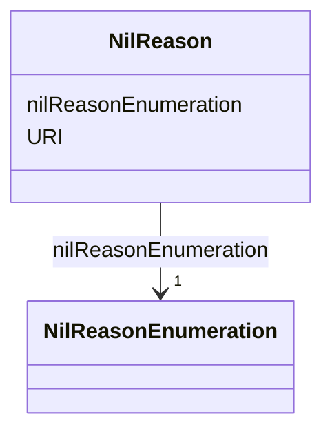

# Class: NilReason 


_CityGML class from package Core_


URI: [citygml:NilReason](https://www.ogc.org/standards/citygml/NilReason)





<!-- no inheritance hierarchy -->

## Slots

| Name | Cardinality and Range | Description | Inheritance |
| ---  | --- | --- | --- |
| [nilReasonEnumeration](nilReasonEnumeration.md) | 1 <br/> [NilReasonEnumeration](NilReasonEnumeration.md) |  | direct |
| [URI](URI.md) | 1 <br/> [Uri](Uri.md) |  | direct |


## Usages

| used by | used in | type | used |
| ---  | --- | --- | --- |
| [DoubleOrNilReason](DoubleOrNilReason.md) | [nilReason](nilReason.md) | range | [NilReason](NilReason.md) |


## Identifier and Mapping Information


### Schema Source


* from schema: https://www.ogc.org/standards/citygml


## Mappings

| Mapping Type | Mapped Value |
| ---  | ---  |
| self | citygml:NilReason |
| native | citygml:NilReason |


## LinkML Source

<!-- TODO: investigate https://stackoverflow.com/questions/37606292/how-to-create-tabbed-code-blocks-in-mkdocs-or-sphinx -->

### Direct

<details>
```yaml
name: NilReason
description: CityGML class from package Core
from_schema: https://www.ogc.org/standards/citygml
abstract: false
attributes:
  nilReasonEnumeration:
    name: nilReasonEnumeration
    from_schema: https://www.ogc.org/standards/citygml
    rank: 1000
    domain_of:
    - NilReason
    range: NilReasonEnumeration
    required: true
    multivalued: false
  URI:
    name: URI
    from_schema: https://www.ogc.org/standards/citygml
    rank: 1000
    domain_of:
    - NilReason
    range: uri
    required: true
    multivalued: false

```
</details>

### Induced

<details>
```yaml
name: NilReason
description: CityGML class from package Core
from_schema: https://www.ogc.org/standards/citygml
abstract: false
attributes:
  nilReasonEnumeration:
    name: nilReasonEnumeration
    from_schema: https://www.ogc.org/standards/citygml
    rank: 1000
    alias: nilReasonEnumeration
    owner: NilReason
    domain_of:
    - NilReason
    range: NilReasonEnumeration
    required: true
    multivalued: false
  URI:
    name: URI
    from_schema: https://www.ogc.org/standards/citygml
    rank: 1000
    alias: URI
    owner: NilReason
    domain_of:
    - NilReason
    range: uri
    required: true
    multivalued: false

```
</details>