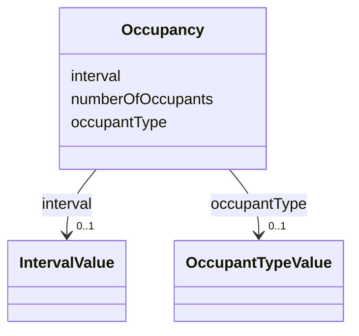

# Class: Occupancy 


_Occupancy is an application-dependent indication of what is contained by a feature._


URI: [citygml:Occupancy](https://www.ogc.org/standards/citygml/Occupancy)





<!-- no inheritance hierarchy -->

## Slots

| Name | Cardinality and Range | Description | Inheritance |
| ---  | --- | --- | --- |
| [numberOfOccupants](numberOfOccupants.md) | 1 <br/> [Integer](Integer.md) | Indicates the number of occupants contained by a feature | direct |
| [interval](interval.md) | 0..1 <br/> [IntervalValue](IntervalValue.md) | Indicates the time period the occupants are contained by a feature | direct |
| [occupantType](occupantType.md) | 0..1 <br/> [OccupantTypeValue](OccupantTypeValue.md) | Indicates the specific type of the occupants that are contained by a feature | direct |


## Usages

| used by | used in | type | used |
| ---  | --- | --- | --- |
| [AbstractConstruction](AbstractConstruction.md) | [occupancy](occupancy.md) | range | [Occupancy](Occupancy.md) |
| [OtherConstruction](OtherConstruction.md) | [occupancy](occupancy.md) | range | [Occupancy](Occupancy.md) |
| [AbstractBridge](AbstractBridge.md) | [occupancy](occupancy.md) | range | [Occupancy](Occupancy.md) |
| [Bridge](Bridge.md) | [occupancy](occupancy.md) | range | [Occupancy](Occupancy.md) |
| [BridgePart](BridgePart.md) | [occupancy](occupancy.md) | range | [Occupancy](Occupancy.md) |
| [AbstractBuilding](AbstractBuilding.md) | [occupancy](occupancy.md) | range | [Occupancy](Occupancy.md) |
| [Building](Building.md) | [occupancy](occupancy.md) | range | [Occupancy](Occupancy.md) |
| [BuildingPart](BuildingPart.md) | [occupancy](occupancy.md) | range | [Occupancy](Occupancy.md) |
| [AbstractTransportationSpace](AbstractTransportationSpace.md) | [occupancy](occupancy.md) | range | [Occupancy](Occupancy.md) |
| [Intersection](Intersection.md) | [occupancy](occupancy.md) | range | [Occupancy](Occupancy.md) |
| [Railway](Railway.md) | [occupancy](occupancy.md) | range | [Occupancy](Occupancy.md) |
| [Road](Road.md) | [occupancy](occupancy.md) | range | [Occupancy](Occupancy.md) |
| [Section](Section.md) | [occupancy](occupancy.md) | range | [Occupancy](Occupancy.md) |
| [Square](Square.md) | [occupancy](occupancy.md) | range | [Occupancy](Occupancy.md) |
| [Track](Track.md) | [occupancy](occupancy.md) | range | [Occupancy](Occupancy.md) |
| [TrafficSpace](TrafficSpace.md) | [occupancy](occupancy.md) | range | [Occupancy](Occupancy.md) |
| [Waterway](Waterway.md) | [occupancy](occupancy.md) | range | [Occupancy](Occupancy.md) |
| [AbstractTunnel](AbstractTunnel.md) | [occupancy](occupancy.md) | range | [Occupancy](Occupancy.md) |
| [Tunnel](Tunnel.md) | [occupancy](occupancy.md) | range | [Occupancy](Occupancy.md) |
| [TunnelPart](TunnelPart.md) | [occupancy](occupancy.md) | range | [Occupancy](Occupancy.md) |


## Identifier and Mapping Information


### Schema Source


* from schema: https://www.ogc.org/standards/citygml


## Mappings

| Mapping Type | Mapped Value |
| ---  | ---  |
| self | citygml:Occupancy |
| native | citygml:Occupancy |


## LinkML Source

<!-- TODO: investigate https://stackoverflow.com/questions/37606292/how-to-create-tabbed-code-blocks-in-mkdocs-or-sphinx -->

### Direct

<details>
```yaml
name: Occupancy
description: Occupancy is an application-dependent indication of what is contained
  by a feature.
from_schema: https://www.ogc.org/standards/citygml
abstract: false
attributes:
  numberOfOccupants:
    name: numberOfOccupants
    description: Indicates the number of occupants contained by a feature.
    from_schema: https://www.ogc.org/standards/citygml
    rank: 1000
    domain_of:
    - Occupancy
    range: integer
    required: true
    multivalued: false
  interval:
    name: interval
    description: Indicates the time period the occupants are contained by a feature.
    from_schema: https://www.ogc.org/standards/citygml
    rank: 1000
    domain_of:
    - Occupancy
    range: IntervalValue
    required: false
    multivalued: false
  occupantType:
    name: occupantType
    description: Indicates the specific type of the occupants that are contained by
      a feature.
    from_schema: https://www.ogc.org/standards/citygml
    rank: 1000
    domain_of:
    - Occupancy
    range: OccupantTypeValue
    required: false
    multivalued: false

```
</details>

### Induced

<details>
```yaml
name: Occupancy
description: Occupancy is an application-dependent indication of what is contained
  by a feature.
from_schema: https://www.ogc.org/standards/citygml
abstract: false
attributes:
  numberOfOccupants:
    name: numberOfOccupants
    description: Indicates the number of occupants contained by a feature.
    from_schema: https://www.ogc.org/standards/citygml
    rank: 1000
    alias: numberOfOccupants
    owner: Occupancy
    domain_of:
    - Occupancy
    range: integer
    required: true
    multivalued: false
  interval:
    name: interval
    description: Indicates the time period the occupants are contained by a feature.
    from_schema: https://www.ogc.org/standards/citygml
    rank: 1000
    alias: interval
    owner: Occupancy
    domain_of:
    - Occupancy
    range: IntervalValue
    required: false
    multivalued: false
  occupantType:
    name: occupantType
    description: Indicates the specific type of the occupants that are contained by
      a feature.
    from_schema: https://www.ogc.org/standards/citygml
    rank: 1000
    alias: occupantType
    owner: Occupancy
    domain_of:
    - Occupancy
    range: OccupantTypeValue
    required: false
    multivalued: false

```
</details>