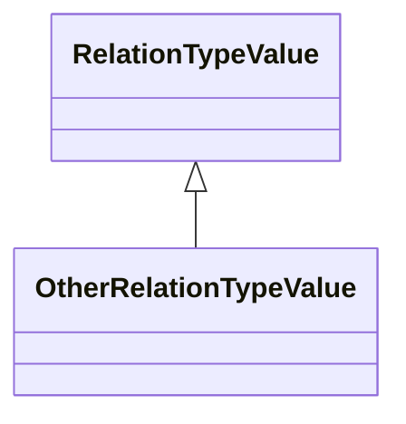

# Class: OtherRelationTypeValue 


_CityGML class from package Core_


URI: [citygml:OtherRelationTypeValue](https://www.ogc.org/standards/citygml/OtherRelationTypeValue)





## Inheritance
* [RelationTypeValue](RelationTypeValue.md)
    * **OtherRelationTypeValue**


## Slots

| Name | Cardinality and Range | Description | Inheritance |
| ---  | --- | --- | --- |


## Identifier and Mapping Information


### Schema Source


* from schema: https://www.ogc.org/standards/citygml


## Mappings

| Mapping Type | Mapped Value |
| ---  | ---  |
| self | citygml:OtherRelationTypeValue |
| native | citygml:OtherRelationTypeValue |


## LinkML Source

<!-- TODO: investigate https://stackoverflow.com/questions/37606292/how-to-create-tabbed-code-blocks-in-mkdocs-or-sphinx -->

### Direct

<details>
```yaml
name: OtherRelationTypeValue
description: CityGML class from package Core
from_schema: https://www.ogc.org/standards/citygml
is_a: RelationTypeValue
abstract: false

```
</details>

### Induced

<details>
```yaml
name: OtherRelationTypeValue
description: CityGML class from package Core
from_schema: https://www.ogc.org/standards/citygml
is_a: RelationTypeValue
abstract: false

```
</details>