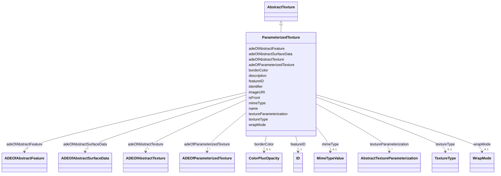

# Class: ParameterizedTexture 


_A ParameterizedTexture is a texture that uses texture coordinates or a transformation matrix for parameterization._


URI: [citygml:ParameterizedTexture](https://www.ogc.org/standards/citygml/ParameterizedTexture)





## Inheritance
* [AbstractFeature](AbstractFeature.md)
    * [AbstractSurfaceData](AbstractSurfaceData.md)
        * [AbstractTexture](AbstractTexture.md)
            * **ParameterizedTexture**


## Slots

| Name | Cardinality and Range | Description | Inheritance |
| ---  | --- | --- | --- |
| [adeOfParameterizedTexture](adeOfParameterizedTexture.md) | * <br/> [ADEOfParameterizedTexture](ADEOfParameterizedTexture.md) | Augments the ParameterizedTexture with properties defined in an ADE | direct |
| [textureParameterization](textureParameterization.md) | * <br/> [AbstractTextureParameterization](AbstractTextureParameterization.md) | Relates to the texture coordinates or transformation matrices used for parame... | direct |
| [imageURI](imageURI.md) | 1 <br/> [Uri](Uri.md) | Specifies the URI that points to the external image data file | [AbstractTexture](AbstractTexture.md) |
| [mimeType](mimeType.md) | 0..1 <br/> [MimeTypeValue](MimeTypeValue.md) | Specifies the MIME type of the external point cloud file | [AbstractTexture](AbstractTexture.md) |
| [textureType](textureType.md) | 0..1 <br/> [TextureType](TextureType.md) | Indicates the specific type of the texture | [AbstractTexture](AbstractTexture.md) |
| [wrapMode](wrapMode.md) | 0..1 <br/> [WrapMode](WrapMode.md) | Specifies the behaviour of the texture when the texture is smaller than the s... | [AbstractTexture](AbstractTexture.md) |
| [borderColor](borderColor.md) | 0..1 <br/> [ColorPlusOpacity](ColorPlusOpacity.md) | Specifies the color of that part of the surface that is not covered by the te... | [AbstractTexture](AbstractTexture.md) |
| [adeOfAbstractTexture](adeOfAbstractTexture.md) | * <br/> [ADEOfAbstractTexture](ADEOfAbstractTexture.md) | Augments AbstractTexture with properties defined in an ADE | [AbstractTexture](AbstractTexture.md) |
| [isFront](isFront.md) | 0..1 <br/> [Boolean](Boolean.md) | Indicates whether the texture or material is assigned to the front side or th... | [AbstractSurfaceData](AbstractSurfaceData.md) |
| [adeOfAbstractSurfaceData](adeOfAbstractSurfaceData.md) | * <br/> [ADEOfAbstractSurfaceData](ADEOfAbstractSurfaceData.md) | Augments AbstractSurfaceData with properties defined in an ADE | [AbstractSurfaceData](AbstractSurfaceData.md) |
| [featureID](featureID.md) | 1 <br/> [ID](ID.md) |  | [AbstractFeature](AbstractFeature.md) |
| [identifier](identifier.md) | 0..1 <br/> [String](String.md) |  | [AbstractFeature](AbstractFeature.md) |
| [name](name.md) | * <br/> [String](String.md) |  | [AbstractFeature](AbstractFeature.md) |
| [description](description.md) | 0..1 <br/> [String](String.md) |  | [AbstractFeature](AbstractFeature.md) |
| [adeOfAbstractFeature](adeOfAbstractFeature.md) | * <br/> [ADEOfAbstractFeature](ADEOfAbstractFeature.md) | Augments AbstractFeature with properties defined in an ADE | [AbstractFeature](AbstractFeature.md) |


## Identifier and Mapping Information


### Schema Source


* from schema: https://www.ogc.org/standards/citygml


## Mappings

| Mapping Type | Mapped Value |
| ---  | ---  |
| self | citygml:ParameterizedTexture |
| native | citygml:ParameterizedTexture |


## LinkML Source

<!-- TODO: investigate https://stackoverflow.com/questions/37606292/how-to-create-tabbed-code-blocks-in-mkdocs-or-sphinx -->

### Direct

<details>
```yaml
name: ParameterizedTexture
description: A ParameterizedTexture is a texture that uses texture coordinates or
  a transformation matrix for parameterization.
from_schema: https://www.ogc.org/standards/citygml
is_a: AbstractTexture
abstract: false
attributes:
  adeOfParameterizedTexture:
    name: adeOfParameterizedTexture
    description: Augments the ParameterizedTexture with properties defined in an ADE.
    from_schema: https://www.ogc.org/standards/citygml
    rank: 1000
    domain_of:
    - ParameterizedTexture
    range: ADEOfParameterizedTexture
    required: false
    multivalued: true
  textureParameterization:
    name: textureParameterization
    description: Relates to the texture coordinates or transformation matrices used
      for parameterization.
    from_schema: https://www.ogc.org/standards/citygml
    rank: 1000
    domain_of:
    - ParameterizedTexture
    range: AbstractTextureParameterization
    required: false
    multivalued: true

```
</details>

### Induced

<details>
```yaml
name: ParameterizedTexture
description: A ParameterizedTexture is a texture that uses texture coordinates or
  a transformation matrix for parameterization.
from_schema: https://www.ogc.org/standards/citygml
is_a: AbstractTexture
abstract: false
attributes:
  adeOfParameterizedTexture:
    name: adeOfParameterizedTexture
    description: Augments the ParameterizedTexture with properties defined in an ADE.
    from_schema: https://www.ogc.org/standards/citygml
    rank: 1000
    alias: adeOfParameterizedTexture
    owner: ParameterizedTexture
    domain_of:
    - ParameterizedTexture
    range: ADEOfParameterizedTexture
    required: false
    multivalued: true
  textureParameterization:
    name: textureParameterization
    description: Relates to the texture coordinates or transformation matrices used
      for parameterization.
    from_schema: https://www.ogc.org/standards/citygml
    rank: 1000
    alias: textureParameterization
    owner: ParameterizedTexture
    domain_of:
    - ParameterizedTexture
    range: AbstractTextureParameterization
    required: false
    multivalued: true
  imageURI:
    name: imageURI
    description: Specifies the URI that points to the external image data file.
    from_schema: https://www.ogc.org/standards/citygml
    rank: 1000
    alias: imageURI
    owner: ParameterizedTexture
    domain_of:
    - AbstractTexture
    range: uri
    required: true
    multivalued: false
  mimeType:
    name: mimeType
    description: Specifies the MIME type of the external point cloud file.
    from_schema: https://www.ogc.org/standards/citygml
    alias: mimeType
    owner: ParameterizedTexture
    domain_of:
    - StandardFileTimeseries
    - TabulatedFileTimeseries
    - PointCloud
    - AbstractTexture
    - ImplicitGeometry
    range: MimeTypeValue
    required: false
    multivalued: false
  textureType:
    name: textureType
    description: Indicates the specific type of the texture.
    from_schema: https://www.ogc.org/standards/citygml
    rank: 1000
    alias: textureType
    owner: ParameterizedTexture
    domain_of:
    - AbstractTexture
    range: TextureType
    required: false
    multivalued: false
  wrapMode:
    name: wrapMode
    description: Specifies the behaviour of the texture when the texture is smaller
      than the surface to which it is applied.
    from_schema: https://www.ogc.org/standards/citygml
    rank: 1000
    alias: wrapMode
    owner: ParameterizedTexture
    domain_of:
    - AbstractTexture
    range: WrapMode
    required: false
    multivalued: false
  borderColor:
    name: borderColor
    description: Specifies the color of that part of the surface that is not covered
      by the texture.
    from_schema: https://www.ogc.org/standards/citygml
    rank: 1000
    alias: borderColor
    owner: ParameterizedTexture
    domain_of:
    - AbstractTexture
    range: ColorPlusOpacity
    required: false
    multivalued: false
  adeOfAbstractTexture:
    name: adeOfAbstractTexture
    description: Augments AbstractTexture with properties defined in an ADE.
    from_schema: https://www.ogc.org/standards/citygml
    rank: 1000
    alias: adeOfAbstractTexture
    owner: ParameterizedTexture
    domain_of:
    - AbstractTexture
    range: ADEOfAbstractTexture
    required: false
    multivalued: true
  isFront:
    name: isFront
    description: Indicates whether the texture or material is assigned to the front
      side or the back side of the surface geometry object.
    from_schema: https://www.ogc.org/standards/citygml
    rank: 1000
    alias: isFront
    owner: ParameterizedTexture
    domain_of:
    - AbstractSurfaceData
    range: boolean
    required: false
    multivalued: false
  adeOfAbstractSurfaceData:
    name: adeOfAbstractSurfaceData
    description: Augments AbstractSurfaceData with properties defined in an ADE.
    from_schema: https://www.ogc.org/standards/citygml
    rank: 1000
    alias: adeOfAbstractSurfaceData
    owner: ParameterizedTexture
    domain_of:
    - AbstractSurfaceData
    range: ADEOfAbstractSurfaceData
    required: false
    multivalued: true
  featureID:
    name: featureID
    from_schema: https://www.ogc.org/standards/citygml
    rank: 1000
    alias: featureID
    owner: ParameterizedTexture
    domain_of:
    - AbstractFeature
    range: ID
    required: true
    multivalued: false
  identifier:
    name: identifier
    from_schema: https://www.ogc.org/standards/citygml
    rank: 1000
    alias: identifier
    owner: ParameterizedTexture
    domain_of:
    - AbstractFeature
    range: string
    required: false
    multivalued: false
  name:
    name: name
    from_schema: https://www.ogc.org/standards/citygml
    alias: name
    owner: ParameterizedTexture
    domain_of:
    - CodeAttribute
    - DateAttribute
    - DoubleAttribute
    - GenericAttributeSet
    - IntAttribute
    - MeasureAttribute
    - StringAttribute
    - UriAttribute
    - AbstractFeature
    range: string
    required: false
    multivalued: true
  description:
    name: description
    from_schema: https://www.ogc.org/standards/citygml
    alias: description
    owner: ParameterizedTexture
    domain_of:
    - ConstructionEvent
    - AbstractFeature
    range: string
    required: false
    multivalued: false
  adeOfAbstractFeature:
    name: adeOfAbstractFeature
    description: Augments AbstractFeature with properties defined in an ADE.
    from_schema: https://www.ogc.org/standards/citygml
    rank: 1000
    alias: adeOfAbstractFeature
    owner: ParameterizedTexture
    domain_of:
    - AbstractFeature
    range: ADEOfAbstractFeature
    required: false
    multivalued: true

```
</details>