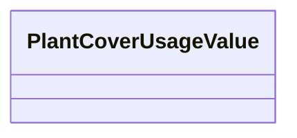

# Class: PlantCoverUsageValue 


_CityGML class from package Vegetation_


URI: [citygml:PlantCoverUsageValue](https://www.ogc.org/standards/citygml/PlantCoverUsageValue)





<!-- no inheritance hierarchy -->

## Slots

| Name | Cardinality and Range | Description | Inheritance |
| ---  | --- | --- | --- |


## Usages

| used by | used in | type | used |
| ---  | --- | --- | --- |
| [PlantCover](PlantCover.md) | [usage](usage.md) | range | [PlantCoverUsageValue](PlantCoverUsageValue.md) |


## Identifier and Mapping Information


### Schema Source


* from schema: https://www.ogc.org/standards/citygml


## Mappings

| Mapping Type | Mapped Value |
| ---  | ---  |
| self | citygml:PlantCoverUsageValue |
| native | citygml:PlantCoverUsageValue |


## LinkML Source

<!-- TODO: investigate https://stackoverflow.com/questions/37606292/how-to-create-tabbed-code-blocks-in-mkdocs-or-sphinx -->

### Direct

<details>
```yaml
name: PlantCoverUsageValue
description: CityGML class from package Vegetation
from_schema: https://www.ogc.org/standards/citygml
abstract: false

```
</details>

### Induced

<details>
```yaml
name: PlantCoverUsageValue
description: CityGML class from package Vegetation
from_schema: https://www.ogc.org/standards/citygml
abstract: false

```
</details>