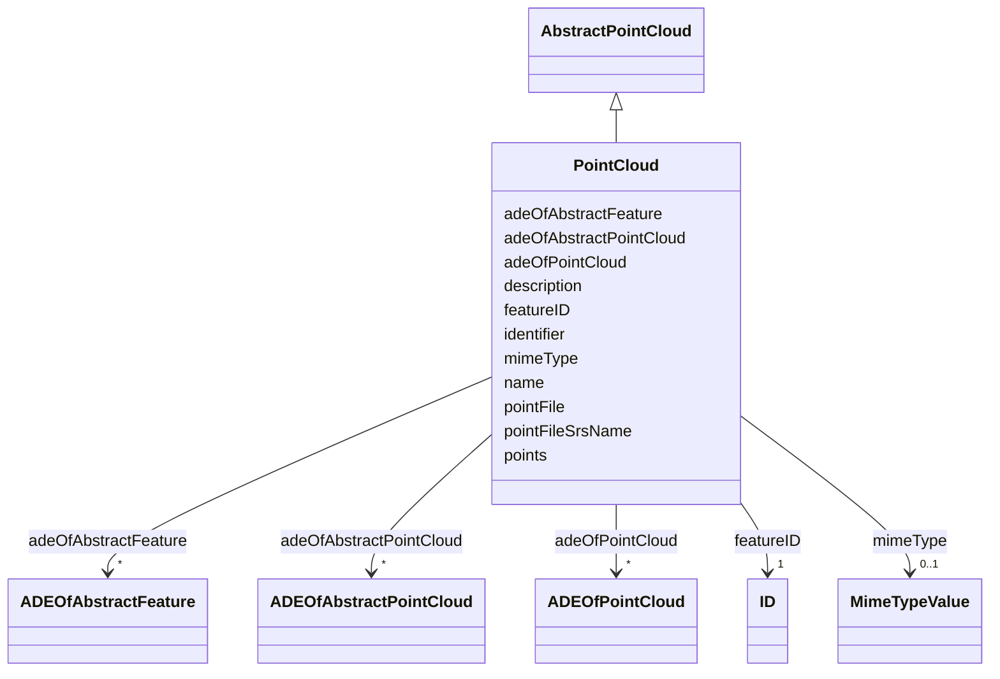

# Class: PointCloud 


_A PointCloud is an unordered collection of points that is a sampling of the geometry of a space or space boundary._


URI: [citygml:PointCloud](https://www.ogc.org/standards/citygml/PointCloud)





## Inheritance
* [AbstractFeature](AbstractFeature.md)
    * [AbstractPointCloud](AbstractPointCloud.md)
        * **PointCloud**


## Slots

| Name | Cardinality and Range | Description | Inheritance |
| ---  | --- | --- | --- |
| [mimeType](mimeType.md) | 0..1 <br/> [MimeTypeValue](MimeTypeValue.md) | Specifies the MIME type of the external point cloud file | direct |
| [pointFile](pointFile.md) | 0..1 <br/> [Uri](Uri.md) | Specifies the URI that points to the external point cloud file | direct |
| [pointFileSrsName](pointFileSrsName.md) | 0..1 <br/> [String](String.md) | Indicates the coordinate reference system used by the external point cloud fi... | direct |
| [adeOfPointCloud](adeOfPointCloud.md) | * <br/> [ADEOfPointCloud](ADEOfPointCloud.md) | Augments the PointCloud with properties defined in an ADE | direct |
| [points](points.md) | 0..1 <br/> [String](String.md) | Relates to the 3D MultiPoint geometry of the PointCloud stored inline with th... | direct |
| [adeOfAbstractPointCloud](adeOfAbstractPointCloud.md) | * <br/> [ADEOfAbstractPointCloud](ADEOfAbstractPointCloud.md) | Augments AbstractPointCloud with properties defined in an ADE | [AbstractPointCloud](AbstractPointCloud.md) |
| [featureID](featureID.md) | 1 <br/> [ID](ID.md) |  | [AbstractFeature](AbstractFeature.md) |
| [identifier](identifier.md) | 0..1 <br/> [String](String.md) |  | [AbstractFeature](AbstractFeature.md) |
| [name](name.md) | * <br/> [String](String.md) |  | [AbstractFeature](AbstractFeature.md) |
| [description](description.md) | 0..1 <br/> [String](String.md) |  | [AbstractFeature](AbstractFeature.md) |
| [adeOfAbstractFeature](adeOfAbstractFeature.md) | * <br/> [ADEOfAbstractFeature](ADEOfAbstractFeature.md) | Augments AbstractFeature with properties defined in an ADE | [AbstractFeature](AbstractFeature.md) |


## Identifier and Mapping Information


### Schema Source


* from schema: https://www.ogc.org/standards/citygml


## Mappings

| Mapping Type | Mapped Value |
| ---  | ---  |
| self | citygml:PointCloud |
| native | citygml:PointCloud |


## LinkML Source

<!-- TODO: investigate https://stackoverflow.com/questions/37606292/how-to-create-tabbed-code-blocks-in-mkdocs-or-sphinx -->

### Direct

<details>
```yaml
name: PointCloud
description: A PointCloud is an unordered collection of points that is a sampling
  of the geometry of a space or space boundary.
from_schema: https://www.ogc.org/standards/citygml
is_a: AbstractPointCloud
abstract: false
attributes:
  mimeType:
    name: mimeType
    description: Specifies the MIME type of the external point cloud file.
    from_schema: https://www.ogc.org/standards/citygml
    domain_of:
    - StandardFileTimeseries
    - TabulatedFileTimeseries
    - PointCloud
    - AbstractTexture
    - ImplicitGeometry
    range: MimeTypeValue
    required: false
    multivalued: false
  pointFile:
    name: pointFile
    description: Specifies the URI that points to the external point cloud file.
    from_schema: https://www.ogc.org/standards/citygml
    rank: 1000
    domain_of:
    - PointCloud
    range: uri
    required: false
    multivalued: false
  pointFileSrsName:
    name: pointFileSrsName
    description: Indicates the coordinate reference system used by the external point
      cloud file.
    from_schema: https://www.ogc.org/standards/citygml
    rank: 1000
    domain_of:
    - PointCloud
    range: string
    required: false
    multivalued: false
  adeOfPointCloud:
    name: adeOfPointCloud
    description: Augments the PointCloud with properties defined in an ADE.
    from_schema: https://www.ogc.org/standards/citygml
    rank: 1000
    domain_of:
    - PointCloud
    range: ADEOfPointCloud
    required: false
    multivalued: true
  points:
    name: points
    description: Relates to the 3D MultiPoint geometry of the PointCloud stored inline
      with the city model.
    from_schema: https://www.ogc.org/standards/citygml
    rank: 1000
    domain_of:
    - PointCloud
    range: string
    required: false
    multivalued: false

```
</details>

### Induced

<details>
```yaml
name: PointCloud
description: A PointCloud is an unordered collection of points that is a sampling
  of the geometry of a space or space boundary.
from_schema: https://www.ogc.org/standards/citygml
is_a: AbstractPointCloud
abstract: false
attributes:
  mimeType:
    name: mimeType
    description: Specifies the MIME type of the external point cloud file.
    from_schema: https://www.ogc.org/standards/citygml
    alias: mimeType
    owner: PointCloud
    domain_of:
    - StandardFileTimeseries
    - TabulatedFileTimeseries
    - PointCloud
    - AbstractTexture
    - ImplicitGeometry
    range: MimeTypeValue
    required: false
    multivalued: false
  pointFile:
    name: pointFile
    description: Specifies the URI that points to the external point cloud file.
    from_schema: https://www.ogc.org/standards/citygml
    rank: 1000
    alias: pointFile
    owner: PointCloud
    domain_of:
    - PointCloud
    range: uri
    required: false
    multivalued: false
  pointFileSrsName:
    name: pointFileSrsName
    description: Indicates the coordinate reference system used by the external point
      cloud file.
    from_schema: https://www.ogc.org/standards/citygml
    rank: 1000
    alias: pointFileSrsName
    owner: PointCloud
    domain_of:
    - PointCloud
    range: string
    required: false
    multivalued: false
  adeOfPointCloud:
    name: adeOfPointCloud
    description: Augments the PointCloud with properties defined in an ADE.
    from_schema: https://www.ogc.org/standards/citygml
    rank: 1000
    alias: adeOfPointCloud
    owner: PointCloud
    domain_of:
    - PointCloud
    range: ADEOfPointCloud
    required: false
    multivalued: true
  points:
    name: points
    description: Relates to the 3D MultiPoint geometry of the PointCloud stored inline
      with the city model.
    from_schema: https://www.ogc.org/standards/citygml
    rank: 1000
    alias: points
    owner: PointCloud
    domain_of:
    - PointCloud
    range: string
    required: false
    multivalued: false
  adeOfAbstractPointCloud:
    name: adeOfAbstractPointCloud
    description: Augments AbstractPointCloud with properties defined in an ADE.
    from_schema: https://www.ogc.org/standards/citygml
    rank: 1000
    alias: adeOfAbstractPointCloud
    owner: PointCloud
    domain_of:
    - AbstractPointCloud
    range: ADEOfAbstractPointCloud
    required: false
    multivalued: true
  featureID:
    name: featureID
    from_schema: https://www.ogc.org/standards/citygml
    rank: 1000
    alias: featureID
    owner: PointCloud
    domain_of:
    - AbstractFeature
    range: ID
    required: true
    multivalued: false
  identifier:
    name: identifier
    from_schema: https://www.ogc.org/standards/citygml
    rank: 1000
    alias: identifier
    owner: PointCloud
    domain_of:
    - AbstractFeature
    range: string
    required: false
    multivalued: false
  name:
    name: name
    from_schema: https://www.ogc.org/standards/citygml
    alias: name
    owner: PointCloud
    domain_of:
    - CodeAttribute
    - DateAttribute
    - DoubleAttribute
    - GenericAttributeSet
    - IntAttribute
    - MeasureAttribute
    - StringAttribute
    - UriAttribute
    - AbstractFeature
    range: string
    required: false
    multivalued: true
  description:
    name: description
    from_schema: https://www.ogc.org/standards/citygml
    alias: description
    owner: PointCloud
    domain_of:
    - ConstructionEvent
    - AbstractFeature
    range: string
    required: false
    multivalued: false
  adeOfAbstractFeature:
    name: adeOfAbstractFeature
    description: Augments AbstractFeature with properties defined in an ADE.
    from_schema: https://www.ogc.org/standards/citygml
    rank: 1000
    alias: adeOfAbstractFeature
    owner: PointCloud
    domain_of:
    - AbstractFeature
    range: ADEOfAbstractFeature
    required: false
    multivalued: true

```
</details>