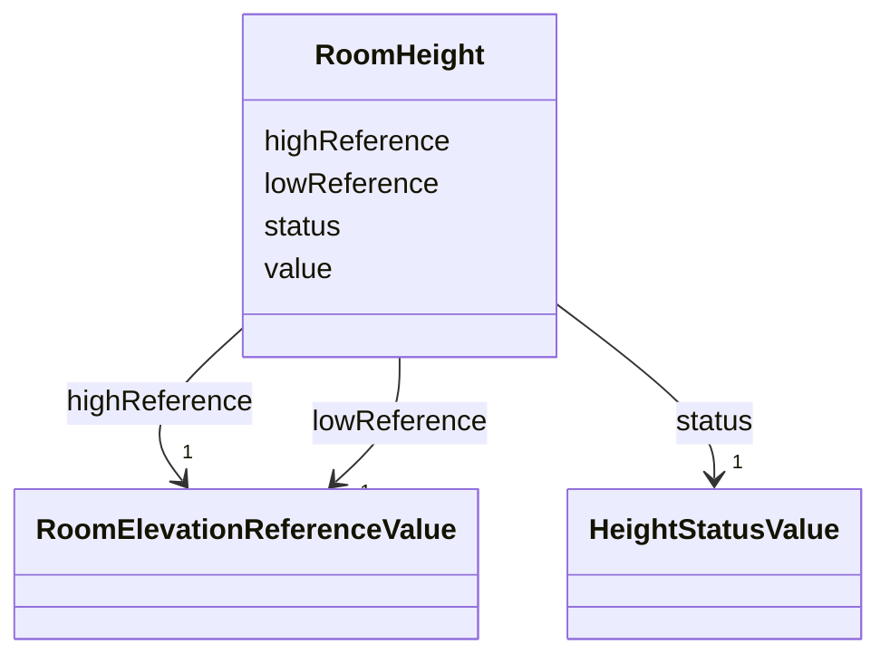

# Class: RoomHeight 


_The RoomHeight represents a vertical distance (measured or estimated) between a low reference and a high reference. [cf. INSPIRE]_


URI: [citygml:RoomHeight](https://www.ogc.org/standards/citygml/RoomHeight)





<!-- no inheritance hierarchy -->

## Slots

| Name | Cardinality and Range | Description | Inheritance |
| ---  | --- | --- | --- |
| [highReference](highReference.md) | 1 <br/> [RoomElevationReferenceValue](RoomElevationReferenceValue.md) | Indicates the high point used to calculate the value of the room height | direct |
| [lowReference](lowReference.md) | 1 <br/> [RoomElevationReferenceValue](RoomElevationReferenceValue.md) | Indicates the low point used to calculate the value of the room height | direct |
| [status](status.md) | 1 <br/> [HeightStatusValue](HeightStatusValue.md) | Indicates the way the room height has been captured | direct |
| [value](value.md) | 1 <br/> [Float](Float.md) | Specifies the value of the room height | direct |


## Usages

| used by | used in | type | used |
| ---  | --- | --- | --- |
| [BuildingRoom](BuildingRoom.md) | [roomHeight](roomHeight.md) | range | [RoomHeight](RoomHeight.md) |


## Identifier and Mapping Information


### Schema Source


* from schema: https://www.ogc.org/standards/citygml


## Mappings

| Mapping Type | Mapped Value |
| ---  | ---  |
| self | citygml:RoomHeight |
| native | citygml:RoomHeight |


## LinkML Source

<!-- TODO: investigate https://stackoverflow.com/questions/37606292/how-to-create-tabbed-code-blocks-in-mkdocs-or-sphinx -->

### Direct

<details>
```yaml
name: RoomHeight
description: The RoomHeight represents a vertical distance (measured or estimated)
  between a low reference and a high reference. [cf. INSPIRE]
from_schema: https://www.ogc.org/standards/citygml
abstract: false
attributes:
  highReference:
    name: highReference
    description: Indicates the high point used to calculate the value of the room
      height.
    from_schema: https://www.ogc.org/standards/citygml
    domain_of:
    - Height
    - RoomHeight
    range: RoomElevationReferenceValue
    required: true
    multivalued: false
  lowReference:
    name: lowReference
    description: Indicates the low point used to calculate the value of the room height.
    from_schema: https://www.ogc.org/standards/citygml
    domain_of:
    - Height
    - RoomHeight
    range: RoomElevationReferenceValue
    required: true
    multivalued: false
  status:
    name: status
    description: Indicates the way the room height has been captured.
    from_schema: https://www.ogc.org/standards/citygml
    domain_of:
    - Height
    - RoomHeight
    range: HeightStatusValue
    required: true
    multivalued: false
  value:
    name: value
    description: Specifies the value of the room height.
    from_schema: https://www.ogc.org/standards/citygml
    domain_of:
    - Height
    - RoomHeight
    - DoubleOrNilReason
    - CodeAttribute
    - DateAttribute
    - DoubleAttribute
    - IntAttribute
    - MeasureAttribute
    - StringAttribute
    - UriAttribute
    range: float
    required: true
    multivalued: false

```
</details>

### Induced

<details>
```yaml
name: RoomHeight
description: The RoomHeight represents a vertical distance (measured or estimated)
  between a low reference and a high reference. [cf. INSPIRE]
from_schema: https://www.ogc.org/standards/citygml
abstract: false
attributes:
  highReference:
    name: highReference
    description: Indicates the high point used to calculate the value of the room
      height.
    from_schema: https://www.ogc.org/standards/citygml
    alias: highReference
    owner: RoomHeight
    domain_of:
    - Height
    - RoomHeight
    range: RoomElevationReferenceValue
    required: true
    multivalued: false
  lowReference:
    name: lowReference
    description: Indicates the low point used to calculate the value of the room height.
    from_schema: https://www.ogc.org/standards/citygml
    alias: lowReference
    owner: RoomHeight
    domain_of:
    - Height
    - RoomHeight
    range: RoomElevationReferenceValue
    required: true
    multivalued: false
  status:
    name: status
    description: Indicates the way the room height has been captured.
    from_schema: https://www.ogc.org/standards/citygml
    alias: status
    owner: RoomHeight
    domain_of:
    - Height
    - RoomHeight
    range: HeightStatusValue
    required: true
    multivalued: false
  value:
    name: value
    description: Specifies the value of the room height.
    from_schema: https://www.ogc.org/standards/citygml
    alias: value
    owner: RoomHeight
    domain_of:
    - Height
    - RoomHeight
    - DoubleOrNilReason
    - CodeAttribute
    - DateAttribute
    - DoubleAttribute
    - IntAttribute
    - MeasureAttribute
    - StringAttribute
    - UriAttribute
    range: float
    required: true
    multivalued: false

```
</details>