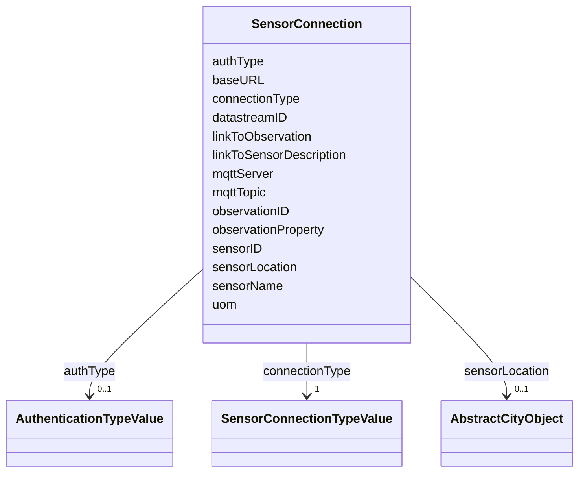

# Class: SensorConnection 


_A SensorConnection provides all details that are required to retrieve a specific datastream from an external sensor web service. This data type comprises the service type (e.g., OGC SensorThings API, OGC Sensor Observation Services, MQTT, proprietary platforms), the URL of the sensor service, the identifier for the sensor or thing, and its observed property as well as information about the required authentication method._


URI: [citygml:SensorConnection](https://www.ogc.org/standards/citygml/SensorConnection)





<!-- no inheritance hierarchy -->

## Slots

| Name | Cardinality and Range | Description | Inheritance |
| ---  | --- | --- | --- |
| [connectionType](connectionType.md) | 1 <br/> [SensorConnectionTypeValue](SensorConnectionTypeValue.md) | Indicates the type of Sensor API to which the SensorConnection refers | direct |
| [observationProperty](observationProperty.md) | 1 <br/> [String](String.md) | Specifies the phenomenon for which the SensorConnection provides observations | direct |
| [uom](uom.md) | 0..1 <br/> [String](String.md) | Specifies the unit of measurement of the observations | direct |
| [sensorID](sensorID.md) | 0..1 <br/> [String](String.md) | Specifies the unique identifier of the sensor from which the SensorConnection... | direct |
| [sensorName](sensorName.md) | 0..1 <br/> [String](String.md) | Specifies the name of the sensor from which the SensorConnection retrieves ob... | direct |
| [observationID](observationID.md) | 0..1 <br/> [String](String.md) | Specifies the unique identifier of the observation that is retrieved by the S... | direct |
| [datastreamID](datastreamID.md) | 0..1 <br/> [String](String.md) | Specifies the datastream that is retrieved by the SensorConnection | direct |
| [baseURL](baseURL.md) | 0..1 <br/> [Uri](Uri.md) | Specifies the base URL of the Sensor API request | direct |
| [authType](authType.md) | 0..1 <br/> [AuthenticationTypeValue](AuthenticationTypeValue.md) | Specifies the type of authentication required to be able to access the Sensor... | direct |
| [mqttServer](mqttServer.md) | 0..1 <br/> [String](String.md) | Specifies the name of the MQTT Server | direct |
| [mqttTopic](mqttTopic.md) | 0..1 <br/> [String](String.md) | Names the specific datastream that is retrieved by the SensorConnection | direct |
| [linkToObservation](linkToObservation.md) | 0..1 <br/> [String](String.md) | Specifies the complete URL to the observation request | direct |
| [linkToSensorDescription](linkToSensorDescription.md) | 0..1 <br/> [String](String.md) | Specifies the complete URL to the sensor description request | direct |
| [sensorLocation](sensorLocation.md) | 0..1 <br/> [AbstractCityObject](AbstractCityObject.md) | Relates the sensor to the city object where it is located | direct |


## Usages

| used by | used in | type | used |
| ---  | --- | --- | --- |
| [Dynamizer](Dynamizer.md) | [sensorConnection](sensorConnection.md) | range | [SensorConnection](SensorConnection.md) |


## Identifier and Mapping Information


### Schema Source


* from schema: https://www.ogc.org/standards/citygml


## Mappings

| Mapping Type | Mapped Value |
| ---  | ---  |
| self | citygml:SensorConnection |
| native | citygml:SensorConnection |


## LinkML Source

<!-- TODO: investigate https://stackoverflow.com/questions/37606292/how-to-create-tabbed-code-blocks-in-mkdocs-or-sphinx -->

### Direct

<details>
```yaml
name: SensorConnection
description: A SensorConnection provides all details that are required to retrieve
  a specific datastream from an external sensor web service. This data type comprises
  the service type (e.g., OGC SensorThings API, OGC Sensor Observation Services, MQTT,
  proprietary platforms), the URL of the sensor service, the identifier for the sensor
  or thing, and its observed property as well as information about the required authentication
  method.
from_schema: https://www.ogc.org/standards/citygml
abstract: false
attributes:
  connectionType:
    name: connectionType
    description: Indicates the type of Sensor API to which the SensorConnection refers.
    from_schema: https://www.ogc.org/standards/citygml
    rank: 1000
    domain_of:
    - SensorConnection
    range: SensorConnectionTypeValue
    required: true
    multivalued: false
  observationProperty:
    name: observationProperty
    description: Specifies the phenomenon for which the SensorConnection provides
      observations.
    from_schema: https://www.ogc.org/standards/citygml
    rank: 1000
    domain_of:
    - SensorConnection
    - AbstractAtomicTimeseries
    range: string
    required: true
    multivalued: false
  uom:
    name: uom
    description: Specifies the unit of measurement of the observations.
    from_schema: https://www.ogc.org/standards/citygml
    rank: 1000
    domain_of:
    - SensorConnection
    - AbstractAtomicTimeseries
    - MeasureOrNilReasonList
    range: string
    required: false
    multivalued: false
  sensorID:
    name: sensorID
    description: Specifies the unique identifier of the sensor from which the SensorConnection
      retrieves observations.
    from_schema: https://www.ogc.org/standards/citygml
    rank: 1000
    domain_of:
    - SensorConnection
    range: string
    required: false
    multivalued: false
  sensorName:
    name: sensorName
    description: Specifies the name of the sensor from which the SensorConnection
      retrieves observations.
    from_schema: https://www.ogc.org/standards/citygml
    rank: 1000
    domain_of:
    - SensorConnection
    range: string
    required: false
    multivalued: false
  observationID:
    name: observationID
    description: Specifies the unique identifier of the observation that is retrieved
      by the SensorConnection.
    from_schema: https://www.ogc.org/standards/citygml
    rank: 1000
    domain_of:
    - SensorConnection
    range: string
    required: false
    multivalued: false
  datastreamID:
    name: datastreamID
    description: Specifies the datastream that is retrieved by the SensorConnection.
    from_schema: https://www.ogc.org/standards/citygml
    rank: 1000
    domain_of:
    - SensorConnection
    range: string
    required: false
    multivalued: false
  baseURL:
    name: baseURL
    description: Specifies the base URL of the Sensor API request.
    from_schema: https://www.ogc.org/standards/citygml
    rank: 1000
    domain_of:
    - SensorConnection
    range: uri
    required: false
    multivalued: false
  authType:
    name: authType
    description: Specifies the type of authentication required to be able to access
      the Sensor API.
    from_schema: https://www.ogc.org/standards/citygml
    rank: 1000
    domain_of:
    - SensorConnection
    range: AuthenticationTypeValue
    required: false
    multivalued: false
  mqttServer:
    name: mqttServer
    description: Specifies the name of the MQTT Server. This attribute is relevant
      when the MQTT Protocol is used to connect to a Sensor API.
    from_schema: https://www.ogc.org/standards/citygml
    rank: 1000
    domain_of:
    - SensorConnection
    range: string
    required: false
    multivalued: false
  mqttTopic:
    name: mqttTopic
    description: Names the specific datastream that is retrieved by the SensorConnection.
      This attribute is relevant when the MQTT Protocol is used to connect to a Sensor
      API.
    from_schema: https://www.ogc.org/standards/citygml
    rank: 1000
    domain_of:
    - SensorConnection
    range: string
    required: false
    multivalued: false
  linkToObservation:
    name: linkToObservation
    description: Specifies the complete URL to the observation request.
    from_schema: https://www.ogc.org/standards/citygml
    rank: 1000
    domain_of:
    - SensorConnection
    range: string
    required: false
    multivalued: false
  linkToSensorDescription:
    name: linkToSensorDescription
    description: Specifies the complete URL to the sensor description request.
    from_schema: https://www.ogc.org/standards/citygml
    rank: 1000
    domain_of:
    - SensorConnection
    range: string
    required: false
    multivalued: false
  sensorLocation:
    name: sensorLocation
    description: Relates the sensor to the city object where it is located.
    from_schema: https://www.ogc.org/standards/citygml
    rank: 1000
    domain_of:
    - SensorConnection
    range: AbstractCityObject
    required: false
    multivalued: false

```
</details>

### Induced

<details>
```yaml
name: SensorConnection
description: A SensorConnection provides all details that are required to retrieve
  a specific datastream from an external sensor web service. This data type comprises
  the service type (e.g., OGC SensorThings API, OGC Sensor Observation Services, MQTT,
  proprietary platforms), the URL of the sensor service, the identifier for the sensor
  or thing, and its observed property as well as information about the required authentication
  method.
from_schema: https://www.ogc.org/standards/citygml
abstract: false
attributes:
  connectionType:
    name: connectionType
    description: Indicates the type of Sensor API to which the SensorConnection refers.
    from_schema: https://www.ogc.org/standards/citygml
    rank: 1000
    alias: connectionType
    owner: SensorConnection
    domain_of:
    - SensorConnection
    range: SensorConnectionTypeValue
    required: true
    multivalued: false
  observationProperty:
    name: observationProperty
    description: Specifies the phenomenon for which the SensorConnection provides
      observations.
    from_schema: https://www.ogc.org/standards/citygml
    rank: 1000
    alias: observationProperty
    owner: SensorConnection
    domain_of:
    - SensorConnection
    - AbstractAtomicTimeseries
    range: string
    required: true
    multivalued: false
  uom:
    name: uom
    description: Specifies the unit of measurement of the observations.
    from_schema: https://www.ogc.org/standards/citygml
    rank: 1000
    alias: uom
    owner: SensorConnection
    domain_of:
    - SensorConnection
    - AbstractAtomicTimeseries
    - MeasureOrNilReasonList
    range: string
    required: false
    multivalued: false
  sensorID:
    name: sensorID
    description: Specifies the unique identifier of the sensor from which the SensorConnection
      retrieves observations.
    from_schema: https://www.ogc.org/standards/citygml
    rank: 1000
    alias: sensorID
    owner: SensorConnection
    domain_of:
    - SensorConnection
    range: string
    required: false
    multivalued: false
  sensorName:
    name: sensorName
    description: Specifies the name of the sensor from which the SensorConnection
      retrieves observations.
    from_schema: https://www.ogc.org/standards/citygml
    rank: 1000
    alias: sensorName
    owner: SensorConnection
    domain_of:
    - SensorConnection
    range: string
    required: false
    multivalued: false
  observationID:
    name: observationID
    description: Specifies the unique identifier of the observation that is retrieved
      by the SensorConnection.
    from_schema: https://www.ogc.org/standards/citygml
    rank: 1000
    alias: observationID
    owner: SensorConnection
    domain_of:
    - SensorConnection
    range: string
    required: false
    multivalued: false
  datastreamID:
    name: datastreamID
    description: Specifies the datastream that is retrieved by the SensorConnection.
    from_schema: https://www.ogc.org/standards/citygml
    rank: 1000
    alias: datastreamID
    owner: SensorConnection
    domain_of:
    - SensorConnection
    range: string
    required: false
    multivalued: false
  baseURL:
    name: baseURL
    description: Specifies the base URL of the Sensor API request.
    from_schema: https://www.ogc.org/standards/citygml
    rank: 1000
    alias: baseURL
    owner: SensorConnection
    domain_of:
    - SensorConnection
    range: uri
    required: false
    multivalued: false
  authType:
    name: authType
    description: Specifies the type of authentication required to be able to access
      the Sensor API.
    from_schema: https://www.ogc.org/standards/citygml
    rank: 1000
    alias: authType
    owner: SensorConnection
    domain_of:
    - SensorConnection
    range: AuthenticationTypeValue
    required: false
    multivalued: false
  mqttServer:
    name: mqttServer
    description: Specifies the name of the MQTT Server. This attribute is relevant
      when the MQTT Protocol is used to connect to a Sensor API.
    from_schema: https://www.ogc.org/standards/citygml
    rank: 1000
    alias: mqttServer
    owner: SensorConnection
    domain_of:
    - SensorConnection
    range: string
    required: false
    multivalued: false
  mqttTopic:
    name: mqttTopic
    description: Names the specific datastream that is retrieved by the SensorConnection.
      This attribute is relevant when the MQTT Protocol is used to connect to a Sensor
      API.
    from_schema: https://www.ogc.org/standards/citygml
    rank: 1000
    alias: mqttTopic
    owner: SensorConnection
    domain_of:
    - SensorConnection
    range: string
    required: false
    multivalued: false
  linkToObservation:
    name: linkToObservation
    description: Specifies the complete URL to the observation request.
    from_schema: https://www.ogc.org/standards/citygml
    rank: 1000
    alias: linkToObservation
    owner: SensorConnection
    domain_of:
    - SensorConnection
    range: string
    required: false
    multivalued: false
  linkToSensorDescription:
    name: linkToSensorDescription
    description: Specifies the complete URL to the sensor description request.
    from_schema: https://www.ogc.org/standards/citygml
    rank: 1000
    alias: linkToSensorDescription
    owner: SensorConnection
    domain_of:
    - SensorConnection
    range: string
    required: false
    multivalued: false
  sensorLocation:
    name: sensorLocation
    description: Relates the sensor to the city object where it is located.
    from_schema: https://www.ogc.org/standards/citygml
    rank: 1000
    alias: sensorLocation
    owner: SensorConnection
    domain_of:
    - SensorConnection
    range: AbstractCityObject
    required: false
    multivalued: false

```
</details>