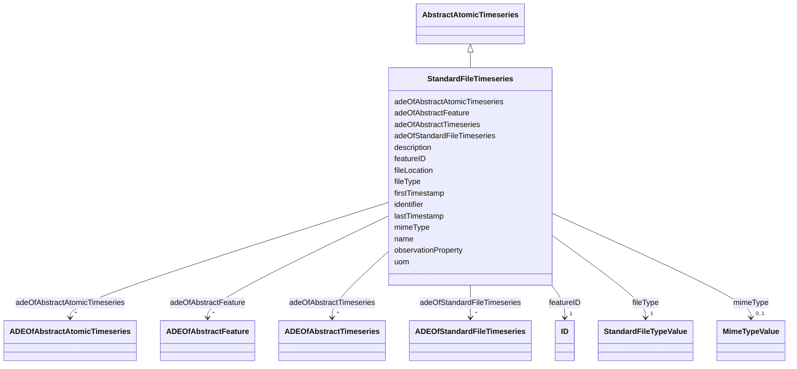

# Class: StandardFileTimeseries 


_A StandardFileTimeseries represents time-varying data for a single contiguous time interval. The data is provided in an external file referenced in the StandardFileTimeseries. The data within the external file is encoded according to a dedicated format for the representation of timeseries data such as using the OGC TimeseriesML or OGC Observations & Measurements Standard. The data type of the data has to be specified within the external file._


URI: [citygml:StandardFileTimeseries](https://www.ogc.org/standards/citygml/StandardFileTimeseries)





## Inheritance
* [AbstractFeature](AbstractFeature.md)
    * [AbstractTimeseries](AbstractTimeseries.md)
        * [AbstractAtomicTimeseries](AbstractAtomicTimeseries.md)
            * **StandardFileTimeseries**


## Slots

| Name | Cardinality and Range | Description | Inheritance |
| ---  | --- | --- | --- |
| [fileLocation](fileLocation.md) | 1 <br/> [Uri](Uri.md) | Specifies the URI that points to the external timeseries file | direct |
| [fileType](fileType.md) | 1 <br/> [StandardFileTypeValue](StandardFileTypeValue.md) | Specifies the format used to represent the timeseries data | direct |
| [mimeType](mimeType.md) | 0..1 <br/> [MimeTypeValue](MimeTypeValue.md) | Specifies the MIME type of the external timeseries file | direct |
| [adeOfStandardFileTimeseries](adeOfStandardFileTimeseries.md) | * <br/> [ADEOfStandardFileTimeseries](ADEOfStandardFileTimeseries.md) | Augments the StandardFileTimeseries with properties defined in an ADE | direct |
| [observationProperty](observationProperty.md) | 1 <br/> [String](String.md) | Specifies the phenomenon for which the atomic timeseries provides observation... | [AbstractAtomicTimeseries](AbstractAtomicTimeseries.md) |
| [uom](uom.md) | 0..1 <br/> [String](String.md) | Specifies the unit of measurement of the observation values | [AbstractAtomicTimeseries](AbstractAtomicTimeseries.md) |
| [adeOfAbstractAtomicTimeseries](adeOfAbstractAtomicTimeseries.md) | * <br/> [ADEOfAbstractAtomicTimeseries](ADEOfAbstractAtomicTimeseries.md) | Augments AbstractAtomicTimeseries with properties defined in an ADE | [AbstractAtomicTimeseries](AbstractAtomicTimeseries.md) |
| [firstTimestamp](firstTimestamp.md) | 0..1 <br/> [String](String.md) | Specifies the beginning of the timeseries | [AbstractTimeseries](AbstractTimeseries.md) |
| [lastTimestamp](lastTimestamp.md) | 0..1 <br/> [String](String.md) | Specifies the end of the timeseries | [AbstractTimeseries](AbstractTimeseries.md) |
| [adeOfAbstractTimeseries](adeOfAbstractTimeseries.md) | * <br/> [ADEOfAbstractTimeseries](ADEOfAbstractTimeseries.md) | Augments AbstractTimeseries with properties defined in an ADE | [AbstractTimeseries](AbstractTimeseries.md) |
| [featureID](featureID.md) | 1 <br/> [ID](ID.md) |  | [AbstractFeature](AbstractFeature.md) |
| [identifier](identifier.md) | 0..1 <br/> [String](String.md) |  | [AbstractFeature](AbstractFeature.md) |
| [name](name.md) | * <br/> [String](String.md) |  | [AbstractFeature](AbstractFeature.md) |
| [description](description.md) | 0..1 <br/> [String](String.md) |  | [AbstractFeature](AbstractFeature.md) |
| [adeOfAbstractFeature](adeOfAbstractFeature.md) | * <br/> [ADEOfAbstractFeature](ADEOfAbstractFeature.md) | Augments AbstractFeature with properties defined in an ADE | [AbstractFeature](AbstractFeature.md) |


## Identifier and Mapping Information


### Schema Source


* from schema: https://www.ogc.org/standards/citygml


## Mappings

| Mapping Type | Mapped Value |
| ---  | ---  |
| self | citygml:StandardFileTimeseries |
| native | citygml:StandardFileTimeseries |


## LinkML Source

<!-- TODO: investigate https://stackoverflow.com/questions/37606292/how-to-create-tabbed-code-blocks-in-mkdocs-or-sphinx -->

### Direct

<details>
```yaml
name: StandardFileTimeseries
description: A StandardFileTimeseries represents time-varying data for a single contiguous
  time interval. The data is provided in an external file referenced in the StandardFileTimeseries.
  The data within the external file is encoded according to a dedicated format for
  the representation of timeseries data such as using the OGC TimeseriesML or OGC
  Observations & Measurements Standard. The data type of the data has to be specified
  within the external file.
from_schema: https://www.ogc.org/standards/citygml
is_a: AbstractAtomicTimeseries
abstract: false
attributes:
  fileLocation:
    name: fileLocation
    description: Specifies the URI that points to the external timeseries file.
    from_schema: https://www.ogc.org/standards/citygml
    rank: 1000
    domain_of:
    - StandardFileTimeseries
    - TabulatedFileTimeseries
    range: uri
    required: true
    multivalued: false
  fileType:
    name: fileType
    description: Specifies the format used to represent the timeseries data.
    from_schema: https://www.ogc.org/standards/citygml
    rank: 1000
    domain_of:
    - StandardFileTimeseries
    - TabulatedFileTimeseries
    range: StandardFileTypeValue
    required: true
    multivalued: false
  mimeType:
    name: mimeType
    description: Specifies the MIME type of the external timeseries file.
    from_schema: https://www.ogc.org/standards/citygml
    rank: 1000
    domain_of:
    - StandardFileTimeseries
    - TabulatedFileTimeseries
    - PointCloud
    - AbstractTexture
    - ImplicitGeometry
    range: MimeTypeValue
    required: false
    multivalued: false
  adeOfStandardFileTimeseries:
    name: adeOfStandardFileTimeseries
    description: Augments the StandardFileTimeseries with properties defined in an
      ADE.
    from_schema: https://www.ogc.org/standards/citygml
    rank: 1000
    domain_of:
    - StandardFileTimeseries
    range: ADEOfStandardFileTimeseries
    required: false
    multivalued: true

```
</details>

### Induced

<details>
```yaml
name: StandardFileTimeseries
description: A StandardFileTimeseries represents time-varying data for a single contiguous
  time interval. The data is provided in an external file referenced in the StandardFileTimeseries.
  The data within the external file is encoded according to a dedicated format for
  the representation of timeseries data such as using the OGC TimeseriesML or OGC
  Observations & Measurements Standard. The data type of the data has to be specified
  within the external file.
from_schema: https://www.ogc.org/standards/citygml
is_a: AbstractAtomicTimeseries
abstract: false
attributes:
  fileLocation:
    name: fileLocation
    description: Specifies the URI that points to the external timeseries file.
    from_schema: https://www.ogc.org/standards/citygml
    rank: 1000
    alias: fileLocation
    owner: StandardFileTimeseries
    domain_of:
    - StandardFileTimeseries
    - TabulatedFileTimeseries
    range: uri
    required: true
    multivalued: false
  fileType:
    name: fileType
    description: Specifies the format used to represent the timeseries data.
    from_schema: https://www.ogc.org/standards/citygml
    rank: 1000
    alias: fileType
    owner: StandardFileTimeseries
    domain_of:
    - StandardFileTimeseries
    - TabulatedFileTimeseries
    range: StandardFileTypeValue
    required: true
    multivalued: false
  mimeType:
    name: mimeType
    description: Specifies the MIME type of the external timeseries file.
    from_schema: https://www.ogc.org/standards/citygml
    rank: 1000
    alias: mimeType
    owner: StandardFileTimeseries
    domain_of:
    - StandardFileTimeseries
    - TabulatedFileTimeseries
    - PointCloud
    - AbstractTexture
    - ImplicitGeometry
    range: MimeTypeValue
    required: false
    multivalued: false
  adeOfStandardFileTimeseries:
    name: adeOfStandardFileTimeseries
    description: Augments the StandardFileTimeseries with properties defined in an
      ADE.
    from_schema: https://www.ogc.org/standards/citygml
    rank: 1000
    alias: adeOfStandardFileTimeseries
    owner: StandardFileTimeseries
    domain_of:
    - StandardFileTimeseries
    range: ADEOfStandardFileTimeseries
    required: false
    multivalued: true
  observationProperty:
    name: observationProperty
    description: Specifies the phenomenon for which the atomic timeseries provides
      observation values.
    from_schema: https://www.ogc.org/standards/citygml
    alias: observationProperty
    owner: StandardFileTimeseries
    domain_of:
    - SensorConnection
    - AbstractAtomicTimeseries
    range: string
    required: true
    multivalued: false
  uom:
    name: uom
    description: Specifies the unit of measurement of the observation values.
    from_schema: https://www.ogc.org/standards/citygml
    alias: uom
    owner: StandardFileTimeseries
    domain_of:
    - SensorConnection
    - AbstractAtomicTimeseries
    - MeasureOrNilReasonList
    range: string
    required: false
    multivalued: false
  adeOfAbstractAtomicTimeseries:
    name: adeOfAbstractAtomicTimeseries
    description: Augments AbstractAtomicTimeseries with properties defined in an ADE.
    from_schema: https://www.ogc.org/standards/citygml
    rank: 1000
    alias: adeOfAbstractAtomicTimeseries
    owner: StandardFileTimeseries
    domain_of:
    - AbstractAtomicTimeseries
    range: ADEOfAbstractAtomicTimeseries
    required: false
    multivalued: true
  firstTimestamp:
    name: firstTimestamp
    description: Specifies the beginning of the timeseries.
    from_schema: https://www.ogc.org/standards/citygml
    rank: 1000
    alias: firstTimestamp
    owner: StandardFileTimeseries
    domain_of:
    - AbstractTimeseries
    range: string
    required: false
    multivalued: false
  lastTimestamp:
    name: lastTimestamp
    description: Specifies the end of the timeseries.
    from_schema: https://www.ogc.org/standards/citygml
    rank: 1000
    alias: lastTimestamp
    owner: StandardFileTimeseries
    domain_of:
    - AbstractTimeseries
    range: string
    required: false
    multivalued: false
  adeOfAbstractTimeseries:
    name: adeOfAbstractTimeseries
    description: Augments AbstractTimeseries with properties defined in an ADE.
    from_schema: https://www.ogc.org/standards/citygml
    rank: 1000
    alias: adeOfAbstractTimeseries
    owner: StandardFileTimeseries
    domain_of:
    - AbstractTimeseries
    range: ADEOfAbstractTimeseries
    required: false
    multivalued: true
  featureID:
    name: featureID
    from_schema: https://www.ogc.org/standards/citygml
    rank: 1000
    alias: featureID
    owner: StandardFileTimeseries
    domain_of:
    - AbstractFeature
    range: ID
    required: true
    multivalued: false
  identifier:
    name: identifier
    from_schema: https://www.ogc.org/standards/citygml
    rank: 1000
    alias: identifier
    owner: StandardFileTimeseries
    domain_of:
    - AbstractFeature
    range: string
    required: false
    multivalued: false
  name:
    name: name
    from_schema: https://www.ogc.org/standards/citygml
    alias: name
    owner: StandardFileTimeseries
    domain_of:
    - CodeAttribute
    - DateAttribute
    - DoubleAttribute
    - GenericAttributeSet
    - IntAttribute
    - MeasureAttribute
    - StringAttribute
    - UriAttribute
    - AbstractFeature
    range: string
    required: false
    multivalued: true
  description:
    name: description
    from_schema: https://www.ogc.org/standards/citygml
    alias: description
    owner: StandardFileTimeseries
    domain_of:
    - ConstructionEvent
    - AbstractFeature
    range: string
    required: false
    multivalued: false
  adeOfAbstractFeature:
    name: adeOfAbstractFeature
    description: Augments AbstractFeature with properties defined in an ADE.
    from_schema: https://www.ogc.org/standards/citygml
    rank: 1000
    alias: adeOfAbstractFeature
    owner: StandardFileTimeseries
    domain_of:
    - AbstractFeature
    range: ADEOfAbstractFeature
    required: false
    multivalued: true

```
</details>