# Class: Storey 


_A Storey is typically a horizontal section of a Building. Storeys are not always defined according to the building structure, but can also be defined according to logical considerations._


URI: [citygml:Storey](https://www.ogc.org/standards/citygml/Storey)

```mermaid
 classDiagram
    class Storey
    click Storey href "../Storey/"
      AbstractBuildingSubdivision <|-- Storey
        click AbstractBuildingSubdivision href "../AbstractBuildingSubdivision/"
      
      Storey : adeOfAbstractBuildingSubdivision
        
          
    
        
        
        Storey --> "*" ADEOfAbstractBuildingSubdivision : adeOfAbstractBuildingSubdivision
        click ADEOfAbstractBuildingSubdivision href "../ADEOfAbstractBuildingSubdivision/"
    

        
      Storey : adeOfAbstractCityObject
        
          
    
        
        
        Storey --> "*" ADEOfAbstractCityObject : adeOfAbstractCityObject
        click ADEOfAbstractCityObject href "../ADEOfAbstractCityObject/"
    

        
      Storey : adeOfAbstractFeature
        
          
    
        
        
        Storey --> "*" ADEOfAbstractFeature : adeOfAbstractFeature
        click ADEOfAbstractFeature href "../ADEOfAbstractFeature/"
    

        
      Storey : adeOfAbstractFeatureWithLifespan
        
          
    
        
        
        Storey --> "*" ADEOfAbstractFeatureWithLifespan : adeOfAbstractFeatureWithLifespan
        click ADEOfAbstractFeatureWithLifespan href "../ADEOfAbstractFeatureWithLifespan/"
    

        
      Storey : adeOfAbstractLogicalSpace
        
          
    
        
        
        Storey --> "*" ADEOfAbstractLogicalSpace : adeOfAbstractLogicalSpace
        click ADEOfAbstractLogicalSpace href "../ADEOfAbstractLogicalSpace/"
    

        
      Storey : adeOfAbstractSpace
        
          
    
        
        
        Storey --> "*" ADEOfAbstractSpace : adeOfAbstractSpace
        click ADEOfAbstractSpace href "../ADEOfAbstractSpace/"
    

        
      Storey : adeOfStorey
        
          
    
        
        
        Storey --> "*" ADEOfStorey : adeOfStorey
        click ADEOfStorey href "../ADEOfStorey/"
    

        
      Storey : appearance
        
          
    
        
        
        Storey --> "*" AbstractAppearance : appearance
        click AbstractAppearance href "../AbstractAppearance/"
    

        
      Storey : area
        
          
    
        
        
        Storey --> "*" QualifiedArea : area
        click QualifiedArea href "../QualifiedArea/"
    

        
      Storey : boundary
        
          
    
        
        
        Storey --> "*" AbstractThematicSurface : boundary
        click AbstractThematicSurface href "../AbstractThematicSurface/"
    

        
      Storey : buildingConstructiveElement
        
          
    
        
        
        Storey --> "*" BuildingConstructiveElement : buildingConstructiveElement
        click BuildingConstructiveElement href "../BuildingConstructiveElement/"
    

        
      Storey : buildingFurniture
        
          
    
        
        
        Storey --> "*" BuildingFurniture : buildingFurniture
        click BuildingFurniture href "../BuildingFurniture/"
    

        
      Storey : buildingInstallation
        
          
    
        
        
        Storey --> "*" BuildingInstallation : buildingInstallation
        click BuildingInstallation href "../BuildingInstallation/"
    

        
      Storey : buildingRoom
        
          
    
        
        
        Storey --> "*" BuildingRoom : buildingRoom
        click BuildingRoom href "../BuildingRoom/"
    

        
      Storey : buildingUnit
        
          
    
        
        
        Storey --> "*" BuildingUnit : buildingUnit
        click BuildingUnit href "../BuildingUnit/"
    

        
      Storey : class
        
          
    
        
        
        Storey --> "0..1" BuildingSubdivisionClassValue : class
        click BuildingSubdivisionClassValue href "../BuildingSubdivisionClassValue/"
    

        
      Storey : creationDate
        
      Storey : description
        
      Storey : dynamizer
        
          
    
        
        
        Storey --> "*" AbstractDynamizer : dynamizer
        click AbstractDynamizer href "../AbstractDynamizer/"
    

        
      Storey : elevation
        
          
    
        
        
        Storey --> "*" Elevation : elevation
        click Elevation href "../Elevation/"
    

        
      Storey : externalReference
        
          
    
        
        
        Storey --> "*" ExternalReference : externalReference
        click ExternalReference href "../ExternalReference/"
    

        
      Storey : featureID
        
          
    
        
        
        Storey --> "1" ID : featureID
        click ID href "../ID/"
    

        
      Storey : function
        
          
    
        
        
        Storey --> "*" BuildingSubdivisionFunctionValue : function
        click BuildingSubdivisionFunctionValue href "../BuildingSubdivisionFunctionValue/"
    

        
      Storey : generalizesTo
        
          
    
        
        
        Storey --> "*" AbstractCityObject : generalizesTo
        click AbstractCityObject href "../AbstractCityObject/"
    

        
      Storey : genericAttribute
        
          
    
        
        
        Storey --> "*" AbstractGenericAttribute : genericAttribute
        click AbstractGenericAttribute href "../AbstractGenericAttribute/"
    

        
      Storey : identifier
        
      Storey : lod0MultiCurve
        
      Storey : lod0MultiSurface
        
      Storey : lod0Point
        
      Storey : lod1Solid
        
      Storey : lod2MultiCurve
        
      Storey : lod2MultiSurface
        
      Storey : lod2Solid
        
      Storey : lod3MultiCurve
        
      Storey : lod3MultiSurface
        
      Storey : lod3Solid
        
      Storey : name
        
      Storey : relatedTo
        
          
    
        
        
        Storey --> "*" AbstractCityObject : relatedTo
        click AbstractCityObject href "../AbstractCityObject/"
    

        
      Storey : relativeToTerrain
        
          
    
        
        
        Storey --> "0..1" RelativeToTerrain : relativeToTerrain
        click RelativeToTerrain href "../RelativeToTerrain/"
    

        
      Storey : relativeToWater
        
          
    
        
        
        Storey --> "0..1" RelativeToWater : relativeToWater
        click RelativeToWater href "../RelativeToWater/"
    

        
      Storey : sortKey
        
      Storey : spaceType
        
          
    
        
        
        Storey --> "0..1" SpaceType : spaceType
        click SpaceType href "../SpaceType/"
    

        
      Storey : terminationDate
        
      Storey : usage
        
          
    
        
        
        Storey --> "*" BuildingSubdivisionUsageValue : usage
        click BuildingSubdivisionUsageValue href "../BuildingSubdivisionUsageValue/"
    

        
      Storey : validFrom
        
      Storey : validTo
        
      Storey : volume
        
          
    
        
        
        Storey --> "*" QualifiedVolume : volume
        click QualifiedVolume href "../QualifiedVolume/"
    

        
      
```





## Inheritance
* [AbstractFeature](AbstractFeature.md)
    * [AbstractFeatureWithLifespan](AbstractFeatureWithLifespan.md)
        * [AbstractCityObject](AbstractCityObject.md)
            * [AbstractSpace](AbstractSpace.md)
                * [AbstractLogicalSpace](AbstractLogicalSpace.md)
                    * [AbstractBuildingSubdivision](AbstractBuildingSubdivision.md)
                        * **Storey**


## Slots

| Name | Cardinality and Range | Description | Inheritance |
| ---  | --- | --- | --- |
| [adeOfStorey](adeOfStorey.md) | * <br/> [ADEOfStorey](ADEOfStorey.md) | Augments the Storey with properties defined in an ADE | direct |
| [boundary](boundary.md) | * <br/> [AbstractThematicSurface](AbstractThematicSurface.md) |  | direct |
| [buildingUnit](buildingUnit.md) | * <br/> [BuildingUnit](BuildingUnit.md) | Relates to the building units that belong to the Storey | direct |
| [class](class.md) | 0..1 <br/> [BuildingSubdivisionClassValue](BuildingSubdivisionClassValue.md) | Indicates the specific type of the building subdivision | [AbstractBuildingSubdivision](AbstractBuildingSubdivision.md) |
| [function](function.md) | * <br/> [BuildingSubdivisionFunctionValue](BuildingSubdivisionFunctionValue.md) | Specifies the intended purposes of the building subdivision | [AbstractBuildingSubdivision](AbstractBuildingSubdivision.md) |
| [usage](usage.md) | * <br/> [BuildingSubdivisionUsageValue](BuildingSubdivisionUsageValue.md) | Specifies the actual uses of the building subdivision | [AbstractBuildingSubdivision](AbstractBuildingSubdivision.md) |
| [elevation](elevation.md) | * <br/> [Elevation](Elevation.md) | Specifies qualified elevations of the building subdivision in relation to a w... | [AbstractBuildingSubdivision](AbstractBuildingSubdivision.md) |
| [sortKey](sortKey.md) | 0..1 <br/> [Float](Float.md) | Defines an order among the objects that belong to the building subdivision | [AbstractBuildingSubdivision](AbstractBuildingSubdivision.md) |
| [adeOfAbstractBuildingSubdivision](adeOfAbstractBuildingSubdivision.md) | * <br/> [ADEOfAbstractBuildingSubdivision](ADEOfAbstractBuildingSubdivision.md) | Augments AbstractBuildingSubdivision with properties defined in an ADE | [AbstractBuildingSubdivision](AbstractBuildingSubdivision.md) |
| [buildingFurniture](buildingFurniture.md) | * <br/> [BuildingFurniture](BuildingFurniture.md) | Relates the furniture objects to the building subdivision | [AbstractBuildingSubdivision](AbstractBuildingSubdivision.md) |
| [buildingConstructiveElement](buildingConstructiveElement.md) | * <br/> [BuildingConstructiveElement](BuildingConstructiveElement.md) | Relates the constructive elements to the building subdivision | [AbstractBuildingSubdivision](AbstractBuildingSubdivision.md) |
| [buildingInstallation](buildingInstallation.md) | * <br/> [BuildingInstallation](BuildingInstallation.md) | Relates the installation objects to the building subdivision | [AbstractBuildingSubdivision](AbstractBuildingSubdivision.md) |
| [buildingRoom](buildingRoom.md) | * <br/> [BuildingRoom](BuildingRoom.md) | Relates the rooms to the building subdivision | [AbstractBuildingSubdivision](AbstractBuildingSubdivision.md) |
| [adeOfAbstractLogicalSpace](adeOfAbstractLogicalSpace.md) | * <br/> [ADEOfAbstractLogicalSpace](ADEOfAbstractLogicalSpace.md) | Augments AbstractLogicalSpace with properties defined in an ADE | [AbstractLogicalSpace](AbstractLogicalSpace.md) |
| [spaceType](spaceType.md) | 0..1 <br/> [SpaceType](SpaceType.md) | Specifies the degree of openness of a space | [AbstractSpace](AbstractSpace.md) |
| [volume](volume.md) | * <br/> [QualifiedVolume](QualifiedVolume.md) | Specifies qualified volumes related to the space | [AbstractSpace](AbstractSpace.md) |
| [area](area.md) | * <br/> [QualifiedArea](QualifiedArea.md) | Specifies qualified areas related to the space | [AbstractSpace](AbstractSpace.md) |
| [adeOfAbstractSpace](adeOfAbstractSpace.md) | * <br/> [ADEOfAbstractSpace](ADEOfAbstractSpace.md) | Augments AbstractSpace with properties defined in an ADE | [AbstractSpace](AbstractSpace.md) |
| [lod2MultiCurve](lod2MultiCurve.md) | 0..1 <br/> [String](String.md) | Relates to a 3D MultiCurve geometry that represents the space in Level of Det... | [AbstractSpace](AbstractSpace.md) |
| [lod3MultiSurface](lod3MultiSurface.md) | 0..1 <br/> [String](String.md) | Relates to a 3D MultiSurface geometry that represents the space in Level of D... | [AbstractSpace](AbstractSpace.md) |
| [lod0MultiSurface](lod0MultiSurface.md) | 0..1 <br/> [String](String.md) | Relates to a 3D MultiSurface geometry that represents the space in Level of D... | [AbstractSpace](AbstractSpace.md) |
| [lod1Solid](lod1Solid.md) | 0..1 <br/> [String](String.md) | Relates to a 3D Solid geometry that represents the space in Level of Detail 1 | [AbstractSpace](AbstractSpace.md) |
| [lod3Solid](lod3Solid.md) | 0..1 <br/> [String](String.md) | Relates to a 3D Solid geometry that represents the space in Level of Detail 3 | [AbstractSpace](AbstractSpace.md) |
| [lod0MultiCurve](lod0MultiCurve.md) | 0..1 <br/> [String](String.md) | Relates to a 3D MultiCurve geometry that represents the space in Level of Det... | [AbstractSpace](AbstractSpace.md) |
| [lod2Solid](lod2Solid.md) | 0..1 <br/> [String](String.md) | Relates to a 3D Solid geometry that represents the space in Level of Detail 2 | [AbstractSpace](AbstractSpace.md) |
| [lod0Point](lod0Point.md) | 0..1 <br/> [String](String.md) | Relates to a 3D Point geometry that represents the space in Level of Detail 0 | [AbstractSpace](AbstractSpace.md) |
| [lod3MultiCurve](lod3MultiCurve.md) | 0..1 <br/> [String](String.md) | Relates to a 3D MultiCurve geometry that represents the space in Level of Det... | [AbstractSpace](AbstractSpace.md) |
| [lod2MultiSurface](lod2MultiSurface.md) | 0..1 <br/> [String](String.md) | Relates to a 3D MultiSurface geometry that represents the space in Level of D... | [AbstractSpace](AbstractSpace.md) |
| [relativeToTerrain](relativeToTerrain.md) | 0..1 <br/> [RelativeToTerrain](RelativeToTerrain.md) | Describes the vertical position of the city object relative to the surroundin... | [AbstractCityObject](AbstractCityObject.md) |
| [relativeToWater](relativeToWater.md) | 0..1 <br/> [RelativeToWater](RelativeToWater.md) | Describes the vertical position of the city object relative to the surroundin... | [AbstractCityObject](AbstractCityObject.md) |
| [adeOfAbstractCityObject](adeOfAbstractCityObject.md) | * <br/> [ADEOfAbstractCityObject](ADEOfAbstractCityObject.md) | Augments AbstractCityObject with properties defined in an ADE | [AbstractCityObject](AbstractCityObject.md) |
| [appearance](appearance.md) | * <br/> [AbstractAppearance](AbstractAppearance.md) | Relates appearances to the city object | [AbstractCityObject](AbstractCityObject.md) |
| [genericAttribute](genericAttribute.md) | * <br/> [AbstractGenericAttribute](AbstractGenericAttribute.md) | Relates generic attributes to the city object | [AbstractCityObject](AbstractCityObject.md) |
| [generalizesTo](generalizesTo.md) | * <br/> [AbstractCityObject](AbstractCityObject.md) | Relates generalized representations of the same real-world object in differen... | [AbstractCityObject](AbstractCityObject.md) |
| [externalReference](externalReference.md) | * <br/> [ExternalReference](ExternalReference.md) | References external objects in other information systems that have a relation... | [AbstractCityObject](AbstractCityObject.md) |
| [relatedTo](relatedTo.md) | * <br/> [AbstractCityObject](AbstractCityObject.md) |  | [AbstractCityObject](AbstractCityObject.md) |
| [dynamizer](dynamizer.md) | * <br/> [AbstractDynamizer](AbstractDynamizer.md) | Relates Dynamizer objects to the city object | [AbstractCityObject](AbstractCityObject.md) |
| [creationDate](creationDate.md) | 0..1 <br/> [Datetime](Datetime.md) | Indicates the date at which a CityGML feature was added to the CityModel | [AbstractFeatureWithLifespan](AbstractFeatureWithLifespan.md) |
| [terminationDate](terminationDate.md) | 0..1 <br/> [Datetime](Datetime.md) | Indicates the date at which a CityGML feature was removed from the CityModel | [AbstractFeatureWithLifespan](AbstractFeatureWithLifespan.md) |
| [validFrom](validFrom.md) | 0..1 <br/> [Datetime](Datetime.md) | Indicates the date at which a CityGML feature started to exist in the real wo... | [AbstractFeatureWithLifespan](AbstractFeatureWithLifespan.md) |
| [validTo](validTo.md) | 0..1 <br/> [Datetime](Datetime.md) | Indicates the date at which a CityGML feature ended to exist in the real worl... | [AbstractFeatureWithLifespan](AbstractFeatureWithLifespan.md) |
| [adeOfAbstractFeatureWithLifespan](adeOfAbstractFeatureWithLifespan.md) | * <br/> [ADEOfAbstractFeatureWithLifespan](ADEOfAbstractFeatureWithLifespan.md) | Augments AbstractFeatureWithLifespan with properties defined in an ADE | [AbstractFeatureWithLifespan](AbstractFeatureWithLifespan.md) |
| [featureID](featureID.md) | 1 <br/> [ID](ID.md) |  | [AbstractFeature](AbstractFeature.md) |
| [identifier](identifier.md) | 0..1 <br/> [String](String.md) |  | [AbstractFeature](AbstractFeature.md) |
| [name](name.md) | * <br/> [String](String.md) |  | [AbstractFeature](AbstractFeature.md) |
| [description](description.md) | 0..1 <br/> [String](String.md) |  | [AbstractFeature](AbstractFeature.md) |
| [adeOfAbstractFeature](adeOfAbstractFeature.md) | * <br/> [ADEOfAbstractFeature](ADEOfAbstractFeature.md) | Augments AbstractFeature with properties defined in an ADE | [AbstractFeature](AbstractFeature.md) |


## Usages

| used by | used in | type | used |
| ---  | --- | --- | --- |
| [BuildingUnit](BuildingUnit.md) | [storey](storey.md) | range | [Storey](Storey.md) |


## Identifier and Mapping Information


### Schema Source


* from schema: https://www.ogc.org/standards/citygml


## Mappings

| Mapping Type | Mapped Value |
| ---  | ---  |
| self | citygml:Storey |
| native | citygml:Storey |


## LinkML Source

<!-- TODO: investigate https://stackoverflow.com/questions/37606292/how-to-create-tabbed-code-blocks-in-mkdocs-or-sphinx -->

### Direct

<details>
```yaml
name: Storey
description: A Storey is typically a horizontal section of a Building. Storeys are
  not always defined according to the building structure, but can also be defined
  according to logical considerations.
from_schema: https://www.ogc.org/standards/citygml
is_a: AbstractBuildingSubdivision
abstract: false
attributes:
  adeOfStorey:
    name: adeOfStorey
    description: Augments the Storey with properties defined in an ADE.
    from_schema: https://www.ogc.org/standards/citygml
    rank: 1000
    domain_of:
    - Storey
    range: ADEOfStorey
    required: false
    multivalued: true
  boundary:
    name: boundary
    from_schema: https://www.ogc.org/standards/citygml
    domain_of:
    - AbstractConstruction
    - AbstractConstructiveElement
    - AbstractInstallation
    - Door
    - Window
    - BridgeRoom
    - BuildingRoom
    - Storey
    - AbstractSpace
    - AuxiliaryTrafficSpace
    - Hole
    - TrafficSpace
    - HollowSpace
    - WaterBody
    range: AbstractThematicSurface
    required: false
    multivalued: true
  buildingUnit:
    name: buildingUnit
    description: Relates to the building units that belong to the Storey.
    from_schema: https://www.ogc.org/standards/citygml
    rank: 1000
    domain_of:
    - Storey
    range: BuildingUnit
    required: false
    multivalued: true

```
</details>

### Induced

<details>
```yaml
name: Storey
description: A Storey is typically a horizontal section of a Building. Storeys are
  not always defined according to the building structure, but can also be defined
  according to logical considerations.
from_schema: https://www.ogc.org/standards/citygml
is_a: AbstractBuildingSubdivision
abstract: false
attributes:
  adeOfStorey:
    name: adeOfStorey
    description: Augments the Storey with properties defined in an ADE.
    from_schema: https://www.ogc.org/standards/citygml
    rank: 1000
    alias: adeOfStorey
    owner: Storey
    domain_of:
    - Storey
    range: ADEOfStorey
    required: false
    multivalued: true
  boundary:
    name: boundary
    from_schema: https://www.ogc.org/standards/citygml
    alias: boundary
    owner: Storey
    domain_of:
    - AbstractConstruction
    - AbstractConstructiveElement
    - AbstractInstallation
    - Door
    - Window
    - BridgeRoom
    - BuildingRoom
    - Storey
    - AbstractSpace
    - AuxiliaryTrafficSpace
    - Hole
    - TrafficSpace
    - HollowSpace
    - WaterBody
    range: AbstractThematicSurface
    required: false
    multivalued: true
  buildingUnit:
    name: buildingUnit
    description: Relates to the building units that belong to the Storey.
    from_schema: https://www.ogc.org/standards/citygml
    rank: 1000
    alias: buildingUnit
    owner: Storey
    domain_of:
    - Storey
    range: BuildingUnit
    required: false
    multivalued: true
  class:
    name: class
    description: Indicates the specific type of the building subdivision.
    from_schema: https://www.ogc.org/standards/citygml
    alias: class
    owner: Storey
    domain_of:
    - Door
    - OtherConstruction
    - Window
    - AbstractBridge
    - BridgeConstructiveElement
    - BridgeFurniture
    - BridgeInstallation
    - BridgeRoom
    - AbstractBuilding
    - AbstractBuildingSubdivision
    - BuildingConstructiveElement
    - BuildingFurniture
    - BuildingInstallation
    - BuildingRoom
    - CityFurniture
    - CityObjectGroup
    - GenericLogicalSpace
    - GenericOccupiedSpace
    - GenericThematicSurface
    - GenericUnoccupiedSpace
    - LandUse
    - AuxiliaryTrafficArea
    - AuxiliaryTrafficSpace
    - ClearanceSpace
    - Hole
    - Intersection
    - Marking
    - Railway
    - Road
    - Section
    - Square
    - Track
    - TrafficArea
    - TrafficSpace
    - Waterway
    - AbstractTunnel
    - HollowSpace
    - TunnelConstructiveElement
    - TunnelFurniture
    - TunnelInstallation
    - PlantCover
    - SolitaryVegetationObject
    - WaterBody
    range: BuildingSubdivisionClassValue
    required: false
    multivalued: false
  function:
    name: function
    description: Specifies the intended purposes of the building subdivision.
    from_schema: https://www.ogc.org/standards/citygml
    alias: function
    owner: Storey
    domain_of:
    - Door
    - OtherConstruction
    - Window
    - AbstractBridge
    - BridgeConstructiveElement
    - BridgeFurniture
    - BridgeInstallation
    - BridgeRoom
    - AbstractBuilding
    - AbstractBuildingSubdivision
    - BuildingConstructiveElement
    - BuildingFurniture
    - BuildingInstallation
    - BuildingRoom
    - CityFurniture
    - CityObjectGroup
    - GenericLogicalSpace
    - GenericOccupiedSpace
    - GenericThematicSurface
    - GenericUnoccupiedSpace
    - LandUse
    - AuxiliaryTrafficArea
    - AuxiliaryTrafficSpace
    - Railway
    - Road
    - Square
    - Track
    - TrafficArea
    - TrafficSpace
    - Waterway
    - AbstractTunnel
    - HollowSpace
    - TunnelConstructiveElement
    - TunnelFurniture
    - TunnelInstallation
    - PlantCover
    - SolitaryVegetationObject
    - WaterBody
    range: BuildingSubdivisionFunctionValue
    required: false
    multivalued: true
  usage:
    name: usage
    description: Specifies the actual uses of the building subdivision.
    from_schema: https://www.ogc.org/standards/citygml
    alias: usage
    owner: Storey
    domain_of:
    - Door
    - OtherConstruction
    - Window
    - AbstractBridge
    - BridgeConstructiveElement
    - BridgeFurniture
    - BridgeInstallation
    - BridgeRoom
    - AbstractBuilding
    - AbstractBuildingSubdivision
    - BuildingConstructiveElement
    - BuildingFurniture
    - BuildingInstallation
    - BuildingRoom
    - CityFurniture
    - CityObjectGroup
    - GenericLogicalSpace
    - GenericOccupiedSpace
    - GenericThematicSurface
    - GenericUnoccupiedSpace
    - LandUse
    - AuxiliaryTrafficArea
    - AuxiliaryTrafficSpace
    - Railway
    - Road
    - Square
    - Track
    - TrafficArea
    - TrafficSpace
    - Waterway
    - AbstractTunnel
    - HollowSpace
    - TunnelConstructiveElement
    - TunnelFurniture
    - TunnelInstallation
    - PlantCover
    - SolitaryVegetationObject
    - WaterBody
    range: BuildingSubdivisionUsageValue
    required: false
    multivalued: true
  elevation:
    name: elevation
    description: Specifies qualified elevations of the building subdivision in relation
      to a well-defined surface which is commonly taken as origin (e.g., geoid or
      water level). [cf. INSPIRE]
    from_schema: https://www.ogc.org/standards/citygml
    alias: elevation
    owner: Storey
    domain_of:
    - AbstractConstruction
    - AbstractBuildingSubdivision
    range: Elevation
    required: false
    multivalued: true
  sortKey:
    name: sortKey
    description: Defines an order among the objects that belong to the building subdivision.
      An example is the sorting of storeys.
    from_schema: https://www.ogc.org/standards/citygml
    rank: 1000
    alias: sortKey
    owner: Storey
    domain_of:
    - AbstractBuildingSubdivision
    range: float
    required: false
    multivalued: false
  adeOfAbstractBuildingSubdivision:
    name: adeOfAbstractBuildingSubdivision
    description: Augments AbstractBuildingSubdivision with properties defined in an
      ADE.
    from_schema: https://www.ogc.org/standards/citygml
    rank: 1000
    alias: adeOfAbstractBuildingSubdivision
    owner: Storey
    domain_of:
    - AbstractBuildingSubdivision
    range: ADEOfAbstractBuildingSubdivision
    required: false
    multivalued: true
  buildingFurniture:
    name: buildingFurniture
    description: Relates the furniture objects to the building subdivision.
    from_schema: https://www.ogc.org/standards/citygml
    alias: buildingFurniture
    owner: Storey
    domain_of:
    - AbstractBuilding
    - AbstractBuildingSubdivision
    - BuildingRoom
    range: BuildingFurniture
    required: false
    multivalued: true
  buildingConstructiveElement:
    name: buildingConstructiveElement
    description: Relates the constructive elements to the building subdivision.
    from_schema: https://www.ogc.org/standards/citygml
    alias: buildingConstructiveElement
    owner: Storey
    domain_of:
    - AbstractBuilding
    - AbstractBuildingSubdivision
    range: BuildingConstructiveElement
    required: false
    multivalued: true
  buildingInstallation:
    name: buildingInstallation
    description: Relates the installation objects to the building subdivision.
    from_schema: https://www.ogc.org/standards/citygml
    alias: buildingInstallation
    owner: Storey
    domain_of:
    - AbstractBuilding
    - AbstractBuildingSubdivision
    - BuildingRoom
    range: BuildingInstallation
    required: false
    multivalued: true
  buildingRoom:
    name: buildingRoom
    description: Relates the rooms to the building subdivision.
    from_schema: https://www.ogc.org/standards/citygml
    alias: buildingRoom
    owner: Storey
    domain_of:
    - AbstractBuilding
    - AbstractBuildingSubdivision
    range: BuildingRoom
    required: false
    multivalued: true
  adeOfAbstractLogicalSpace:
    name: adeOfAbstractLogicalSpace
    description: Augments AbstractLogicalSpace with properties defined in an ADE.
    from_schema: https://www.ogc.org/standards/citygml
    rank: 1000
    alias: adeOfAbstractLogicalSpace
    owner: Storey
    domain_of:
    - AbstractLogicalSpace
    range: ADEOfAbstractLogicalSpace
    required: false
    multivalued: true
  spaceType:
    name: spaceType
    description: Specifies the degree of openness of a space.
    from_schema: https://www.ogc.org/standards/citygml
    rank: 1000
    alias: spaceType
    owner: Storey
    domain_of:
    - AbstractSpace
    range: SpaceType
    required: false
    multivalued: false
  volume:
    name: volume
    description: Specifies qualified volumes related to the space.
    from_schema: https://www.ogc.org/standards/citygml
    alias: volume
    owner: Storey
    domain_of:
    - QualifiedVolume
    - AbstractSpace
    range: QualifiedVolume
    required: false
    multivalued: true
  area:
    name: area
    description: Specifies qualified areas related to the space.
    from_schema: https://www.ogc.org/standards/citygml
    alias: area
    owner: Storey
    domain_of:
    - QualifiedArea
    - AbstractSpace
    - AbstractThematicSurface
    range: QualifiedArea
    required: false
    multivalued: true
  adeOfAbstractSpace:
    name: adeOfAbstractSpace
    description: Augments AbstractSpace with properties defined in an ADE.
    from_schema: https://www.ogc.org/standards/citygml
    rank: 1000
    alias: adeOfAbstractSpace
    owner: Storey
    domain_of:
    - AbstractSpace
    range: ADEOfAbstractSpace
    required: false
    multivalued: true
  lod2MultiCurve:
    name: lod2MultiCurve
    description: Relates to a 3D MultiCurve geometry that represents the space in
      Level of Detail 2.
    from_schema: https://www.ogc.org/standards/citygml
    rank: 1000
    alias: lod2MultiCurve
    owner: Storey
    domain_of:
    - AbstractSpace
    range: string
    required: false
    multivalued: false
  lod3MultiSurface:
    name: lod3MultiSurface
    description: Relates to a 3D MultiSurface geometry that represents the space in
      Level of Detail 3.
    from_schema: https://www.ogc.org/standards/citygml
    rank: 1000
    alias: lod3MultiSurface
    owner: Storey
    domain_of:
    - AbstractSpace
    - AbstractThematicSurface
    range: string
    required: false
    multivalued: false
  lod0MultiSurface:
    name: lod0MultiSurface
    description: Relates to a 3D MultiSurface geometry that represents the space in
      Level of Detail 0.
    from_schema: https://www.ogc.org/standards/citygml
    rank: 1000
    alias: lod0MultiSurface
    owner: Storey
    domain_of:
    - AbstractSpace
    - AbstractThematicSurface
    range: string
    required: false
    multivalued: false
  lod1Solid:
    name: lod1Solid
    description: Relates to a 3D Solid geometry that represents the space in Level
      of Detail 1.
    from_schema: https://www.ogc.org/standards/citygml
    rank: 1000
    alias: lod1Solid
    owner: Storey
    domain_of:
    - AbstractSpace
    range: string
    required: false
    multivalued: false
  lod3Solid:
    name: lod3Solid
    description: Relates to a 3D Solid geometry that represents the space in Level
      of Detail 3.
    from_schema: https://www.ogc.org/standards/citygml
    rank: 1000
    alias: lod3Solid
    owner: Storey
    domain_of:
    - AbstractSpace
    range: string
    required: false
    multivalued: false
  lod0MultiCurve:
    name: lod0MultiCurve
    description: Relates to a 3D MultiCurve geometry that represents the space in
      Level of Detail 0.
    from_schema: https://www.ogc.org/standards/citygml
    rank: 1000
    alias: lod0MultiCurve
    owner: Storey
    domain_of:
    - AbstractSpace
    - AbstractThematicSurface
    range: string
    required: false
    multivalued: false
  lod2Solid:
    name: lod2Solid
    description: Relates to a 3D Solid geometry that represents the space in Level
      of Detail 2.
    from_schema: https://www.ogc.org/standards/citygml
    rank: 1000
    alias: lod2Solid
    owner: Storey
    domain_of:
    - AbstractSpace
    range: string
    required: false
    multivalued: false
  lod0Point:
    name: lod0Point
    description: Relates to a 3D Point geometry that represents the space in Level
      of Detail 0.
    from_schema: https://www.ogc.org/standards/citygml
    rank: 1000
    alias: lod0Point
    owner: Storey
    domain_of:
    - AbstractSpace
    range: string
    required: false
    multivalued: false
  lod3MultiCurve:
    name: lod3MultiCurve
    description: Relates to a 3D MultiCurve geometry that represents the space in
      Level of Detail 3.
    from_schema: https://www.ogc.org/standards/citygml
    rank: 1000
    alias: lod3MultiCurve
    owner: Storey
    domain_of:
    - AbstractSpace
    range: string
    required: false
    multivalued: false
  lod2MultiSurface:
    name: lod2MultiSurface
    description: Relates to a 3D MultiSurface geometry that represents the space in
      Level of Detail 2.
    from_schema: https://www.ogc.org/standards/citygml
    rank: 1000
    alias: lod2MultiSurface
    owner: Storey
    domain_of:
    - AbstractSpace
    - AbstractThematicSurface
    range: string
    required: false
    multivalued: false
  relativeToTerrain:
    name: relativeToTerrain
    description: Describes the vertical position of the city object relative to the
      surrounding terrain.
    from_schema: https://www.ogc.org/standards/citygml
    rank: 1000
    alias: relativeToTerrain
    owner: Storey
    domain_of:
    - AbstractCityObject
    range: RelativeToTerrain
    required: false
    multivalued: false
  relativeToWater:
    name: relativeToWater
    description: Describes the vertical position of the city object relative to the
      surrounding water surface.
    from_schema: https://www.ogc.org/standards/citygml
    rank: 1000
    alias: relativeToWater
    owner: Storey
    domain_of:
    - AbstractCityObject
    range: RelativeToWater
    required: false
    multivalued: false
  adeOfAbstractCityObject:
    name: adeOfAbstractCityObject
    description: Augments AbstractCityObject with properties defined in an ADE.
    from_schema: https://www.ogc.org/standards/citygml
    rank: 1000
    alias: adeOfAbstractCityObject
    owner: Storey
    domain_of:
    - AbstractCityObject
    range: ADEOfAbstractCityObject
    required: false
    multivalued: true
  appearance:
    name: appearance
    description: Relates appearances to the city object.
    from_schema: https://www.ogc.org/standards/citygml
    rank: 1000
    alias: appearance
    owner: Storey
    domain_of:
    - AbstractCityObject
    - ImplicitGeometry
    range: AbstractAppearance
    required: false
    multivalued: true
  genericAttribute:
    name: genericAttribute
    description: Relates generic attributes to the city object.
    from_schema: https://www.ogc.org/standards/citygml
    alias: genericAttribute
    owner: Storey
    domain_of:
    - GenericAttributeSet
    - AbstractCityObject
    range: AbstractGenericAttribute
    required: false
    multivalued: true
  generalizesTo:
    name: generalizesTo
    description: Relates generalized representations of the same real-world object
      in different Levels of Detail to the city object. The direction of this relation
      is from the city object to the corresponding generalized city objects.
    from_schema: https://www.ogc.org/standards/citygml
    rank: 1000
    alias: generalizesTo
    owner: Storey
    domain_of:
    - AbstractCityObject
    range: AbstractCityObject
    required: false
    multivalued: true
  externalReference:
    name: externalReference
    description: References external objects in other information systems that have
      a relation to the city object.
    from_schema: https://www.ogc.org/standards/citygml
    rank: 1000
    alias: externalReference
    owner: Storey
    domain_of:
    - AbstractCityObject
    range: ExternalReference
    required: false
    multivalued: true
  relatedTo:
    name: relatedTo
    from_schema: https://www.ogc.org/standards/citygml
    rank: 1000
    alias: relatedTo
    owner: Storey
    domain_of:
    - AbstractCityObject
    range: AbstractCityObject
    required: false
    multivalued: true
  dynamizer:
    name: dynamizer
    description: Relates Dynamizer objects to the city object. These allow timeseries
      data to override static attribute values of the city object.
    from_schema: https://www.ogc.org/standards/citygml
    rank: 1000
    alias: dynamizer
    owner: Storey
    domain_of:
    - AbstractCityObject
    range: AbstractDynamizer
    required: false
    multivalued: true
  creationDate:
    name: creationDate
    description: Indicates the date at which a CityGML feature was added to the CityModel.
    from_schema: https://www.ogc.org/standards/citygml
    rank: 1000
    alias: creationDate
    owner: Storey
    domain_of:
    - AbstractFeatureWithLifespan
    range: datetime
    required: false
    multivalued: false
  terminationDate:
    name: terminationDate
    description: Indicates the date at which a CityGML feature was removed from the
      CityModel.
    from_schema: https://www.ogc.org/standards/citygml
    rank: 1000
    alias: terminationDate
    owner: Storey
    domain_of:
    - AbstractFeatureWithLifespan
    range: datetime
    required: false
    multivalued: false
  validFrom:
    name: validFrom
    description: Indicates the date at which a CityGML feature started to exist in
      the real world.
    from_schema: https://www.ogc.org/standards/citygml
    rank: 1000
    alias: validFrom
    owner: Storey
    domain_of:
    - AbstractFeatureWithLifespan
    range: datetime
    required: false
    multivalued: false
  validTo:
    name: validTo
    description: Indicates the date at which a CityGML feature ended to exist in the
      real world.
    from_schema: https://www.ogc.org/standards/citygml
    rank: 1000
    alias: validTo
    owner: Storey
    domain_of:
    - AbstractFeatureWithLifespan
    range: datetime
    required: false
    multivalued: false
  adeOfAbstractFeatureWithLifespan:
    name: adeOfAbstractFeatureWithLifespan
    description: Augments AbstractFeatureWithLifespan with properties defined in an
      ADE.
    from_schema: https://www.ogc.org/standards/citygml
    rank: 1000
    alias: adeOfAbstractFeatureWithLifespan
    owner: Storey
    domain_of:
    - AbstractFeatureWithLifespan
    range: ADEOfAbstractFeatureWithLifespan
    required: false
    multivalued: true
  featureID:
    name: featureID
    from_schema: https://www.ogc.org/standards/citygml
    rank: 1000
    alias: featureID
    owner: Storey
    domain_of:
    - AbstractFeature
    range: ID
    required: true
    multivalued: false
  identifier:
    name: identifier
    from_schema: https://www.ogc.org/standards/citygml
    rank: 1000
    alias: identifier
    owner: Storey
    domain_of:
    - AbstractFeature
    range: string
    required: false
    multivalued: false
  name:
    name: name
    from_schema: https://www.ogc.org/standards/citygml
    alias: name
    owner: Storey
    domain_of:
    - CodeAttribute
    - DateAttribute
    - DoubleAttribute
    - GenericAttributeSet
    - IntAttribute
    - MeasureAttribute
    - StringAttribute
    - UriAttribute
    - AbstractFeature
    range: string
    required: false
    multivalued: true
  description:
    name: description
    from_schema: https://www.ogc.org/standards/citygml
    alias: description
    owner: Storey
    domain_of:
    - ConstructionEvent
    - AbstractFeature
    range: string
    required: false
    multivalued: false
  adeOfAbstractFeature:
    name: adeOfAbstractFeature
    description: Augments AbstractFeature with properties defined in an ADE.
    from_schema: https://www.ogc.org/standards/citygml
    rank: 1000
    alias: adeOfAbstractFeature
    owner: Storey
    domain_of:
    - AbstractFeature
    range: ADEOfAbstractFeature
    required: false
    multivalued: true

```
</details>