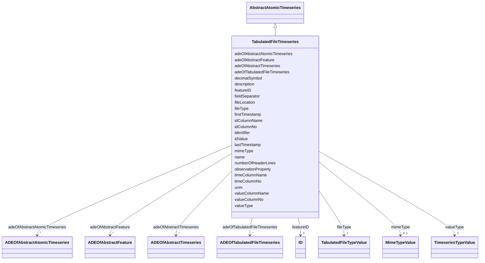

# Class: TabulatedFileTimeseries 


_A TabulatedFileTimeseries represents time-varying data of a specific data type for a single contiguous time interval. The data is provided in an external file referenced in the TabulatedFileTimeseries. The file contains table structured data using an appropriate file format such as comma-separated values (CSV), Microsoft Excel (XLSX) or Google Spreadsheet. The timestamps and the values are given in specific columns of the table. Each row represents a single time-value-pair. A subset of rows can be selected using the idColumn and idValue attributes._


URI: [citygml:TabulatedFileTimeseries](https://www.ogc.org/standards/citygml/TabulatedFileTimeseries)





## Inheritance
* [AbstractFeature](AbstractFeature.md)
    * [AbstractTimeseries](AbstractTimeseries.md)
        * [AbstractAtomicTimeseries](AbstractAtomicTimeseries.md)
            * **TabulatedFileTimeseries**


## Slots

| Name | Cardinality and Range | Description | Inheritance |
| ---  | --- | --- | --- |
| [fileLocation](fileLocation.md) | 1 <br/> [Uri](Uri.md) | Specifies the URI that points to the external timeseries file | direct |
| [fileType](fileType.md) | 1 <br/> [TabulatedFileTypeValue](TabulatedFileTypeValue.md) | Specifies the format used to represent the timeseries data | direct |
| [mimeType](mimeType.md) | 0..1 <br/> [MimeTypeValue](MimeTypeValue.md) | Specifies the MIME type of the external timeseries file | direct |
| [valueType](valueType.md) | 1 <br/> [TimeseriesTypeValue](TimeseriesTypeValue.md) | Indicates the specific type of the timeseries data | direct |
| [numberOfHeaderLines](numberOfHeaderLines.md) | 0..1 <br/> [Integer](Integer.md) | Indicates the number of lines at the beginning of the tabulated file that rep... | direct |
| [fieldSeparator](fieldSeparator.md) | 1 <br/> [String](String.md) | Indicates which symbol is used to separate the individual values in the tabul... | direct |
| [decimalSymbol](decimalSymbol.md) | 0..1 <br/> [String](String.md) | Indicates which symbol is used to separate the integer part from the fraction... | direct |
| [idColumnNo](idColumnNo.md) | 0..1 <br/> [Integer](Integer.md) | Specifies the number of the column that stores the identifier of the time-val... | direct |
| [idColumnName](idColumnName.md) | 0..1 <br/> [String](String.md) | Specifies the name of the column that stores the identifier of the time-value... | direct |
| [idValue](idValue.md) | 0..1 <br/> [String](String.md) | Specifies the value of the identifier for which the time-value-pairs are to b... | direct |
| [timeColumnNo](timeColumnNo.md) | 0..1 <br/> [Integer](Integer.md) | Specifies the number of the column that stores the timestamp of the time-valu... | direct |
| [timeColumnName](timeColumnName.md) | 0..1 <br/> [String](String.md) | Specifies the name of the column that stores the timestamp of the time-value-... | direct |
| [valueColumnNo](valueColumnNo.md) | 0..1 <br/> [Integer](Integer.md) | Specifies the number of the column that stores the value of the time-value-pa... | direct |
| [valueColumnName](valueColumnName.md) | 0..1 <br/> [String](String.md) | Specifies the name of the column that stores the value of the time-value-pair | direct |
| [adeOfTabulatedFileTimeseries](adeOfTabulatedFileTimeseries.md) | * <br/> [ADEOfTabulatedFileTimeseries](ADEOfTabulatedFileTimeseries.md) | Augments the TabulatedFileTimeseries with properties defined in an ADE | direct |
| [observationProperty](observationProperty.md) | 1 <br/> [String](String.md) | Specifies the phenomenon for which the atomic timeseries provides observation... | [AbstractAtomicTimeseries](AbstractAtomicTimeseries.md) |
| [uom](uom.md) | 0..1 <br/> [String](String.md) | Specifies the unit of measurement of the observation values | [AbstractAtomicTimeseries](AbstractAtomicTimeseries.md) |
| [adeOfAbstractAtomicTimeseries](adeOfAbstractAtomicTimeseries.md) | * <br/> [ADEOfAbstractAtomicTimeseries](ADEOfAbstractAtomicTimeseries.md) | Augments AbstractAtomicTimeseries with properties defined in an ADE | [AbstractAtomicTimeseries](AbstractAtomicTimeseries.md) |
| [firstTimestamp](firstTimestamp.md) | 0..1 <br/> [String](String.md) | Specifies the beginning of the timeseries | [AbstractTimeseries](AbstractTimeseries.md) |
| [lastTimestamp](lastTimestamp.md) | 0..1 <br/> [String](String.md) | Specifies the end of the timeseries | [AbstractTimeseries](AbstractTimeseries.md) |
| [adeOfAbstractTimeseries](adeOfAbstractTimeseries.md) | * <br/> [ADEOfAbstractTimeseries](ADEOfAbstractTimeseries.md) | Augments AbstractTimeseries with properties defined in an ADE | [AbstractTimeseries](AbstractTimeseries.md) |
| [featureID](featureID.md) | 1 <br/> [ID](ID.md) |  | [AbstractFeature](AbstractFeature.md) |
| [identifier](identifier.md) | 0..1 <br/> [String](String.md) |  | [AbstractFeature](AbstractFeature.md) |
| [name](name.md) | * <br/> [String](String.md) |  | [AbstractFeature](AbstractFeature.md) |
| [description](description.md) | 0..1 <br/> [String](String.md) |  | [AbstractFeature](AbstractFeature.md) |
| [adeOfAbstractFeature](adeOfAbstractFeature.md) | * <br/> [ADEOfAbstractFeature](ADEOfAbstractFeature.md) | Augments AbstractFeature with properties defined in an ADE | [AbstractFeature](AbstractFeature.md) |


## Identifier and Mapping Information


### Schema Source


* from schema: https://www.ogc.org/standards/citygml


## Mappings

| Mapping Type | Mapped Value |
| ---  | ---  |
| self | citygml:TabulatedFileTimeseries |
| native | citygml:TabulatedFileTimeseries |


## LinkML Source

<!-- TODO: investigate https://stackoverflow.com/questions/37606292/how-to-create-tabbed-code-blocks-in-mkdocs-or-sphinx -->

### Direct

<details>
```yaml
name: TabulatedFileTimeseries
description: A TabulatedFileTimeseries represents time-varying data of a specific
  data type for a single contiguous time interval. The data is provided in an external
  file referenced in the TabulatedFileTimeseries. The file contains table structured
  data using an appropriate file format such as comma-separated values (CSV), Microsoft
  Excel (XLSX) or Google Spreadsheet. The timestamps and the values are given in specific
  columns of the table. Each row represents a single time-value-pair. A subset of
  rows can be selected using the idColumn and idValue attributes.
from_schema: https://www.ogc.org/standards/citygml
is_a: AbstractAtomicTimeseries
abstract: false
attributes:
  fileLocation:
    name: fileLocation
    description: Specifies the URI that points to the external timeseries file.
    from_schema: https://www.ogc.org/standards/citygml
    domain_of:
    - StandardFileTimeseries
    - TabulatedFileTimeseries
    range: uri
    required: true
    multivalued: false
  fileType:
    name: fileType
    description: Specifies the format used to represent the timeseries data.
    from_schema: https://www.ogc.org/standards/citygml
    domain_of:
    - StandardFileTimeseries
    - TabulatedFileTimeseries
    range: TabulatedFileTypeValue
    required: true
    multivalued: false
  mimeType:
    name: mimeType
    description: Specifies the MIME type of the external timeseries file.
    from_schema: https://www.ogc.org/standards/citygml
    domain_of:
    - StandardFileTimeseries
    - TabulatedFileTimeseries
    - PointCloud
    - AbstractTexture
    - ImplicitGeometry
    range: MimeTypeValue
    required: false
    multivalued: false
  valueType:
    name: valueType
    description: Indicates the specific type of the timeseries data.
    from_schema: https://www.ogc.org/standards/citygml
    domain_of:
    - GenericTimeseries
    - TabulatedFileTimeseries
    range: TimeseriesTypeValue
    required: true
    multivalued: false
  numberOfHeaderLines:
    name: numberOfHeaderLines
    description: Indicates the number of lines at the beginning of the tabulated file
      that represent headers.
    from_schema: https://www.ogc.org/standards/citygml
    rank: 1000
    domain_of:
    - TabulatedFileTimeseries
    range: integer
    required: false
    multivalued: false
  fieldSeparator:
    name: fieldSeparator
    description: Indicates which symbol is used to separate the individual values
      in the tabulated file.
    from_schema: https://www.ogc.org/standards/citygml
    rank: 1000
    domain_of:
    - TabulatedFileTimeseries
    range: string
    required: true
    multivalued: false
  decimalSymbol:
    name: decimalSymbol
    description: Indicates which symbol is used to separate the integer part from
      the fractional part of a decimal number.
    from_schema: https://www.ogc.org/standards/citygml
    rank: 1000
    domain_of:
    - TabulatedFileTimeseries
    range: string
    required: false
    multivalued: false
  idColumnNo:
    name: idColumnNo
    description: Specifies the number of the column that stores the identifier of
      the time-value-pair.
    from_schema: https://www.ogc.org/standards/citygml
    rank: 1000
    domain_of:
    - TabulatedFileTimeseries
    range: integer
    required: false
    multivalued: false
  idColumnName:
    name: idColumnName
    description: Specifies the name of the column that stores the identifier of the
      time-value-pair.
    from_schema: https://www.ogc.org/standards/citygml
    rank: 1000
    domain_of:
    - TabulatedFileTimeseries
    range: string
    required: false
    multivalued: false
  idValue:
    name: idValue
    description: Specifies the value of the identifier for which the time-value-pairs
      are to be selected.
    from_schema: https://www.ogc.org/standards/citygml
    rank: 1000
    domain_of:
    - TabulatedFileTimeseries
    range: string
    required: false
    multivalued: false
  timeColumnNo:
    name: timeColumnNo
    description: Specifies the number of the column that stores the timestamp of the
      time-value-pair.
    from_schema: https://www.ogc.org/standards/citygml
    rank: 1000
    domain_of:
    - TabulatedFileTimeseries
    range: integer
    required: false
    multivalued: false
  timeColumnName:
    name: timeColumnName
    description: Specifies the name of the column that stores the timestamp of the
      time-value-pair.
    from_schema: https://www.ogc.org/standards/citygml
    rank: 1000
    domain_of:
    - TabulatedFileTimeseries
    range: string
    required: false
    multivalued: false
  valueColumnNo:
    name: valueColumnNo
    description: Specifies the number of the column that stores the value of the time-value-pair.
    from_schema: https://www.ogc.org/standards/citygml
    rank: 1000
    domain_of:
    - TabulatedFileTimeseries
    range: integer
    required: false
    multivalued: false
  valueColumnName:
    name: valueColumnName
    description: Specifies the name of the column that stores the value of the time-value-pair.
    from_schema: https://www.ogc.org/standards/citygml
    rank: 1000
    domain_of:
    - TabulatedFileTimeseries
    range: string
    required: false
    multivalued: false
  adeOfTabulatedFileTimeseries:
    name: adeOfTabulatedFileTimeseries
    description: Augments the TabulatedFileTimeseries with properties defined in an
      ADE.
    from_schema: https://www.ogc.org/standards/citygml
    rank: 1000
    domain_of:
    - TabulatedFileTimeseries
    range: ADEOfTabulatedFileTimeseries
    required: false
    multivalued: true

```
</details>

### Induced

<details>
```yaml
name: TabulatedFileTimeseries
description: A TabulatedFileTimeseries represents time-varying data of a specific
  data type for a single contiguous time interval. The data is provided in an external
  file referenced in the TabulatedFileTimeseries. The file contains table structured
  data using an appropriate file format such as comma-separated values (CSV), Microsoft
  Excel (XLSX) or Google Spreadsheet. The timestamps and the values are given in specific
  columns of the table. Each row represents a single time-value-pair. A subset of
  rows can be selected using the idColumn and idValue attributes.
from_schema: https://www.ogc.org/standards/citygml
is_a: AbstractAtomicTimeseries
abstract: false
attributes:
  fileLocation:
    name: fileLocation
    description: Specifies the URI that points to the external timeseries file.
    from_schema: https://www.ogc.org/standards/citygml
    alias: fileLocation
    owner: TabulatedFileTimeseries
    domain_of:
    - StandardFileTimeseries
    - TabulatedFileTimeseries
    range: uri
    required: true
    multivalued: false
  fileType:
    name: fileType
    description: Specifies the format used to represent the timeseries data.
    from_schema: https://www.ogc.org/standards/citygml
    alias: fileType
    owner: TabulatedFileTimeseries
    domain_of:
    - StandardFileTimeseries
    - TabulatedFileTimeseries
    range: TabulatedFileTypeValue
    required: true
    multivalued: false
  mimeType:
    name: mimeType
    description: Specifies the MIME type of the external timeseries file.
    from_schema: https://www.ogc.org/standards/citygml
    alias: mimeType
    owner: TabulatedFileTimeseries
    domain_of:
    - StandardFileTimeseries
    - TabulatedFileTimeseries
    - PointCloud
    - AbstractTexture
    - ImplicitGeometry
    range: MimeTypeValue
    required: false
    multivalued: false
  valueType:
    name: valueType
    description: Indicates the specific type of the timeseries data.
    from_schema: https://www.ogc.org/standards/citygml
    alias: valueType
    owner: TabulatedFileTimeseries
    domain_of:
    - GenericTimeseries
    - TabulatedFileTimeseries
    range: TimeseriesTypeValue
    required: true
    multivalued: false
  numberOfHeaderLines:
    name: numberOfHeaderLines
    description: Indicates the number of lines at the beginning of the tabulated file
      that represent headers.
    from_schema: https://www.ogc.org/standards/citygml
    rank: 1000
    alias: numberOfHeaderLines
    owner: TabulatedFileTimeseries
    domain_of:
    - TabulatedFileTimeseries
    range: integer
    required: false
    multivalued: false
  fieldSeparator:
    name: fieldSeparator
    description: Indicates which symbol is used to separate the individual values
      in the tabulated file.
    from_schema: https://www.ogc.org/standards/citygml
    rank: 1000
    alias: fieldSeparator
    owner: TabulatedFileTimeseries
    domain_of:
    - TabulatedFileTimeseries
    range: string
    required: true
    multivalued: false
  decimalSymbol:
    name: decimalSymbol
    description: Indicates which symbol is used to separate the integer part from
      the fractional part of a decimal number.
    from_schema: https://www.ogc.org/standards/citygml
    rank: 1000
    alias: decimalSymbol
    owner: TabulatedFileTimeseries
    domain_of:
    - TabulatedFileTimeseries
    range: string
    required: false
    multivalued: false
  idColumnNo:
    name: idColumnNo
    description: Specifies the number of the column that stores the identifier of
      the time-value-pair.
    from_schema: https://www.ogc.org/standards/citygml
    rank: 1000
    alias: idColumnNo
    owner: TabulatedFileTimeseries
    domain_of:
    - TabulatedFileTimeseries
    range: integer
    required: false
    multivalued: false
  idColumnName:
    name: idColumnName
    description: Specifies the name of the column that stores the identifier of the
      time-value-pair.
    from_schema: https://www.ogc.org/standards/citygml
    rank: 1000
    alias: idColumnName
    owner: TabulatedFileTimeseries
    domain_of:
    - TabulatedFileTimeseries
    range: string
    required: false
    multivalued: false
  idValue:
    name: idValue
    description: Specifies the value of the identifier for which the time-value-pairs
      are to be selected.
    from_schema: https://www.ogc.org/standards/citygml
    rank: 1000
    alias: idValue
    owner: TabulatedFileTimeseries
    domain_of:
    - TabulatedFileTimeseries
    range: string
    required: false
    multivalued: false
  timeColumnNo:
    name: timeColumnNo
    description: Specifies the number of the column that stores the timestamp of the
      time-value-pair.
    from_schema: https://www.ogc.org/standards/citygml
    rank: 1000
    alias: timeColumnNo
    owner: TabulatedFileTimeseries
    domain_of:
    - TabulatedFileTimeseries
    range: integer
    required: false
    multivalued: false
  timeColumnName:
    name: timeColumnName
    description: Specifies the name of the column that stores the timestamp of the
      time-value-pair.
    from_schema: https://www.ogc.org/standards/citygml
    rank: 1000
    alias: timeColumnName
    owner: TabulatedFileTimeseries
    domain_of:
    - TabulatedFileTimeseries
    range: string
    required: false
    multivalued: false
  valueColumnNo:
    name: valueColumnNo
    description: Specifies the number of the column that stores the value of the time-value-pair.
    from_schema: https://www.ogc.org/standards/citygml
    rank: 1000
    alias: valueColumnNo
    owner: TabulatedFileTimeseries
    domain_of:
    - TabulatedFileTimeseries
    range: integer
    required: false
    multivalued: false
  valueColumnName:
    name: valueColumnName
    description: Specifies the name of the column that stores the value of the time-value-pair.
    from_schema: https://www.ogc.org/standards/citygml
    rank: 1000
    alias: valueColumnName
    owner: TabulatedFileTimeseries
    domain_of:
    - TabulatedFileTimeseries
    range: string
    required: false
    multivalued: false
  adeOfTabulatedFileTimeseries:
    name: adeOfTabulatedFileTimeseries
    description: Augments the TabulatedFileTimeseries with properties defined in an
      ADE.
    from_schema: https://www.ogc.org/standards/citygml
    rank: 1000
    alias: adeOfTabulatedFileTimeseries
    owner: TabulatedFileTimeseries
    domain_of:
    - TabulatedFileTimeseries
    range: ADEOfTabulatedFileTimeseries
    required: false
    multivalued: true
  observationProperty:
    name: observationProperty
    description: Specifies the phenomenon for which the atomic timeseries provides
      observation values.
    from_schema: https://www.ogc.org/standards/citygml
    alias: observationProperty
    owner: TabulatedFileTimeseries
    domain_of:
    - SensorConnection
    - AbstractAtomicTimeseries
    range: string
    required: true
    multivalued: false
  uom:
    name: uom
    description: Specifies the unit of measurement of the observation values.
    from_schema: https://www.ogc.org/standards/citygml
    alias: uom
    owner: TabulatedFileTimeseries
    domain_of:
    - SensorConnection
    - AbstractAtomicTimeseries
    - MeasureOrNilReasonList
    range: string
    required: false
    multivalued: false
  adeOfAbstractAtomicTimeseries:
    name: adeOfAbstractAtomicTimeseries
    description: Augments AbstractAtomicTimeseries with properties defined in an ADE.
    from_schema: https://www.ogc.org/standards/citygml
    rank: 1000
    alias: adeOfAbstractAtomicTimeseries
    owner: TabulatedFileTimeseries
    domain_of:
    - AbstractAtomicTimeseries
    range: ADEOfAbstractAtomicTimeseries
    required: false
    multivalued: true
  firstTimestamp:
    name: firstTimestamp
    description: Specifies the beginning of the timeseries.
    from_schema: https://www.ogc.org/standards/citygml
    rank: 1000
    alias: firstTimestamp
    owner: TabulatedFileTimeseries
    domain_of:
    - AbstractTimeseries
    range: string
    required: false
    multivalued: false
  lastTimestamp:
    name: lastTimestamp
    description: Specifies the end of the timeseries.
    from_schema: https://www.ogc.org/standards/citygml
    rank: 1000
    alias: lastTimestamp
    owner: TabulatedFileTimeseries
    domain_of:
    - AbstractTimeseries
    range: string
    required: false
    multivalued: false
  adeOfAbstractTimeseries:
    name: adeOfAbstractTimeseries
    description: Augments AbstractTimeseries with properties defined in an ADE.
    from_schema: https://www.ogc.org/standards/citygml
    rank: 1000
    alias: adeOfAbstractTimeseries
    owner: TabulatedFileTimeseries
    domain_of:
    - AbstractTimeseries
    range: ADEOfAbstractTimeseries
    required: false
    multivalued: true
  featureID:
    name: featureID
    from_schema: https://www.ogc.org/standards/citygml
    rank: 1000
    alias: featureID
    owner: TabulatedFileTimeseries
    domain_of:
    - AbstractFeature
    range: ID
    required: true
    multivalued: false
  identifier:
    name: identifier
    from_schema: https://www.ogc.org/standards/citygml
    rank: 1000
    alias: identifier
    owner: TabulatedFileTimeseries
    domain_of:
    - AbstractFeature
    range: string
    required: false
    multivalued: false
  name:
    name: name
    from_schema: https://www.ogc.org/standards/citygml
    alias: name
    owner: TabulatedFileTimeseries
    domain_of:
    - CodeAttribute
    - DateAttribute
    - DoubleAttribute
    - GenericAttributeSet
    - IntAttribute
    - MeasureAttribute
    - StringAttribute
    - UriAttribute
    - AbstractFeature
    range: string
    required: false
    multivalued: true
  description:
    name: description
    from_schema: https://www.ogc.org/standards/citygml
    alias: description
    owner: TabulatedFileTimeseries
    domain_of:
    - ConstructionEvent
    - AbstractFeature
    range: string
    required: false
    multivalued: false
  adeOfAbstractFeature:
    name: adeOfAbstractFeature
    description: Augments AbstractFeature with properties defined in an ADE.
    from_schema: https://www.ogc.org/standards/citygml
    rank: 1000
    alias: adeOfAbstractFeature
    owner: TabulatedFileTimeseries
    domain_of:
    - AbstractFeature
    range: ADEOfAbstractFeature
    required: false
    multivalued: true

```
</details>