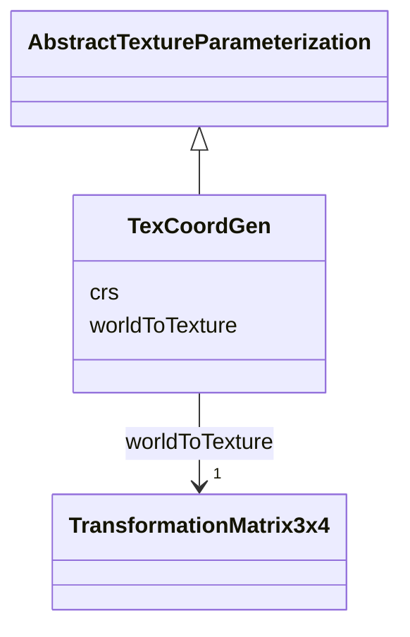

# Class: TexCoordGen 


_TexCoordGen defines texture parameterization using a transformation matrix._


URI: [citygml:TexCoordGen](https://www.ogc.org/standards/citygml/TexCoordGen)





## Inheritance
* [AbstractTextureParameterization](AbstractTextureParameterization.md)
    * **TexCoordGen**


## Slots

| Name | Cardinality and Range | Description | Inheritance |
| ---  | --- | --- | --- |
| [worldToTexture](worldToTexture.md) | 1 <br/> [TransformationMatrix3x4](TransformationMatrix3x4.md) | Specifies the 3x4 transformation matrix that defines the transformation betwe... | direct |
| [crs](crs.md) | 0..1 <br/> [String](String.md) |  | direct |


## Identifier and Mapping Information


### Schema Source


* from schema: https://www.ogc.org/standards/citygml


## Mappings

| Mapping Type | Mapped Value |
| ---  | ---  |
| self | citygml:TexCoordGen |
| native | citygml:TexCoordGen |


## LinkML Source

<!-- TODO: investigate https://stackoverflow.com/questions/37606292/how-to-create-tabbed-code-blocks-in-mkdocs-or-sphinx -->

### Direct

<details>
```yaml
name: TexCoordGen
description: TexCoordGen defines texture parameterization using a transformation matrix.
from_schema: https://www.ogc.org/standards/citygml
is_a: AbstractTextureParameterization
abstract: false
attributes:
  worldToTexture:
    name: worldToTexture
    description: Specifies the 3x4 transformation matrix that defines the transformation
      between world coordinates and texture coordinates.
    from_schema: https://www.ogc.org/standards/citygml
    rank: 1000
    domain_of:
    - TexCoordGen
    range: TransformationMatrix3x4
    required: true
    multivalued: false
  crs:
    name: crs
    from_schema: https://www.ogc.org/standards/citygml
    rank: 1000
    domain_of:
    - TexCoordGen
    range: string
    required: false
    multivalued: false

```
</details>

### Induced

<details>
```yaml
name: TexCoordGen
description: TexCoordGen defines texture parameterization using a transformation matrix.
from_schema: https://www.ogc.org/standards/citygml
is_a: AbstractTextureParameterization
abstract: false
attributes:
  worldToTexture:
    name: worldToTexture
    description: Specifies the 3x4 transformation matrix that defines the transformation
      between world coordinates and texture coordinates.
    from_schema: https://www.ogc.org/standards/citygml
    rank: 1000
    alias: worldToTexture
    owner: TexCoordGen
    domain_of:
    - TexCoordGen
    range: TransformationMatrix3x4
    required: true
    multivalued: false
  crs:
    name: crs
    from_schema: https://www.ogc.org/standards/citygml
    rank: 1000
    alias: crs
    owner: TexCoordGen
    domain_of:
    - TexCoordGen
    range: string
    required: false
    multivalued: false

```
</details>