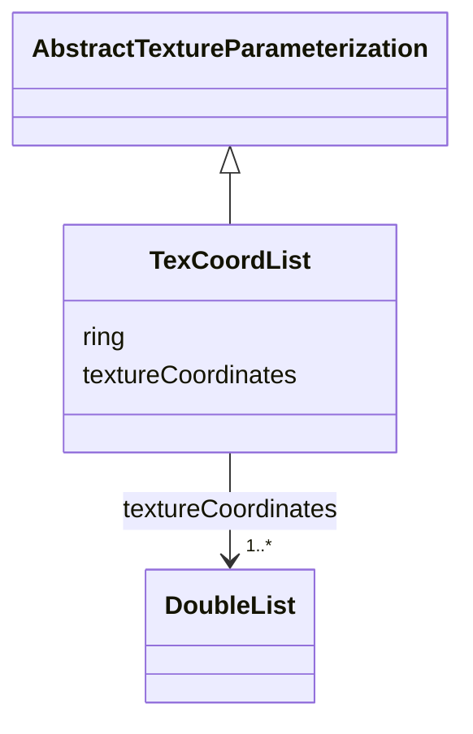

# Class: TexCoordList 


_TexCoordList defines texture parameterization using texture coordinates._


URI: [citygml:TexCoordList](https://www.ogc.org/standards/citygml/TexCoordList)





## Inheritance
* [AbstractTextureParameterization](AbstractTextureParameterization.md)
    * **TexCoordList**


## Slots

| Name | Cardinality and Range | Description | Inheritance |
| ---  | --- | --- | --- |
| [textureCoordinates](textureCoordinates.md) | 1..* <br/> [DoubleList](DoubleList.md) | Specifies the coordinates of texture used for parameterization | direct |
| [ring](ring.md) | 1..* <br/> [Uri](Uri.md) | Specifies the URIs that point to the LinearRings that are parameterized using... | direct |


## Identifier and Mapping Information


### Schema Source


* from schema: https://www.ogc.org/standards/citygml


## Mappings

| Mapping Type | Mapped Value |
| ---  | ---  |
| self | citygml:TexCoordList |
| native | citygml:TexCoordList |


## LinkML Source

<!-- TODO: investigate https://stackoverflow.com/questions/37606292/how-to-create-tabbed-code-blocks-in-mkdocs-or-sphinx -->

### Direct

<details>
```yaml
name: TexCoordList
description: TexCoordList defines texture parameterization using texture coordinates.
from_schema: https://www.ogc.org/standards/citygml
is_a: AbstractTextureParameterization
abstract: false
attributes:
  textureCoordinates:
    name: textureCoordinates
    description: Specifies the coordinates of texture used for parameterization. The
      texture coordinates are provided separately for each LinearRing of the surface
      geometry object.
    from_schema: https://www.ogc.org/standards/citygml
    rank: 1000
    domain_of:
    - TexCoordList
    range: DoubleList
    required: true
    multivalued: true
  ring:
    name: ring
    description: Specifies the URIs that point to the LinearRings that are parameterized
      using the given texture coordinates.
    from_schema: https://www.ogc.org/standards/citygml
    rank: 1000
    domain_of:
    - TexCoordList
    range: uri
    required: true
    multivalued: true

```
</details>

### Induced

<details>
```yaml
name: TexCoordList
description: TexCoordList defines texture parameterization using texture coordinates.
from_schema: https://www.ogc.org/standards/citygml
is_a: AbstractTextureParameterization
abstract: false
attributes:
  textureCoordinates:
    name: textureCoordinates
    description: Specifies the coordinates of texture used for parameterization. The
      texture coordinates are provided separately for each LinearRing of the surface
      geometry object.
    from_schema: https://www.ogc.org/standards/citygml
    rank: 1000
    alias: textureCoordinates
    owner: TexCoordList
    domain_of:
    - TexCoordList
    range: DoubleList
    required: true
    multivalued: true
  ring:
    name: ring
    description: Specifies the URIs that point to the LinearRings that are parameterized
      using the given texture coordinates.
    from_schema: https://www.ogc.org/standards/citygml
    rank: 1000
    alias: ring
    owner: TexCoordList
    domain_of:
    - TexCoordList
    range: uri
    required: true
    multivalued: true

```
</details>