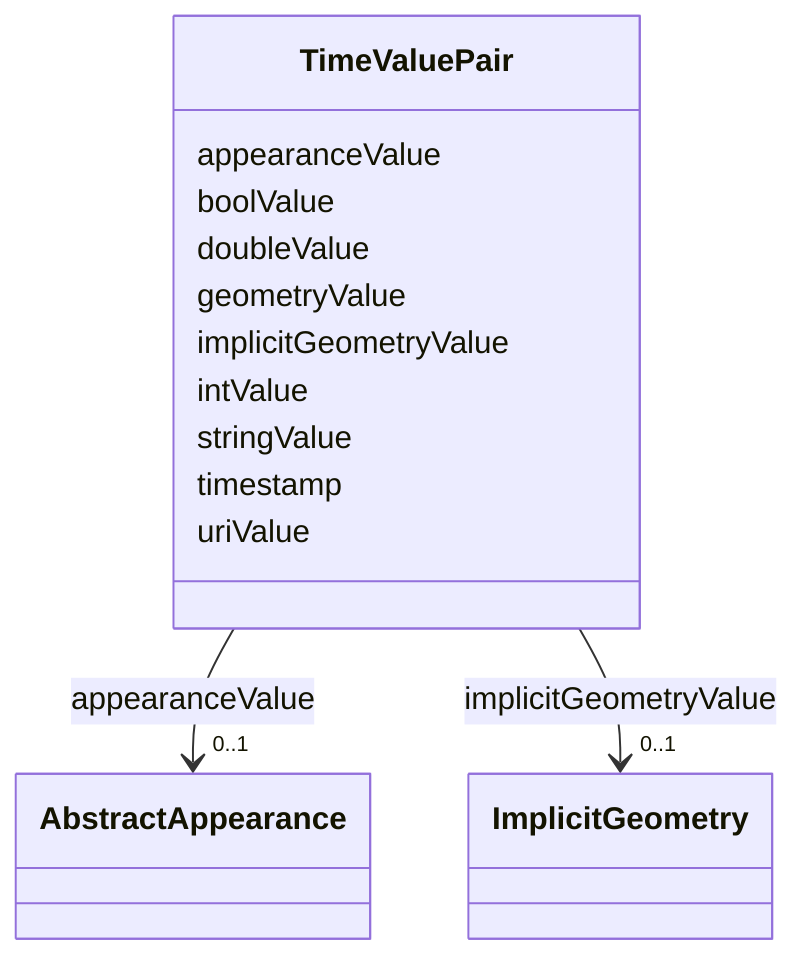

# Class: TimeValuePair 


_A TimeValuePair represents a value that is valid for a given timepoint. For each TimeValuePair, only one of the value properties can be used mutually exclusive. Which value property has to be provided depends on the selected value type in the GenericTimeSeries feature, in which the TimeValuePair is included._


URI: [citygml:TimeValuePair](https://www.ogc.org/standards/citygml/TimeValuePair)





<!-- no inheritance hierarchy -->

## Slots

| Name | Cardinality and Range | Description | Inheritance |
| ---  | --- | --- | --- |
| [timestamp](timestamp.md) | 1 <br/> [String](String.md) | Specifies the timepoint at which the value of the TimeValuePair is valid | direct |
| [intValue](intValue.md) | 0..1 <br/> [Integer](Integer.md) | Specifies the "Integer" value of the TimeValuePair | direct |
| [doubleValue](doubleValue.md) | 0..1 <br/> [Float](Float.md) | Specifies the "Double" value of the TimeValuePair | direct |
| [stringValue](stringValue.md) | 0..1 <br/> [String](String.md) | Specifies the "String" value of the TimeValuePair | direct |
| [geometryValue](geometryValue.md) | 0..1 <br/> [String](String.md) | Specifies the geometry value of the TimeValuePair | direct |
| [uriValue](uriValue.md) | 0..1 <br/> [Uri](Uri.md) | Specifies the "URI" value of the TimeValuePair | direct |
| [boolValue](boolValue.md) | 0..1 <br/> [Boolean](Boolean.md) | Specifies the "Boolean" value of the TimeValuePair | direct |
| [implicitGeometryValue](implicitGeometryValue.md) | 0..1 <br/> [ImplicitGeometry](ImplicitGeometry.md) | Specifies the "ImplicitGeometry" value of the TimeValuePair | direct |
| [appearanceValue](appearanceValue.md) | 0..1 <br/> [AbstractAppearance](AbstractAppearance.md) | Specifies the "Appearance" value of the TimeValuePair | direct |


## Usages

| used by | used in | type | used |
| ---  | --- | --- | --- |
| [GenericTimeseries](GenericTimeseries.md) | [timeValuePair](timeValuePair.md) | range | [TimeValuePair](TimeValuePair.md) |


## Identifier and Mapping Information


### Schema Source


* from schema: https://www.ogc.org/standards/citygml


## Mappings

| Mapping Type | Mapped Value |
| ---  | ---  |
| self | citygml:TimeValuePair |
| native | citygml:TimeValuePair |


## LinkML Source

<!-- TODO: investigate https://stackoverflow.com/questions/37606292/how-to-create-tabbed-code-blocks-in-mkdocs-or-sphinx -->

### Direct

<details>
```yaml
name: TimeValuePair
description: A TimeValuePair represents a value that is valid for a given timepoint.
  For each TimeValuePair, only one of the value properties can be used mutually exclusive.
  Which value property has to be provided depends on the selected value type in the
  GenericTimeSeries feature, in which the TimeValuePair is included.
from_schema: https://www.ogc.org/standards/citygml
abstract: false
attributes:
  timestamp:
    name: timestamp
    description: Specifies the timepoint at which the value of the TimeValuePair is
      valid.
    from_schema: https://www.ogc.org/standards/citygml
    rank: 1000
    domain_of:
    - TimeValuePair
    range: string
    required: true
    multivalued: false
  intValue:
    name: intValue
    description: Specifies the "Integer" value of the TimeValuePair.
    from_schema: https://www.ogc.org/standards/citygml
    rank: 1000
    domain_of:
    - TimeValuePair
    range: integer
    required: false
    multivalued: false
  doubleValue:
    name: doubleValue
    description: Specifies the "Double" value of the TimeValuePair.
    from_schema: https://www.ogc.org/standards/citygml
    rank: 1000
    domain_of:
    - TimeValuePair
    range: float
    required: false
    multivalued: false
  stringValue:
    name: stringValue
    description: Specifies the "String" value of the TimeValuePair.
    from_schema: https://www.ogc.org/standards/citygml
    rank: 1000
    domain_of:
    - TimeValuePair
    range: string
    required: false
    multivalued: false
  geometryValue:
    name: geometryValue
    description: Specifies the geometry value of the TimeValuePair.
    from_schema: https://www.ogc.org/standards/citygml
    rank: 1000
    domain_of:
    - TimeValuePair
    range: string
    required: false
    multivalued: false
  uriValue:
    name: uriValue
    description: Specifies the "URI" value of the TimeValuePair.
    from_schema: https://www.ogc.org/standards/citygml
    rank: 1000
    domain_of:
    - TimeValuePair
    range: uri
    required: false
    multivalued: false
  boolValue:
    name: boolValue
    description: Specifies the "Boolean" value of the TimeValuePair.
    from_schema: https://www.ogc.org/standards/citygml
    rank: 1000
    domain_of:
    - TimeValuePair
    range: boolean
    required: false
    multivalued: false
  implicitGeometryValue:
    name: implicitGeometryValue
    description: Specifies the "ImplicitGeometry" value of the TimeValuePair.
    from_schema: https://www.ogc.org/standards/citygml
    rank: 1000
    domain_of:
    - TimeValuePair
    range: ImplicitGeometry
    required: false
    multivalued: false
  appearanceValue:
    name: appearanceValue
    description: Specifies the "Appearance" value of the TimeValuePair.
    from_schema: https://www.ogc.org/standards/citygml
    rank: 1000
    domain_of:
    - TimeValuePair
    range: AbstractAppearance
    required: false
    multivalued: false

```
</details>

### Induced

<details>
```yaml
name: TimeValuePair
description: A TimeValuePair represents a value that is valid for a given timepoint.
  For each TimeValuePair, only one of the value properties can be used mutually exclusive.
  Which value property has to be provided depends on the selected value type in the
  GenericTimeSeries feature, in which the TimeValuePair is included.
from_schema: https://www.ogc.org/standards/citygml
abstract: false
attributes:
  timestamp:
    name: timestamp
    description: Specifies the timepoint at which the value of the TimeValuePair is
      valid.
    from_schema: https://www.ogc.org/standards/citygml
    rank: 1000
    alias: timestamp
    owner: TimeValuePair
    domain_of:
    - TimeValuePair
    range: string
    required: true
    multivalued: false
  intValue:
    name: intValue
    description: Specifies the "Integer" value of the TimeValuePair.
    from_schema: https://www.ogc.org/standards/citygml
    rank: 1000
    alias: intValue
    owner: TimeValuePair
    domain_of:
    - TimeValuePair
    range: integer
    required: false
    multivalued: false
  doubleValue:
    name: doubleValue
    description: Specifies the "Double" value of the TimeValuePair.
    from_schema: https://www.ogc.org/standards/citygml
    rank: 1000
    alias: doubleValue
    owner: TimeValuePair
    domain_of:
    - TimeValuePair
    range: float
    required: false
    multivalued: false
  stringValue:
    name: stringValue
    description: Specifies the "String" value of the TimeValuePair.
    from_schema: https://www.ogc.org/standards/citygml
    rank: 1000
    alias: stringValue
    owner: TimeValuePair
    domain_of:
    - TimeValuePair
    range: string
    required: false
    multivalued: false
  geometryValue:
    name: geometryValue
    description: Specifies the geometry value of the TimeValuePair.
    from_schema: https://www.ogc.org/standards/citygml
    rank: 1000
    alias: geometryValue
    owner: TimeValuePair
    domain_of:
    - TimeValuePair
    range: string
    required: false
    multivalued: false
  uriValue:
    name: uriValue
    description: Specifies the "URI" value of the TimeValuePair.
    from_schema: https://www.ogc.org/standards/citygml
    rank: 1000
    alias: uriValue
    owner: TimeValuePair
    domain_of:
    - TimeValuePair
    range: uri
    required: false
    multivalued: false
  boolValue:
    name: boolValue
    description: Specifies the "Boolean" value of the TimeValuePair.
    from_schema: https://www.ogc.org/standards/citygml
    rank: 1000
    alias: boolValue
    owner: TimeValuePair
    domain_of:
    - TimeValuePair
    range: boolean
    required: false
    multivalued: false
  implicitGeometryValue:
    name: implicitGeometryValue
    description: Specifies the "ImplicitGeometry" value of the TimeValuePair.
    from_schema: https://www.ogc.org/standards/citygml
    rank: 1000
    alias: implicitGeometryValue
    owner: TimeValuePair
    domain_of:
    - TimeValuePair
    range: ImplicitGeometry
    required: false
    multivalued: false
  appearanceValue:
    name: appearanceValue
    description: Specifies the "Appearance" value of the TimeValuePair.
    from_schema: https://www.ogc.org/standards/citygml
    rank: 1000
    alias: appearanceValue
    owner: TimeValuePair
    domain_of:
    - TimeValuePair
    range: AbstractAppearance
    required: false
    multivalued: false

```
</details>