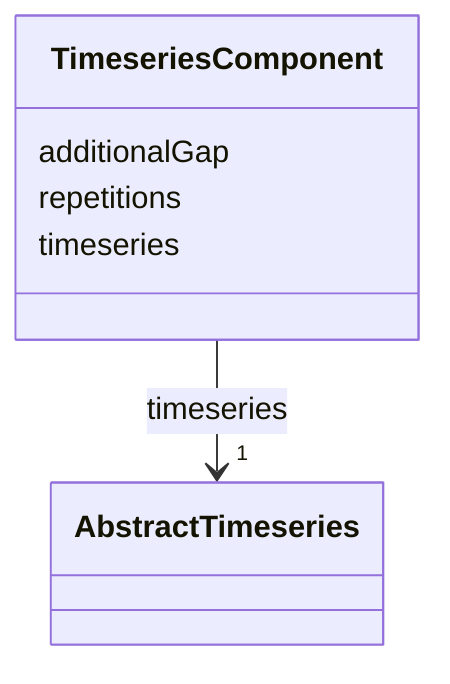

# Class: TimeseriesComponent 


_TimeseriesComponent represents an element of a CompositeTimeseries._


URI: [citygml:TimeseriesComponent](https://www.ogc.org/standards/citygml/TimeseriesComponent)





<!-- no inheritance hierarchy -->

## Slots

| Name | Cardinality and Range | Description | Inheritance |
| ---  | --- | --- | --- |
| [repetitions](repetitions.md) | 1 <br/> [Integer](Integer.md) | Specifies how often the timeseries that is referenced by the TimeseriesCompon... | direct |
| [additionalGap](additionalGap.md) | 0..1 <br/> [String](String.md) | Specifies how much extra time is added after all repetitions as an additional... | direct |
| [timeseries](timeseries.md) | 1 <br/> [AbstractTimeseries](AbstractTimeseries.md) | Relates a timeseries to the TimeseriesComponent | direct |


## Usages

| used by | used in | type | used |
| ---  | --- | --- | --- |
| [CompositeTimeseries](CompositeTimeseries.md) | [component](component.md) | range | [TimeseriesComponent](TimeseriesComponent.md) |


## Identifier and Mapping Information


### Schema Source


* from schema: https://www.ogc.org/standards/citygml


## Mappings

| Mapping Type | Mapped Value |
| ---  | ---  |
| self | citygml:TimeseriesComponent |
| native | citygml:TimeseriesComponent |


## LinkML Source

<!-- TODO: investigate https://stackoverflow.com/questions/37606292/how-to-create-tabbed-code-blocks-in-mkdocs-or-sphinx -->

### Direct

<details>
```yaml
name: TimeseriesComponent
description: TimeseriesComponent represents an element of a CompositeTimeseries.
from_schema: https://www.ogc.org/standards/citygml
abstract: false
attributes:
  repetitions:
    name: repetitions
    description: Specifies how often the timeseries that is referenced by the TimeseriesComponent
      should be iterated.
    from_schema: https://www.ogc.org/standards/citygml
    rank: 1000
    domain_of:
    - TimeseriesComponent
    range: integer
    required: true
    multivalued: false
  additionalGap:
    name: additionalGap
    description: Specifies how much extra time is added after all repetitions as an
      additional gap.
    from_schema: https://www.ogc.org/standards/citygml
    rank: 1000
    domain_of:
    - TimeseriesComponent
    range: string
    required: false
    multivalued: false
  timeseries:
    name: timeseries
    description: Relates a timeseries to the TimeseriesComponent.
    from_schema: https://www.ogc.org/standards/citygml
    rank: 1000
    domain_of:
    - TimeseriesComponent
    range: AbstractTimeseries
    required: true
    multivalued: false

```
</details>

### Induced

<details>
```yaml
name: TimeseriesComponent
description: TimeseriesComponent represents an element of a CompositeTimeseries.
from_schema: https://www.ogc.org/standards/citygml
abstract: false
attributes:
  repetitions:
    name: repetitions
    description: Specifies how often the timeseries that is referenced by the TimeseriesComponent
      should be iterated.
    from_schema: https://www.ogc.org/standards/citygml
    rank: 1000
    alias: repetitions
    owner: TimeseriesComponent
    domain_of:
    - TimeseriesComponent
    range: integer
    required: true
    multivalued: false
  additionalGap:
    name: additionalGap
    description: Specifies how much extra time is added after all repetitions as an
      additional gap.
    from_schema: https://www.ogc.org/standards/citygml
    rank: 1000
    alias: additionalGap
    owner: TimeseriesComponent
    domain_of:
    - TimeseriesComponent
    range: string
    required: false
    multivalued: false
  timeseries:
    name: timeseries
    description: Relates a timeseries to the TimeseriesComponent.
    from_schema: https://www.ogc.org/standards/citygml
    rank: 1000
    alias: timeseries
    owner: TimeseriesComponent
    domain_of:
    - TimeseriesComponent
    range: AbstractTimeseries
    required: true
    multivalued: false

```
</details>